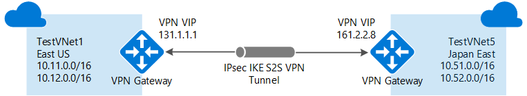

# Configure a VNet-to-VNet VPN gateway connection using Azure CLI

This article helps you connect virtual networks by using the VNet-to-VNet connection type. The virtual networks can be in the same or different regions, and from the same or different subscriptions. When connecting VNets from different subscriptions, the subscriptions do not need to be associated with the same Active Directory tenant.

The steps in this article apply to the [Resource Manager deployment model](../azure-resource-manager/management/deployment-models.md) and use Azure CLI. You can also create this configuration using a different deployment tool or deployment model by selecting a different option from the following list:

> [!div class="op_single_selector"]
> * [Azure portal](vpn-gateway-howto-vnet-vnet-resource-manager-portal.md)
> * [PowerShell](vpn-gateway-vnet-vnet-rm-ps.md)
> * [Azure CLI](vpn-gateway-howto-vnet-vnet-cli.md)
> * [Azure portal (classic)](vpn-gateway-howto-vnet-vnet-portal-classic.md)
> * [Connect different deployment models - Azure portal](vpn-gateway-connect-different-deployment-models-portal.md)
> * [Connect different deployment models - PowerShell](vpn-gateway-connect-different-deployment-models-powershell.md)
>
>

## <a name="about"></a>About connecting VNets

There are multiple ways to connect VNets. The sections below describe different ways to connect virtual networks.

### VNet-to-VNet

Configuring a VNet-to-VNet connection is a good way to easily connect VNets. Connecting a virtual network to another virtual network using the VNet-to-VNet connection type is similar to creating a Site-to-Site IPsec connection to an on-premises location. Both connectivity types use a VPN gateway to provide a secure tunnel using IPsec/IKE, and both function the same way when communicating. The difference between the connection types is the way the local network gateway is configured. When you create a VNet-to-VNet connection, you do not see the local network gateway address space. It is automatically created and populated. If you update the address space for one VNet, the other VNet automatically knows to route to the updated address space. Creating a VNet-to-VNet connection is typically faster and easier than creating a Site-to-Site connection between VNets.

### Connecting VNets using Site-to-Site (IPsec) steps

If you are working with a complicated network configuration, you may prefer to connect your VNets using the [Site-to-Site](vpn-gateway-howto-site-to-site-resource-manager-cli.md) steps, instead of the VNet-to-VNet steps. When you use the Site-to-Site steps, you create and configure the local network gateways manually. The local network gateway for each VNet treats the other VNet as a local site. This lets you specify additional address space for the local network gateway in order to route traffic. If the address space for a VNet changes, you need to manually update the corresponding local network gateway to reflect the change. It does not automatically update.

### VNet peering

You may want to consider connecting your VNets using VNet Peering. VNet peering does not use a VPN gateway and has different constraints. Additionally, [VNet peering pricing](https://azure.microsoft.com/pricing/details/virtual-network) is calculated differently than [VNet-to-VNet VPN Gateway pricing](https://azure.microsoft.com/pricing/details/vpn-gateway). For more information, see [VNet peering](../virtual-network/virtual-network-peering-overview.md).

## <a name="why"></a>Why create a VNet-to-VNet connection?

You may want to connect virtual networks using a VNet-to-VNet connection for the following reasons:

* **Cross region geo-redundancy and geo-presence**

  * You can set up your own geo-replication or synchronization with secure connectivity without going over Internet-facing endpoints.
  * With Azure Traffic Manager and Load Balancer, you can set up highly available workload with geo-redundancy across multiple Azure regions. One important example is to set up SQL Always On with Availability Groups spreading across multiple Azure regions.
* **Regional multi-tier applications with isolation or administrative boundary**

  * Within the same region, you can set up multi-tier applications with multiple virtual networks connected together due to isolation or administrative requirements.

VNet-to-VNet communication can be combined with multi-site configurations. This lets you establish network topologies that combine cross-premises connectivity with inter-virtual network connectivity.

## <a name="steps"></a>Which VNet-to-VNet steps should I use?

In this article, you see two different sets of VNet-to-VNet connection steps. One set of steps for [VNets that reside in the same subscription](#samesub) and one for [VNets that reside in different subscriptions](#difsub). 

For this exercise, you can combine configurations, or just choose the one that you want to work with. All of the configurations use the VNet-to-VNet connection type. Network traffic flows between the VNets that are directly connected to each other. In this exercise, traffic from TestVNet4 does not route to TestVNet5.

* [VNets that reside in the same subscription:](#samesub) The steps for this configuration use TestVNet1 and TestVNet4.

  

* [VNets that reside in different subscriptions:](#difsub) The steps for this configuration use TestVNet1 and TestVNet5.

  


## <a name="samesub"></a>Connect VNets that are in the same subscription

### Before you begin

Before beginning, install the latest version of the CLI commands (2.0 or later). For information about installing the CLI commands, see [Install the Azure CLI](/cli/azure/install-azure-cli).

### <a name="Plan"></a>Plan your IP address ranges

In the following steps, you create two virtual networks along with their respective gateway subnets and configurations. You then create a VPN connection between the two VNets. It’s important to plan the IP address ranges for your network configuration. Keep in mind that you must make sure that none of your VNet ranges or local network ranges overlap in any way. In these examples, we do not include a DNS server. If you want name resolution for your virtual networks, see [Name resolution](../virtual-network/virtual-networks-name-resolution-for-vms-and-role-instances.md).

We use the following values in the examples:

**Values for TestVNet1:**

* VNet Name: TestVNet1
* Resource Group: TestRG1
* Location: East US
* TestVNet1: 10.11.0.0/16 & 10.12.0.0/16
* FrontEnd: 10.11.0.0/24
* BackEnd: 10.12.0.0/24
* GatewaySubnet: 10.12.255.0/27
* GatewayName: VNet1GW
* Public IP: VNet1GWIP
* VPNType: RouteBased
* Connection(1to4): VNet1toVNet4
* Connection(1to5): VNet1toVNet5 (For VNets in different subscriptions)

**Values for TestVNet4:**

* VNet Name: TestVNet4
* TestVNet2: 10.41.0.0/16 & 10.42.0.0/16
* FrontEnd: 10.41.0.0/24
* BackEnd: 10.42.0.0/24
* GatewaySubnet: 10.42.255.0/27
* Resource Group: TestRG4
* Location: West US
* GatewayName: VNet4GW
* Public IP: VNet4GWIP
* VPNType: RouteBased
* Connection: VNet4toVNet1

### <a name="Connect"></a>Step 1 - Connect to your subscription

[!INCLUDE [CLI login](../../includes/vpn-gateway-cli-login-numbers-include.md)]

### <a name="TestVNet1"></a>Step 2 - Create and configure TestVNet1

1. Create a resource group.

   ```azurecli
   az group create -n TestRG1  -l eastus
   ```
2. Create TestVNet1 and the subnets for TestVNet1. This example creates a virtual network named TestVNet1 and a subnet named FrontEnd.

   ```azurecli
   az network vnet create -n TestVNet1 -g TestRG1 --address-prefix 10.11.0.0/16 -l eastus --subnet-name FrontEnd --subnet-prefix 10.11.0.0/24
   ```
3. Create an additional address space for the backend subnet. Notice that in this step, we specify both the address space that we created earlier, and the additional address space that we want to add. This is because the [az network vnet update](/cli/azure/network/vnet) command overwrites the previous settings. Make sure to specify all of the address prefixes when using this command.

   ```azurecli
   az network vnet update -n TestVNet1 --address-prefixes 10.11.0.0/16 10.12.0.0/16 -g TestRG1
   ```
4. Create the backend subnet.
  
   ```azurecli
   az network vnet subnet create --vnet-name TestVNet1 -n BackEnd -g TestRG1 --address-prefix 10.12.0.0/24 
   ```
5. Create the gateway subnet. Notice that the gateway subnet is named 'GatewaySubnet'. This name is required. In this example, the gateway subnet is using a /27. While it is possible to create a gateway subnet as small as /29, we recommend that you create a larger subnet that includes more addresses by selecting at least /28 or /27. This will allow for enough addresses to accommodate possible additional configurations that you may want in the future.

   ```azurecli 
   az network vnet subnet create --vnet-name TestVNet1 -n GatewaySubnet -g TestRG1 --address-prefix 10.12.255.0/27
   ```
6. Request a public IP address to be allocated to the gateway you will create for your VNet. Notice that the AllocationMethod is Dynamic. You cannot specify the IP address that you want to use. It's dynamically allocated to your gateway.

   ```azurecli
   az network public-ip create -n VNet1GWIP -g TestRG1 --allocation-method Dynamic
   ```
7. Create the virtual network gateway for TestVNet1. VNet-to-VNet configurations require a RouteBased VpnType. If you run this command using the '--no-wait' parameter, you don't see any feedback or output. The '--no-wait' parameter allows the gateway to create in the background. It does not mean that the VPN gateway finishes creating immediately. Creating a gateway can often take 45 minutes or more, depending on the gateway SKU that you use.

   ```azurecli
   az network vnet-gateway create -n VNet1GW -l eastus --public-ip-address VNet1GWIP -g TestRG1 --vnet TestVNet1 --gateway-type Vpn --sku VpnGw1 --vpn-type RouteBased --no-wait
   ```

### <a name="TestVNet4"></a>Step 3 - Create and configure TestVNet4

1. Create a resource group.

   ```azurecli
   az group create -n TestRG4  -l westus
   ```
2. Create TestVNet4.

   ```azurecli
   az network vnet create -n TestVNet4 -g TestRG4 --address-prefix 10.41.0.0/16 -l westus --subnet-name FrontEnd --subnet-prefix 10.41.0.0/24
   ```

3. Create additional subnets for TestVNet4.

   ```azurecli
   az network vnet update -n TestVNet4 --address-prefixes 10.41.0.0/16 10.42.0.0/16 -g TestRG4 
   az network vnet subnet create --vnet-name TestVNet4 -n BackEnd -g TestRG4 --address-prefix 10.42.0.0/24 
   ```
4. Create the gateway subnet.

   ```azurecli
   az network vnet subnet create --vnet-name TestVNet4 -n GatewaySubnet -g TestRG4 --address-prefix 10.42.255.0/27
   ```
5. Request a Public IP address.

   ```azurecli
   az network public-ip create -n VNet4GWIP -g TestRG4 --allocation-method Dynamic
   ```
6. Create the TestVNet4 virtual network gateway.

   ```azurecli
   az network vnet-gateway create -n VNet4GW -l westus --public-ip-address VNet4GWIP -g TestRG4 --vnet TestVNet4 --gateway-type Vpn --sku VpnGw1 --vpn-type RouteBased --no-wait
   ```

### <a name="createconnect"></a>Step 4 - Create the connections

You now have two VNets with VPN gateways. The next step is to create VPN gateway connections between the virtual network gateways. If you used the examples above, your VNet gateways are in different resource groups. When gateways are in different resource groups, you need to identify and specify the resource IDs for each gateway when making a connection. If your VNets are in the same resource group, you can use the [second set of instructions](#samerg) because you don't need to specify the resource IDs.

### <a name="diffrg"></a>To connect VNets that reside in different resource groups

1. Get the Resource ID of VNet1GW from the output of the following command:

   ```azurecli
   az network vnet-gateway show -n VNet1GW -g TestRG1
   ```

   In the output, find the "id:" line. The values within the quotes are needed to create the connection in the next section. Copy these values to a text editor, such as Notepad, so that you can easily paste them when creating your connection.

   Example output:

   ```
   "activeActive": false, 
   "bgpSettings": { 
    "asn": 65515, 
    "bgpPeeringAddress": "10.12.255.30", 
    "peerWeight": 0 
   }, 
   "enableBgp": false, 
   "etag": "W/\"ecb42bc5-c176-44e1-802f-b0ce2962ac04\"", 
   "gatewayDefaultSite": null, 
   "gatewayType": "Vpn", 
   "id": "/subscriptions/d6ff83d6-713d-41f6-a025-5eb76334fda9/resourceGroups/TestRG1/providers/Microsoft.Network/virtualNetworkGateways/VNet1GW", 
   "ipConfigurations":
   ```

   Copy the values after **"id":** within the quotes.

   ```
   "id": "/subscriptions/d6ff83d6-713d-41f6-a025-5eb76334fda9/resourceGroups/TestRG1/providers/Microsoft.Network/virtualNetworkGateways/VNet1GW"
   ```

2. Get the Resource ID of VNet4GW and copy the values to a text editor.

   ```azurecli
   az network vnet-gateway show -n VNet4GW -g TestRG4
   ```

3. Create the TestVNet1 to TestVNet4 connection. In this step, you create the connection from TestVNet1 to TestVNet4. There is a shared key referenced in the examples. You can use your own values for the shared key. The important thing is that the shared key must match for both connections. Creating a connection takes a short while to complete.

   ```azurecli
   az network vpn-connection create -n VNet1ToVNet4 -g TestRG1 --vnet-gateway1 /subscriptions/d6ff83d6-713d-41f6-a025-5eb76334fda9/resourceGroups/TestRG1/providers/Microsoft.Network/virtualNetworkGateways/VNet1GW -l eastus --shared-key "aabbcc" --vnet-gateway2 /subscriptions/d6ff83d6-713d-41f6-a025-5eb76334fda9/resourceGroups/TestRG4/providers/Microsoft.Network/virtualNetworkGateways/VNet4GW 
   ```
4. Create the TestVNet4 to TestVNet1 connection. This step is similar to the one above, except you are creating the connection from TestVNet4 to TestVNet1. Make sure the shared keys match. It takes a few minutes to establish the connection.

   ```azurecli
   az network vpn-connection create -n VNet4ToVNet1 -g TestRG4 --vnet-gateway1 /subscriptions/d6ff83d6-713d-41f6-a025-5eb76334fda9/resourceGroups/TestRG4/providers/Microsoft.Network/virtualNetworkGateways/VNet4GW -l westus --shared-key "aabbcc" --vnet-gateway2 /subscriptions/d6ff83d6-713d-41f6-a025-5eb76334fda9/resourceGroups/TestRG1/providers/Microsoft.Network/virtualNetworkGateways/VNet1G
   ```
5. Verify your connections. See [Verify your connection](#verify).

### <a name="samerg"></a>To connect VNets that reside in the same resource group

1. Create the TestVNet1 to TestVNet4 connection. In this step, you create the connection from TestVNet1 to TestVNet4. Notice the resource groups are the same in the examples. You also see a shared key referenced in the examples. You can use your own values for the shared key, however, the shared key must match for both connections. Creating a connection takes a short while to complete.

   ```azurecli
   az network vpn-connection create -n VNet1ToVNet4 -g TestRG1 --vnet-gateway1 VNet1GW -l eastus --shared-key "eeffgg" --vnet-gateway2 VNet4GW
   ```
2. Create the TestVNet4 to TestVNet1 connection. This step is similar to the one above, except you are creating the connection from TestVNet4 to TestVNet1. Make sure the shared keys match. It takes a few minutes to establish the connection.

   ```azurecli
   az network vpn-connection create -n VNet4ToVNet1 -g TestRG1 --vnet-gateway1 VNet4GW -l eastus --shared-key "eeffgg" --vnet-gateway2 VNet1GW
   ```
3. Verify your connections. See [Verify your connection](#verify).

## <a name="difsub"></a>Connect VNets that are in different subscriptions

In this scenario, you connect TestVNet1 and TestVNet5. The VNets reside different subscriptions. The subscriptions do not need to be associated with the same Active Directory tenant. The steps for this configuration add an additional VNet-to-VNet connection in order to connect TestVNet1 to TestVNet5.

### <a name="TestVNet1diff"></a>Step 5 - Create and configure TestVNet1

These instructions continue from the steps in the preceding sections. You must complete [Step 1](#Connect) and [Step 2](#TestVNet1) to create and configure TestVNet1 and the VPN Gateway for TestVNet1. For this configuration, you are not required to create TestVNet4 from the previous section, although if you do create it, it will not conflict with these steps. Once you complete Step 1 and Step 2, continue with Step 6 (below).

### <a name="verifyranges"></a>Step 6 - Verify the IP address ranges

When creating additional connections, it's important to verify that the IP address space of the new virtual network does not overlap with any of your other VNet ranges or local network gateway ranges. For this exercise, you can use the following values for the TestVNet5:

**Values for TestVNet5:**

* VNet Name: TestVNet5
* Resource Group: TestRG5
* Location: Japan East
* TestVNet5: 10.51.0.0/16 & 10.52.0.0/16
* FrontEnd: 10.51.0.0/24
* BackEnd: 10.52.0.0/24
* GatewaySubnet: 10.52.255.0/27
* GatewayName: VNet5GW
* Public IP: VNet5GWIP
* VPNType: RouteBased
* Connection: VNet5toVNet1
* ConnectionType: VNet2VNet

### <a name="TestVNet5"></a>Step 7 - Create and configure TestVNet5

This step must be done in the context of the new subscription, Subscription 5. This part may be performed by the administrator in a different organization that owns the subscription. To switch between subscriptions use `az account list --all` to list the subscriptions available to your account, then use `az account set --subscription <subscriptionID>` to switch to the subscription that you want to use.

1. Make sure you are connected to Subscription 5, then create a resource group.

   ```azurecli
   az group create -n TestRG5  -l japaneast
   ```
2. Create TestVNet5.

   ```azurecli
   az network vnet create -n TestVNet5 -g TestRG5 --address-prefix 10.51.0.0/16 -l japaneast --subnet-name FrontEnd --subnet-prefix 10.51.0.0/24
   ```

3. Add subnets.

   ```azurecli
   az network vnet update -n TestVNet5 --address-prefixes 10.51.0.0/16 10.52.0.0/16 -g TestRG5
   az network vnet subnet create --vnet-name TestVNet5 -n BackEnd -g TestRG5 --address-prefix 10.52.0.0/24
   ```

4. Add the gateway subnet.

   ```azurecli
   az network vnet subnet create --vnet-name TestVNet5 -n GatewaySubnet -g TestRG5 --address-prefix 10.52.255.0/27
   ```

5. Request a public IP address.

   ```azurecli
   az network public-ip create -n VNet5GWIP -g TestRG5 --allocation-method Dynamic
   ```
6. Create the TestVNet5 gateway

   ```azurecli
   az network vnet-gateway create -n VNet5GW -l japaneast --public-ip-address VNet5GWIP -g TestRG5 --vnet TestVNet5 --gateway-type Vpn --sku VpnGw1 --vpn-type RouteBased --no-wait
   ```

### <a name="connections5"></a>Step 8 - Create the connections

This step is split into two CLI sessions marked as **[Subscription 1]**, and **[Subscription 5]** because the gateways are in the different subscriptions. To switch between subscriptions use `az account list --all` to list the subscriptions available to your account, then use `az account set --subscription <subscriptionID>` to switch to the subscription that you want to use.

1. **[Subscription 1]** Log in and connect to Subscription 1. Run the following command to get the name and ID of the Gateway from the output:

   ```azurecli
   az network vnet-gateway show -n VNet1GW -g TestRG1
   ```

   Copy the output for "id:". Send the ID and the name of the VNet gateway (VNet1GW) to the administrator of Subscription 5 via email or another method.

   Example output:

   ```
   "id": "/subscriptions/d6ff83d6-713d-41f6-a025-5eb76334fda9/resourceGroups/TestRG1/providers/Microsoft.Network/virtualNetworkGateways/VNet1GW"
   ```

2. **[Subscription 5]** Log in and connect to Subscription 5. Run the following command to get the name and ID of the Gateway from the output:

   ```azurecli
   az network vnet-gateway show -n VNet5GW -g TestRG5
   ```

   Copy the output for "id:". Send the ID and the name of the VNet gateway (VNet5GW) to the administrator of Subscription 1 via email or another method.

3. **[Subscription 1]** In this step, you create the connection from TestVNet1 to TestVNet5. You can use your own values for the shared key, however, the shared key must match for both connections. Creating a connection can take a short while to complete. Make sure you connect to Subscription 1.

   ```azurecli
   az network vpn-connection create -n VNet1ToVNet5 -g TestRG1 --vnet-gateway1 /subscriptions/d6ff83d6-713d-41f6-a025-5eb76334fda9/resourceGroups/TestRG1/providers/Microsoft.Network/virtualNetworkGateways/VNet1GW -l eastus --shared-key "eeffgg" --vnet-gateway2 /subscriptions/e7e33b39-fe28-4822-b65c-a4db8bbff7cb/resourceGroups/TestRG5/providers/Microsoft.Network/virtualNetworkGateways/VNet5GW
   ```

4. **[Subscription 5]** This step is similar to the one above, except you are creating the connection from TestVNet5 to TestVNet1. Make sure that the shared keys match and that you connect to Subscription 5.

   ```azurecli
   az network vpn-connection create -n VNet5ToVNet1 -g TestRG5 --vnet-gateway1 /subscriptions/e7e33b39-fe28-4822-b65c-a4db8bbff7cb/resourceGroups/TestRG5/providers/Microsoft.Network/virtualNetworkGateways/VNet5GW -l japaneast --shared-key "eeffgg" --vnet-gateway2 /subscriptions/d6ff83d6-713d-41f6-a025-5eb76334fda9/resourceGroups/TestRG1/providers/Microsoft.Network/virtualNetworkGateways/VNet1GW
   ```

## <a name="verify"></a>Verify the connections
[!INCLUDE [vpn-gateway-no-nsg-include](../../includes/vpn-gateway-no-nsg-include.md)]

[!INCLUDE [verify connections](../../includes/vpn-gateway-verify-connection-cli-rm-include.md)]

## <a name="faq"></a>VNet-to-VNet FAQ
[!INCLUDE [vpn-gateway-vnet-vnet-faq](../../includes/vpn-gateway-faq-vnet-vnet-include.md)]

## Next steps

* Once your connection is complete, you can add virtual machines to your virtual networks. For more information, see the [Virtual Machines documentation](../index.yml).
* For information about BGP, see the [BGP Overview](vpn-gateway-bgp-overview.md) and [How to configure BGP](vpn-gateway-bgp-resource-manager-ps.md).
