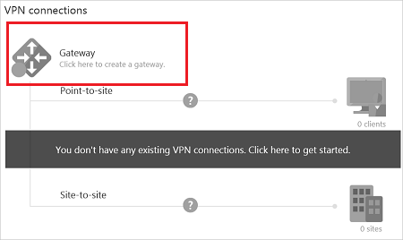
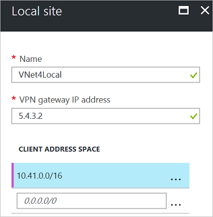
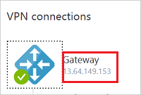
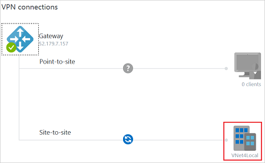
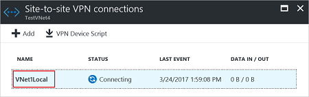
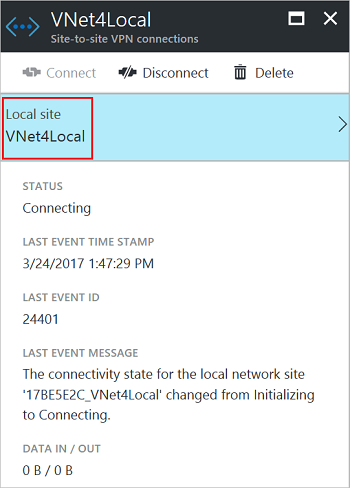
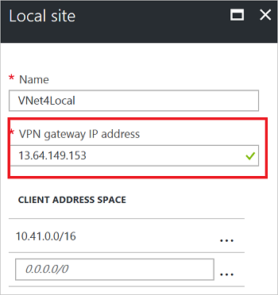

---
title: 'Create a connection between VNets: classic: Azure portal | Microsoft Docs'
description: Connect Azure virtual networks together using PowerShell and the Azure portal.
services: vpn-gateway
documentationcenter: na
author: cherylmc
manager: jpconnock
editor: ''
tags: azure-service-management

ms.assetid:
ms.service: vpn-gateway
ms.devlang: na
ms.topic: article
ms.tgt_pltfrm: na 
ms.workload: infrastructure-services
ms.date: 02/14/2018
ms.author: cherylmc

---
# Configure a VNet-to-VNet connection (classic)

[!INCLUDE [deployment models](../../includes/vpn-gateway-classic-deployment-model-include.md)]

This article helps you create a VPN gateway connection between virtual networks. The virtual networks can be in the same or different regions, and from the same or different subscriptions. The steps in this article apply to the classic deployment model and the Azure portal. You can also create this configuration using a different deployment tool or deployment model by selecting a different option from the following list:

> [!div class="op_single_selector"]
> * [Azure portal](vpn-gateway-howto-vnet-vnet-resource-manager-portal.md)
> * [PowerShell](vpn-gateway-vnet-vnet-rm-ps.md)
> * [Azure CLI](vpn-gateway-howto-vnet-vnet-cli.md)
> * [Azure portal (classic)](vpn-gateway-howto-vnet-vnet-portal-classic.md)
> * [Connect different deployment models - Azure portal](vpn-gateway-connect-different-deployment-models-portal.md)
> * [Connect different deployment models - PowerShell](vpn-gateway-connect-different-deployment-models-powershell.md)
>
>


[!INCLUDE [updated-for-az](../../includes/updated-for-az.md)]

## About VNet-to-VNet connections

Connecting a virtual network to another virtual network (VNet-to-VNet) in the classic deployment model using a VPN gateway is similar to connecting a virtual network to an on-premises site location. Both connectivity types use a VPN gateway to provide a secure tunnel using IPsec/IKE.

The VNets you connect can be in different subscriptions and different regions. You can combine VNet to VNet communication with multi-site configurations. This lets you establish network topologies that combine cross-premises connectivity with inter-virtual network connectivity.


### <a name="why"></a>Why connect virtual networks?

You may want to connect virtual networks for the following reasons:

* **Cross region geo-redundancy and geo-presence**

  * You can set up your own geo-replication or synchronization with secure connectivity without going over Internet-facing endpoints.
  * With Azure Load Balancer and Microsoft or third-party clustering technology, you can set up highly available workload with geo-redundancy across multiple Azure regions. One important example is to set up SQL Always On with Availability Groups spreading across multiple Azure regions.
* **Regional multi-tier applications with strong isolation boundary**

  * Within the same region, you can set up multi-tier applications with multiple VNets connected together with strong isolation and secure inter-tier communication.
* **Cross subscription, inter-organization communication in Azure**

  * If you have multiple Azure subscriptions, you can connect workloads from different subscriptions together securely between virtual networks.
  * For enterprises or service providers, you can enable cross-organization communication with secure VPN technology within Azure.

For more information about VNet-to-VNet connections, see [VNet-to-VNet considerations](#faq) at the end of this article.

### Before you begin

Before beginning this exercise, download and install the latest version of the Azure Service Management (SM) PowerShell cmdlets. For more information, see [How to install and configure Azure PowerShell](/powershell/azure/overview). We use the portal for most of the steps, but you must use PowerShell to create the connections between the VNets. You can't create the connections using the Azure portal.

## <a name="plan"></a>Step 1 - Plan your IP address ranges

It’s important to decide the ranges that you’ll use to configure your virtual networks. For this configuration, you must make sure that none of your VNet ranges overlap with each other, or with any of the local networks that they connect to.

The following table shows an example of how to define your VNets. Use the ranges as a guideline only. Write down the ranges for your virtual networks. You need this information for later steps.

**Example**

| Virtual Network | Address Space | Region | Connects to local network site |
|:--- |:--- |:--- |:--- |
| TestVNet1 |TestVNet1<br>(10.11.0.0/16)<br>(10.12.0.0/16) |East US |VNet4Local<br>(10.41.0.0/16)<br>(10.42.0.0/16) |
| TestVNet4 |TestVNet4<br>(10.41.0.0/16)<br>(10.42.0.0/16) |West US |VNet1Local<br>(10.11.0.0/16)<br>(10.12.0.0/16) |

## <a name="vnetvalues"></a>Step 2 - Create the virtual networks

Create two virtual networks in the [Azure portal](https://portal.azure.com). For the steps to create classic virtual networks, see [Create a classic virtual network](../virtual-network/virtual-networks-create-vnet-classic-pportal.md). 

When using the portal to create a classic virtual network, you must navigate to the virtual network page by using the following steps, otherwise the option to create a classic virtual network does not appear:

1. Click the '+' to open the 'New' page.
2. In the 'Search the marketplace' field, type 'Virtual Network'. If you instead, select Networking -> Virtual Network, you will not get the option to create a classic VNet.
3. Locate 'Virtual Network' from the returned list and click it to open the Virtual Network page. 
4. On the virtual network page, select 'Classic' to create a classic VNet. 

If you are using this article as an exercise, you can use the following example values:

**Values for TestVNet1**

Name: TestVNet1<br>
Address space: 10.11.0.0/16, 10.12.0.0/16 (optional)<br>
Subnet name: default<br>
Subnet address range: 10.11.0.1/24<br>
Resource group: ClassicRG<br>
Location: East US<br>
GatewaySubnet: 10.11.1.0/27

**Values for TestVNet4**

Name: TestVNet4<br>
Address space: 10.41.0.0/16, 10.42.0.0/16 (optional)<br>
Subnet name: default<br>
Subnet address range: 10.41.0.1/24<br>
Resource group: ClassicRG<br>
Location: West US<br>
GatewaySubnet: 10.41.1.0/27

**When creating your VNets, keep in mind the following settings:**

* **Virtual Network Address Spaces** – On the Virtual Network Address Spaces page, specify the address range that you want to use for your virtual network. These are the dynamic IP addresses that will be assigned to the VMs and other role instances that you deploy to this virtual network.<br>The address spaces you select cannot overlap with the address spaces for any of the other VNets or on-premises locations that this VNet will connect to.

* **Location** – When you create a virtual network, you associate it with an Azure location (region). For example, if you want your VMs that are deployed to your virtual network to be physically located in West US, select that location. You can’t change the location associated with your virtual network after you create it.

**After creating your VNets, you can add the following settings:**

* **Address space** – Additional address space is not required for this configuration, but you can add additional address space after creating the VNet.

* **Subnets** – Additional subnets are not required for this configuration, but you might want to have your VMs in a subnet that is separate from your other role instances.

* **DNS servers** – Enter the DNS server name and IP address. This setting does not create a DNS server. It allows you to specify the DNS servers that you want to use for name resolution for this virtual network.

In this section, you configure the connection type, the local site, and create the gateway.

## <a name="localsite"></a>Step 3 - Configure the local site

Azure uses the settings specified in each local network site to determine how to route traffic between the VNets. Each VNet must point to the respective local network that you want to route traffic to. You determine the name you want to use to refer to each local network site. It's best to use something descriptive.

For example, TestVNet1 connects to a local network site that you create named 'VNet4Local'. The settings for VNet4Local contain the address prefixes for TestVNet4.

The local site for each VNet is the other VNet. The following example values are used for our configuration:

| Virtual Network | Address Space | Region | Connects to local network site |
|:--- |:--- |:--- |:--- |
| TestVNet1 |TestVNet1<br>(10.11.0.0/16)<br>(10.12.0.0/16) |East US |VNet4Local<br>(10.41.0.0/16)<br>(10.42.0.0/16) |
| TestVNet4 |TestVNet4<br>(10.41.0.0/16)<br>(10.42.0.0/16) |West US |VNet1Local<br>(10.11.0.0/16)<br>(10.12.0.0/16) |

1. Locate TestVNet1 in the Azure portal. In the **VPN connections** section of the page, click **Gateway**.

	
2. On the **New VPN Connection** page, select **Site-to-Site**.
3. Click **Local site** to open the Local site page and configure the settings.
4. On the **Local site** page, name your local site. In our example, we name the local site 'VNet4Local'.
5. For **VPN gateway IP address**, you can use any IP address that you want, as long as it's in a valid format. Typically, you’d use the actual external IP address for a VPN device. But, for a classic VNet-to-VNet configuration, you use the public IP address that is assigned to the gateway for your VNet. Given that you’ve not yet created the virtual network gateway, you specify any valid public IP address as a placeholder.<br>Don't leave this blank - it's not optional for this configuration. In a later step, you go back into these settings and configure them with the corresponding virtual network gateway IP addresses once Azure generates it.
6. For **Client Address Space**, use the address space of the other VNet. Refer to your planning example. Click **OK** to save your settings and return back to the **New VPN Connection** page.

	

## <a name="gw"></a>Step 4 - Create the virtual network gateway

Each virtual network must have a virtual network gateway. The virtual network gateway routes and encrypts traffic.

1. On the **New VPN Connection** page, select the checkbox **Create gateway immediately**.
2. Click **Subnet, size and routing type**. On the **Gateway configuration** page, click **Subnet**.
3. The gateway subnet name is filled in automatically with the required name 'GatewaySubnet'. The **Address range** contains the IP addresses that are allocated to the VPN gateway services. Some configurations allow a gateway subnet of /29, but it's best to use a /28 or /27 to accommodate future configurations that may require more IP addresses for the gateway services. In our example settings, we use 10.11.1.0/27. Adjust the address space, then click **OK**.
4. Configure the **Gateway Size**. This setting refers to the [Gateway SKU](vpn-gateway-about-vpn-gateway-settings.md#gwsku).
5. Configure the **Routing Type**. The routing type for this configuration must be **Dynamic**. You can't change the routing type later unless you tear down the gateway and create a new one.
6. Click **OK**.
7. On the **New VPN Connection** page, click **OK** to begin creating the virtual network gateway. Creating a gateway can often take 45 minutes or more, depending on the selected gateway SKU.

## <a name="vnet4settings"></a>Step 5 - Configure TestVNet4 settings

Repeat the steps to [Create a local site](#localsite) and [Create the virtual network gateway](#gw) to configure TestVNet4, substituting the values when necessary. If you are doing this as an exercise, use the [Example values](#vnetvalues).

## <a name="updatelocal"></a>Step 6 - Update the local sites

After your virtual network gateways have been created for both VNets, you must adjust the local sites **VPN gateway IP address** values.

|VNet name|Connected site|Gateway IP address|
|:--- |:--- |:--- |
|TestVNet1|VNet4Local|VPN gateway IP address for TestVNet4|
|TestVNet4|VNet1Local|VPN gateway IP address for TestVNet1|

### Part 1 - Get the virtual network gateway public IP address

1. Locate your virtual network in the Azure portal.
2. Click to open the VNet **Overview** page. On the page, in **VPN connections**, you can view the IP address for your virtual network gateway.

   
3. Copy the IP address. You will use it in the next section.
4. Repeat these steps for TestVNet4

### Part 2 - Modify the local sites

1. Locate your virtual network in the Azure portal.
2. On the VNet **Overview** page, click the local site.

   
3. On the **Site-to-Site VPN Connections** page, click the name of the local site that you want to modify.

   
4. Click the **Local site** that you want to modify.

   
5. Update the **VPN gateway IP address** and click **OK** to save the settings.

   
6. Close the other pages.
7. Repeat these steps for TestVNet4.

## <a name="getvalues"></a>Step 7 - Retrieve values from the network configuration file

When you create classic VNets in the Azure portal, the name that you view is not the full name that you use for PowerShell. For example, a VNet that appears to be named **TestVNet1** in the portal, may have a much longer name in the network configuration file. The name might look something like: **Group ClassicRG TestVNet1**. When you create your connections, it's important to use the values that you see in the network configuration file.

In the following steps, you will connect to your Azure account and download and view the network configuration file to obtain the values that are required for your connections.

1. Download and install the latest version of the Azure Service Management (SM) PowerShell cmdlets. For more information, see [How to install and configure Azure PowerShell](/powershell/azure/overview).

2. Open your PowerShell console with elevated rights and connect to your account. Use the following example to help you connect:

   ```powershell
   Connect-AzAccount
   ```

   Check the subscriptions for the account.

   ```powershell
   Get-AzSubscription
   ```

   If you have more than one subscription, select the subscription that you want to use.

   ```powershell
   Select-AzSubscription -SubscriptionName "Replace_with_your_subscription_name"
   ```

   Next, use the following cmdlet to add your Azure subscription to PowerShell for the classic deployment model.

   ```powershell
   Add-AzureAccount
   ```
3. Export and view the network configuration file. Create a directory on your computer and then export the network configuration file to the directory. In this example, the network configuration file is exported to **C:\AzureNet**.

   ```powershell
   Get-AzureVNetConfig -ExportToFile C:\AzureNet\NetworkConfig.xml
   ```
4. Open the file with a text editor and view the names for your VNets and sites. These will be the name you use when you create your connections.<br>VNet names are listed as **VirtualNetworkSite name =**<br>Site names are listed as **LocalNetworkSiteRef name =**

## <a name="createconnections"></a>Step 8 - Create the VPN gateway connections

When all the previous steps have been completed, you can set the IPsec/IKE pre-shared keys and create the connection. This set of steps uses PowerShell. VNet-to-VNet connections for the classic deployment model cannot be configured in the Azure portal.

In the examples, notice that the shared key is exactly the same. The shared key must always match. Be sure to replace the values in these examples with the exact names for your VNets and Local Network Sites.

1. Create the TestVNet1 to TestVNet4 connection.

   ```powershell
   Set-AzureVNetGatewayKey -VNetName 'Group ClassicRG TestVNet1' `
   -LocalNetworkSiteName '17BE5E2C_VNet4Local' -SharedKey A1b2C3D4
   ```
2. Create the TestVNet4 to TestVNet1 connection.

   ```powershell
   Set-AzureVNetGatewayKey -VNetName 'Group ClassicRG TestVNet4' `
   -LocalNetworkSiteName 'F7F7BFC7_VNet1Local' -SharedKey A1b2C3D4
   ```
3. Wait for the connections to initialize. Once the gateway has initialized, the Status is 'Successful'.

   ```
   Error          :
   HttpStatusCode : OK
   Id             :
   Status         : Successful
   RequestId      :
   StatusCode     : OK
   ```

## <a name="faq"></a>VNet-to-VNet considerations for classic VNets
* The virtual networks can be in the same or different subscriptions.
* The virtual networks can be in the same or different Azure regions (locations).
* A cloud service or a load balancing endpoint can't span across virtual networks, even if they are connected together.
* Connecting multiple virtual networks together doesn't require any VPN devices.
* VNet-to-VNet supports connecting Azure Virtual Networks. It does not support connecting virtual machines or cloud services that are not deployed to a virtual network.
* VNet-to-VNet requires dynamic routing gateways. Azure static routing gateways are not supported.
* Virtual network connectivity can be used simultaneously with multi-site VPNs. There is a maximum of 10 VPN tunnels for a virtual network VPN gateway connecting to either other virtual networks, or on-premises sites.
* The address spaces of the virtual networks and on-premises local network sites must not overlap. Overlapping address spaces will cause the creation of virtual networks or uploading netcfg configuration files to fail.
* Redundant tunnels between a pair of virtual networks are not supported.
* All VPN tunnels for the VNet, including P2S VPNs, share the available bandwidth for the VPN gateway, and the same VPN gateway uptime SLA in Azure.
* VNet-to-VNet traffic travels across the Azure backbone.

## Next steps
Verify your connections. See [Verify a VPN Gateway connection](vpn-gateway-verify-connection-resource-manager.md).
