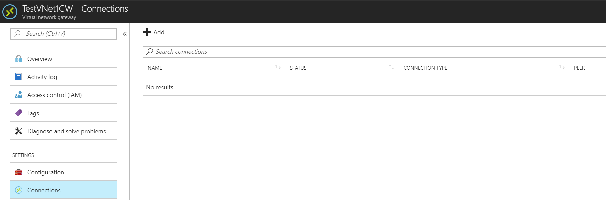
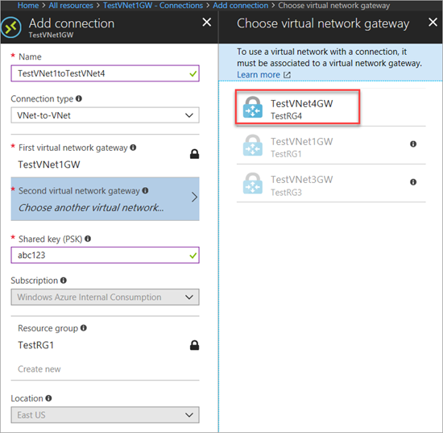
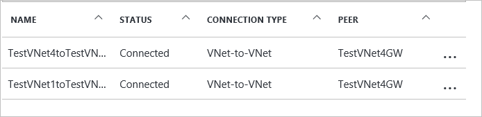
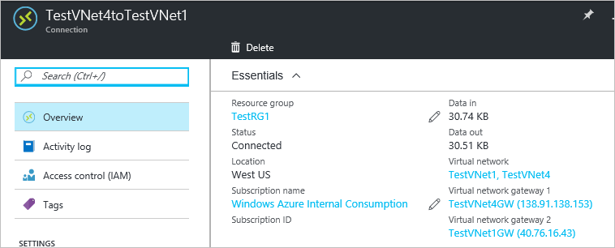

# Configure a VNet-to-VNet VPN gateway connection by using the Azure portal

This article helps you connect virtual networks (VNets) by using the VNet-to-VNet connection type. Virtual networks can be in different regions and from different subscriptions. When you connect VNets from different subscriptions, the subscriptions don't need to be associated with the same Active Directory tenant. 

The steps in this article apply to the Azure Resource Manager deployment model and use the Azure portal. You can create this configuration with a different deployment tool or model by using options that are described in the following articles:

> [!div class="op_single_selector"]
> * [Azure portal](vpn-gateway-howto-vnet-vnet-resource-manager-portal.md)
> * [PowerShell](vpn-gateway-vnet-vnet-rm-ps.md)
> * [Azure CLI](vpn-gateway-howto-vnet-vnet-cli.md)
> * [Azure portal (classic)](vpn-gateway-howto-vnet-vnet-portal-classic.md)
> * [Connect different deployment models - Azure portal](vpn-gateway-connect-different-deployment-models-portal.md)
> * [Connect different deployment models - PowerShell](vpn-gateway-connect-different-deployment-models-powershell.md)
>
>

## About connecting VNets

The following sections describe the different ways to connect virtual networks.

### VNet-to-VNet

Configuring a VNet-to-VNet connection is a simple way to connect VNets. When you connect a virtual network to another virtual network with a VNet-to-VNet connection type (VNet2VNet), it's similar to creating a Site-to-Site IPsec connection to an on-premises location. Both connection types use a VPN gateway to provide a secure tunnel with IPsec/IKE and function the same way when communicating. However, they differ in the way the local network gateway is configured. 

When you create a VNet-to-VNet connection, the local network gateway address space is automatically created and populated. If you update the address space for one VNet, the other VNet automatically routes to the updated address space. It's typically faster and easier to create a VNet-to-VNet connection than a Site-to-Site connection.

### Site-to-Site (IPsec)

If you're working with a complicated network configuration, you may prefer to connect your VNets by using a [Site-to-Site connection](vpn-gateway-howto-site-to-site-resource-manager-portal.md) instead. When you follow the Site-to-Site IPsec steps, you create and configure the local network gateways manually. The local network gateway for each VNet treats the other VNet as a local site. These steps allow you to specify additional address spaces for the local network gateway to route traffic. If the address space for a VNet changes, you must manually update the corresponding local network gateway.

### VNet peering

You can also connect your VNets by using VNet peering. VNet peering doesn't use a VPN gateway and has different constraints. Additionally, [VNet peering pricing](https://azure.microsoft.com/pricing/details/virtual-network) is calculated differently than [VNet-to-VNet VPN Gateway pricing](https://azure.microsoft.com/pricing/details/vpn-gateway). For more information, see [VNet peering](../virtual-network/virtual-network-peering-overview.md).

## Why create a VNet-to-VNet connection?

You may want to connect virtual networks by using a VNet-to-VNet connection for the following reasons:

### Cross region geo-redundancy and geo-presence

  * You can set up your own geo-replication or synchronization with secure connectivity without going over internet-facing endpoints.
  * With Azure Traffic Manager and Azure Load Balancer, you can set up highly available workload with geo-redundancy across multiple Azure regions. For example, you can set up SQL Server Always On availability groups across multiple Azure regions.

### Regional multi-tier applications with isolation or administrative boundaries

  * Within the same region, you can set up multi-tier applications with multiple virtual networks that are connected together because of isolation or administrative requirements.

VNet-to-VNet communication can be combined with multi-site configurations. These configurations lets you establish network topologies that combine cross-premises connectivity with inter-virtual network connectivity, as shown in the following diagram:

This article shows you how to connect VNets by using the VNet-to-VNet connection type. When you follow these steps as an exercise, you can use the following example settings values. In the example, the virtual networks are in the same subscription, but in different resource groups. If your VNets are in different subscriptions, you can't create the connection in the portal. Use [PowerShell](vpn-gateway-vnet-vnet-rm-ps.md) or [CLI](vpn-gateway-howto-vnet-vnet-cli.md) instead. For more information about VNet-to-VNet connections, see [VNet-to-VNet FAQ](#vnet-to-vnet-faq).

### Example settings

**Values for TestVNet1:**

- **Virtual network settings**
    - **Name**: Enter *TestVNet1*.
    - **Address space**: Enter *10.11.0.0/16*.
    - **Subscription**: Select the subscription you want to use.
    - **Resource group**: Enter *TestRG1*.
    - **Location**: Select **East US**.
    - **Subnet**
        - **Name**: Enter *FrontEnd*.
        - **Address range**: Enter *10.11.0.0/24*.
    - **Gateway subnet**:
        - **Name**: *GatewaySubnet* is autofilled.
        - **Address range**: Enter *10.11.255.0/27*.
    - **DNS server**: Select **Custom** and enter the IP address of your DNS server.

- **Virtual network gateway settings** 
    - **Name**: Enter *TestVNet1GW*.
    - **Gateway type**: Select **VPN**.
    - **VPN type**: Select **Route-based**.
    - **SKU**: Select the gateway SKU you want to use.
    - **Public IP address name**: Enter *TestVNet1GWIP*
    - **Connection** 
       - **Name**: Enter *TestVNet1toTestVNet4*.
       - **Shared key**: Enter *abc123*. You can create the shared key yourself. When you create the connection between the VNets, the values must match.

**Values for TestVNet4:**

- **Virtual network settings**
   - **Name**: Enter *TestVNet4*.
   - **Address space**: Enter *10.41.0.0/16*.
   - **Subscription**: Select the subscription you want to use.
   - **Resource group**: Enter *TestRG4*.
   - **Location**: Select **West US**.
   - **Subnet** 
      - **Name**: Enter *FrontEnd*.
      - **Address range**: Enter *10.41.0.0/24*.
   - **GatewaySubnet** 
      - **Name**: *GatewaySubnet* is autofilled.
      - **Address range**: Enter *10.41.255.0/27*.
   - **DNS server**: Select **Custom** and enter the IP address of your DNS server.

- **Virtual network gateway settings** 
    - **Name**: Enter *TestVNet4GW*.
    - **Gateway type**: Select **VPN**.
    - **VPN type**: Select **Route-based**.
    - **SKU**: Select the gateway SKU you want to use.
    - **Public IP address name**: Enter *TestVNet4GWIP*.
    - **Connection** 
       - **Name**: Enter *TestVNet4toTestVNet1*.
       - **Shared key**: Enter *abc123*. You can create the shared key yourself. When you create the connection between the VNets, the values must match.

## Create and configure TestVNet1
If you already have a VNet, verify that the settings are compatible with your VPN gateway design. Pay particular attention to any subnets that may overlap with other networks. Your connection won't work properly if you have overlapping subnets. After your VNet is configured with the correct settings, you can begin the steps in the Specify a DNS server section.

### To create a virtual network
[!INCLUDE [vpn-gateway-basic-vnet-rm-portal](../../includes/vpn-gateway-basic-vnet-rm-portal-include.md)]

## Add additional address space and create subnets
You can add additional address space and create subnets once your VNet has been created.

[!INCLUDE [vpn-gateway-additional-address-space](../../includes/vpn-gateway-additional-address-space-include.md)]

## Create a gateway subnet
Before creating a virtual network gateway for your virtual network, you first need to create the gateway subnet. The gateway subnet contains the IP addresses that are used by the virtual network gateway. If possible, it's best to create a gateway subnet by using a CIDR block of /28 or /27 to provide enough IP addresses to accommodate future additional configuration requirements.

If you're creating this configuration as an exercise, refer to these [Example settings](#example-settings) when creating your gateway subnet.

[!INCLUDE [vpn-gateway-no-nsg](../../includes/vpn-gateway-no-nsg-include.md)]

### To create a gateway subnet
[!INCLUDE [vpn-gateway-add-gwsubnet-rm-portal](../../includes/vpn-gateway-add-gwsubnet-rm-portal-include.md)]

## Specify a DNS server (optional)
DNS isn't required for VNet-to-VNet connections. However, if you want to have name resolution for resources that are deployed to your virtual network, specify a DNS server. This setting lets you specify the DNS server that you want to use for name resolution for this virtual network. It doesn't create a DNS server.

[!INCLUDE [vpn-gateway-add-dns-rm-portal](../../includes/vpn-gateway-add-dns-rm-portal-include.md)]

## Create a virtual network gateway
In this step, you create the virtual network gateway for your VNet. Creating a gateway can often take 45 minutes or more, depending on the selected gateway SKU. If you're creating this configuration as an exercise, see the [Example settings](#example-settings).

### To create a virtual network gateway
[!INCLUDE [vpn-gateway-add-gw-rm-portal](../../includes/vpn-gateway-add-gw-rm-portal-include.md)]

## Create and configure TestVNet4
After you've configured TestVNet1, create TestVNet4 by repeating the previous steps and replacing the values with TestVNet4 values. You don't need to wait until the virtual network gateway for TestVNet1 has finished creating before you configure TestVNet4. If you're using your own values, make sure the address spaces don't overlap with any of the VNets to which you want to connect.

## Configure the TestVNet1 gateway connection
When the virtual network gateways for both TestVNet1 and TestVNet4 have completed, you can create your virtual network gateway connections. In this section, you create a connection from VNet1 to VNet4. These steps work only for VNets in the same subscription. If your VNets are in different subscriptions, you must use [PowerShell](vpn-gateway-vnet-vnet-rm-ps.md) to make the connection. However, if your VNets are in different resource groups in the same subscription, you can connect them by using the portal.

1. In the Azure portal, select **All resources**, enter *virtual network gateway* in the search box, and then navigate to the virtual network gateway for your VNet. For example, **TestVNet1GW**. Select it to open the **Virtual network gateway** page.

   
2. Under **Settings**, select **Connections**, and then select **Add** to open the **Add connection** page.

   
3. On the **Add connection** page, fill in the values for your connection:

   - **Name**: Enter a name for your connection. For example, *TestVNet1toTestVNet4*.

   - **Connection type**: Select **VNet-to-VNet** from the drop-down.

   - **First virtual network gateway**: This field value is automatically filled in because you're creating this connection from the specified virtual network gateway.

   - **Second virtual network gateway**: This field is the virtual network gateway of the VNet that you want to create a connection to. Select **Choose another virtual network gateway** to open the **Choose virtual network gateway** page.

     - View the virtual network gateways that are listed on this page. Notice that only virtual network gateways that are in your subscription are listed. If you want to connect to a virtual network gateway that isn't in your subscription, use the [PowerShell](vpn-gateway-vnet-vnet-rm-ps.md).

     - Select the virtual network gateway to which you want to connect.

     - **Shared key (PSK)**: In this field, enter a shared key for your connection. You can generate or create this key yourself. In a site-to-site connection, the key you use is the same for your on-premises device and your virtual network gateway connection. The concept is similar here, except that rather than connecting to a VPN device, you're connecting to another virtual network gateway.
    
4. Select **OK** to save your changes.

## Configure the TestVNet4 gateway connection
Next, create a connection from TestVNet4 to TestVNet1. In the portal, locate the virtual network gateway associated with TestVNet4. Follow the steps from the previous section, replacing the values to create a connection from TestVNet4 to TestVNet1. Make sure that you use the same shared key.

## Verify your connections

Locate the virtual network gateway in the Azure portal. On the **Virtual network gateway** page, select **Connections** to view the **Connections** page for the virtual network gateway. After the connection is established, you'll see the **Status** values change to **Succeeded** and **Connected**. Select a connection to open the **Essentials** page and view more information.

When data begins flowing, you'll see values for **Data in** and **Data out**.

## Add additional connections

If you want to add additional connections, navigate to the virtual network gateway from which you want to create the connection, then select **Connections**. You can create another VNet-to-VNet connection, or create an IPsec Site-to-Site connection to an on-premises location. Be sure to adjust the **Connection type** to match the type of connection you want to create. Before you create additional connections, verify that the address space for your virtual network doesn't overlap with any of the address spaces you want to connect to. For steps to create a Site-to-Site connection, see [Create a Site-to-Site connection](vpn-gateway-howto-site-to-site-resource-manager-portal.md).

## VNet-to-VNet FAQ
View the FAQ details for additional information about VNet-to-VNet connections.

[!INCLUDE [vpn-gateway-vnet-vnet-faq](../../includes/vpn-gateway-faq-vnet-vnet-include.md)]

## Next steps

For information about how you can limit network traffic to resources in a virtual network, see [Network Security](../virtual-network/security-overview.md).

For information about how Azure routes traffic between Azure, on-premises, and Internet resources, see [Virtual network traffic routing](../virtual-network/virtual-networks-udr-overview.md).
