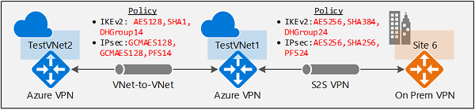
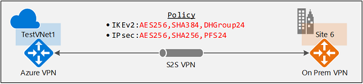

---
title: 'IPsec/IKE policy for S2S VPN & VNet-to-VNet connections'
titleSuffix: Azure VPN Gateway
description: Configure IPsec/IKE policy for S2S or VNet-to-VNet connections with Azure VPN Gateways using Azure Resource Manager and PowerShell.
services: vpn-gateway
author: yushwang

ms.service: vpn-gateway
ms.topic: article
ms.date: 02/14/2018
ms.author: yushwang

---
# Configure IPsec/IKE policy for S2S VPN or VNet-to-VNet connections

This article walks you through the steps to configure IPsec/IKE policy for Site-to-Site VPN or VNet-to-VNet connections using the Resource Manager deployment model and PowerShell.

[!INCLUDE [updated-for-az](../../includes/updated-for-az.md)]

## <a name="about"></a>About IPsec and IKE policy parameters for Azure VPN gateways
IPsec and IKE protocol standard supports a wide range of cryptographic algorithms in various combinations. Refer to [About cryptographic requirements and Azure VPN gateways](vpn-gateway-about-compliance-crypto.md) to see how this can help ensuring cross-premises and VNet-to-VNet connectivity satisfy your compliance or security requirements.

This article provides instructions to create and configure an IPsec/IKE policy and apply to a new or existing connection:

* [Part 1 - Workflow to create and set IPsec/IKE policy](#workflow)
* [Part 2 - Supported cryptographic algorithms and key strengths](#params)
* [Part 3 - Create a new S2S VPN connection with IPsec/IKE policy](#crossprem)
* [Part 4 - Create a new VNet-to-VNet connection with IPsec/IKE policy](#vnet2vnet)
* [Part 5 - Manage (create, add, remove) IPsec/IKE policy for a connection](#managepolicy)

> [!IMPORTANT]
> 1. Note that IPsec/IKE policy only works on the following gateway SKUs:
>    * ***VpnGw1, VpnGw2, VpnGw3*** (route-based)
>    * ***Standard*** and ***HighPerformance*** (route-based)
> 2. You can only specify ***one*** policy combination for a given connection.
> 3. You must specify all algorithms and parameters for both IKE (Main Mode) and IPsec (Quick Mode). Partial policy specification is not allowed.
> 4. Consult with your VPN device vendor specifications to ensure the policy is supported on your on-premises VPN devices. S2S or VNet-to-VNet connections cannot establish if the policies are incompatible.

## <a name ="workflow"></a>Part 1 - Workflow to create and set IPsec/IKE policy
This section outlines the workflow to create and update IPsec/IKE policy on a S2S VPN or VNet-to-VNet connection:
1. Create a virtual network and a VPN gateway
2. Create a local network gateway for cross premises connection, or another virtual network and gateway for VNet-to-VNet connection
3. Create an IPsec/IKE policy with selected algorithms and parameters
4. Create a connection (IPsec or VNet2VNet) with the IPsec/IKE policy
5. Add/update/remove an IPsec/IKE policy for an existing connection

The instructions in this article helps you set up and configure IPsec/IKE policies as shown in the diagram:



## <a name ="params"></a>Part 2 - Supported cryptographic algorithms & key strengths

The following table lists the supported cryptographic algorithms and key strengths configurable by the customers:

| **IPsec/IKEv2**  | **Options**    |
| ---  | --- 
| IKEv2 Encryption | AES256, AES192, AES128, DES3, DES  
| IKEv2 Integrity  | SHA384, SHA256, SHA1, MD5  |
| DH Group         | DHGroup24, ECP384, ECP256, DHGroup14, DHGroup2048, DHGroup2, DHGroup1, None |
| IPsec Encryption | GCMAES256, GCMAES192, GCMAES128, AES256, AES192, AES128, DES3, DES, None    |
| IPsec Integrity  | GCMASE256, GCMAES192, GCMAES128, SHA256, SHA1, MD5 |
| PFS Group        | PFS24, ECP384, ECP256, PFS2048, PFS2, PFS1, None 
| QM SA Lifetime   | (**Optional**: default values are used if not specified)<br>Seconds (integer; **min. 300**/default 27000 seconds)<br>KBytes (integer; **min. 1024**/default 102400000 KBytes)   |
| Traffic Selector | UsePolicyBasedTrafficSelectors** ($True/$False; **Optional**, default $False if not specified)    |
|  |  |

> [!IMPORTANT]
> 1. **Your on-premises VPN device configuration must match or contain the following algorithms and parameters that you specify on the Azure IPsec/IKE policy:**
>    * IKE encryption algorithm (Main Mode / Phase 1)
>    * IKE integrity algorithm (Main Mode / Phase 1)
>    * DH Group (Main Mode / Phase 1)
>    * IPsec encryption algorithm (Quick Mode / Phase 2)
>    * IPsec integrity algorithm (Quick Mode / Phase 2)
>    * PFS Group (Quick Mode / Phase 2)
>    * Traffic Selector (if UsePolicyBasedTrafficSelectors is used)
>    * The SA lifetimes are local specifications only, do not need to match.
>
> 2. **If GCMAES is used as for IPsec Encryption algorithm, you must select the same GCMAES algorithm and key length for IPsec Integrity; for example, using GCMAES128 for both**
> 3. In the table above:
>    * IKEv2 corresponds to Main Mode or Phase 1
>    * IPsec corresponds to Quick Mode or Phase 2
>    * DH Group specifies the Diffie-Hellmen Group used in Main Mode or Phase 1
>    * PFS Group specified the Diffie-Hellmen Group used in Quick Mode or Phase 2
> 4. IKEv2 Main Mode SA lifetime is fixed at 28,800 seconds on the Azure VPN gateways
> 5. Setting "UsePolicyBasedTrafficSelectors" to $True on a connection will configure the Azure VPN gateway to connect to policy-based VPN firewall on premises. If you enable PolicyBasedTrafficSelectors, you need to ensure your VPN device has the matching traffic selectors defined with all combinations of your on-premises network (local network gateway) prefixes to/from the Azure virtual network prefixes, instead of any-to-any. For example, if your on-premises network prefixes are 10.1.0.0/16 and 10.2.0.0/16, and your virtual network prefixes are 192.168.0.0/16 and 172.16.0.0/16, you need to specify the following traffic selectors:
>    * 10.1.0.0/16 <====> 192.168.0.0/16
>    * 10.1.0.0/16 <====> 172.16.0.0/16
>    * 10.2.0.0/16 <====> 192.168.0.0/16
>    * 10.2.0.0/16 <====> 172.16.0.0/16

For more information regarding policy-based traffic selectors, see [Connect multiple on-premises policy-based VPN devices](vpn-gateway-connect-multiple-policybased-rm-ps.md).

The following table lists the corresponding Diffie-Hellman Groups supported by the custom policy:

| **Diffie-Hellman Group**  | **DHGroup**              | **PFSGroup** | **Key length** |
| --- | --- | --- | --- |
| 1                         | DHGroup1                 | PFS1         | 768-bit MODP   |
| 2                         | DHGroup2                 | PFS2         | 1024-bit MODP  |
| 14                        | DHGroup14<br>DHGroup2048 | PFS2048      | 2048-bit MODP  |
| 19                        | ECP256                   | ECP256       | 256-bit ECP    |
| 20                        | ECP384                   | ECP384       | 384-bit ECP    |
| 24                        | DHGroup24                | PFS24        | 2048-bit MODP  |

Refer to [RFC3526](https://tools.ietf.org/html/rfc3526) and [RFC5114](https://tools.ietf.org/html/rfc5114) for more details.

## <a name ="crossprem"></a>Part 3 - Create a new S2S VPN connection with IPsec/IKE policy

This section walks you through the steps of creating a S2S VPN connection with an IPsec/IKE policy. The following steps create the connection as shown in the diagram:



See [Create a S2S VPN connection](vpn-gateway-create-site-to-site-rm-powershell.md) for more detailed step-by-step instructions for creating a S2S VPN connection.

### <a name="before"></a>Before you begin

* Verify that you have an Azure subscription. If you don't already have an Azure subscription, you can activate your [MSDN subscriber benefits](https://azure.microsoft.com/pricing/member-offers/msdn-benefits-details/) or sign up for a [free account](https://azure.microsoft.com/pricing/free-trial/).
* Install the Azure Resource Manager PowerShell cmdlets. See [Overview of Azure PowerShell](/powershell/azure/overview) for more information about installing the PowerShell cmdlets.

### <a name="createvnet1"></a>Step 1 - Create the virtual network, VPN gateway, and local network gateway

#### 1. Declare your variables

For this exercise, we start by declaring our variables. Be sure to replace the values with your own when configuring for production.

```powershell
$Sub1          = "<YourSubscriptionName>"
$RG1           = "TestPolicyRG1"
$Location1     = "East US 2"
$VNetName1     = "TestVNet1"
$FESubName1    = "FrontEnd"
$BESubName1    = "Backend"
$GWSubName1    = "GatewaySubnet"
$VNetPrefix11  = "10.11.0.0/16"
$VNetPrefix12  = "10.12.0.0/16"
$FESubPrefix1  = "10.11.0.0/24"
$BESubPrefix1  = "10.12.0.0/24"
$GWSubPrefix1  = "10.12.255.0/27"
$DNS1          = "8.8.8.8"
$GWName1       = "VNet1GW"
$GW1IPName1    = "VNet1GWIP1"
$GW1IPconf1    = "gw1ipconf1"
$Connection16  = "VNet1toSite6"

$LNGName6      = "Site6"
$LNGPrefix61   = "10.61.0.0/16"
$LNGPrefix62   = "10.62.0.0/16"
$LNGIP6        = "131.107.72.22"
```

#### 2. Connect to your subscription and create a new resource group

Make sure you switch to PowerShell mode to use the Resource Manager cmdlets. For more information, see [Using Windows PowerShell with Resource Manager](../powershell-azure-resource-manager.md).

Open your PowerShell console and connect to your account. Use the following sample to help you connect:

```powershell
Connect-AzAccount
Select-AzSubscription -SubscriptionName $Sub1
New-AzResourceGroup -Name $RG1 -Location $Location1
```

#### 3. Create the virtual network, VPN gateway, and local network gateway

The following sample creates the virtual network, TestVNet1, with three subnets, and the VPN gateway. When substituting values, it's important that you always name your gateway subnet specifically GatewaySubnet. If you name it something else, your gateway creation fails.

```powershell
$fesub1 = New-AzVirtualNetworkSubnetConfig -Name $FESubName1 -AddressPrefix $FESubPrefix1
$besub1 = New-AzVirtualNetworkSubnetConfig -Name $BESubName1 -AddressPrefix $BESubPrefix1
$gwsub1 = New-AzVirtualNetworkSubnetConfig -Name $GWSubName1 -AddressPrefix $GWSubPrefix1

New-AzVirtualNetwork -Name $VNetName1 -ResourceGroupName $RG1 -Location $Location1 -AddressPrefix $VNetPrefix11,$VNetPrefix12 -Subnet $fesub1,$besub1,$gwsub1

$gw1pip1    = New-AzPublicIpAddress -Name $GW1IPName1 -ResourceGroupName $RG1 -Location $Location1 -AllocationMethod Dynamic
$vnet1      = Get-AzVirtualNetwork -Name $VNetName1 -ResourceGroupName $RG1
$subnet1    = Get-AzVirtualNetworkSubnetConfig -Name "GatewaySubnet" -VirtualNetwork $vnet1
$gw1ipconf1 = New-AzVirtualNetworkGatewayIpConfig -Name $GW1IPconf1 -Subnet $subnet1 -PublicIpAddress $gw1pip1

New-AzVirtualNetworkGateway -Name $GWName1 -ResourceGroupName $RG1 -Location $Location1 -IpConfigurations $gw1ipconf1 -GatewayType Vpn -VpnType RouteBased -GatewaySku VpnGw1

New-AzLocalNetworkGateway -Name $LNGName6 -ResourceGroupName $RG1 -Location $Location1 -GatewayIpAddress $LNGIP6 -AddressPrefix $LNGPrefix61,$LNGPrefix62
```

### <a name="s2sconnection"></a>Step 2 - Create a S2S VPN connection with an IPsec/IKE policy

#### 1. Create an IPsec/IKE policy

The following sample script creates an IPsec/IKE policy with the following algorithms and parameters:

* IKEv2: AES256, SHA384, DHGroup24
* IPsec: AES256, SHA256, PFS None, SA Lifetime 14400 seconds & 102400000KB

```powershell
$ipsecpolicy6 = New-AzIpsecPolicy -IkeEncryption AES256 -IkeIntegrity SHA384 -DhGroup DHGroup24 -IpsecEncryption AES256 -IpsecIntegrity SHA256 -PfsGroup None -SALifeTimeSeconds 14400 -SADataSizeKilobytes 102400000
```

If you use GCMAES for IPsec, you must use the same GCMAES algorithm and key length for both IPsec encryption and integrity. For example above, the corresponding parameters will be "-IpsecEncryption GCMAES256 -IpsecIntegrity GCMAES256" when using GCMAES256.

#### 2. Create the S2S VPN connection with the IPsec/IKE policy

Create an S2S VPN connection and apply the IPsec/IKE policy created earlier.

```powershell
$vnet1gw = Get-AzVirtualNetworkGateway -Name $GWName1  -ResourceGroupName $RG1
$lng6 = Get-AzLocalNetworkGateway  -Name $LNGName6 -ResourceGroupName $RG1

New-AzVirtualNetworkGatewayConnection -Name $Connection16 -ResourceGroupName $RG1 -VirtualNetworkGateway1 $vnet1gw -LocalNetworkGateway2 $lng6 -Location $Location1 -ConnectionType IPsec -IpsecPolicies $ipsecpolicy6 -SharedKey 'AzureA1b2C3'
```

You can optionally add "-UsePolicyBasedTrafficSelectors $True" to the create connection cmdlet to enable Azure VPN gateway to connect to policy-based VPN devices on premises, as described above.

> [!IMPORTANT]
> Once an IPsec/IKE policy is specified on a connection, the Azure VPN gateway will only send or accept
> the IPsec/IKE proposal with specified cryptographic algorithms and key strengths on that particular
> connection. Make sure your on-premises VPN device for the connection uses or accepts the exact
> policy combination, otherwise the S2S VPN tunnel will not establish.


## <a name ="vnet2vnet"></a>Part 4 - Create a new VNet-to-VNet connection with IPsec/IKE policy

The steps of creating a VNet-to-VNet connection with an IPsec/IKE policy are similar to that of a S2S VPN connection. The following sample scripts create the connection as shown in the diagram:


See [Create a VNet-to-VNet connection](vpn-gateway-vnet-vnet-rm-ps.md) for more detailed steps for creating a VNet-to-VNet connection. You must complete [Part 3](#crossprem) to create and configure TestVNet1 and the VPN Gateway.

### <a name="createvnet2"></a>Step 1 - Create the second virtual network and VPN gateway

#### 1. Declare your variables

Be sure to replace the values with the ones that you want to use for your configuration.

```powershell
$RG2          = "TestPolicyRG2"
$Location2    = "East US 2"
$VNetName2    = "TestVNet2"
$FESubName2   = "FrontEnd"
$BESubName2   = "Backend"
$GWSubName2   = "GatewaySubnet"
$VNetPrefix21 = "10.21.0.0/16"
$VNetPrefix22 = "10.22.0.0/16"
$FESubPrefix2 = "10.21.0.0/24"
$BESubPrefix2 = "10.22.0.0/24"
$GWSubPrefix2 = "10.22.255.0/27"
$DNS2         = "8.8.8.8"
$GWName2      = "VNet2GW"
$GW2IPName1   = "VNet2GWIP1"
$GW2IPconf1   = "gw2ipconf1"
$Connection21 = "VNet2toVNet1"
$Connection12 = "VNet1toVNet2"
```

#### 2. Create the second virtual network and VPN gateway in the new resource group

```powershell
New-AzResourceGroup -Name $RG2 -Location $Location2

$fesub2 = New-AzVirtualNetworkSubnetConfig -Name $FESubName2 -AddressPrefix $FESubPrefix2
$besub2 = New-AzVirtualNetworkSubnetConfig -Name $BESubName2 -AddressPrefix $BESubPrefix2
$gwsub2 = New-AzVirtualNetworkSubnetConfig -Name $GWSubName2 -AddressPrefix $GWSubPrefix2

New-AzVirtualNetwork -Name $VNetName2 -ResourceGroupName $RG2 -Location $Location2 -AddressPrefix $VNetPrefix21,$VNetPrefix22 -Subnet $fesub2,$besub2,$gwsub2

$gw2pip1    = New-AzPublicIpAddress -Name $GW2IPName1 -ResourceGroupName $RG2 -Location $Location2 -AllocationMethod Dynamic
$vnet2      = Get-AzVirtualNetwork -Name $VNetName2 -ResourceGroupName $RG2
$subnet2    = Get-AzVirtualNetworkSubnetConfig -Name "GatewaySubnet" -VirtualNetwork $vnet2
$gw2ipconf1 = New-AzVirtualNetworkGatewayIpConfig -Name $GW2IPconf1 -Subnet $subnet2 -PublicIpAddress $gw2pip1

New-AzVirtualNetworkGateway -Name $GWName2 -ResourceGroupName $RG2 -Location $Location2 -IpConfigurations $gw2ipconf1 -GatewayType Vpn -VpnType RouteBased -GatewaySku HighPerformance
```

### Step 2 - Create a VNet-toVNet connection with the IPsec/IKE policy

Similar to the S2S VPN connection, create an IPsec/IKE policy then apply to policy to the new connection.

#### 1. Create an IPsec/IKE policy

The following sample script creates a different IPsec/IKE policy with the following algorithms and parameters:
* IKEv2: AES128, SHA1, DHGroup14
* IPsec: GCMAES128, GCMAES128, PFS14, SA Lifetime 14400 seconds & 102400000KB

```powershell
$ipsecpolicy2 = New-AzIpsecPolicy -IkeEncryption AES128 -IkeIntegrity SHA1 -DhGroup DHGroup14 -IpsecEncryption GCMAES128 -IpsecIntegrity GCMAES128 -PfsGroup PFS14 -SALifeTimeSeconds 14400 -SADataSizeKilobytes 102400000
```

#### 2. Create VNet-to-VNet connections with the IPsec/IKE policy

Create a VNet-to-VNet connection and apply the IPsec/IKE policy you created. In this example, both gateways are in the same subscription. So it is possible to create and configure both connections with the same IPsec/IKE policy in the same PowerShell session.

```powershell
$vnet1gw = Get-AzVirtualNetworkGateway -Name $GWName1  -ResourceGroupName $RG1
$vnet2gw = Get-AzVirtualNetworkGateway -Name $GWName2  -ResourceGroupName $RG2

New-AzVirtualNetworkGatewayConnection -Name $Connection12 -ResourceGroupName $RG1 -VirtualNetworkGateway1 $vnet1gw -VirtualNetworkGateway2 $vnet2gw -Location $Location1 -ConnectionType Vnet2Vnet -IpsecPolicies $ipsecpolicy2 -SharedKey 'AzureA1b2C3'

New-AzVirtualNetworkGatewayConnection -Name $Connection21 -ResourceGroupName $RG2 -VirtualNetworkGateway1 $vnet2gw -VirtualNetworkGateway2 $vnet1gw -Location $Location2 -ConnectionType Vnet2Vnet -IpsecPolicies $ipsecpolicy2 -SharedKey 'AzureA1b2C3'
```

> [!IMPORTANT]
> Once an IPsec/IKE policy is specified on a connection, the Azure VPN gateway will only send or accept
> the IPsec/IKE proposal with specified cryptographic algorithms and key strengths on that particular
> connection. Make sure the IPsec policies for both connections are the same, otherwise the
> VNet-to-VNet connection will not establish.

After completing these steps, the connection is established in a few minutes, and you will have the following network topology as shown in the beginning:


## <a name ="managepolicy"></a>Part 5 - Update IPsec/IKE policy for a connection

The last section shows you how to manage IPsec/IKE policy for an existing S2S or VNet-to-VNet connection. The exercise below walks you through the following operations on a connection:

1. Show the IPsec/IKE policy of a connection
2. Add or update the IPsec/IKE policy to a connection
3. Remove the IPsec/IKE policy from a connection

The same steps apply to both S2S and VNet-to-VNet connections.

> [!IMPORTANT]
> IPsec/IKE policy is supported on *Standard* and *HighPerformance* route-based VPN gateways only. It does not work on the Basic gateway SKU or the policy-based VPN gateway.

#### 1. Show the IPsec/IKE policy of a connection

The following example shows how to get the IPsec/IKE policy configured on a connection. The scripts also continue from the exercises above.

```powershell
$RG1          = "TestPolicyRG1"
$Connection16 = "VNet1toSite6"
$connection6  = Get-AzVirtualNetworkGatewayConnection -Name $Connection16 -ResourceGroupName $RG1
$connection6.IpsecPolicies
```

The last command lists the current IPsec/IKE policy configured on the connection, if there is any. The following is a sample output for the connection:

```powershell
SALifeTimeSeconds   : 14400
SADataSizeKilobytes : 102400000
IpsecEncryption     : AES256
IpsecIntegrity      : SHA256
IkeEncryption       : AES256
IkeIntegrity        : SHA384
DhGroup             : DHGroup24
PfsGroup            : PFS24
```

If there is no IPsec/IKE policy configured, the command (PS> $connection6.IpsecPolicies) gets an empty return. It does not mean IPsec/IKE is not configured on the connection, but that there is no custom IPsec/IKE policy. The actual connection uses the default policy negotiated between your on-premises VPN device and the Azure VPN gateway.

#### 2. Add or update an IPsec/IKE policy for a connection

The steps to add a new policy or update an existing policy on a connection are the same: create a new policy then apply the new policy to the connection.

```powershell
$RG1          = "TestPolicyRG1"
$Connection16 = "VNet1toSite6"
$connection6  = Get-AzVirtualNetworkGatewayConnection -Name $Connection16 -ResourceGroupName $RG1

$newpolicy6   = New-AzIpsecPolicy -IkeEncryption AES128 -IkeIntegrity SHA1 -DhGroup DHGroup14 -IpsecEncryption AES256 -IpsecIntegrity SHA256 -PfsGroup None -SALifeTimeSeconds 14400 -SADataSizeKilobytes 102400000

Set-AzVirtualNetworkGatewayConnection -VirtualNetworkGatewayConnection $connection6 -IpsecPolicies $newpolicy6
```

To enable "UsePolicyBasedTrafficSelectors" when connecting to an on-premises policy-based VPN device, add the "-UsePolicyBaseTrafficSelectors" parameter to the cmdlet, or set it to $False to disable the option:

```powershell
Set-AzVirtualNetworkGatewayConnection -VirtualNetworkGatewayConnection $connection6 -IpsecPolicies $newpolicy6 -UsePolicyBasedTrafficSelectors $True
```

You can get the connection again to check if the policy is updated.

```powershell
$connection6  = Get-AzVirtualNetworkGatewayConnection -Name $Connection16 -ResourceGroupName $RG1
$connection6.IpsecPolicies
```

You should see the output from the last line, as shown in the following example:

```powershell
SALifeTimeSeconds   : 14400
SADataSizeKilobytes : 102400000
IpsecEncryption     : AES256
IpsecIntegrity      : SHA256
IkeEncryption       : AES128
IkeIntegrity        : SHA1
DhGroup             : DHGroup14
PfsGroup            : None
```

#### 3. Remove an IPsec/IKE policy from a connection

Once you remove the custom policy from a connection, the Azure VPN gateway reverts back to the [default list of IPsec/IKE proposals](vpn-gateway-about-vpn-devices.md) and renegotiates again with your on-premises VPN device.

```powershell
$RG1           = "TestPolicyRG1"
$Connection16  = "VNet1toSite6"
$connection6   = Get-AzVirtualNetworkGatewayConnection -Name $Connection16 -ResourceGroupName $RG1

$currentpolicy = $connection6.IpsecPolicies[0]
$connection6.IpsecPolicies.Remove($currentpolicy)

Set-AzVirtualNetworkGatewayConnection -VirtualNetworkGatewayConnection $connection6
```

You can use the same script to check if the policy has been removed from the connection.

## Next steps

See [Connect multiple on-premises policy-based VPN devices](vpn-gateway-connect-multiple-policybased-rm-ps.md) for more details regarding policy-based traffic selectors.

Once your connection is complete, you can add virtual machines to your virtual networks. See [Create a Virtual Machine](../virtual-machines/virtual-machines-windows-hero-tutorial.md?toc=%2fazure%2fvirtual-machines%2fwindows%2ftoc.json) for steps.
