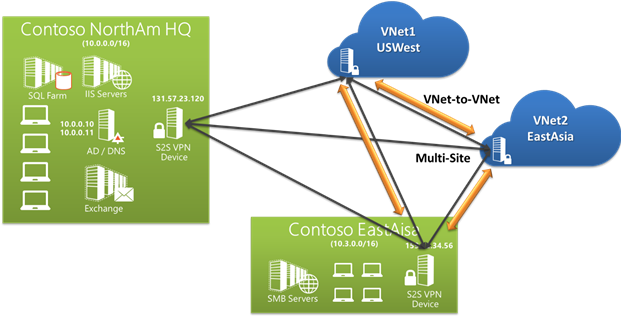

<properties 
   pageTitle="Connect multiple on-premises sites to a virtual network"
   description="This article will walk you through connecting multiple local on-premises sites to a virtual network."
   services="vpn-gateway"
   documentationCenter="na"
   authors="cherylmc"
   manager="carolz"
   editor="tysonn" />
<tags 
   ms.service="vpn-gateway"
   ms.devlang="na"
   ms.topic="article"
   ms.tgt_pltfrm="na"
   ms.workload="infrastructure-services"
   ms.date="08/04/2015"
   ms.author="cherylmc" />

# Connect multiple on-premises sites to a virtual network

You can connect multiple on-premises sites to a single virtual network. This is especially attractive for building hybrid cloud solutions. Creating a multi-site connection to your Azure virtual network gateway is very similar to creating other site-to-site connections. In fact, you can use an existing Azure VPN gateway, provided you have a route-based (or dynamic routing) VPN gateway configured for your virtual network. 

If your gateway is policy-based (or static routing), you can always change the gateway type without needing to rebuild the virtual network to accommodate multi-site, although you will also need to ensure your on-premises VPN gateway supports route-based VPN configurations. You'll then just add configuration settings to the network configuration file, and create multiple VPN connections from your virtual network to additional sites.

## Points to consider

**You won't be able to use the Management Portal to make changes to this virtual network.** For this release, you'll need to make changes to the network configuration file instead of using the Management Portal. If you make changes in the Management Portal, they'll overwrite your multi-site reference settings for this virtual network. You should feel pretty comfortable using the network configuration file by the time you've completed the multi-site procedure. However, if you have multiple people working on your network configuration, you'll need to make sure that everyone knows about this limitation. This doesn't mean that you can't use the Management Portal at all. You can use it for everything else except making configuration changes to this particular virtual network.

## Before you begin

Before you begin configuration, verify that you have the following:

- An Azure subscription. If you don't already have an Azure subscription, you can activate your [MSDN subscriber benefits](http://azure.microsoft.com/pricing/member-offers/msdn-benefits-details/) or sign up for a [free trial](http://azure.microsoft.com/pricing/free-trial/).

- Compatible VPN hardware for each on-premises location. Check [About VPN Devices for Virtual Network Connectivity](http://go.microsoft.com/fwlink/p/?linkid=615099) to verify if the device that you want to use is something that is known to be compatible.

- An externally facing public IPv4 IP address for each VPN device. The IP address cannot be located behind a NAT. This is requirement.

-   The latest version of Azure PowerShell cmdlets. You can download and install the latest version from the Windows PowerShell section of the [Downloads](http://azure.microsoft.com/downloads/) page.

- Someone who is proficient at configuring your VPN hardware. You won't be able to use the auto-generated VPN scripts from the Management Portal to configure your VPN devices. This means you'll have to have a strong understanding of how to configure your VPN device, or work with someone who does.

- The IP address ranges that you want to use for your virtual network (if you haven't already created one). 

- The IP address ranges for each of the local network sites that you'll be connecting to. You'll need to make sure that the IP address ranges for each of the local network sites that you want to connect to do not overlap. Otherwise, the Management Portal or the REST API will reject the configuration being uploaded. For example, if you have two local network sites that both contain the IP address range 10.2.3.0/24 and you have a package with a destination address 10.2.3.3, Azure wouldn't know which site you want to send the package to because the address ranges are overlapping. To prevent routing issues, Azure doesn't allow you to upload a configuration file that has overlapping ranges.

## Create your virtual network and gateway

1. **Create a site-to-site VPN with a dynamic routing gateway.** If you already have one, great! You can proceed to [Export the virtual network configuration settings](#export). If not, do the following:

	**If you already have a site-to-site virtual network, but it has a static routing gateway:** **1.** Change your gateway type to dynamic routing. A multi-site VPN requires a dynamic routing gateway. To change your gateway type, you'll need to first delete the existing gateway, then create a new one. For instructions, see [Change a VPN Gateway Routing Type](vpn-gateway-configure-vpn-gateway-mp.md/#how-to-change-your-vpn-gateway-type). **2.** Configure your new gateway and create your VPN tunnel. For instructions, see [Configure a VPN Gateway in the Management Portal](vpn-gateway-configure-vpn-gateway-mp.md). 
	
	**If you don't have a site-to-site virtual network:** **1.** Create your site-to-site virtual network using these instructions: [Create a Virtual Network with a Site-to-Site VPN Connection in the Management Portal](vpn-gateway-site-to-site-create.md). **2.** Configure a dynamic routing gateway using these instructions: [Configure a VPN Gateway in the Management Portal](vpn-gateway-configure-vpn-gateway-mp.md). Be sure to select **dynamic routing** for your gateway type.

1. **Export the virtual network configuration settings.** To export your network configuration file, see [To export your network settings](../virtual-network/virtual-networks-using-network-configuration-file.md#export-and-import-virtual-network-settings-using-the-management-portal). The file that you export will be used to configure your new multi-site settings.

1. **Open your network configuration file.** Open the network configuration file that you downloaded in the last step. Use any xml editor that you like. The file should look similar to the following:

		<NetworkConfiguration xmlns:xsd="http://www.w3.org/2001/XMLSchema" xmlns:xsi="http://www.w3.org/2001/XMLSchema-instance" xmlns="http://schemas.microsoft.com/ServiceHosting/2011/07/NetworkConfiguration">
		  <VirtualNetworkConfiguration>
		    <LocalNetworkSites>
		      <LocalNetworkSite name="Site1">
		        <AddressSpace>
		          <AddressPrefix>10.0.0.0/16</AddressPrefix>
		          <AddressPrefix>10.1.0.0/16</AddressPrefix>
		        </AddressSpace>
		        <VPNGatewayAddress>131.2.3.4</VPNGatewayAddress>
		      </LocalNetworkSite>
		      <LocalNetworkSite name="Site2">
		        <AddressSpace>
		          <AddressPrefix>10.2.0.0/16</AddressPrefix>
		          <AddressPrefix>10.3.0.0/16</AddressPrefix>
		        </AddressSpace>
		        <VPNGatewayAddress>131.4.5.6</VPNGatewayAddress>
		      </LocalNetworkSite>
		    </LocalNetworkSites>
		    <VirtualNetworkSites>
		      <VirtualNetworkSite name="VNet1" AffinityGroup="USWest">
		        <AddressSpace>
		          <AddressPrefix>10.20.0.0/16</AddressPrefix>
		          <AddressPrefix>10.21.0.0/16</AddressPrefix>
		        </AddressSpace>
		        <Subnets>
		          <Subnet name="FE">
		            <AddressPrefix>10.20.0.0/24</AddressPrefix>
		          </Subnet>
		          <Subnet name="BE">
		            <AddressPrefix>10.20.1.0/24</AddressPrefix>
		          </Subnet>
		          <Subnet name="GatewaySubnet">
		            <AddressPrefix>10.20.2.0/29</AddressPrefix>
		          </Subnet>
		        </Subnets>
		        <Gateway>
		          <ConnectionsToLocalNetwork>
		            <LocalNetworkSiteRef name="Site1">
		              <Connection type="IPsec" />
		            </LocalNetworkSiteRef>
		          </ConnectionsToLocalNetwork>
		        </Gateway>
		      </VirtualNetworkSite>
		    </VirtualNetworkSites>
		  </VirtualNetworkConfiguration>
		</NetworkConfiguration>

1. Add multiple site references to the network configuration file. When you add or remove site reference information, you'll make configuration changes to the ConnectionsToLocalNetwork/LocalNetworkSiteRef. Adding a new local site reference triggers Azure to create a new tunnel. In the example below, the network configuration is for a single-site connection.

		<Gateway>
          <ConnectionsToLocalNetwork>
            <LocalNetworkSiteRef name="Site1"><Connection type="IPsec" /></LocalNetworkSiteRef>
          </ConnectionsToLocalNetwork>
        </Gateway>

	To add additional site references (create a multi-site configuration), simply add additional "LocalNetworkSiteRef" lines, as shown in the example below: 

        <Gateway>
          <ConnectionsToLocalNetwork>
            <LocalNetworkSiteRef name="Site1"><Connection type="IPsec" /></LocalNetworkSiteRef>
            <LocalNetworkSiteRef name="Site2"><Connection type="IPsec" /></LocalNetworkSiteRef>
          </ConnectionsToLocalNetwork>
        </Gateway>

1. **Save the network configuration file and import it.** To import the network configuration file, see [To import your network settings](../virtual-network/../virtual-network/virtual-networks-using-network-configuration-file.md#export-and-import-virtual-network-settings-using-the-management-portal). When you import this file with the changes, the new tunnels will be added. The tunnels will use the dynamic gateway that you created earlier.

1. **Download the pre-shared keys for the VPN tunnels.** Once your new tunnels have been added, use the PowerShell cmdlet Get-AzureVNetGatewayKey to get the IPsec/IKE pre-shared keys for each tunnel.

	For example:

		PS C:\> Get-AzureVNetGatewayKey –VNetName "VNet1" –LocalNetworkSiteName "Site1"

		PS C:\> Get-AzureVNetGatewayKey –VNetName "VNet1" –LocalNetworkSiteName "Site2"

	If you prefer, you can also use the *Get Virual Network Gateway Shared Key* REST API to get the pre-shared keys.

## Verify your connections

**Check the multi-site tunnel status.** After downloading the keys for each tunnel, you'll want to verify connections. Use *Get-AzureVnetConnection* to get a list of virtual network tunnels, as shown in the example below. VNet1 is the name of the VNet.

		PS C:\Users\yushwang\Azure> Get-AzureVnetConnection -VNetName VNET1
		
		ConnectivityState         : Connected
		EgressBytesTransferred    : 661530
		IngressBytesTransferred   : 519207
		LastConnectionEstablished : 5/2/2014 2:51:40 PM
		LastEventID               : 23401
		LastEventMessage          : The connectivity state for the local network site 'Site1' changed from Not Connected to Connected.
		LastEventTimeStamp        : 5/2/2014 2:51:40 PM
		LocalNetworkSiteName      : Site1
		OperationDescription      : Get-AzureVNetConnection
		OperationId               : 7f68a8e6-51e9-9db4-88c2-16b8067fed7f
		OperationStatus           : Succeeded
		
		ConnectivityState         : Connected
		EgressBytesTransferred    : 789398
		IngressBytesTransferred   : 143908
		LastConnectionEstablished : 5/2/2014 3:20:40 PM
		LastEventID               : 23401
		LastEventMessage          : The connectivity state for the local network site 'Site2' changed from Not Connected to Connected.
		LastEventTimeStamp        : 5/2/2014 2:51:40 PM
		LocalNetworkSiteName      : Site2
		OperationDescription      : Get-AzureVNetConnection
		OperationId               : 7893b329-51e9-9db4-88c2-16b8067fed7f
		OperationStatus           : Succeeded

## Next Steps

To learn more about VPN Gateways, see [About VPN Gateways](../vpn-gateway/vpn-gateway-about-vpngateways.md).

