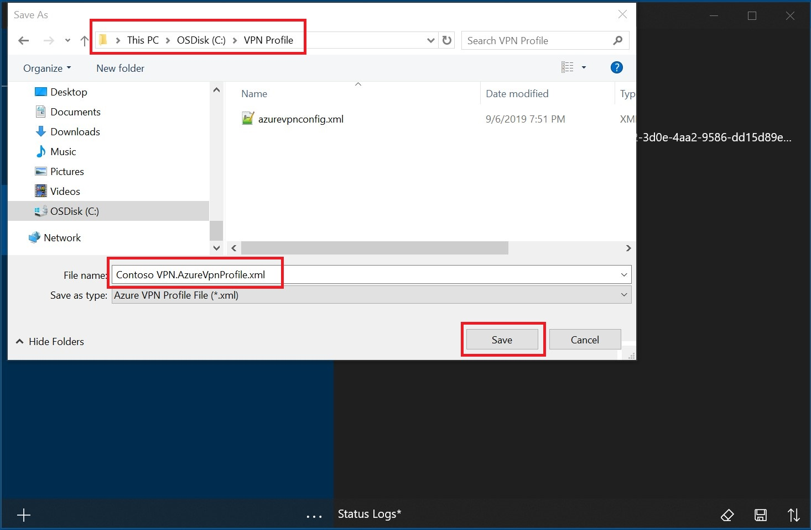
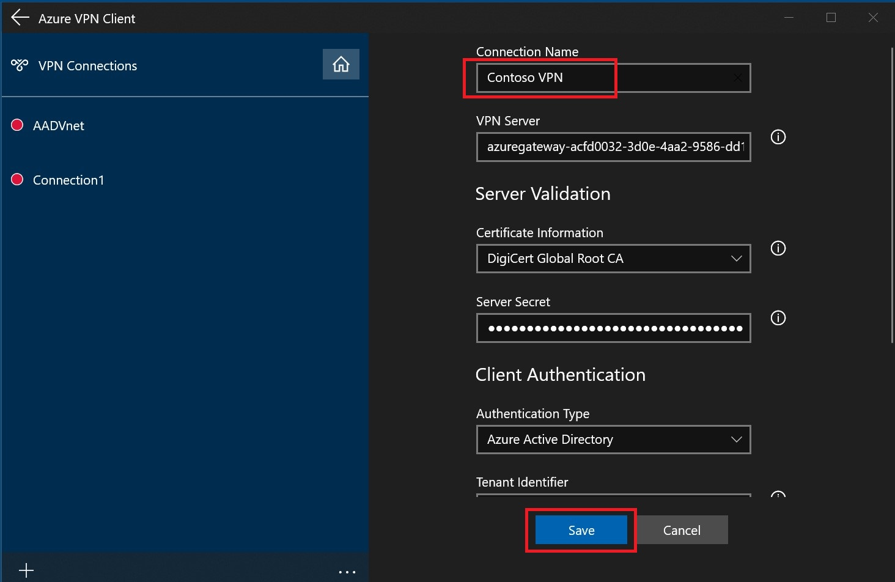
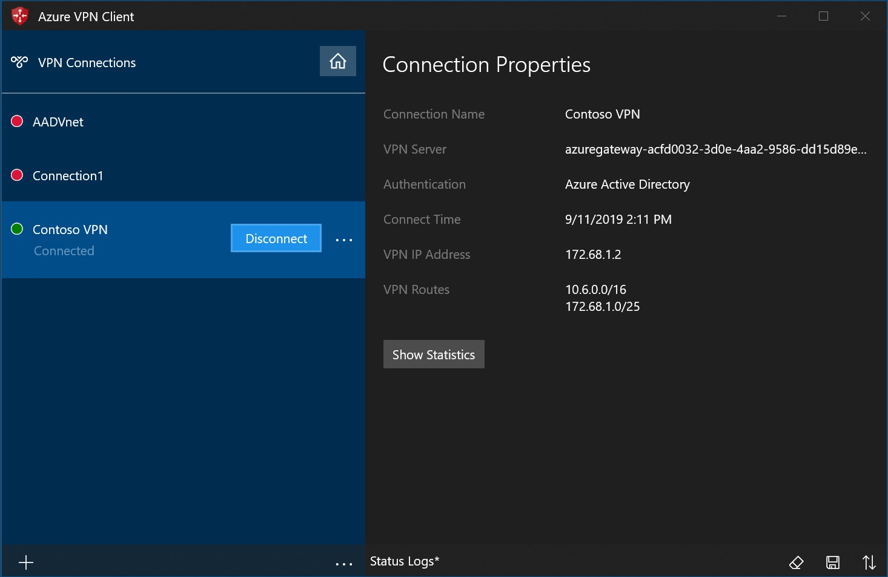
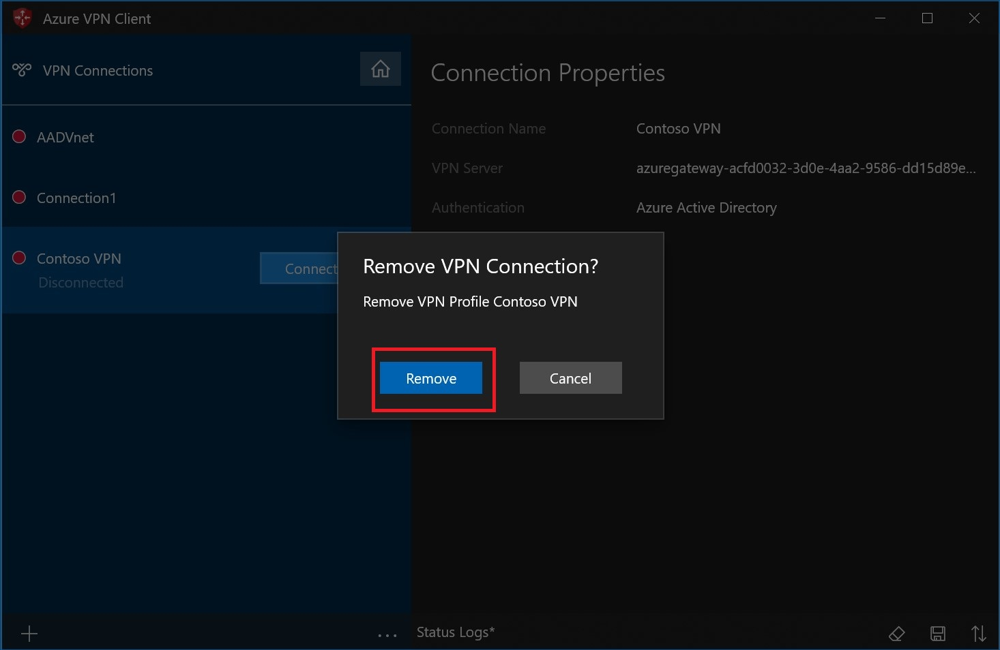
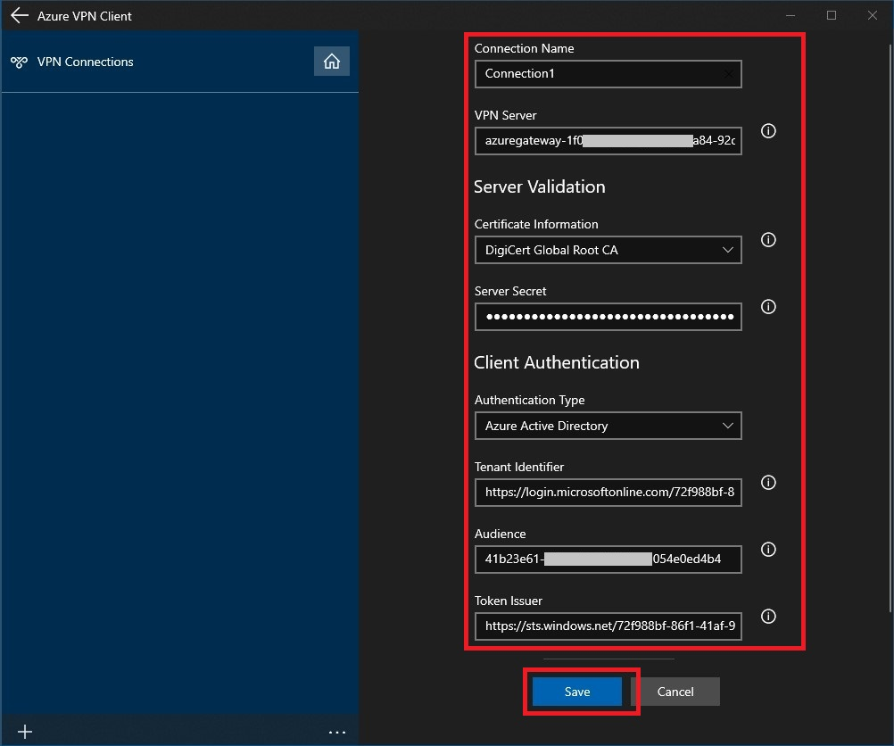
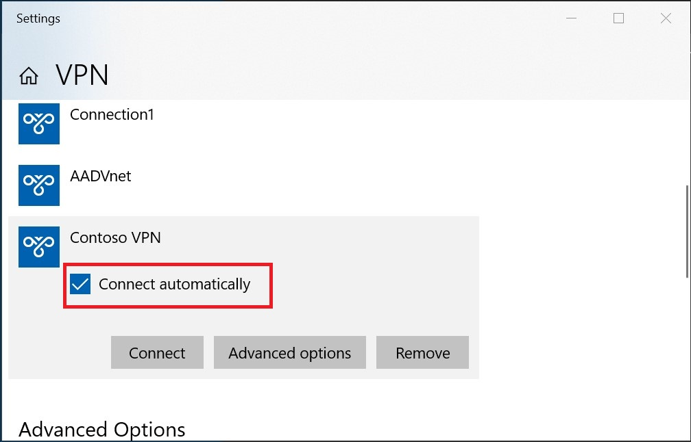
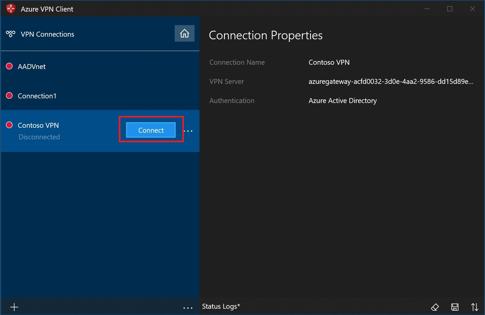
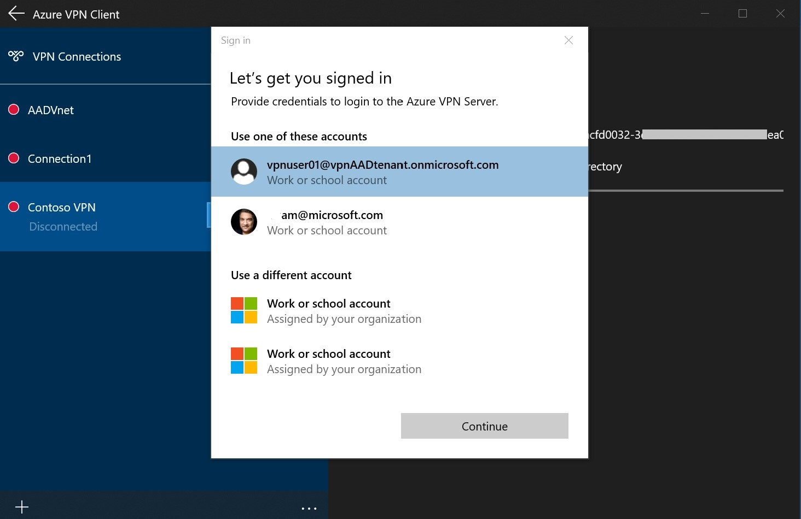
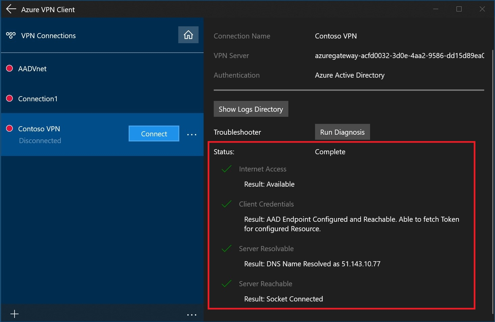

# Configure a VPN client for P2S VPN connections: AAD authentication

This article helps you configure a VPN client to connect to a virtual network using Point-to-Site VPN and Azure Active Directory authentication. Before you can connect and authenticate using AAD, you must first configure your AAD tenant. For more information, see [Configure an AAD tenant](vpn-gateway-openvpn-aad-tenant.md).

## Working with client profiles

To connect, you need to configure a VPN client profile on every computer that wants to connect to the VNet. You can create a client profile on a computer, export it, and then import it to additional computers.

### To create a certificate-based client profile

When working with a certificate-based profile, make sure that the appropriate certificates are installed on the client computer. For more information about certificates, see [Install client certificates](point-to-site-how-to-vpn-client-install-azure-cert.md).

  

### To create a RADIUS client profile

  

### To export and distribute a client profile

Once you have a working profile and need to distribute it to other users, you can export it using the following steps:

1. Hi-lite the VPN client profile that you want to export, click the **...**, then click **Export**.

    

2. Select the location that you want to save this profile to, leave the file name as is, then click **Save** to save the xml file.

    

### To import a client profile

1. On the page, click **Import**.

    

2. Browse to the profile xml file and select it. With the file selected, click **Open**.

    

3. Specify the name of the profile and click **Save**.

    

4. Click **Connect** to connect to the VPN.

    

5. Once connected, the icon will turn green and say **Connected**.

    

### To delete a client profile

1. Select the ellipses next to the client profile that you want to delete. Then, click **Remove**.

    

2. Click **Remove** to delete.

    

## Create a connection

1. On the page, click **+**, then **+ Add**.

    

2. Fill out the connection information. If you are unsure of the values, contact your administrator. After filling out the values, click **Save**.

    

3. Click **Connect** to connect to the VPN.

    

4. Select the proper credentials, then click **Continue**.

    

5. Once successfully connected, the icon will turn green and say **Connected**.

    

### To connect automatically

These steps help you configure your connection to connect automatically with Always-on.

1. On the home page for your VPN client, click **VPN Settings**.

    

2. Click **Yes** on the switch apps dialogue box.

    

3. Make sure the connection that you want to set is not already connected, then hi-lite the profile and check the **Connect automatically** check box.

    

4. Click **Connect** to initiate the VPN connection.

    

## Diagnose connection issues

1. To diagnose connection issues, you can use the **Diagnose** tool. Click the **...** next to the VPN connection that you want to diagnose to reveal the menu. Then click **Diagnose**.

    

2. On the **Connection Properties** page, click **Run Diagnosis**.

    

3. Sign in with your credentials.

    

4. View the diagnosis results.

    
