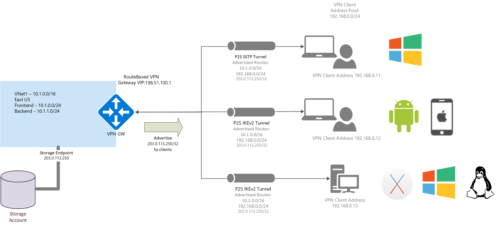

# Advertise custom routes for P2S VPN clients

You may want to advertise custom routes to all of your point-to-site VPN clients. For example, when you have enabled storage endpoints in your VNet and want the remote users to be able to access these storage accounts over the VPN connection. You can advertise the IP address of the storage end-point to all your remote users so that the traffic to the storage account goes over the VPN tunnel, and not the public Internet.



## To advertise custom routes

To advertise custom routes, use the `Set-AzVirtualNetworkGateway cmdlet`. The following example shows you how to advertise the IP for the [Contoso storage account tables](https://contoso.table.core.windows.net).

1. Ping *contoso.table.core.windows.net* and note the IP address. For example:

    ```cmd
    C:\>ping contoso.table.core.windows.net
    Pinging table.by4prdstr05a.store.core.windows.net [13.88.144.250] with 32 bytes of data:
    ```

2. Run the following PowerShell commands:

    ```azurepowershell-interactive
    $gw = Get-AzVirtualNetworkGateway -Name <name of gateway> -ResourceGroupName <name of resource group>
    Set-AzVirtualNetworkGateway -VirtualNetworkGateway $gw -CustomRoute 13.88.144.250/32
    ```

3. To add multiple custom routes, use a comma and spaces to separate the addresses. For example:

    ```azurepowershell-interactive
    Set-AzVirtualNetworkGateway -VirtualNetworkGateway $gw -CustomRoute x.x.x.x/xx , y.y.y.y/yy
    ```
## To view custom routes

Use the following example to view custom routes:

  ```azurepowershell-interactive
  $gw = Get-AzVirtualNetworkGateway -Name <name of gateway> -ResourceGroupName <name of resource group>
  $gw.CustomRoutes | Format-List
  ```
## To delete custom routes

Use the following example to delete custom routes:

  ```azurepowershell-interactive
  $gw = Get-AzVirtualNetworkGateway -Name <name of gateway> -ResourceGroupName <name of resource group>
  Set-AzVirtualNetworkGateway -VirtualNetworkGateway $gw -CustomRoute @0
  ```
## Next steps

For additional P2S routing information, see [About point-to-site routing](vpn-gateway-about-point-to-site-routing.md).
