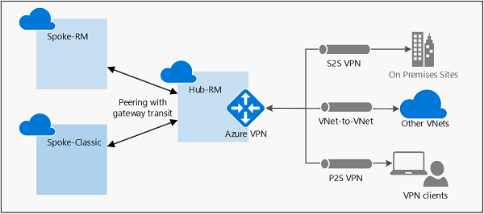
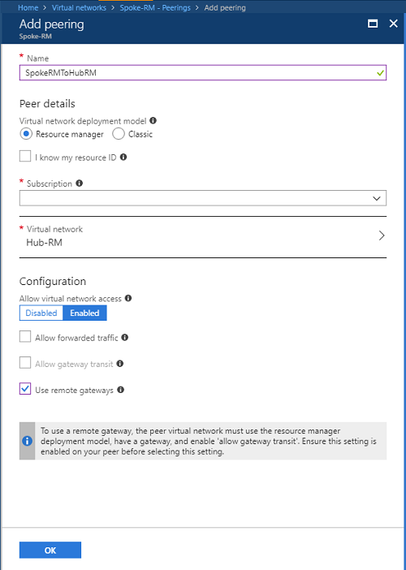
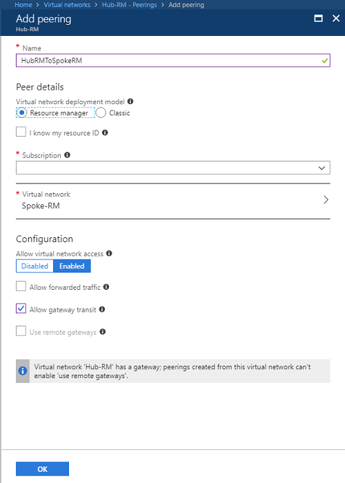
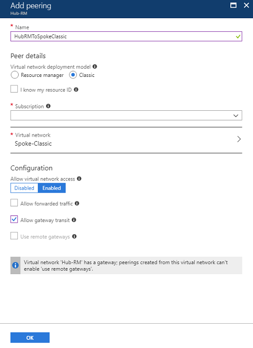

# Configure VPN gateway transit for virtual network peering

This article helps you configure gateway transit for virtual network peering. [Virtual network peering](../virtual-network/virtual-network-peering-overview.md) seamlessly connects two Azure virtual networks, merging the two virtual networks into one for connectivity purposes. [Gateway transit](../virtual-network/virtual-network-peering-overview.md#gateways-and-on-premises-connectivity) is a peering property that enables one virtual network to utilize the VPN gateway in the peered virtual network for cross-premises or VNet-to-VNet connectivity. The following diagram shows how gateway transit works with virtual network peering.



In the diagram, gateway transit allows the peered virtual networks to use the Azure VPN gateway in Hub-RM. Connectivity available on the VPN gateway, including S2S, P2S, and VNet-to-VNet connections, applies to all three virtual networks. The transit option is available for peering between the same or different deployment models. The constraint is that the VPN gateway can only be in the virtual network using Resource Manager deployment model, as shown in the diagram.

In hub-and-spoke network architecture, gateway transit allows spoke virtual networks to share the VPN gateway in the hub, instead of deploying VPN gateways in every spoke virtual network. Routes to the gateway-connected virtual networks or on-premises networks will propagate to the routing tables for the peered virtual networks using gateway transit. You can disable the automatic route propagation from the VPN gateway. Create a routing table with the "**Disable BGP route propagation**" option, and associate the routing table to the subnets to prevent the route distribution to those subnets. For more information, see [Virtual network routing table](../virtual-network/manage-route-table.md).

There are two scenarios described in this document:

1. Both virtual networks are using the Resource Manager deployment model
2. The spoke virtual network is classic, and the hub virtual network with gateway is in Resource Manager

## Requirements

[!INCLUDE [updated-for-az](../../includes/updated-for-az.md)]

The example in this document requires the following resources to be created:

1. Hub-RM virtual network with a VPN gateway
2. Spoke-RM virtual network
3. Spoke-Classic virtual network with the classic deployment model
4. The account you use requires the necessary roles and permission. See the [Permissions](#permissions) section of this article for details.

Refer to the following documents for instructions:

1. [Create a VPN gateway in a virtual network](vpn-gateway-howto-site-to-site-resource-manager-portal.md)
2. [Create virtual network peering with the same deployment model](../virtual-network/tutorial-connect-virtual-networks-portal.md)
3. [Create virtual network peering with different deployment models](../virtual-network/create-peering-different-deployment-models.md)

## <a name="permissions"></a>Permissions

The accounts you use to create a virtual network peering must have the necessary roles or permissions. In the example below, if you were peering two virtual networks named Hub-RM and Spoke-Classic, your account must have the following roles or permissions for each virtual network:
    
|Virtual network|Deployment model|Role|Permissions|
|---|---|---|---|
|Hub-RM|Resource Manager|[Network Contributor](../role-based-access-control/built-in-roles.md?toc=%2fazure%2fvirtual-network%2ftoc.json#network-contributor)|Microsoft.Network/virtualNetworks/virtualNetworkPeerings/write|
| |Classic|[Classic Network Contributor](../role-based-access-control/built-in-roles.md?toc=%2fazure%2fvirtual-network%2ftoc.json#classic-network-contributor)|N/A|
|Spoke-Classic|Resource Manager|[Network Contributor](../role-based-access-control/built-in-roles.md?toc=%2fazure%2fvirtual-network%2ftoc.json#network-contributor)|Microsoft.Network/virtualNetworks/peer|
||Classic|[Classic Network Contributor](../role-based-access-control/built-in-roles.md?toc=%2fazure%2fvirtual-network%2ftoc.json#classic-network-contributor)|Microsoft.ClassicNetwork/virtualNetworks/peer|

Learn more about [built-in roles](../role-based-access-control/built-in-roles.md?toc=%2fazure%2fvirtual-network%2ftoc.json#network-contributor) and assigning specific permissions to [custom roles](../active-directory/role-based-access-control-custom-roles.md?toc=%2fazure%2fvirtual-network%2ftoc.json) (Resource Manager only).

## Resource Manager to Resource Manager peering with gateway transit

Follow the instructions to create or update the virtual network peerings to enable gateway transit.

1. Create or update the virtual network peering from Spoke-RM to Hub-RM from the Azure portal. Navigate to the Spoke-RM virtual network resource, click on "Peerings", then "Add":
    - Set the "Resource Manager" option
    - Select the Hub-RM virtual network in the corresponding subscription
    - Make sure "Allow virtual network access" is "Enabled"
    - Set the "**Use remote gateways**" option
    - Click "OK"

      

2. If the peering is already created, navigate to the peering resource, then enable the "**Use remote gateways**" option similar to the screenshot shown in step (1)

3. Create or update the virtual network peering from Hub-RM to Spoke-RM from the Azure portal. Navigate to the Hub-RM virtual network resource, click on "Peerings", then "Add":
    - Set the "Resource Manager" option
    - Make sure "Allow virtual network access" is "Enabled"
    - Select the "Spoke-RM" virtual network in the corresponding subscription
    - Set the "**Allow gateway transit**" option
    - Click "OK"

      

4. If the peering is already created, navigate to the peering resource, then enable the "**Allow gateway transit**" option similar to the screenshot shown in step (3)

5. Verify the peering status as "**Connected**" on both virtual networks

### PowerShell sample

You can also use PowerShell to create or update the peering with the example above. Replace the variables with the names of your virtual networks and resource groups.

```azurepowershell-interactive
$SpokeRG = "SpokeRG1"
$SpokeRM = "Spoke-RM"
$HubRG   = "HubRG1"
$HubRM   = "Hub-RM"

$spokermvnet = Get-AzVirtualNetwork -Name $SpokeRM -ResourceGroup $SpokeRG
$hubrmvnet   = Get-AzVirtualNetwork -Name $HubRM -ResourceGroup $HubRG

Add-AzVirtualNetworkPeering `
  -Name SpokeRMtoHubRM `
  -VirtualNetwork $spokermvnet `
  -RemoteVirtualNetworkId $hubrmvnet.Id `
  -UseRemoteGateways

Add-AzVirtualNetworkPeering `
  -Name HubRMToSpokeRM `
  -VirtualNetwork $hubrmvnet `
  -RemoteVirtualNetworkId $spokermvnet.Id `
  -AllowGatewayTransit
```

## Classic to Resource Manager peering with gateway transit

The steps are similar to the Resource Manager example, except the operations are applied on the Hub-RM virtual network only.

1. Create or update the virtual network peering from Hub-RM to Spoke-RM from the Azure portal. Navigate to the Hub-RM virtual network resource, click on "Peerings", then "Add":
   - Set the "Classic" option for Virtual network deployment model
   - Select the "Spoke-Classic" virtual network in the corresponding subscription
   - Make sure "Allow virtual network access" is "Enabled"
   - Set the "**Allow gateway transit**" option
   - Click "OK"

     

2. If the peering is already created, navigate to the peering resource, then enable the "**Allow gateway transit**" option similar to the screenshot shown in step (1)

3. There is no operation on the Spoke-Classic virtual network

4. Verify the peering status as "**Connected**" on the Hub-RM virtual network

Once the status shows "Connected", the spoke virtual networks can start using VNet-to-VNet or cross-premises connectivity through the VPN gateway in the hub virtual network.

### PowerShell sample

You can also use PowerShell to create or update the peering with the example above. Replace the variables and subscription ID with the values of your virtual network and resource groups, and subscription. You only need to create virtual network peering on the hub virtual network.

```azurepowershell-interactive
$HubRG   = "HubRG1"
$HubRM   = "Hub-RM"

$hubrmvnet   = Get-AzVirtualNetwork -Name $HubRM -ResourceGroup $HubRG

Add-AzVirtualNetworkPeering `
  -Name HubRMToSpokeRM `
  -VirtualNetwork $hubrmvnet `
  -RemoteVirtualNetworkId "/subscriptions/<subscription Id>/resourceGroups/Default-Networking/providers/Microsoft.ClassicNetwork/virtualNetworks/Spoke-Classic" `
  -AllowGatewayTransit
```

## Next steps

* Learn more about [virtual network peering constraints and behaviors](../virtual-network/virtual-network-manage-peering.md#requirements-and-constraints) and [virtual network peering settings](../virtual-network/virtual-network-manage-peering.md#create-a-peering) before creating a virtual network peering for production use.
* Learn how to [create a hub and spoke network topology](/azure/architecture/reference-architectures/hybrid-networking/hub-spoke?toc=%2fazure%2fvirtual-network%2ftoc.json#vnet-peering) with virtual network peering and gateway transit.
