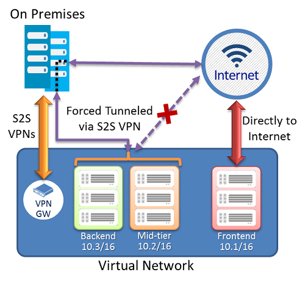

# Planning and design for VPN Gateway
Planning and designing your cross-premises and VNet-to-VNet configurations can be either simple, or complicated, depending on your networking needs. This article walks you through basic planning and design considerations.

## Planning
### Cross-premises connectivity options
If you want to connect your on-premises sites securely to a virtual network, you have three different ways to do so: Site-to-Site, Point-to-Site, and ExpressRoute. Compare the different cross-premises connections that are available. The option you choose can depend on various considerations, such as:

* What kind of throughput does your solution require?
* Do you want to communicate over the public Internet via secure VPN, or over a private connection?
* Do you have a public IP address available to use?
* Are you planning to use a VPN device? If so, is it compatible?
* Are you connecting just a few computers, or do you want a persistent connection for your site?
* What type of VPN gateway is required for the solution you want to create?
* Which gateway SKU should you use?

### Planning table
The following table can help you decide the best connectivity option for your solution.

[!INCLUDE [vpn-gateway-cross-premises](../../includes/vpn-gateway-cross-premises-include.md)]

### Gateway SKUs
[!INCLUDE [vpn-gateway-table-gwtype-aggtput](../../includes/vpn-gateway-table-gwtype-aggtput-include.md)]

### Workflow
The following list outlines the common workflow for cloud connectivity:

1. Design and plan your connectivity topology and list the address spaces for all networks you want to connect.
2. Create an Azure virtual network. 
3. Create a VPN gateway for the virtual network.
4. Create and configure connections to on-premises networks or other virtual networks (as needed).
5. Create and configure a Point-to-Site connection for your Azure VPN gateway (as needed).

## Design
### Connection topologies
Start by looking at the diagrams in the [About VPN Gateway](vpn-gateway-about-vpngateways.md) article. The article contains basic diagrams, the deployment models for each topology (Resource Manager or classic), and which deployment tools you can use to deploy your configuration.   

### Design basics
The following sections discuss the VPN gateway basics. Also, consider [networking services limitations](../azure-subscription-service-limits.md#networking-limits).

#### About subnets
When you are creating connections, you must consider your subnet ranges. You cannot have overlapping subnet address ranges. An overlapping subnet is when one virtual network or on-premises location contains the same address space that the other location contains. This means that you need your network engineers for your local on-premises networks to carve out a range for you to use for your Azure IP addressing space/subnets. You need address space that is not being used on the local on-premises network. 

Avoiding overlapping subnets is also important when you are working with VNet-to-VNet connections. If your subnets overlap and an IP address exists in both the sending and destination VNets, VNet-to-VNet connections fail. Azure can't route the data to the other VNet because the destination address is part of the sending VNet. 

VPN Gateways require a specific subnet called a gateway subnet. All gateway subnets must be named GatewaySubnet to work properly. Be sure not to name your gateway subnet a different name, and don't deploy VMs or anything else to the gateway subnet. See [Gateway Subnets](vpn-gateway-about-vpn-gateway-settings.md#gwsub).

#### About local network gateways
The local network gateway typically refers to your on-premises location. In the classic deployment model, the local network gateway is referred to as a Local Network Site. When you configure a local network gateway, you give it a name, specify the public IP address of the on-premises VPN device, and specify the address prefixes that are in the on-premises location. Azure looks at the destination address prefixes for network traffic, consults the configuration that you have specified for the local network gateway, and routes packets accordingly. You can modify these address prefixes as needed. For more information, see [Local network gateways](vpn-gateway-about-vpn-gateway-settings.md#lng).

#### About gateway types
Selecting the correct gateway type for your topology is critical. If you select the wrong type, your gateway won't work properly. The gateway type specifies how the gateway itself connects and is a required configuration setting for the Resource Manager deployment model.

The gateway types are:

* Vpn
* ExpressRoute

#### About connection types
Each configuration requires a specific connection type. The connection types are:

* IPsec
* Vnet2Vnet
* ExpressRoute
* VPNClient

#### About VPN types
Each configuration requires a specific VPN type. If you are combining two configurations, such as creating a Site-to-Site connection and a Point-to-Site connection to the same VNet, you must use a VPN type that satisfies both connection requirements.

[!INCLUDE [vpn-gateway-vpntype](../../includes/vpn-gateway-vpntype-include.md)]

The following tables show the VPN type as it maps to each connection configuration. Make sure the VPN type for your gateway matches the configuration that you want to create. 

[!INCLUDE [vpn-gateway-table-vpntype](../../includes/vpn-gateway-table-vpntype-include.md)]

### VPN devices for Site-to-Site connections
To configure a Site-to-Site connection, regardless of deployment model, you need the following items:

* A VPN device that is compatible with Azure VPN gateways
* A public-facing IPv4 IP address that is not behind a NAT

You need to have experience configuring your VPN device, or have someone that can configure the device for you. For more information about VPN devices, see [About VPN devices](vpn-gateway-about-vpn-devices.md). The VPN devices article contains information about validated devices, requirements for devices that have not been validated, and links to device configuration documents if available.

### Consider forced tunnel routing
For most configurations, you can configure forced tunneling. Forced tunneling lets you redirect or "force" all Internet-bound traffic back to your on-premises location via a Site-to-Site VPN tunnel for inspection and auditing. This is a critical security requirement for most enterprise IT policies. 

Without forced tunneling, Internet-bound traffic from your VMs in Azure will always traverse from Azure network infrastructure directly out to the Internet, without the option to allow you to inspect or audit the traffic. Unauthorized Internet access can potentially lead to information disclosure or other types of security breaches.

A forced tunneling connection can be configured in both deployment models and by using different tools. For more information, see [Configure forced tunneling](vpn-gateway-forced-tunneling-rm.md).

**Forced tunneling diagram**

## Next steps
See the [VPN Gateway FAQ](vpn-gateway-vpn-faq.md) and [About VPN Gateway](vpn-gateway-about-vpngateways.md) articles for more information to help you with your design.

For more information about specific gateway settings, see [About VPN Gateway Settings](vpn-gateway-about-vpn-gateway-settings.md).

