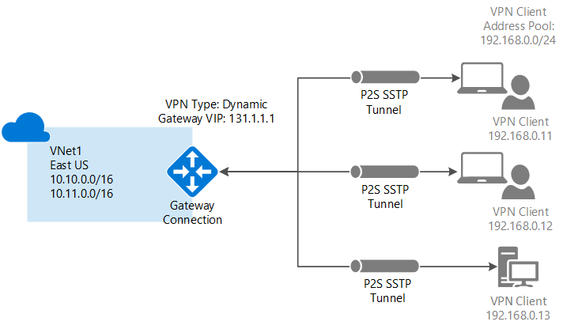

<properties
   pageTitle="Configure a Point-to-Site VPN gateway connection to an Azure Virtual Network using the classic portal | Microsoft Azure"
   description="Securely connect to your Azure Virtual Network by creating a Point-to-Site VPN gateway connection."
   services="vpn-gateway"
   documentationCenter="na"
   authors="cherylmc"
   manager="carmonm"
   editor=""
   tags="azure-service-management"/>

<tags
   ms.service="vpn-gateway"
   ms.devlang="na"
   ms.topic="hero-article"
   ms.tgt_pltfrm="na"
   ms.workload="infrastructure-services"
   ms.date="08/31/2016"
   ms.author="cherylmc"/>

# Configure a Point-to-Site connection to a VNet using the classic portal

> [AZURE.SELECTOR]
- [Resource Manager - PowerShell](vpn-gateway-howto-point-to-site-rm-ps.md)
- [Classic - Classic Portal](vpn-gateway-point-to-site-create.md)

A Point-to-Site (P2S) configuration lets you create a secure connection from an individual client computer to a virtual network. A P2S connection is useful when you want to connect to your VNet from a remote location, such as from home or a conference, or when you only have a few clients that need to connect to a virtual network.

This article walks you through creating a VNet with a Point-to-Site connection in the **classic deployment model** using the **classic portal**. Currently, you cannot create this configuration end-to-end in the Azure portal for the classic deployment model. You can perform some of the steps in the Azure portal, but PowerShell is still required for the VPN client configuration download.

Point-to-Site connections do not require a VPN device or a public-facing IP address to work. A VPN connection is established by starting the connection from the client computer. For more information about Point-to-Site connections, see the [VPN Gateway FAQ](vpn-gateway-vpn-faq.md#point-to-site-connections) and [Planning and Design](vpn-gateway-plan-design.md).

**Deployment models and tools for Point-to-Site connections**

[AZURE.INCLUDE [vpn-gateway-table-point-to-site](../../includes/vpn-gateway-table-point-to-site-include.md)] 

**About Azure deployment models**

[AZURE.INCLUDE [vpn-gateway-clasic-rm](../../includes/vpn-gateway-classic-rm-include.md)] 

## About creating a Point-to-Site connection
 
The following steps walk you through the steps to create a secure Point-to-Site connection to a virtual network. 

The configuration for a Point-to-Site connection is broken down into four sections. The order in which you configure each of these sections is important. Don't skip steps or jump ahead.

- **Section 1** Create a virtual network and VPN gateway.
- **Section 2** Create the certificates used for authentication and upload them.
- **Section 3** Export and install your client certificates.
- **Section 4** Configure your VPN client.

## Section 1 - Create a virtual network and a VPN gateway

### Part 1: Create a virtual network

1. Log in to the [Azure classic portal](https://manage.windowsazure.com/). These steps use the classic portal, not the Azure portal. Currently, you cannot create a P2S connection using the Azure portal.

2. In the lower left corner of the screen, click **New**. In the navigation pane, click **Network Services**, and then click **Virtual Network**. Click **Custom Create** to begin the configuration wizard.

3. On the **Virtual Network Details** page, enter the following information, and then click the next arrow on the lower right.
	- **Name**: Name your virtual network. For example, 'VNet1'. This is the name that you'll refer to when you deploy VMs to this VNet.
	- **Location**: The location is directly related to the physical location (region) where you want your resources (VMs) to reside. For example, if you want the VMs that you deploy to this virtual network to be physically located in East US, select that location. You can't change the region associated with your virtual network after you create it.

4. On the **DNS Servers and VPN Connectivity** page, enter the following information, and then click the next arrow on the lower right.
	- **DNS Servers**: Enter the DNS server name and IP address, or select a previously registered DNS server from the shortcut menu. This setting does not create a DNS server. It allows you to specify the DNS servers that you want to use for name resolution for this virtual network. If you want to use the Azure default name resolution service, leave this section blank.
	- **Configure Point-To-Site VPN**: Select the checkbox.

5. On the **Point-To-Site Connectivity** page, specify the IP address range from which your VPN clients will receive an IP address when connected. There are a few rules regarding the address ranges that you can specify. It's important to verify that the range that you specify doesn't overlap with any of the ranges located on your on-premises network.

6. Enter the following information, and then click the next arrow.
 - **Address Space**: Include the Starting IP and CIDR (Address Count).
 - **Add address space**: Add address space only if it is required for your network design.

7. On the **Virtual Network Address Spaces** page, specify the address range that you want to use for your virtual network. These are the dynamic IP addresses (DIPS) that will be assigned to the VMs and other role instances that you deploy to this virtual network.  It's especially important to select a range that does not overlap with any of the ranges that are used for your on-premises network. You must coordinate with your network administrator, who may need to carve out a range of IP addresses from your on-premises network address space for you to use for your virtual network.

8. Enter the following information, and then click the checkmark to begin creating your virtual network.
 - **Address Space**: Add the internal IP address range that you want to use for this virtual network, including Starting IP and Count. It's important to select a range that does not overlap with any of the ranges that are used for your on-premises network. 
 - **Add subnet**: Additional subnets are not required, but you may want to create a separate subnet for VMs that will have static DIPS. Or you might want to have your VMs in a subnet that's separate from your other role instances.
 - **Add gateway subnet**: The gateway subnet is required for a Point-to-Site VPN. Click to add the gateway subnet. The gateway subnet is used only for the virtual network gateway.

9. Once your virtual network has been created, you will see **Created** listed under **Status** on the networks page in the Azure classic portal. Once your virtual network has been created, you can create your dynamic routing gateway.

### Part 2: Create a dynamic routing gateway

The gateway type must be configured as dynamic. Static routing gateways do not work with this feature.

1. In the Azure classic portal, on the **Networks** page, click the virtual network that you created, and navigate to the **Dashboard** page.

2. Click **Create Gateway**, located at the bottom of the **Dashboard** page. A message appears asking **Do you want to create a gateway for virtual network "VNet1"**. Click **Yes** to begin creating the gateway. It can take around 15 minutes for the gateway to create.

## Section 2 - Generate and upload certificates

Certificates are used to authenticate VPN clients for Point-to-Site VPNs. You can use a root certificate generated by an enterprise certificate solution, or you can use a self-signed certificate. You can upload up to 20 root certificates to Azure. Once the .cer file is uploaded, Azure can use the information contained in it to authenticate clients that have a client certificate installed. The client certificate must be generated from the same certificate that the .cer file represents.

In this section you will do the following:

- Obtain the .cer file for a root certificate. This can either be a self-signed certificate, or you can use your enterprise certificate system.
- Upload the .cer file to Azure.
- Generate client certificates.

### Part 1: Obtain the .cer file for the root certificate

If you are using an enterprise certificate system, obtain the .cer file for the root certificate that you want to use. In [Part 3](#createclientcert), you generate the client certificates from the root certificate.

If you are not using an enterprise certificate solution, you'll need to generate a self-signed root certificate. For Windows 10 steps, you can refer to [Working with self-signed root certificates for Point-to-Site configurations](vpn-gateway-certificates-point-to-site.md). The article walks you through using makecert to generate a self-signed certificate, and then export the .cer file.

### Part 2: Upload the root certificate .cer file to the Azure classic portal

Add a trusted certificate to Azure. When you add a Base64-encoded X.509 (.cer) file to Azure, you are telling Azure to trust the root certificate that the file represents.

1. In the Azure classic portal, on the **Certificates** page for your virtual network, click **Upload a root certificate**.

2. On the **Upload Certificate** page, browse for the .cer root certificate, and then click the checkmark.

### Part 3: Generate a client certificate

Next, generate the client certificates. You can either generate a unique certificate for each client that will connect, or you can use the same certificate on multiple clients. The advantage to generating unique client certificates is the ability to revoke a single certificate if needed. Otherwise, if everyone is using the same client certificate and you find that you need to revoke the certificate for one client, you will need to generate and install new certificates for all of the clients that use the certificate to authenticate.

- If you are using an enterprise certificate solution, generate a client certificate with the common name value format 'name@yourdomain.com', rather than the NetBIOS 'DOMAIN\username' format. 

- If you are using a self-signed certificate, see [Working with self-signed root certificates for Point-to-Site configurations](vpn-gateway-certificates-point-to-site.md) to generate a client certificate.

## Section 3 - Export and install the client certificate

Install a client certificate on each computer that you want to connect to the virtual network. A client certificate is required for authentication. You can automate installing the client certificate, or you can install manually. The following steps walk you through exporting and installing the client certificate manually.

1. To export a client certificate, you can use *certmgr.msc*. Right-click the client certificate that you want to export, click **all tasks**, and then click **export**.
2. Export the client certificate with the private key. This is a *.pfx* file. Make sure to record or remember the password (key) that you set for this certificate.
3. Copy the *.pfx* file to the client computer. On the client computer, double-click the *.pfx* file to install it. Enter the password when requested. Do not modify the installation location.

## Section 4 - Configure your VPN client

To connect to the virtual network, you also need to configure a VPN client. The client requires both a client certificate and the proper VPN client configuration in order to connect. To configure a VPN client, perform the following steps, in order.

### Part 1: Create the VPN client configuration package

1. In the Azure classic portal, on the **Dashboard** page for your virtual network, navigate to the quick glance menu in the right corner. For the list of client operating systems that are supported, see the [Point-to-Site connections](vpn-gateway-vpn-faq.md#point-to-site-connections) section of the VPN Gateway FAQ. The VPN client package contains configuration information to configure the VPN client software built into Windows. The package does not install additional software. The settings are specific to the virtual network that you want to connect to.  Select the download package that corresponds to the client operating system on which it will be installed:
 - For 32-bit clients, select **Download the 32-bit Client VPN Package**.
 - For 64-bit clients, select **Download the 64-bit Client VPN Package**.

2. It takes a few minutes to create your client package. Once the package has been completed, you can download the file. The *.exe* file that you download can be safely stored on your local computer.

3. After you generate and download the VPN client package from the Azure classic portal, you can install the client package on the client computer from which you want to connect to your virtual network. If you plan to install the VPN client package to multiple client computers, make sure that they each also have a client certificate installed.

### Part 2: Install the VPN configuration package on the client

1. Copy the configuration file locally to the computer that you want to connect to your virtual network and double-click the .exe file. 

2. Once the package has installed, you can start the VPN connection. The configuration package is not signed by Microsoft. You may want to sign the package using your organization's signing service, or sign it yourself using [SignTool]( http://go.microsoft.com/fwlink/p/?LinkId=699327). It's OK to use the package without signing. However, if the package isn't signed, a warning appears when you install the package.

3. On the client computer, navigate to **Network Settings** and click **VPN**. You will see the connection listed. It will show the name of the virtual network that it will connect to and will look similar to this: 

	

### Part 3: Connect to Azure

1. To connect to your VNet, on the client computer, navigate to VPN connections and locate the VPN connection that you created. It is named the same name as your virtual network. Click **Connect**. A pop-up message may appear that refers to using the certificate. If this happens, click **Continue** to use elevated privileges. 

2. On the **Connection** status page, click **Connect** to start the connection. If you see a **Select Certificate** screen, verify that the client certificate showing is the one that you want to use to connect. If it is not, use the drop-down arrow to select the correct certificate, and then click **OK**.

	

3. Your connection should now be established.

	

### Part 4: Verify the VPN connection

1. To verify that your VPN connection is active, open an elevated command prompt, and run *ipconfig/all*.
2. View the results. Notice that the IP address you received is one of the addresses within the Point-to-Site connectivity address range that you specified when you created your VNet. The results should be something similar to this:

Example:

    PPP adapter VNet1:
		Connection-specific DNS Suffix .:
		Description.....................: VNet1
		Physical Address................:
		DHCP Enabled....................: No
		Autoconfiguration Enabled.......: Yes
		IPv4 Address....................: 192.168.130.2(Preferred)
		Subnet Mask.....................: 255.255.255.255
		Default Gateway.................:
		NetBIOS over Tcpip..............: Enabled

## Next steps

You can add virtual machines to your virtual network. See [How to create a custom virtual machine](../virtual-machines/virtual-machines-windows-classic-createportal.md).

If you want more information about Virtual Networks, see the [Virtual Network Documentation](https://azure.microsoft.com/documentation/services/virtual-network/) page.
