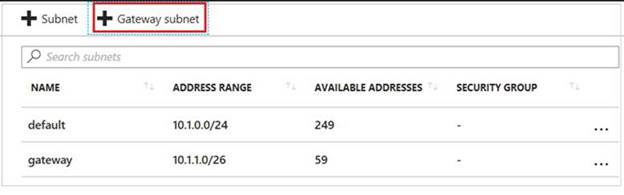
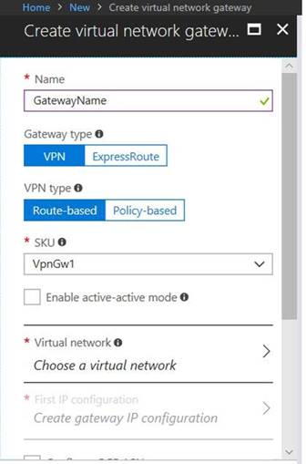
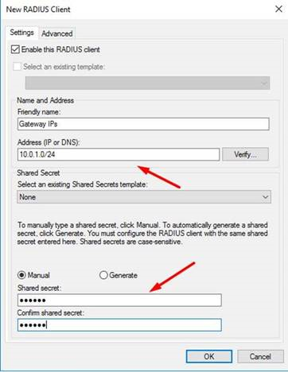
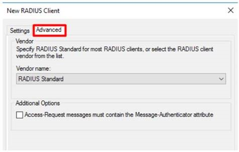
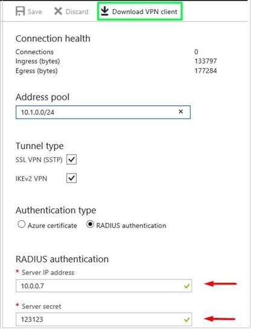

# Integrate Azure VPN gateway RADIUS authentication with NPS server for multifactor authentication 

The article describes how to integrate Network Policy Server (NPS) with Azure VPN gateway RADIUS authentication to deliver multifactor authentication (MFA) for point-to-site VPN connections. 

## Prerequisite

To enable MFA, the users must be in Microsoft Entra ID, which must be synced from either the on-premises or cloud environment. Also, the user must have already completed the auto-enrollment process for MFA.  For more information, see [Set up my account for two-step verification](https://support.microsoft.com/account-billing/how-to-use-the-microsoft-authenticator-app-9783c865-0308-42fb-a519-8cf666fe0acc)

## Detailed steps

### Step 1: Create a virtual network gateway

1. Log on to the [Azure portal](https://portal.azure.com).
2. In the virtual network that will host the virtual network gateway, select **Subnets**, and then select **Gateway subnet** to create a subnet. 

    
3. Create a virtual network gateway by specifying the following settings:

    - **Gateway type**: Select **VPN**.
    - **VPN type**: Select **Route-based**.
    - **SKU**: Select a SKU type based on your requirements.
    - **Virtual network**: Select the virtual network in which you created the gateway subnet.

        

 

### Step 2: Configure the NPS for Microsoft Entra multifactor authentication

1. On the NPS server, [install the NPS extension for Microsoft Entra multifactor authentication](../active-directory/authentication/howto-mfa-nps-extension.md#install-the-nps-extension).
2. Open the NPS console, right-click **RADIUS Clients**, and then select **New**. Create the RADIUS client by specifying the following settings:

    - **Friendly Name**: Type any name.
    - **Address (IP or DNS)**: Type the gateway subnet that you created in the Step 1.
    - **Shared secret**: type any secret key, and remember it for later use.

      

 
3.  On the **Advanced** tab, set the vendor name to **RADIUS Standard** and make sure that the **Additional Options** check box is not selected.

    

4. Go to **Policies** > **Network Policies**, double-click **Connections to Microsoft Routing and Remote Access server** policy, select **Grant access**, and then click **OK**.

### Step 3: Configure the virtual network gateway

1. Log on to [Azure portal](https://portal.azure.com).
2. Open the virtual network gateway that you created. Make sure that the gateway type is set to **VPN** and that the VPN type is **route-based**.
3. Click **Point to site configuration** > **Configure now**, and then specify the following settings:

    - **Address pool**: Type the gateway subnet you created in the step 1.
    - **Authentication type**: Select **RADIUS authentication**.
    - **Server IP address**: Type the IP address of the NPS server.

      

## Next steps

- [Microsoft Entra multifactor authentication](../active-directory/authentication/concept-mfa-howitworks.md)
- [Integrate your existing NPS infrastructure with Microsoft Entra multifactor authentication](../active-directory/authentication/howto-mfa-nps-extension.md)
