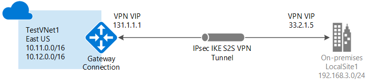

<properties
   pageTitle="Create a virtual network with a site-to-site VPN Gateway connection using the Azure Classic Portal | Microsoft Azure"
   description="Create a VNet with a S2S VPN Gateway connection for cross-premises and hybrid configurations using the classic deployment model."
   services="vpn-gateway"
   documentationCenter=""
   authors="cherylmc"
   manager="carmonm"
   editor=""
   tags="azure-service-management"/>

<tags
   ms.service="vpn-gateway"
   ms.devlang="na"
   ms.topic="hero-article"
   ms.tgt_pltfrm="na"
   ms.workload="infrastructure-services"
   ms.date="05/13/2016"
   ms.author="cherylmc"/>

# Create a virtual network with a Site-to-Site VPN connection using the Azure classic portal

> [AZURE.SELECTOR]
- [Azure Portal](vpn-gateway-howto-site-to-site-resource-manager-portal.md)
- [Azure Classic Portal](vpn-gateway-site-to-site-create.md)
- [PowerShell - Resource Manager](vpn-gateway-create-site-to-site-rm-powershell.md)

This article will walk you through creating a virtual network and a site-to-site VPN connection to your on-premises network. Site-to-site connections can be used for cross-premises and hybrid configurations. This article applies to the classic deployment model and uses the Azure classic portal. 

**About Azure deployment models**

[AZURE.INCLUDE [vpn-gateway-clasic-rm](../../includes/vpn-gateway-classic-rm-include.md)] 

## Connection diagram
 

**Deployment models and tools for Site-to-Site connections**

[AZURE.INCLUDE [vpn-gateway-table-site-to-site](../../includes/vpn-gateway-table-site-to-site-include.md)]

If you want to connect VNets together, but are not creating a connection to an on-premises location, see [Configure a VNet-to-VNet connection for the classic deployment model](virtual-networks-configure-vnet-to-vnet-connection.md). If you are looking for a different type of connection configuration, see the [VPN Gateway connection topologies](vpn-gateway-topology.md) article.

 
## Before you begin

Verify that you have the following items before beginning configuration.

- A compatible VPN device and someone who can configure it. See [About VPN Devices](vpn-gateway-about-vpn-devices.md). If you aren't familiar with configuring your VPN device, or are unfamiliar with the IP address ranges located in your on-premises network configuration, you will need to coordinate with someone who can provide those details for you.

-  An externally-facing public IP address for your VPN device. This IP address cannot be located behind a NAT.

- An Azure subscription. If you don't already have an Azure subscription, you can activate your [MSDN subscriber benefits](https://azure.microsoft.com/pricing/member-offers/msdn-benefits-details/) or sign up for a [free account](https://azure.microsoft.com/pricing/free-trial/).

## Create your virtual network

1. Log in to the [Azure classic portal](https://manage.windowsazure.com/).

2. In the lower left corner of the screen, click **New**. In the navigation pane, click **Network Services**, and then click **Virtual Network**. Click **Custom Create** to begin the configuration wizard.

3. Fill out the information on the following pages to create your VNet.

## Virtual network details page

Enter the following information.

- **Name**: Name your virtual network. For example, *EastUSVNet*. You'll use this virtual network name when you deploy your VMs and PaaS instances, so you may not want to make the name too complicated.
- **Location**: The location is directly related to the physical location (region) where you want your resources (VMs) to reside. For example, if you want the VMs that you deploy to this virtual network to be physically located in *East US*, select that location. You can't change the region associated with your virtual network after you create it.

## DNS servers and VPN connectivity page

Enter the following information, and then click the next arrow on the lower right.

- **DNS Servers**: Enter the DNS server name and IP address, or select a previously registered DNS server from the shortcut menu. This setting does not create a DNS server, it allows you to specify the DNS servers that you want to use for name resolution for this virtual network.
- **Configure Site-To-Site VPN**: Select the checkbox for **Configure a site-to-site VPN**.
- **Local Network**: A local network represents your physical on-premises location. You can select a local network that you've previously created, or you can create a new local network. However, if you do select to use a local network that you previously created, you'll want to go to the **Local Networks** configuration page and make sure that the VPN Device IP address (public facing IPv4 address) for the VPN device you are using for this connection is accurate.

## Site-to-site connectivity page

If you're creating a new local network, you'll see the **Site-To-Site Connectivity** page. If you want to use a local network that you previously created, this page will not appear in the wizard and you can move on to the next section.

Enter the following information and then click the next arrow.

- 	**Name**: The name you want to call your local (on-premises) network site.
- 	**VPN Device IP Address**: This is public facing IPv4 address of your on-premises VPN device that you'll use to connect to Azure. The VPN device cannot be located behind a NAT.
- 	**Address Space**: Include Starting IP and CIDR (Address Count). This is where you specify the address range(s) that you want to be sent through the virtual network gateway to your local on-premises location. If a destination IP address falls within the ranges that you specify here, it will be routed through the virtual network gateway.
- 	**Add address space**: If you have multiple address ranges that you want to be sent through the virtual network gateway, this is where you specify each additional address range. You can add or remove ranges later on the **Local Network** page.

## Virtual network address spaces page

Specify the address range that you want to use for your virtual network. These are the dynamic IP addresses (DIPS) that will be assigned to the VMs and other role instances that you deploy to this virtual network.

It's especially important to select a range that does not overlap with any of the ranges that are used for your on-premises network. You'll need to coordinate with your network administrator. Your network administrator may need to carve out a range of IP addresses from your on-premises network address space for you to use for your virtual network.

Enter the following information, and then click the checkmark on the lower right to configure your network.

- **Address Space**: Include Starting IP and Address Count. Verify that the address spaces you specify don't overlap any of the address spaces that you have on your on-premises network.
- **Add subnet**: Include Starting IP and Address Count. Additional subnets are not required, but you may want to create a separate subnet for VMs that will have static DIPS. Or you might want to have your VMs in a subnet that is separate from your other role instances.
- **Add gateway subnet**: Click to add the gateway subnet. The gateway subnet is used only for the virtual network gateway and is required for this configuration.

Click the checkmark on the bottom of the page and your virtual network will begin to create. When it completes, you will see **Created** listed under **Status** on the **Networks** page in the Azure Classic Portal. After the VNet has been created, you can then configure your virtual network gateway.

[AZURE.INCLUDE [vpn-gateway-no-nsg](../../includes/vpn-gateway-no-nsg-include.md)] 

## Configure your virtual network gateway

Next, you'll configure the virtual network gateway in order to create a secure site-to-site connection. See [Configure a virtual network gateway in the Azure classic portal](vpn-gateway-configure-vpn-gateway-mp.md).

## Next steps

Once your connection is complete, you can add virtual machines to your virtual networks. See the [Virtual Machines](https://azure.microsoft.com/documentation/services/virtual-machines/) documentation for more information.
