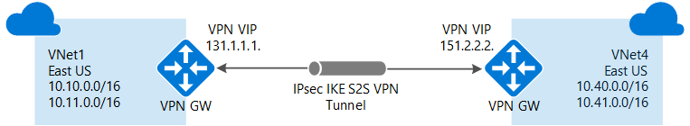
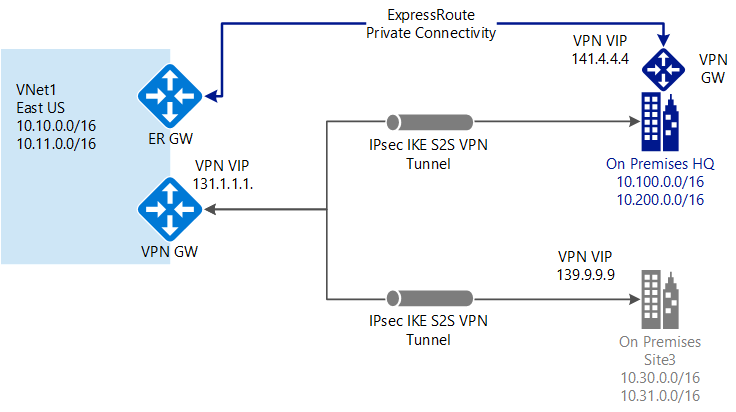

<properties 
   pageTitle="VPN Gateway connection toplogies | Microsoft Azure"
   description="View VPN Gateway connection topologies and available configuration tools and deployment models."
   services="vpn-gateway"
   documentationCenter="na"
   authors="cherylmc"
   manager="carmonm"
   editor=""
   tags="azure-resource-manager,azure-service-management"/>
<tags 
   ms.service="vpn-gateway"
   ms.devlang="na"
   ms.topic="get-started-article"
   ms.tgt_pltfrm="na"
   ms.workload="infrastructure-services"
   ms.date="07/13/2016"
   ms.author="cherylmc" />

# Azure VPN Gateway connection topologies

This article shows the baseline VPN gateway connection topologies. You can use the graphics and descriptions to help select the configuration topology to match your requirements. While this article goes through the main baseline topologies, it's possible to build more complex topologies using the diagrams as a guideline.

Each topology contains a table listing the deployment model that the topology is available for, the deployment tools that you can use to configure each topology, and will link directly to an article if an article is available. We update the tables frequently as new articles and deployment tools become available for you to use.

If you want more information about VPN gateways, see [About VPN Gateways](vpn-gateway-about-vpngateways.md).

## Site-to-Site and Multi-Site

A Site-to-Site connection is a connection over IPsec/IKE (IKEv1 or IKEv2) VPN tunnel. This type of connection requires a VPN device or Windows Server RRAS on-premises. Site-to-site connections can be used for cross-premises and hybrid configurations.   

**S2S diagram**

You can create and configure more than one S2S VPN connections to your on-premises networks if you are using Azure Route-Based VPNs. This type of configuration is often called a "multi-site" connection.
 

**Multi-Site diagram**

**Available deployment models and methods**

[AZURE.INCLUDE [vpn-gateway-table-site-to-site](../../includes/vpn-gateway-table-site-to-site-include.md)] 

## VNet-to-VNet

Connecting a virtual network to another virtual network (VNet-to-VNet) is very similar to connecting a VNet to an on-premises site location. Both connectivity types use an Azure VPN gateway to provide a secure tunnel using IPsec/IKE. The VNets you connect can be in different regions, or in different subscriptions. You can even combine VNet-to-VNet communication with multi-site configurations. This lets you establish network topologies that combine cross-premises connectivity with inter-virtual network connectivity.

Azure currently has two deployment models: Azure Service Management (referred to as classic), and Azure Resource Manager. If you have been using Azure for some time, you probably have Azure VMs and instance roles running on a classic VNet, while your newer VMs and role instances may be running on a VNet created in ARM. You can create a connection between virtual networks even if they are in different deployment models.

**VNet2VNet diagram**

**Available deployment models and methods**

[AZURE.INCLUDE [vpn-gateway-table-vnet-to-vnet](../../includes/vpn-gateway-table-vnet-to-vnet-include.md)] 

## Site-to-Site and ExpressRoute coexisting connections

ExpressRoute is a direct, dedicated connection to Microsoft Services, including Azure, from your WAN, not over the public Internet. Site-to-Site VPN traffic travels encrypted over the public Internet. Having the ability to configure Site-to-Site VPN and ExpressRoute connections for the same virtual network has several advantages. You can configure Site-to-Site VPN as a secure failover path for ExpressRoute, or use Site-to-Site VPNs to connect to sites that are not part of your network, but that are connected through ExpressRoute. 

**Coexisting connections diagram**

**Available deployment models and methods**

[AZURE.INCLUDE [vpn-gateway-table-coexist](../../includes/vpn-gateway-table-coexist-include.md)] 

## Point-to-Site

A Point-to-Site configuration allows you to create a secure connection to your virtual network from a client computer, individually. A VPN connection is established by starting the connection from the client computer. This is a useful solution when you want to connect to your VNet from a remote location, such as from home or a conference, or when you only have a few clients that need to connect to a virtual network. 

A Point-to-Site connection is a VPN connection over SSTP (Secure Socket Tunneling Protocol). Point-to-Site connections do not require a VPN device or a public-facing IP address to work. 

**P2S diagram**

**Available deployment models and methods**

[AZURE.INCLUDE [vpn-gateway-table-point-to-site](../../includes/vpn-gateway-table-point-to-site-include.md)] 

## Next steps

You'll want to become familiar with the items in the [About VPN Gateways](vpn-gateway-about-vpngateways.md) and [VPN Gateway FAQ](vpn-gateway-vpn-faq.md) articles to better understand VPN gateways before moving forward with planning and designing your connection.

 
