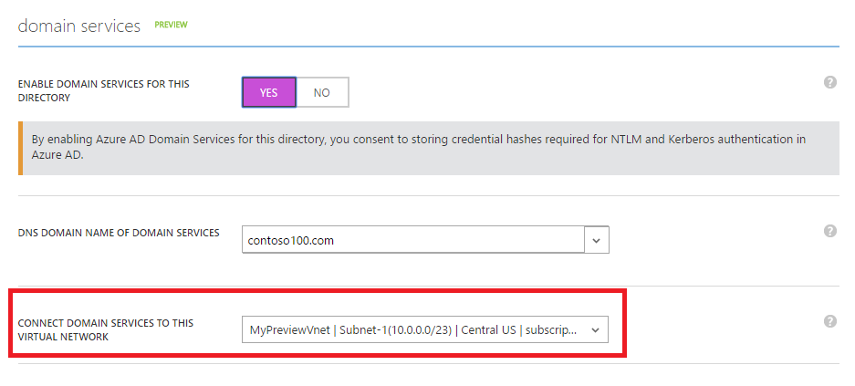

# Troubleshooting: Failed to delete a virtual network in Azure

You might receive errors when you try to delete a virtual network in Microsoft Azure. This article provides troubleshoot steps to help you resolve this problem. 

[!INCLUDE [support-disclaimer](../../includes/support-disclaimer.md)]

## Troubleshooting steps

### Check whether a virtual network gateway is running in the virtual network

To remove the virtual network, you must first remove the virtual network gateway in this virtual network.

For classic virtual networks, go to the **Overview** page of the virtual network. If the gateway is running in the virutal network, you will see the IP address of the gateway. 

For virtual networks, go to the **Overview** page of the virtual network. Check **Connected devices** for the virtual network gateway.

Before you can remove the gateway, any **Connection** objects in the gateway must be removed.

### Check whether an application gateway is running in the virtual network

Go to the **Overview** page of the virtual network . Check the **Connected devices** for the application gateway.

If there is an application gateway, you must remove it before you can delete the virtual network.

### Check whether Azure Active Directory Domain Service is enabled in the virtual network

If the Active Directory Domain Service is enabled and connected to the virtual network, you cannot delete this virtual network. 

To disable the service, follow these steps:

1. Go to the [Azure classic portal](https://manage.windowsazure.com).
2. In the left pane, select  **Active Directory**.
3. Select the Azure Active Directory (Azure AD) directory that has Ative Directory Domain Service enabled.
4. click the **Configure** tab.
5. Under **domain services**, change the **Enable domain services for this directory** option to **No**.  

### Check whether the virtual network is connected to another resource

Use get-sub to check for Circuit Links, connections, or even peerings. Any of these can cause a virtual network deletion to fail. 

The recommended deletiton oder should be:

1. Connections
2. Gateways
3. IPs
4. virtual networks
5. App Service Environment (ASE)

### Check whether a VM is still running in the virtual network

Make sure that there is no VM is running in the virtual network.

### Check whether the virtual network is stuck in a migration state

If the virtual network is stuck in a migration state, it cannot be deleted. Run the following command to abort the mirgation, and then delete the virtual network.

    Move-AzureVirtualNetwork -VirtualNetworkName "Name" -Abort

## Next steps

- [Azure Virtual Network](virtual-networks-overview.md)
- [Azure Virtual Network frequently asked questions (FAQ](virtual-networks-faq.md)