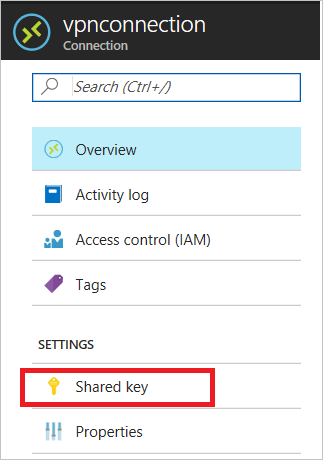

# Troubleshooting: An Azure site-to-site VPN connection cannot connect and stops working

After you configure a site-to-site VPN connection between an on-premises network and an Azure virtual network, the VPN connection suddenly stops working and cannot be reconnected. This article provides troubleshooting steps to help you resolve this problem. 

[!INCLUDE [support-disclaimer](../../includes/support-disclaimer.md)]

## Troubleshooting steps

To resolve the problem, first try to [reset the Azure VPN gateway](vpn-gateway-resetgw-classic.md) and reset the tunnel from the on-premises VPN device. If the problem persists, follow these steps to identify the cause of the problem.

### Prerequisite step

Check the type of the Azure VPN gateway.

1. Go to the [Azure portal](https://portal.azure.com).

2. Check the **Overview** page of the VPN gateway for the type information.
    
    

### Step 1. Check whether the on-premises VPN device is validated

1. Check whether you are using a [validated VPN device and operating system version](vpn-gateway-about-vpn-devices.md#devicetable). If the device is not a validated VPN device, you might have to contact the device manufacturer to see if there is a compatibility issue.

2. Make sure that the VPN device is correctly configured. For more information, see [Edit device configuration samples](vpn-gateway-about-vpn-devices.md#editing).

### Step 2. Verify the shared key

Compare the shared key for the on-premises VPN device to the Azure Virtual Network VPN to make sure that the keys match. 

To view the shared key for the Azure VPN connection, use one of the following methods:

**Azure portal**

1. Go to the VPN gateway site-to-site connection that you created.

2. In the **Settings** section, click **Shared key**.
    
    

**Azure PowerShell**

[!INCLUDE [updated-for-az](../../includes/updated-for-az.md)]

For the Azure Resource Manager deployment model:

    Get-AzVirtualNetworkGatewayConnectionSharedKey -Name <Connection name> -ResourceGroupName <Resource group name>

For the classic deployment model:

    Get-AzureVNetGatewayKey -VNetName -LocalNetworkSiteName

### Step 3. Verify the VPN peer IPs

-	The IP definition in the **Local Network Gateway** object in Azure should match the on-premises device IP.
-	The Azure gateway IP definition that is set on the on-premises device should match the Azure gateway IP.

### Step 4. Check UDR and NSGs on the gateway subnet

Check for and remove user-defined routing (UDR) or Network Security Groups (NSGs) on the gateway subnet, and then test the result. If the problem is resolved, validate the settings that UDR or NSG applied.

### Step 5. Check the on-premises VPN device external interface address

- If the Internet-facing IP address of the VPN device is included in the **Local network** definition in Azure, you might experience sporadic disconnections.
- The device's external interface must be directly on the Internet. There should be no network address translation or firewall between the Internet and the device.
- To configure firewall clustering to have a virtual IP, you must break the cluster and expose the VPN appliance directly to a public interface that the gateway can interface with.

### Step 6. Verify that the subnets match exactly (Azure policy-based gateways)

-	Verify that the virtual network address space(s) match exactly between the Azure virtual network and on-premises definitions.
-	Verify that the subnets match exactly between the **Local Network Gateway** and on-premises definitions for the on-premises network.

### Step 7. Verify the Azure gateway health probe

1. Open health probe by browsing to the following URL:

    `https://<YourVirtualNetworkGatewayIP>:8081/healthprobe`

2. Click through the certificate warning.
3. If you receive a response, the VPN gateway is considered healthy. If you don't receive a response, the gateway might not be healthy or an NSG on the gateway subnet is causing the problem. The following text is a sample response:

    ```xml
    <?xml version="1.0"?>
    <string xmlns="http://schemas.microsoft.com/2003/10/Serialization/">Primary Instance: GatewayTenantWorker_IN_1 GatewayTenantVersion: 14.7.24.6</string>
    ```

### Step 8. Check whether the on-premises VPN device has the perfect forward secrecy feature enabled

The perfect forward secrecy feature can cause disconnection problems. If the VPN device has perfect forward secrecy enabled, disable the feature. Then update the VPN gateway IPsec policy.

## Next steps

-	[Configure a site-to-site connection to a virtual network](vpn-gateway-howto-site-to-site-resource-manager-portal.md)
-	[Configure an IPsec/IKE policy for site-to-site VPN connections](vpn-gateway-ipsecikepolicy-rm-powershell.md)
