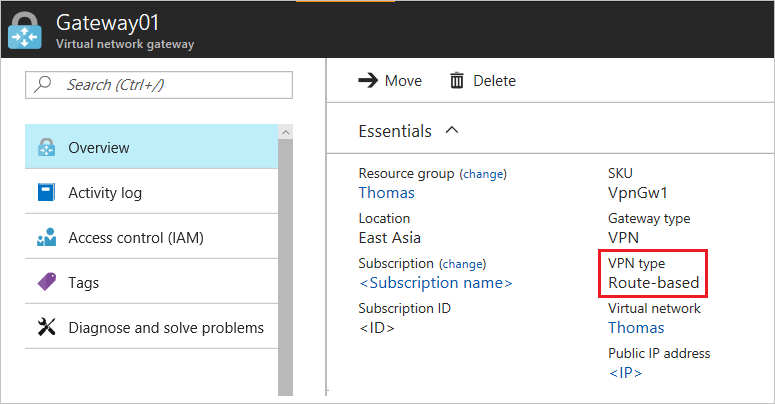

# Troubleshooting: Azure Site-to-Site VPN disconnects intermittently

You might experience the problem that a new or existing Microsoft Azure Site-to-Site VPN connection is not stable or disconnects regularly. This article provides troubleshoot steps to help you identify and resolve the cause of the problem. 

[!INCLUDE [support-disclaimer](../../includes/support-disclaimer.md)]

## Troubleshooting steps

### Prerequisite step

Check the type of Azure  virtual network gateway:

1. Go to [Azure portal](https://portal.azure.com).
2. Check the **Overview** page of the virtual network gateway for the type information.
    
    

### Step 1: Check whether the on-premises VPN device is validated

1. Check whether you are using a [validated VPN device and operating system version](vpn-gateway-about-vpn-devices.md#devicetable). If the VPN device is not validated, you may have to contact the device manufacturer to see if there is any compatibility issue.
2. Make sure that the VPN device is correctly configured. For more information, see [Editing device configuration samples](vpn-gateway-about-vpn-devices.md#editing).

### Step 2: Check the Security Association settings(for policy-based Azure virtual network gateways)

1. Make sure that the virtual network, subnets and, ranges in the **Local network gateway** definition in Microsoft Azure are same as the configuration on the on-premises VPN device.
2. Verify that the Security Association settings match.

### Step 3: Check for User-Defined Routes or Network Security Groups on Gateway Subnet

A user-defined route on the gateway subnet may be restricting some traffic and allowing other traffic. This makes it appear that the VPN connection is unreliable for some traffic and good for others. 

### Step 4: Check the "one VPN Tunnel per Subnet Pair" setting (for policy-based virtual network gateways)

Make sure that the on-premises VPN device is set to have **one VPN tunnel per subnet pair** for policy-based virtual network gateways.

### Step 5: Check for Security Association Limitations

The virtual network gateway has limit of 200 subnet Security Association pairs. If the number of Azure virtual network subnets multiplied times by the number of local subnets is greater than 200, you might see sporadic subnets disconnecting.

### Step 6: Check on-premises VPN device external interface address

If the Internet facing IP address of the VPN device is included in the **Local network gateway address space** definition in Azure, you may experience sporadic disconnections.

### Step 7: Check whether the on-premises VPN device has Perfect Forward Secrecy enabled

The **Perfect Forward Secrecy** feature can cause the disconnection problems. If the VPN device has **Perfect forward Secrecy** enabled, disable the feature. Then [update the virtual network gateway IPsec policy](vpn-gateway-ipsecikepolicy-rm-powershell.md#managepolicy).

## Next steps

- [Configure a Site-to-Site connection to a virtual network](./tutorial-site-to-site-portal.md)
- [Configure IPsec/IKE policy for Site-to-Site VPN connections](vpn-gateway-ipsecikepolicy-rm-powershell.md)
