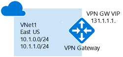

# Tutorial: Create and manage a VPN gateway using PowerShell

Azure VPN gateways provide cross-premises connectivity between customer premises and Azure. This tutorial covers basic Azure VPN gateway deployment items such as creating and managing a VPN gateway. You learn how to:

> [!div class="checklist"]
> * Create a VPN gateway
> * View the public IP address
> * Resize a VPN gateway
> * Reset a VPN gateway

The following diagram shows the virtual network and the VPN gateway created as part of this tutorial.



### Working with Azure Cloud Shell and Azure PowerShell

[!INCLUDE [working with cloud shell](../../includes/vpn-gateway-cloud-shell-powershell.md)]

## Common network parameter values

Below are the parameter values used for this tutorial. In the examples, the variables translate to the following:

```
#$RG1         = The name of the resource group
#$VNet1       = The name of the virtual network
#$Location1   = The location region
#$FESubnet1   = The name of the first subnet
#$BESubnet1   = The name of the second subnet
#$VNet1Prefix = The address range for the virtual network
#$FEPrefix1   = Addresses for the first subnet
#$BEPrefix1   = Addresses for the second subnet
#$GwPrefix1   = Addresses for the GatewaySubnet
#$VNet1ASN    = ASN for the virtual network
#$DNS1        = The IP address of the DNS server you want to use for name resolution
#$Gw1         = The name of the virtual network gateway
#$GwIP1       = The public IP address for the virtual network gateway
#$GwIPConf1   = The name of the IP configuration
```

Change the values below based on your environment and network setup, then copy and paste to set the variables for this tutorial. If your Cloud Shell session times out, or you need to use a different PowerShell window, copy and paste the variables to your new session and continue the tutorial.

```azurepowershell-interactive
$RG1         = "TestRG1"
$VNet1       = "VNet1"
$Location1   = "East US"
$FESubnet1   = "FrontEnd"
$BESubnet1   = "Backend"
$VNet1Prefix = "10.1.0.0/16"
$FEPrefix1   = "10.1.0.0/24"
$BEPrefix1   = "10.1.1.0/24"
$GwPrefix1   = "10.1.255.0/27"
$VNet1ASN    = 65010
$DNS1        = "8.8.8.8"
$Gw1         = "VNet1GW"
$GwIP1       = "VNet1GWIP"
$GwIPConf1   = "gwipconf1"
```

## Create a resource group

Create a resource group with the [New-AzResourceGroup](/powershell/module/az.resources/new-azresourcegroup) command. An Azure resource group is a logical container into which Azure resources are deployed and managed. A resource group must be created first. In the following example, a resource group named *TestRG1* is created in the *East US* region:

```azurepowershell-interactive
New-AzResourceGroup -ResourceGroupName $RG1 -Location $Location1
```

## Create a virtual network

Azure VPN gateway provides cross-premises connectivity and P2S VPN server functionality for your virtual network. Add the VPN gateway to an existing virtual network or create a new virtual network and the gateway. Notice that the example specifies the name of the gateway subnet specifically. You must always specify the name of the gateway subnet as "GatewaySubnet" in order for it to function properly. This example creates a new virtual network with three subnets: Frontend, Backend, and GatewaySubnet using [New-AzVirtualNetworkSubnetConfig](/powershell/module/az.network/new-azvirtualnetworksubnetconfig) and [New-AzVirtualNetwork](/powershell/module/az.network/new-azvirtualnetwork):

```azurepowershell-interactive
$fesub1 = New-AzVirtualNetworkSubnetConfig -Name $FESubnet1 -AddressPrefix $FEPrefix1
$besub1 = New-AzVirtualNetworkSubnetConfig -Name $BESubnet1 -AddressPrefix $BEPrefix1
$gwsub1 = New-AzVirtualNetworkSubnetConfig -Name GatewaySubnet -AddressPrefix $GwPrefix1
$vnet   = New-AzVirtualNetwork `
            -Name $VNet1 `
            -ResourceGroupName $RG1 `
            -Location $Location1 `
            -AddressPrefix $VNet1Prefix `
            -Subnet $fesub1,$besub1,$gwsub1
```

## Request a public IP address for the VPN gateway

Azure VPN gateways communicate with your on-premises VPN devices over the Internet to performs IKE (Internet Key Exchange) negotiation and establish IPsec tunnels. Create and assign a public IP address to your VPN gateway as shown in the example below with [New-AzPublicIpAddress](/powershell/module/az.network/new-azpublicipaddress) and [New-AzVirtualNetworkGatewayIpConfig](/powershell/module/az.network/new-azvirtualnetworkgatewayipconfig):

> [!IMPORTANT]
> Currently, you can only use a Dynamic public IP address for the gateway. Static IP address is not supported on Azure VPN gateways.

```azurepowershell-interactive
$gwpip    = New-AzPublicIpAddress -Name $GwIP1 -ResourceGroupName $RG1 `
              -Location $Location1 -AllocationMethod Dynamic
$subnet   = Get-AzVirtualNetworkSubnetConfig -Name 'GatewaySubnet' `
              -VirtualNetwork $vnet
$gwipconf = New-AzVirtualNetworkGatewayIpConfig -Name $GwIPConf1 `
              -Subnet $subnet -PublicIpAddress $gwpip
```

## Create a VPN gateway

A VPN gateway can take 45 minutes or more to create. Once the gateway creation has completed, you can create a connection between your virtual network and another VNet. Or create a connection between your virtual network and an on-premises location. Create a VPN gateway using the [New-AzVirtualNetworkGateway](/powershell/module/az.network/New-azVirtualNetworkGateway) cmdlet.

```azurepowershell-interactive
New-AzVirtualNetworkGateway -Name $Gw1 -ResourceGroupName $RG1 `
  -Location $Location1 -IpConfigurations $gwipconf -GatewayType Vpn `
  -VpnType RouteBased -GatewaySku VpnGw1
```

Key parameter values:
* GatewayType: Use **Vpn** for site-to-site and VNet-to-VNet connections
* VpnType: Use **RouteBased** to interact with wider range of VPN devices and more routing features
* GatewaySku: **VpnGw1** is the default; change it to another VpnGw SKU if you need higher throughputs or more connections. For more information, see [Gateway SKUs](vpn-gateway-about-vpn-gateway-settings.md#gwsku).

If you are using the TryIt, your session may time out. That's OK. The gateway will still create.

Once the gateway creation has completed, you can create a connection between your virtual network and another VNet, or create a connection between your virtual network and an on-premises location. You can also configure a P2S connection to your VNet from a client computer.

## View the gateway public IP address

If you know the name of the public IP address, use [Get-AzPublicIpAddress](https://docs.microsoft.com/powershell/module/az.network/get-azpublicipaddress) to show the public IP address assigned to the gateway.

If your session timed out, copy the common network parameters from the beginning of this tutorial into your new session and proceed, then proceed.

```azurepowershell-interactive
$myGwIp = Get-AzPublicIpAddress -Name $GwIP1 -ResourceGroup $RG1
$myGwIp.IpAddress
```

## Resize a gateway

You can change the VPN gateway SKU after the gateway is created. Different gateway SKUs support different specifications such as throughputs, number of connections, etc. The following example uses [Resize-AzVirtualNetworkGateway](/powershell/module/az.network/Resize-azVirtualNetworkGateway) to resize your gateway from VpnGw1 to VpnGw2. For more information, see [Gateway SKUs](vpn-gateway-about-vpn-gateway-settings.md#gwsku).

```azurepowershell-interactive
$gateway = Get-AzVirtualNetworkGateway -Name $Gw1 -ResourceGroup $RG1
Resize-AzVirtualNetworkGateway -GatewaySku VpnGw2 -VirtualNetworkGateway $gateway
```

Resizing a VPN gateway also takes about 30 to 45 minutes, although this operation will **not** interrupt or remove existing connections and configurations.

## Reset a gateway

As part of the troubleshooting steps, you can reset your Azure VPN gateway to force the VPN gateway to restart the IPsec/IKE tunnel configurations. Use [Reset-AzVirtualNetworkGateway](/powershell/module/az.network/Reset-azVirtualNetworkGateway) to reset your gateway.

```azurepowershell-interactive
$gateway = Get-AzVirtualNetworkGateway -Name $Gw1 -ResourceGroup $RG1
Reset-AzVirtualNetworkGateway -VirtualNetworkGateway $gateway
```

For more information, see [Reset a VPN gateway](vpn-gateway-resetgw-classic.md).

## Clean up resources

If you're advancing to the [next tutorial](vpn-gateway-tutorial-vpnconnection-powershell.md), you will want to keep these resources because they are the prerequisites.

However, if the gateway is part of a prototype, test, or proof-of-concept deployment, you can use the [Remove-AzResourceGroup](/powershell/module/az.resources/remove-azresourcegroup) command to remove the resource group, the VPN gateway, and all related resources.

```azurepowershell-interactive
Remove-AzResourceGroup -Name $RG1
```

## Next steps

In this tutorial, you learned about basic VPN gateway creation and management such as how to:

> [!div class="checklist"]
> * Create a VPN gateway
> * View the public IP address
> * Resize a VPN gateway
> * Reset a VPN gateway

Advance to the following tutorials to learn about S2S, VNet-to-VNet, and P2S connections.

> [!div class="nextstepaction"]
> * [Create S2S connections](vpn-gateway-tutorial-vpnconnection-powershell.md)
> * [Create VNet-to-VNet connections](vpn-gateway-howto-vnet-vnet-resource-manager-portal.md)
> * [Create P2S connections](vpn-gateway-howto-point-to-site-resource-manager-portal.md)
