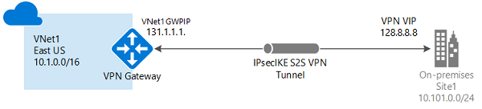
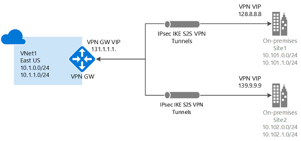

# Tutorial: Create and manage S2S VPN connections using PowerShell

Azure S2S VPN connections provide secure, cross-premises connectivity between customer premises and Azure. This tutorial walks through IPsec S2S VPN connection life cycles such as creating and managing a S2S VPN connection. You learn how to:

> [!div class="checklist"]
> * Create an S2S VPN connection
> * Update the connection property: pre-shared key, BGP, IPsec/IKE policy
> * Add more VPN connections
> * Delete a VPN connection

The following diagram shows the topology for this tutorial:



### Working with Azure Cloud Shell and Azure PowerShell

[!INCLUDE [working with cloud shell](../../includes/vpn-gateway-cloud-shell-powershell.md)]

## Requirements

Complete the first tutorial: [Create VPN gateway with Azure PowerShell](vpn-gateway-tutorial-create-gateway-powershell.md) to create the following resources:

1. Resource group (TestRG1), virtual network (VNet1), and the GatewaySubnet
2. VPN gateway (VNet1GW)

The virtual network parameter values are listed below. Note the additional values for the local network gateway which represent your on-premises network. Change the values below based on your environment and network setup, then copy and paste to set the variables for this tutorial. If your Cloud Shell session times out, or you need to use a different PowerShell window, copy and paste the variables to your new session and continue the tutorial.

>[!NOTE]
> If you are using this to make a connection, be sure to change the values to match your on-premises network. If you are just running these steps as a tutorial, you don't need to make changes, but the connection will not work.
>

```azurepowershell-interactive
# Virtual network
$RG1         = "TestRG1"
$VNet1       = "VNet1"
$Location1   = "East US"
$VNet1Prefix = "10.1.0.0/16"
$VNet1ASN    = 65010
$Gw1         = "VNet1GW"

# On-premises network - LNGIP1 is the VPN device public IP address
$LNG1        = "VPNsite1"
$LNGprefix1  = "10.101.0.0/24"
$LNGprefix2  = "10.101.1.0/24"
$LNGIP1      = "5.4.3.2"

# Optional - on-premises BGP properties
$LNGASN1     = 65011
$BGPPeerIP1  = "10.101.1.254"

# Connection
$Connection1 = "VNet1ToSite1"
```

The workflow to create an S2S VPN connection is straightforward:

1. Create a local network gateway to represent your on-premises network
2. Create a connection between your Azure VPN gateway and the local network gateway

## Create a local network gateway

A local network gateway represents your on-premises network. You can specify the properties of your on-premises network in the local network gateway, including:

* Public IP address of your VPN device
* On-premises address space
* (Optional) BGP attributes (BGP peer IP address and AS number)

Create a local network gateway with the [New-AzLocalNetworkGateway](https://docs.microsoft.com/powershell/module/az.network/new-azlocalnetworkgateway) command.

```azurepowershell-interactive
New-AzLocalNetworkGateway -Name $LNG1 -ResourceGroupName $RG1 `
  -Location $Location1 -GatewayIpAddress $LNGIP1 -AddressPrefix $LNGprefix1,$LNGprefix2
```

## Create a S2S VPN connection

Next, create a Site-to-Site VPN connection between your virtual network gateway and your VPN device with the [New-AzVirtualNetworkGatewayConnection](https://docs.microsoft.com/powershell/module/az.network/new-azvirtualnetworkgatewayconnection). Notice that the '-ConnectionType' for Site-to-Site VPN is *IPsec*.

```azurepowershell-interactive
$vng1 = Get-AzVirtualNetworkGateway -Name $GW1  -ResourceGroupName $RG1
$lng1 = Get-AzLocalNetworkGateway   -Name $LNG1 -ResourceGroupName $RG1

New-AzVirtualNetworkGatewayConnection -Name $Connection1 -ResourceGroupName $RG1 `
  -Location $Location1 -VirtualNetworkGateway1 $vng1 -LocalNetworkGateway2 $lng1 `
  -ConnectionType IPsec -SharedKey "Azure@!b2C3" -ConnectionProtocol IKEv2
```

Add the optional "**-EnableBGP $True**" property to enable BGP for the connection if you are using BGP. It is disabled by default. Parameter '-ConnectionProtocol' is optional with IKEv2 as default. You can create the connection with IKEv1 protocols by specifying **-ConnectionProtocol IKEv1**.

## Update the VPN connection pre-shared key, BGP, and IPsec/IKE policy

### View and update your pre-shared key

Azure S2S VPN connection uses a pre-shared key (secret) to authenticate between your on-premises VPN device and the Azure VPN gateway. You can view and update the pre-shared key for a connection with [Get-AzVirtualNetworkGatewayConnectionSharedKey](https://docs.microsoft.com/powershell/module/az.network/get-azvirtualnetworkgatewayconnectionsharedkey) and [Set-AzVirtualNetworkGatewayConnectionSharedKey](https://docs.microsoft.com/powershell/module/az.network/set-azvirtualnetworkgatewayconnectionsharedkey).

> [!IMPORTANT]
> The pre-shared key is a string of **printable ASCII characters** no longer than 128 in length.

This command shows the pre-shared key for the connection:

```azurepowershell-interactive
Get-AzVirtualNetworkGatewayConnectionSharedKey `
  -Name $Connection1 -ResourceGroupName $RG1
```

The output will be "**Azure\@!b2C3**" following the example above. Use the command below to change the pre-shared key value to "**Azure\@!_b2=C3**":

```azurepowershell-interactive
Set-AzVirtualNetworkGatewayConnectionSharedKey `
  -Name $Connection1 -ResourceGroupName $RG1 `
  -Value "Azure@!_b2=C3"
```

### Enable BGP on VPN connection

Azure VPN gateway supports BGP dynamic routing protocol. You can enable BGP on each individual connection, depending on whether you are using BGP in your on-premises networks and devices. Specify the following BGP properties before enabling BGP on the connection:

* Azure VPN ASN (Autonomous System Number)
* On-premises local network gateway ASN
* On-premises local network gateway BGP peer IP address

If you have not configured the BGP properties, the following commands add these properties to your VPN gateway and local network gateway: [Set-AzVirtualNetworkGateway](https://docs.microsoft.com/powershell/module/az.network/set-azvirtualnetworkgateway) and [Set-AzLocalNetworkGateway](https://docs.microsoft.com/powershell/module/az.network/set-azlocalnetworkgateway).

Use the following example to configure BGP properties:

```azurepowershell-interactive
$vng1 = Get-AzVirtualNetworkGateway -Name $GW1  -ResourceGroupName $RG1
Set-AzVirtualNetworkGateway -VirtualNetworkGateway $vng1 -Asn $VNet1ASN

$lng1 = Get-AzLocalNetworkGateway   -Name $LNG1 -ResourceGroupName $RG1
Set-AzLocalNetworkGateway -LocalNetworkGateway $lng1 `
  -Asn $LNGASN1 -BgpPeeringAddress $BGPPeerIP1
```

Enable BGP with [Set-AzVirtualNetworkGatewayConnection](https://docs.microsoft.com/powershell/module/az.network/set-azvirtualnetworkgatewayconnection).

```azurepowershell-interactive
$connection = Get-AzVirtualNetworkGatewayConnection `
  -Name $Connection1 -ResourceGroupName $RG1

Set-AzVirtualNetworkGatewayConnection -VirtualNetworkGatewayConnection $connection `
  -EnableBGP $True
```

You can disable BGP by changing the "-EnableBGP" property value to **$False**. Refer to [BGP on Azure VPN gateways](vpn-gateway-bgp-resource-manager-ps.md) for more detailed explanations of BGP on Azure VPN gateways.

### Apply a custom IPsec/IKE policy on the connection

You can apply an optional IPsec/IKE policy to specify the exact combination of IPsec/IKE cryptographic algorithms and key strengths on the connection, instead of using the [default proposals](vpn-gateway-about-vpn-devices.md#ipsec). The following sample script creates a different IPsec/IKE policy with the following algorithms and parameters:

* IKEv2: AES256, SHA256, DHGroup14
* IPsec: AES128, SHA1, PFS14, SA Lifetime 14,400 seconds & 102,400,000 KB

```azurepowershell-interactive
$connection = Get-AzVirtualNetworkGatewayConnection -Name $Connection1 `
                -ResourceGroupName $RG1
$newpolicy  = New-AzIpsecPolicy `
                -IkeEncryption AES256 -IkeIntegrity SHA256 -DhGroup DHGroup14 `
                -IpsecEncryption AES128 -IpsecIntegrity SHA1 -PfsGroup PFS2048 `
                -SALifeTimeSeconds 14400 -SADataSizeKilobytes 102400000

Set-AzVirtualNetworkGatewayConnection -VirtualNetworkGatewayConnection $connection `
  -IpsecPolicies $newpolicy
```

Refer to [IPsec/IKE policy for S2S or VNet-to-VNet connections](vpn-gateway-ipsecikepolicy-rm-powershell.md) for a complete list of algorithms and instructions.

## Add another S2S VPN connection

Add an additional S2S VPN connection to the same VPN gateway, create another local network gateway, and create a new connection between the new local network gateway and the VPN gateway. Use the following examples, making sure to modify the variables to reflect your own network configuration.

```azurepowershell-interactive
# On-premises network - LNGIP2 is the VPN device public IP address
$LNG2        = "VPNsite2"
$Location2   = "West US"
$LNGprefix21 = "10.102.0.0/24"
$LNGprefix22 = "10.102.1.0/24"
$LNGIP2      = "4.3.2.1"
$Connection2 = "VNet1ToSite2"

New-AzLocalNetworkGateway -Name $LNG2 -ResourceGroupName $RG1 `
  -Location $Location2 -GatewayIpAddress $LNGIP2 -AddressPrefix $LNGprefix21,$LNGprefix22

$vng1 = Get-AzVirtualNetworkGateway -Name $GW1  -ResourceGroupName $RG1
$lng2 = Get-AzLocalNetworkGateway   -Name $LNG2 -ResourceGroupName $RG1

New-AzVirtualNetworkGatewayConnection -Name $Connection2 -ResourceGroupName $RG1 `
  -Location $Location1 -VirtualNetworkGateway1 $vng1 -LocalNetworkGateway2 $lng2 `
  -ConnectionType IPsec -SharedKey "AzureA1%b2_C3+"
```

There are now two S2S VPN connections to your Azure VPN gateway.



## Delete a S2S VPN connection

Delete a S2S VPN connection with [Remove-AzVirtualNetworkGatewayConnection](https://docs.microsoft.com/powershell/module/az.network/remove-azvirtualnetworkgatewayconnection).

```azurepowershell-interactive
Remove-AzVirtualNetworkGatewayConnection -Name $Connection2 -ResourceGroupName $RG1
```

Delete the local network gateway if you no longer need it. You cannot delete a local network gateway if there are other connections associated with it.

```azurepowershell-interactive
Remove-AzVirtualNetworkGatewayConnection -Name $LNG2 -ResourceGroupName $RG1
```

## Clean up resources

If this configuration is part of a prototype, test, or proof-of-concept deployment, you can use the [Remove-AzResourceGroup](/powershell/module/az.resources/remove-azresourcegroup) command to remove the resource group, the VPN gateway, and all related resources.

```azurepowershell-interactive
Remove-AzResourceGroup -Name $RG1
```

## Next steps

In this tutorial, you learned about creating and managing S2S VPN connections such as how to:

> [!div class="checklist"]
> * Create an S2S VPN connection
> * Update the connection property: pre-shared key, BGP, IPsec/IKE policy
> * Add more VPN connections
> * Delete a VPN connection

Advance to the following tutorials to learn about S2S, VNet-to-VNet, and P2S connections.

> [!div class="nextstepaction"]
> * [Create VNet-to-VNet connections](vpn-gateway-howto-vnet-vnet-resource-manager-portal.md)
> * [Create P2S connections](vpn-gateway-howto-point-to-site-resource-manager-portal.md)
