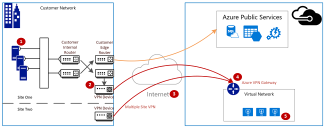
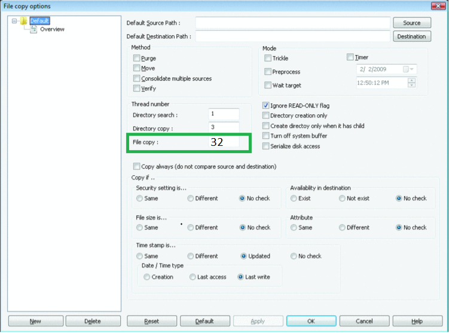

# How to validate VPN throughput to a virtual network

A VPN gateway connection enables you to establish secure, cross-premises connectivity between your Virtual Network within Azure and on-premises IT infrastructure.

This article shows you how to validate the network throughput from the on-premises resources to an Azure virtual machine. It also provides guidance for troubleshooting some common issues.

>[!NOTE]
>The intention of article is to help diagnosing and fixing some common issues. If you're unable to solve the issue by using the guidance provided, [contact support](https://portal.azure.com/?#blade/Microsoft_Azure_Support/HelpAndSupportBlade) to get your issue resolved quickly.
>
>

## Overview

The VPN gateway connection involves the following components:

- On-premises VPN device. View a list of [validated VPN devices](vpn-gateway-about-vpn-devices.md#devicetable).
- Public Internet
- Azure VPN gateway
- Azure virtual machine

The following diagram shows the logical connectivity of a on-premises network to Azure virtual network using VPN.



## Calculate maximum ingress / egress to expect

1.	Understand your application throughput baseline requirements.
2.	Understand your Azure VPN gateway throughput limits. You can find the information in the "Aggregate throughput by SKU and VPN type" section of [Planning and design for VPN Gatewaye](vpn-gateway-plan-design.md).
3.	Understand the [Azure VM throughput guidance](../virtual-machines/virtual-machines-windows-sizes.md) for your VM size.
4.	Understand your Internet Service Provider (ISP) bandwidth.
5.	Calculate your expected throughput - Least bandwidth of (VM, Gateway, ISP) * .80.

If your calculated throughput does not meet your application throughput baseline requirements you will need to increase bandwidth of the resource you identified as the bottleneck. To resize an Azure VPN Gateway, see [Changing a gateway SKU](https://docs.microsoft.com/en-us/azure/vpn-gateway/vpn-gateway-about-vpn-gateway-settings.md#gwsku). To resize a virtual machine, see [Resize a VM](../virtual-machines/virtual-machines-windows-resize-vm.md). You may also want to contact your ISP if you are not achieving the desired internet bandwidth.

## Validate network throughput by using performance tools

This validation should be performed during non-peak hours as VPN tunnel throughput saturation during testing will not give accurate results.

The tool we are utilizing for this test is iPerf which works on both Windows and Linux and has both client/server modes. (Limited to 3 Gbps for Windows VMs)

This tool does not perform any read/write operations to disk. It solely produces self-generated TCP traffic from one end to the other. It will generate statistics based on experimentation in order to measure the bandwidth available between client/server nodes. When testing between two nodes, one will act as a server and the other as client. Once this test is completed, it is advised to reverse the roles for both upload and download perspective on both nodes.

### Download iPerf
Download [iPerf](https://iperf.fr/download/iperf_3.1/iperf-3.1.2-win64.zip). See [iPerf documentation](https://iperf.fr/iperf-doc.php) for additional details.

 >[!NOTE]
 >The third-party products that this article discusses are manufactured by companies that are independent of Microsoft. Microsoft makes no warranty, implied or otherwise, about the performance or reliability of these products.
 >
 >

### Run iPerf (iperf3.exe)
1. Enable NSG/ACL rule allowing the traffic (for public IP address testing on Azure VM).

2. On both nodes enable a firewall exception for port 5001.

	**Windows:** Run the following command as an administrator:

	```CMD
	netsh advfirewall firewall add rule name="Open Port 5001" dir=in action=allow protocol=TCP localport=5001
	```

	To remove the rule when testing is complete, run:
    ```CMD
		netsh advfirewall firewall delete rule name="Open Port 5001" protocol=TCP localport=5001
		```

	**Azure Linux:**  Azure Linux images have permissive firewalls. If there is an application listening on a port the traffic will be allowed through. Custom images that are secured may need ports opened explicitly. Common Linux OS-layer firewalls include `iptables`, `ufw` or `firewalld`.

3. On the server node, change to the directory where iperf3.exe is extracted, then  run iPerf in server mode and set it to listen on port 5001. To do this, refer the following commands:

	 ```CMD
	 cd c:\iperf-3.1.2-win65

	 iperf3.exe -s -p 5001
	 ```

4. On the client node, change to the directory where iperf tool is extracted and run the following command:
    ```CMD
	iperf3.exe -c <IP of the iperf Server> -t 30 -p 5001 -P 32
		```

	The client will be inducing traffic on port 5001 to the server for 30 seconds. The flag '-P 'indicates we are using 32 simultaneous connections to the server node.

	Below is the output from this example:

	

5. (OPTIONAL) To preserve the testing results, run:
     ```CMD
		iperf3.exe -c IPofTheServerToReach -t 30 -p 5001 -P 32  >> output.txt
		```

6. After completing the above steps, execute the same steps with reversed roles such as the server node will now be the client node and vice-versa.

## Address slow file copy issues
Slow file copy issues may be experienced using Windows Explorer or drag and drop through an RDP session. This is normally caused by one or both of the following:

1. File copy applications, such as, Windows Explorer and RDP do not use multiple threads when copying files. To have better performance use a multi-threaded file copy application such as [Richcopy](https://technet.microsoft.com/en-us/magazine/2009.04.utilityspotlight.aspx) to copy files using 16 or 32 threads.<br><br>
<br>
2. VM disk read/write speed can be the cause of slow file copy issues. See [Azure Storage Troubleshooting](../storage/storage-e2e-troubleshooting.md) for additional details.

## On-premises device external facing interface
If the on-premises VPN device internet facing IP address is included within the [local network](vpn-gateway-howto-site-to-site-resource-manager-portal.md#LocalNetworkGateway) definition in Azure, you may experience inability to bring up the VPN, sporadic disconnects or performance issues.

## Checking latency
Use tracert to trace up to Microsoft Azure Edge device to determine if there are any delays exceeding 100ms between hops.

From the on-premises network, run *tracert* to the VIP of the Azure Gateway or VM. Once you see only * returned you know you have hit the Azure edge. When you see DNS names with MSN in them you know you have hit the Microsoft backbone.<br><br>


## Next steps
For more information or help, check out the following links:

- [Optimize network throughput for Azure virtual machines](../virtual-network/virtual-network-optimize-network-bandwidth.md)
- [Microsoft Support](https://portal.azure.com/?#blade/Microsoft_Azure_Support/HelpAndSupportBlade)
