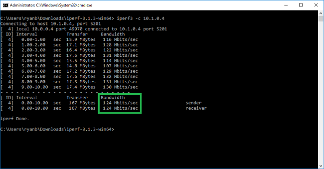
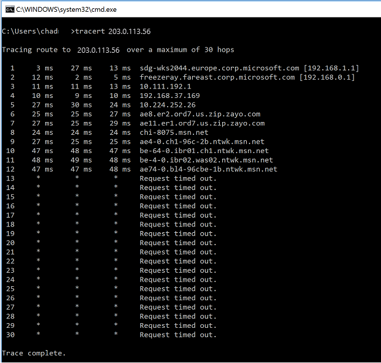

# How to validate VPN throughput to a virtual network

A VPN gateway connection enables you to establish secure, cross-premises connectivity between your Virtual Network within Azure and your on-premises IT infrastructure.

This article shows how to validate network throughput from the on-premises resources to an Azure virtual machine (VM).

> [!NOTE]
> This article is intended to help diagnose and fix common issues. If you're unable to solve the issue by using the following information, [contact support](https://portal.azure.com/?#blade/Microsoft_Azure_Support/HelpAndSupportBlade).

## Overview

The VPN gateway connection involves the following components:

* On-premises VPN device (View a list of [validated VPN devices](vpn-gateway-about-vpn-devices.md#devicetable).)
* Public internet
* Azure VPN gateway
* Azure VM

The following diagram shows the logical connectivity of an on-premises network to an Azure virtual network through VPN.


## Calculate the maximum expected ingress/egress

1. Determine your application's baseline throughput requirements.
1. Determine your Azure VPN gateway throughput limits. For help, see the "Gateway SKUs" section of [About VPN Gateway](vpn-gateway-about-vpngateways.md#gwsku).
1. Determine the [Azure VM throughput guidance](../virtual-machines/virtual-machines-windows-sizes.md) for your VM size.
1. Determine your Internet Service Provider (ISP) bandwidth.
1. Calculate your expected throughput by taking the least bandwidth of either the VM, VPN Gateway, or ISP; which is measured in Megabits-per-second (/) divided by eight (8).

If your calculated throughput does not meet your application's baseline throughput requirements, you must increase the bandwidth of the resource that you identified as the bottleneck. To resize an Azure VPN Gateway, see [Changing a gateway SKU](vpn-gateway-about-vpn-gateway-settings.md#gwsku). To resize a virtual machine, see [Resize a VM](../virtual-machines/virtual-machines-windows-resize-vm.md). If you are not experiencing the expected Internet bandwidth, you may also contact your ISP.

> [!NOTE]
> VPN Gateway throughput is an aggregate of all Site-to-Site\VNET-to-VNET, or Point-to-Site connections.

## Validate network throughput by using performance tools

This validation should be performed during non-peak hours, as VPN tunnel throughput saturation during testing does not give accurate results.

The tool we use for this test is iPerf, which works on both Windows and Linux and has both client and server modes. It is limited to 3Gbps for Windows VMs.

This tool does not perform any read/write operations to disk. It solely produces self-generated TCP traffic from one end to the other. It generates statistics based on experimentation that measures the bandwidth available between client and server nodes. When testing between two nodes, one node acts as the server, and the other node acts as a client. Once this test is completed, we recommend that you reverse the roles of the nodes to test both upload and download throughput on both nodes.

### Download iPerf

Download [iPerf](https://iperf.fr/download/iperf_3.1/iperf-3.1.2-win64.zip). For details, see [iPerf documentation](https://iperf.fr/iperf-doc.php).

 > [!NOTE]
 > The third-party products discussed in this article are manufactured by companies that are independent of Microsoft. Microsoft makes no warranty, implied or otherwise, about the performance or reliability of these products.

### Run iPerf (iperf3.exe)

1. Enable an NSG/ACL rule allowing the traffic (for public IP address testing on Azure VM).

1. On both nodes, enable a firewall exception for port 5001.

   **Windows:** Run the following command as an administrator:

   ```CMD
   netsh advfirewall firewall add rule name="Open Port 5001" dir=in action=allow protocol=TCP localport=5001
   ```

   To remove the rule when testing is complete, run this command:

   ```CMD
   netsh advfirewall firewall delete rule name="Open Port 5001" protocol=TCP localport=5001
   ```

   **Azure Linux:** Azure Linux images have permissive firewalls. If there is an application listening on a port, the traffic is allowed through. Custom images that are secured may need ports opened explicitly. Common Linux OS-layer firewalls include `iptables`, `ufw`, or `firewalld`.

1. On the server node, change to the directory where iperf3.exe is extracted. Then run iPerf in server mode, and set it to listen on port 5001 as the following commands:

   ```CMD
   cd c:\iperf-3.1.2-win65

   iperf3.exe -s -p 5001
   ```

   > [!Note]
   > Port 5001 is customizable to account for particular firewall restrictions in your environment.

1. On the client node, change to the directory where iperf tool is extracted and then run the following command:

   ```CMD
   iperf3.exe -c <IP of the iperf Server> -t 30 -p 5001 -P 32
   ```

   The client is directing thirty seconds of traffic on port 5001, to the server. The flag '-P ' indicates that we are making 32 simultaneous connections to the server node.

   The following screen shows the output from this example:

   

1. (OPTIONAL) To preserve the testing results, run this command:

   ```CMD
   iperf3.exe -c IPofTheServerToReach -t 30 -p 5001 -P 32  >> output.txt
   ```

1. After completing the previous steps, execute the same steps with the roles reversed, so that the server node will now be the client node, and vice-versa.

> [!Note]
> Iperf is not the only tool. [NTTTCP is an alternative solution for testing](https://docs.microsoft.com/azure/virtual-network/virtual-network-bandwidth-testing).

## Test VMs running Windows

### Load Latte.exe onto the VMs

Download the latest version of [Latte.exe](https://gallery.technet.microsoft.com/Latte-The-Windows-tool-for-ac33093b)

Consider putting Latte.exe in separate folder, such as `c:\tools`

### Allow Latte.exe through the Windows firewall

On the receiver, create an Allow rule on the Windows Firewall to allow the Latte.exe traffic to arrive. It's easiest to allow the entire Latte.exe program by name rather than to allow specific TCP ports inbound.

### Allow Latte.exe through the Windows Firewall like this

`netsh advfirewall firewall add rule program=<PATH>\latte.exe name="Latte" protocol=any dir=in action=allow enable=yes profile=ANY`

For example, if you copied latte.exe to the "c:\tools" folder, this would be the command

`netsh advfirewall firewall add rule program=c:\tools\latte.exe name="Latte" protocol=any dir=in action=allow enable=yes profile=ANY`

### Run latency tests

Start latte.exe on the RECEIVER (run from CMD, not from PowerShell):

`latte -a <Receiver IP address>:<port> -i <iterations>`

Around 65k iterations is long enough to return representative results.

Any available port number is fine.

If the VM has an IP address of 10.0.0.4, it would look like this

`latte -c -a 10.0.0.4:5005 -i 65100`

Start latte.exe on the SENDER (run from CMD, not from PowerShell)

`latte -c -a <Receiver IP address>:<port> -i <iterations>`

The resulting command is the same as on the receiver except with the addition of "-c" to indicate that this is the "client" or sender

`latte -c -a 10.0.0.4:5005 -i 65100`

Wait for the results. Depending on how far apart the VMs are, it could take a few minutes to complete. Consider starting with fewer iterations to test for success before running longer tests.

## Test VMs running Linux

Use [SockPerf](https://github.com/mellanox/sockperf) to test VMs.

### Install SockPerf on the VMs

On the Linux VMs (both SENDER and RECEIVER), run these commands to prepare SockPerf on your VMs:

#### CentOS / RHEL - Install GIT and other helpful tools

`sudo yum install gcc -y -q`
`sudo yum install git -y -q`
`sudo yum install gcc-c++ -y`
`sudo yum install ncurses-devel -y`
`sudo yum install -y automake`

#### Ubuntu - Install GIT and other helpful tools

`sudo apt-get install build-essential -y`
`sudo apt-get install git -y -q`
`sudo apt-get install -y autotools-dev`
`sudo apt-get install -y automake`

#### Bash - all

From bash command line (assumes git is installed)

`git clone https://github.com/mellanox/sockperf`
`cd sockperf/`
`./autogen.sh`
`./configure --prefix=`

Make is slower, may take several minutes

`make`

Make install is fast

`sudo make install`

### Run SockPerf on the VMs

#### Sample commands after installation. Server/Receiver - assumes server's IP is 10.0.0.4

`sudo sockperf sr --tcp -i 10.0.0.4 -p 12345 --full-rtt`

#### Client - assumes server's IP is 10.0.0.4

`sockperf ping-pong -i 10.0.0.4 --tcp -m 1400 -t 101 -p 12345  --full-rtt`

> [!Note]
> Make sure there are no intermediate hops (e.g. Virtual Appliance) during the throughput testing in between the VM and Gateway.
> If there are poor results (in terms of overall throughput) coming from the iPERF/NTTTCP tests above, please refer to the following article to understand the key factors behind the possible root causes of the problem: https://docs.microsoft.com/azure/virtual-network/virtual-network-tcpip-performance-tuning

In particular, analysis of packet capture traces (Wireshark/Network Monitor) collected in parallel from client and server during those tests will help in the assessments of bad performance. These traces can include packet loss, high latency, MTU size. fragmentation, TCP 0 Window, Out of Order fragments, and so on.

## Address slow file copy issues

Even if the overall throughput assessed with the previous steps (iPERF/NTTTCP/etc..) was good, you may experience slow file coping when either using Windows Explorer, or dragging and dropping through an RDP session. This problem is normally due to one or both of the following factors:

* File copy applications, such as Windows Explorer and RDP, do not use multiple threads when copying files. For better performance, use a multi-threaded file copy application such as [Richcopy](https://technet.microsoft.com/magazine/2009.04.utilityspotlight.aspx) to copy files by using 16 or 32 threads. To change the thread number for file copy in Richcopy, click **Action** > **Copy options** > **File copy**.

   <br>

   > [!Note]
   > Not all application work same, and not all application/process utilizes all the threads. If you run the test, you could see some threads being empty and won't provide accurate throughput results.
   > To check your application file transfer performance, use multi-thread by increasing the # of thread in succession or decrease in order to find the optimal throughput of the application or file transfer.

* Insufficient VM disk read/write speed. For more information, see [Azure Storage Troubleshooting](../storage/common/storage-e2e-troubleshooting.md).

## On-premises device external facing interface

Mentioned the subnets of on-premises ranges that you would like Azure to reach via VPN on Local Network Gateway. Simultaneously, define the VNET address space in Azure to the on-premises device.

* **Route Based Gateway**: The policy or traffic selector for route-based VPNs are configured as any-to-any (or wild cards).

* **Policy Based Gateway**: Policy-based VPNs encrypt and direct packets through IPsec tunnels based on the combinations of address prefixes between your on-premises network and the Azure VNet. The policy (or Traffic Selector) is usually defined as an access list in the VPN configuration.

* **UsePolicyBasedTrafficSelector** connections: ("UsePolicyBasedTrafficSelectors" to $True on a connection will configure the Azure VPN gateway to connect to policy-based VPN firewall on premises. If you enable PolicyBasedTrafficSelectors, you need to ensure your VPN device has the matching traffic selectors defined with all combinations of your on-premises network (local network gateway) prefixes to and from the Azure virtual network prefixes, instead of any-to-any.

Inappropriate configuration may lead to frequent disconnects within the tunnel, packet drops, bad throughput, and latency.

## Check latency

You can check latency by using the following tools:

* WinMTR
* TCPTraceroute
* `ping` and `psping` (These tools can provide a good estimate of RTT, but they can't be used in all cases.)



If you notice a high latency spike at any of the hops before entering MS Network backbone, you may want to proceed with further investigations with your Internet Service Provider.

If a large, unusual latency spike is noticed from hops within "msn.net", please contact MS support for further investigations.

## Next steps

For more information or help, check out the following link:

* [Microsoft Support](https://portal.azure.com/?#blade/Microsoft_Azure_Support/HelpAndSupportBlade)
