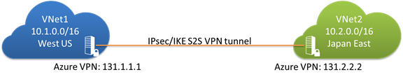

<properties
   pageTitle="Create a VNet-to-VNet connection using Azure Resource Manager and PowerShell | Microsoft Azure"
   description="This article walks you through connecting virtual networks together by using Azure Resource Manager and PowerShell"
   services="vpn-gateway"
   documentationCenter="na"
   authors="cherylmc"
   manager="carolz"
   editor=""
   tags="azure-resource-manager"/>

<tags
   ms.service="vpn-gateway"
   ms.devlang="na"
   ms.topic="article"
   ms.tgt_pltfrm="na"
   ms.workload="infrastructure-services"
   ms.date="10/20/2015"
   ms.author="cherylmc"/>

# Configure a VNet-to-VNet connection using Azure Resource Manager and PowerShell

> [AZURE.SELECTOR]
- [Azure Portal](virtual-networks-configure-vnet-to-vnet-connection.md)
- [PowerShell - Azure Resource Manager](vpn-gateway-vnet-vnet-rm-ps.md)

This article will walk you through the steps using the Resource Manager deployment model. You can select the article for the deployment model and deployment tool by using the tabs above.

>[AZURE.NOTE] It's important to know that Azure currently works with two deployment models: Resource Manager, and classic. Before you begin your configuration, make sure that you understand the deployment models and tools. For information about the deployment models, see [Azure deployment models](../azure-classic-rm.md).

Connecting a virtual network to another virtual network (VNet-to-VNet) is very similar to connecting a VNet to an on-premises site location. Both connectivity types use a VPN gateway to provide a secure tunnel using IPsec/IKE. The VNets you connect can be in different regions. You can even combine VNet-to-VNet communication with multi-site configurations. This lets you establish network topologies that combine cross-premises connectivity with inter-virtual network connectivity, as shown in the diagram below. 

 
## Why connect virtual networks?

You may want to connect virtual networks for the following reasons:

- **Cross region geo-redundancy and geo-presence**
	- You can set up your own geo-replication or synchronization with secure connectivity without going over internet-facing endpoints.
	- With Azure Load Balancer and Microsoft or third-party clustering technology, you can setup highly available workload with geo-redundancy across multiple Azure regions. One important example is to setup SQL Always On with Availability Groups spreading across multiple Azure regions.

- **Regional multi-tier applications with strong isolation boundary**
	- Within the same region, you can setup multi-tier applications with multiple virtual networks connected together with strong isolation and secure inter-tier communication.

### Items to note

This article will walk you through connecting two virtual networks, VNet1 and VNet2. You’ll need to be comfortable with networking in order to substitute the IP address ranges that are compatible with your network design requirements. 

- The virtual networks can be in the same or different Azure regions (locations).

- A cloud service or a load balancing endpoint CANNOT span across virtual networks, even if they are connected together.

- Connecting multiple Azure virtual networks together doesn't require any on-premises VPN gateways, unless cross-premises connectivity is required.

- VNet-to-VNet supports connecting virtual networks. It does not support connecting virtual machines or cloud services NOT in a virtual network.

- VNet-to-VNet requires Azure VPN gateways with RouteBased (previously called Dynamic) VPN types. 

- Virtual network connectivity can be used simultaneously with multi-site VPNs, with a maximum of 10 VPN tunnels for a virtual network VPN gateway connecting to ether other virtual networks or on-premises sites.

- The address spaces of the virtual networks and on-premises local network sites must not overlap. Overlapping address spaces will cause the creation of virtual networks to fail.

- Redundant tunnels between a pair of virtual networks are not supported.

- All VPN tunnels of the virtual network share the available bandwidth on the Azure VPN gateway and the same VPN gateway uptime SLA in Azure.

- VNet-to-VNet traffic travels across the Azure backbone.

## Before beginning

Before you begin, verify that you have the following:

- An Azure subscription. If you don't already have an Azure subscription, you can activate your [MSDN subscriber benefits](http://azure.microsoft.com/pricing/member-offers/msdn-benefits-details/) or sign up for a [free trial](http://azure.microsoft.com/pricing/free-trial/).

- Azure PowerShell 0.9.8 cmdlets. You can download and install this version from the Windows PowerShell section of the [Download page](http://azure.microsoft.com/downloads/). This article was written for 0.9.8, although it's possible to use these steps (with slight modifications to the cmdlets) with the PowerShell 1.0 Preview.

**About using these steps with Azure PowerShell 1.0 Preview**

	[AZURE.INCLUDE [powershell-preview-inline-include](../../includes/powershell-preview-inline-include.md)] 

## 1. Plan your IP address ranges

It’s important to decide the ranges that you’ll use to configure your network configuration. From the perspective of VNet1, VNet2 is just another VPN connection that’s defined in the Azure platform. And from VNet2, VNet1 is just another VPN connection. Keep in mind that you must make sure that none of your VNet ranges or local network ranges overlap in any way.

In the steps below, we’ll create two virtual networks along with their respective gateway subnets and configurations. We'll then create a VPN gateway connection between the two VNets.

For this exercise, use the following values for the VNets:

Values for VNet1: 

- Virtual Network Name = VNet1
- Resource Group = testrg1
- Address Space = 10.1.0.0/16 
- Region = US West
- GatewaySubnet = 10.1.0.0/28
- Subnet1 = 10.1.1.0/28

Values for VNet2: 

- Virtual Network Name = VNet2
- Resource Group = testrg2
- Address Space = 10.2.0.0/16
- Region = Japan East
- GatewaySubnet = 10.2.0.0/28
- Subnet1 = 10.2.1.0/28

## 2. Connect to your subscription 

Open your PowerShell console and connect to your account. Use the following sample to help you connect:

		Add-AzureAccount

If you have more than one subscription, use *Select-AzureSubscription* to connect to the subscription that you want to use.

		Select-AzureSubscription "yoursubscription"

Next, switch to the Azure Resource Manager mode. 
		
		Switch-AzureMode -Name AzureResourceManager

## 3. Create a virtual network

Use the sample below to create a virtual network and a gateway subnet. Substitute the values for your own. In this example, we'll create VNet1. You'll repeat the steps to create VNet2 later.

First, create a Resource Group. 

			New-AzureResourceGroup -Name testrg1 -Location 'West US'

Next, create your virtual network. The sample below creates a virtual network named *VNet1* and two subnets, one called *GatewaySubnet* and the other called *Subnet1*. It's important to create one subnet named specifically *GatewaySubnet*. If you name it something else, your connection configuration will fail. In the example below, our gateway subnet is using a /28. You may choose to use a gateway subnet as small as /29. Note that some features (such as an ExpressRoute/site-to-site coexist connection) require a larger gateway subnet of /27, so you may want to create your gateway subnet to accommodate additional features you may use in the future.

 		$subnet = New-AzureVirtualNetworkSubnetConfig -Name 'GatewaySubnet' -AddressPrefix 10.1.0.0/28
		$subnet1 = New-AzureVirtualNetworkSubnetConfig -Name 'Subnet1' -AddressPrefix '10.1.1.0/28'
		New-AzureVirtualNetwork -Name VNet1 -ResourceGroupName testrg1 -Location 'West US' -AddressPrefix 10.1.0.0/16 -Subnet $subnet, $subnet1

## 4. Request a public IP address

Next, you'll request a public IP address to be allocated to the gateway you will create for your VNet. You cannot specify the IP address that you want to use; it’s dynamically allocated to your gateway. You'll use this IP address in the next configuration section.

Use the sample below. The Allocation Method for this address must be Dynamic. 

		$gwpip= New-AzurePublicIpAddress -Name gwpip1 -ResourceGroupName testrg1 -Location 'West US' -AllocationMethod Dynamic

## 5. Create the gateway configuration

The gateway configuration defines the subnet and the public IP address to use. Use the sample below to create your gateway configuration. 

		$vnet = Get-AzureVirtualNetwork -Name VNet1 -ResourceGroupName testrg1
		$subnet = Get-AzureVirtualNetworkSubnetConfig -Name 'GatewaySubnet' -VirtualNetwork $vnet
		$gwipconfig = New-AzureVirtualNetworkGatewayIpConfig -Name gwipconfig1 -SubnetId $subnet.Id -PublicIpAddressId $gwpip.Id 

## 6. Create the gateway

In this step, you'll create the virtual network gateway for your VNet. VNet-to-VNet configurations require a RouteBased VpnType. Creating a gateway can take a while, so be patient.

		New-AzureVirtualNetworkGateway -Name vnetgw1 -ResourceGroupName testrg1 -Location 'West US' -IpConfigurations $gwipconfig -GatewayType Vpn -VpnType RouteBased

## 7. Create VNet2

Once you've configured VNet1, repeat the previous steps to configure VNet2 along with its gateway configuration. After you've completed the configuration for both of the VNets and their respective gateways, proceed to **Step 8. Connect the gateways**.

## 8. Connect the gateways

In this step, you'll create the VPN gateway connections between the two virtual network gateways. You'll see a shared key referenced in the examples. You can use your own values for the shared key. The important thing is that the shared key must match for both configurations.

When creating connections, note that they do take some time to complete.

**For VNet1 to VNet2**
    
    $vnetgw1 = Get-AzureVirtualNetworkGateway -Name vnetgw1 -ResourceGroupName testrg1
    $vnetgw2 = Get-AzureVirtualNetworkGateway -Name vnetgw2 -ResourceGroupName testrg2
    
    New-AzureVirtualNetworkGatewayConnection -Name conn1 -ResourceGroupName testrg1 -VirtualNetworkGateway1 $vnetgw1 -VirtualNetworkGateway2 $vnetgw2 -Location 'West US' -ConnectionType Vnet2Vnet -SharedKey 'abc123'

**For VNet2 to VNet1**
    
    $vnetgw1 = Get-AzureVirtualNetworkGateway -Name vnetgw2 -ResourceGroupName testrg2
    $vnetgw2 = Get-AzureVirtualNetworkGateway -Name vnetgw1 -ResourceGroupName testrg1
    
    New-AzureVirtualNetworkGatewayConnection -Name conn2 -ResourceGroupName testrg2 -VirtualNetworkGateway1 $vnetgw1 -VirtualNetworkGateway2 $vnetgw2 -Location 'Japan East' -ConnectionType Vnet2Vnet -SharedKey 'abc123'
    

After a few minutes, the connection should be established. Note that at this time, gateways and connections created with Azure Resource Manager are not visible in the Preview Portal. 

## Verifying connections

At this time, the VPN connections created with Resource Manager are not visible in the Preview Portal. However, it's possible to verify that your connection succeeded by using *Get-AzureVirtualNetworkGatewayConnection –Debug*. In the future, we'll have a cmdlet for this, as well as the ability to view your connection in the Preview Portal.

You can use the following cmdlet example. Be sure to change the values to match each connection that you want to verify. When prompted, select *A* in order to run All. 

		Get-AzureVirtualNetworkGatewayConnection -Name vnet2connection -ResourceGroupName vnet2vnetrg -Debug 

 After the cmdlet has finished, scroll through to view the values. In the example below, the connection status shows as *Connected* and you can see ingress and egress bytes.

	Body:
	{
	  "name": "Vnet2Connection",
	  "id": "/subscriptions/a932c0e6-b5cb-4e68-b23d-5064372c8a3cdef/resourceGroups/Vnet2VnetRG/providers/Microsoft.Network/connections/Vnet2Connection",
	  "properties": {
	    "provisioningState": "Succeeded",
	    "resourceGuid": "3c0bc049-860d-46ea-9909-e08098680a8bdef",
	    "virtualNetworkGateway1": {
	      "id": "/subscriptions/a932c0e6-b5cb-4e68-b23d-5064372c8a3cdef/resourceGroups/Vnet2VnetRG/providers/Microsoft.Network/virtualNetworkGateways/Vnet2Gw"
	    },
	    "virtualNetworkGateway2": {
	      "id": "/subscriptions/a932c0e6-b5cb-4e68-b23d-5064372c8a3cdef/resourceGroups/Vnet2VnetRG/providers/Microsoft.Network/virtualNetworkGateways/Vnet1Gw"
	    },
	    "connectionType": "Vnet2Vnet",
	    "routingWeight": 3,
	    "sharedKey": "abc123",
	    "connectionStatus": "Connected",
	    "ingressBytesTransferred": 3359044,
	    "egressBytesTransferred": 4142451
	  }
	} 

## Connecting existing VNets

If you already have created virtual networks in Azure Resource Manager mode and you want to connect them, verify the following:

- You have a gateway subnet of at least /29 or larger for each VNet.
- The address ranges for your virtual networks do not overlap.

If you need to add gateway subnets to your VNets, use the sample below, replacing the values with your own. Be sure to name the gateway subnet 'GatewaySubnet'. If you name it something else, your VPN configuration will not work as expected. 

	
		$vnet = Get-AzureVirtualNetwork -ResourceGroupName testrg -Name testvnet
		Add-AzureVirtualNetworkSubnetConfig -Name 'GatewaySubnet' -AddressPrefix 10.0.3.0/28 -VirtualNetwork $vnet
		Set-AzureVirtualNetwork -VirtualNetwork $vnet

After verifying that your gateway subnets are configured correctly, continue with **Step 4. Request a public IP address** and follow the steps.

## Next steps

You can add virtual machines to your virtual networks. [Create a Virtual Machine](../virtual-machines/virtual-machines-windows-tutorial.md).

For more information about VPN Gateways, see the [VPN Gateway FAQ](vpn-gateway-faq.md).