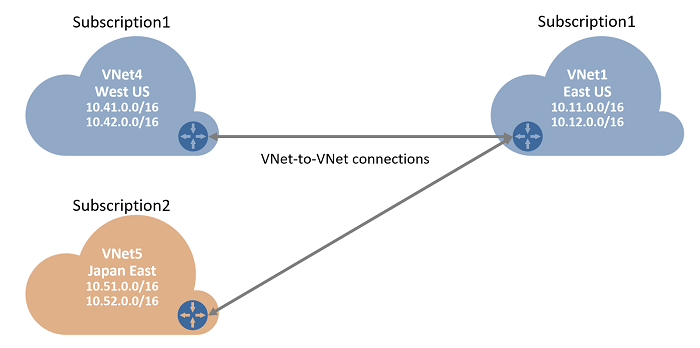
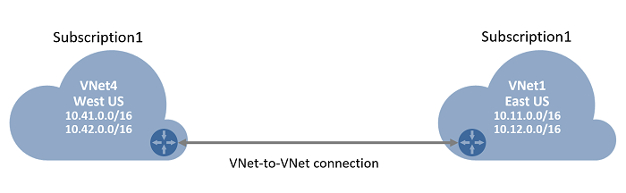

<properties
   pageTitle="Create a VNet-to-VNet VPN Gateway connection using Azure Resource Manager and PowerShell for VNets | Microsoft Azure"
   description="This article walks you through connecting virtual networks together by using Azure Resource Manager and PowerShell."
   services="vpn-gateway"
   documentationCenter="na"
   authors="cherylmc"
   manager="carmonm"
   editor=""
   tags="azure-resource-manager"/>

<tags
   ms.service="vpn-gateway"
   ms.devlang="na"
   ms.topic="get-started-article"
   ms.tgt_pltfrm="na"
   ms.workload="infrastructure-services"
   ms.date="07/29/2016"
   ms.author="cherylmc"/>

# Configure a VNet-to-VNet connection by using Azure Resource Manager and PowerShell

> [AZURE.SELECTOR]
- [Azure Classic Portal](virtual-networks-configure-vnet-to-vnet-connection.md)
- [PowerShell - Azure Resource Manager](vpn-gateway-vnet-vnet-rm-ps.md)

This article will walk you through the steps to create a connection between virtual networks using the Resource Manager deployment model and PowerShell. The virtual networks can be in the same or different regions, from the same or different subscriptions.

[AZURE.INCLUDE [vpn-gateway-peering](../../includes/vpn-gateway-vnetpeeringlink-include.md)]

**About Azure deployment models**

[AZURE.INCLUDE [vpn-gateway-clasic-rm](../../includes/vpn-gateway-classic-rm-include.md)] 

**Deployment models and tools for VNet-to-VNet**

A VNet-to-VNet connection can be configured in both deployment models and by using several different tools. See the table below for more information. We update this table as new articles, new deployment models, and additional tools become available for this configuration. When an article is available, we link directly to it from the table.

[AZURE.INCLUDE [vpn-gateway-table-vnet-vnet](../../includes/vpn-gateway-table-vnet-to-vnet-include.md)] 

## About VNet-to-VNet connections

Connecting a virtual network to another virtual network (VNet-to-VNet) is very similar to connecting a VNet to an on-premises site location. Both connectivity types use an Azure VPN gateway to provide a secure tunnel using IPsec/IKE. The VNets you connect can be in different regions. Or in different subscriptions. You can even combine VNet-to-VNet communication with multi-site configurations. This lets you establish network topologies that combine cross-premises connectivity with inter-virtual network connectivity, as shown in the diagram below. 

 
### Why connect virtual networks?

You may want to connect virtual networks for the following reasons:

- **Cross region geo-redundancy and geo-presence**
	- You can set up your own geo-replication or synchronization with secure connectivity without going over Internet-facing endpoints.
	- With Azure Traffic Manager and Load Balancer, you can setup highly available workload with geo-redundancy across multiple Azure regions. One important example is to set up SQL Always On with Availability Groups spreading across multiple Azure regions.

- **Regional multi-tier applications with isolation or administrative boundary**
	- Within the same region, you can setup multi-tier applications with multiple virtual networks connected together due to isolation or administrative requirements.

### VNet-to-VNet FAQ

[AZURE.INCLUDE [vpn-gateway-vnet-vnet-faq](../../includes/vpn-gateway-vnet-vnet-faq-include.md)] 

## Which set of steps should I use?

Within this article, you will see different sets of steps that apply to VNets created using the Resource Manager deployment model. VNet-to-VNet configuration steps depend on whether the VNets reside in the same subscription, or are in different subscriptions. 

For configuration steps, the key difference between the two is whether you can create and configure all virtual network and gateway resources within the same PowerShell session. This document includes steps for each. The graphic above shows both a same subscription VNet-to-VNet connection, and a cross-subscription VNet-to-VNet connection. 

- [VNets that reside in the same subscription](#samesub)
- [VNets that reside in different subscriptions](#difsub)

## How to connect VNets that are in the same subscription

This configuration applies to virtual networks that are in the same subscription, as shown in the diagram below:

### Before you begin

- Verify that you have an Azure subscription. If you don't already have an Azure subscription, you can activate your [MSDN subscriber benefits](https://azure.microsoft.com/pricing/member-offers/msdn-benefits-details/) or sign up for a [free account](https://azure.microsoft.com/pricing/free-trial/).
	
- You'll need to install the Azure Resource Manager PowerShell cmdlets. See [How to install and configure Azure PowerShell](../powershell-install-configure.md) for more information about installing the PowerShell cmdlets.

### Step 1 - Plan your IP address ranges

It’s important to decide the ranges that you’ll use to configure your network configuration. Keep in mind that you must make sure that none of your VNet ranges or local network ranges overlap in any way.

In the steps below, we’ll create two virtual networks along with their respective gateway subnets and configurations. We'll then create a VPN gateway connection between the two VNets.

For this exercise, use the following values for the VNets:

**Values for TestVNet1:**

- VNet Name: TestVNet1
- Resource Group: TestRG1
- Location: East US
- TestVNet1: 10.11.0.0/16 & 10.12.0.0/16
- FrontEnd: 10.11.0.0/24
- BackEnd: 10.12.0.0/24
- GatewaySubnet: 10.12.255.0/27
- DNS Server: 8.8.8.8
- GatewayName: VNet1GW
- Public IP: VNet1GWIP
- VPNType: RouteBased
- Connection(1to4): VNet1toVNet4
- Connection(1to5): VNet1toVNet5
- ConnectionType: VNet2VNet

**Values for TestVNet4:**

- VNet Name: TestVNet4
- TestVNet2: 10.41.0.0/16 & 10.42.0.0/16
- FrontEnd: 10.41.0.0/24
- BackEnd: 10.42.0.0/24
- GatewaySubnet: 10.42.255.0/27
- Resource Group: TestRG4
- Location: West US
- DNS Server: 8.8.8.8
- GatewayName: VNet4GW
- Public IP: VNet4GWIP
- VPNType: RouteBased
- Connection: VNet4toVNet1
- ConnectionType: VNet2VNet

### Step 2 - Create and configure TestVNet1

1. Declare your variables

	For this exercise, we'll start by declaring our variables. The example below declares the variables using the values for this exercise. Be sure to replace the values with your own when configuring for production. You can use these variables if you are running through the steps to become familiar with this type of configuration. Modify the variables, and then copy and paste into your PowerShell console.

		$Sub1          = "Replace_With_Your_Subcription_Name"
		$RG1           = "TestRG1"
		$Location1     = "East US"
		$VNetName1     = "TestVNet1"
		$FESubName1    = "FrontEnd"
		$BESubName1    = "Backend"
		$GWSubName1    = "GatewaySubnet"
		$VNetPrefix11  = "10.11.0.0/16"
		$VNetPrefix12  = "10.12.0.0/16"
		$FESubPrefix1  = "10.11.0.0/24"
		$BESubPrefix1  = "10.12.0.0/24"
		$GWSubPrefix1  = "10.12.255.0/27"
		$DNS1          = "8.8.8.8"
		$GWName1       = "VNet1GW"
		$GWIPName1     = "VNet1GWIP"
		$GWIPconfName1 = "gwipconf1"
		$Connection14  = "VNet1toVNet4"
		$Connection15  = "VNet1toVNet5"

2. Connect to subscription 1

	Make sure you switch to PowerShell mode to use the Resource Manager cmdlets. For more information, see [Using Windows PowerShell with Resource Manager](../powershell-azure-resource-manager.md).

	Open your PowerShell console and connect to your account. Use the following sample to help you connect:

		Login-AzureRmAccount

	Check the subscriptions for the account.

		Get-AzureRmSubscription 

	Specify the subscription that you want to use.

		Select-AzureRmSubscription -SubscriptionName $Sub1

3. Create a new resource group

		New-AzureRmResourceGroup -Name $RG1 -Location $Location1

4. Create the subnet configurations for TestVNet1

	The sample below creates a virtual network named TestVNet1 and three subnets, one called GatewaySubnet, one called FrontEnd, and one called Backend. When substituting values, it's important that you always name your gateway subnet specifically GatewaySubnet. If you name it something else, your gateway creation will fail. 

	In the example below, our gateway subnet is using a /27. Although you technically can create a gateway subnet using a subnet as small as a /29, we don't recommend doing this. We recommend using possibly something larger, such as a /27 or /26, just in case you want to take advantage of existing or future configurations that may require a larger gateway subnet. 

		$fesub1 = New-AzureRmVirtualNetworkSubnetConfig -Name $FESubName1 -AddressPrefix $FESubPrefix1
		$besub1 = New-AzureRmVirtualNetworkSubnetConfig -Name $BESubName1 -AddressPrefix $BESubPrefix1
		$gwsub1 = New-AzureRmVirtualNetworkSubnetConfig -Name $GWSubName1 -AddressPrefix $GWSubPrefix1

5. Create TestVNet1

		New-AzureRmVirtualNetwork -Name $VNetName1 -ResourceGroupName $RG1 -Location $Location1 -AddressPrefix $VNetPrefix11,$VNetPrefix12 -Subnet $fesub1,$besub1,$gwsub1

6. Request a public IP address

	Next, you'll request a public IP address to be allocated to the gateway you will create for your VNet. You cannot specify the IP address that you want to use; it’s dynamically allocated to your gateway. You'll use this IP address in the next configuration section. Use the example below. The Allocation Method for this address must be Dynamic. 

		$gwpip1    = New-AzureRmPublicIpAddress -Name $GWIPName1 -ResourceGroupName $RG1 -Location $Location1 -AllocationMethod Dynamic

7. Create the gateway configuration

	The gateway configuration defines the subnet and the public IP address to use. Use the sample below to create your gateway configuration. 

		$vnet1     = Get-AzureRmVirtualNetwork -Name $VNetName1 -ResourceGroupName $RG1
		$subnet1   = Get-AzureRmVirtualNetworkSubnetConfig -Name "GatewaySubnet" -VirtualNetwork $vnet1
		$gwipconf1 = New-AzureRmVirtualNetworkGatewayIpConfig -Name $GWIPconfName1 -Subnet $subnet1 -PublicIpAddress $gwpip1

8. Create the gateway for TestVNet1

	In this step, you'll create the virtual network gateway for your TestVNet1. VNet-to-VNet configurations require a RouteBased VpnType. Creating a gateway can take a while (30 minutes or more to complete).

		New-AzureRmVirtualNetworkGateway -Name $GWName1 -ResourceGroupName $RG1 -Location $Location1 -IpConfigurations $gwipconf1 -GatewayType Vpn -VpnType RouteBased -GatewaySku Standard

### Step 3 - Create and configure TestVNet4

Once you've configured TestVNet1, you'll repeat the steps to create TestVNet4. Follow the steps below, replacing the values with your own when needed. This step can be done within the same PowerShell session because it is in the same subscription.

1. Declare your variables

	Be sure to replace the values with the ones that you want to use for your configuration.

		$RG4           = "TestRG4"
		$Location4     = "West US"
		$VnetName4     = "TestVNet4"
		$FESubName4    = "FrontEnd"
		$BESubName4    = "Backend"
		$GWSubName4    = "GatewaySubnet"
		$VnetPrefix41  = "10.41.0.0/16"
		$VnetPrefix42  = "10.42.0.0/16"
		$FESubPrefix4  = "10.41.0.0/24"
		$BESubPrefix4  = "10.42.0.0/24"
		$GWSubPrefix4  = "10.42.255.0/27"
		$DNS4          = "8.8.8.8"
		$GWName4       = "VNet4GW"
		$GWIPName4     = "VNet4GWIP"
		$GWIPconfName4 = "gwipconf4"
		$Connection41  = "VNet4toVNet1"

	Before you continue, please make sure you are still connected to Subscription 1.

2. Create a new resource group

		New-AzureRmResourceGroup -Name $RG4 -Location $Location4

3. Create the subnet configurations for TestVNet4

		$fesub4 = New-AzureRmVirtualNetworkSubnetConfig -Name $FESubName4 -AddressPrefix $FESubPrefix4
		$besub4 = New-AzureRmVirtualNetworkSubnetConfig -Name $BESubName4 -AddressPrefix $BESubPrefix4
		$gwsub4 = New-AzureRmVirtualNetworkSubnetConfig -Name $GWSubName4 -AddressPrefix $GWSubPrefix4

4. Create TestVNet4

		New-AzureRmVirtualNetwork -Name $VnetName4 -ResourceGroupName $RG4 -Location $Location4 -AddressPrefix $VnetPrefix41,$VnetPrefix42 -Subnet $fesub4,$besub4,$gwsub4

5. Request a public IP address

		$gwpip4    = New-AzureRmPublicIpAddress -Name $GWIPName4 -ResourceGroupName $RG4 -Location $Location4 -AllocationMethod Dynamic

6. Create the gateway configuration

		$vnet4     = Get-AzureRmVirtualNetwork -Name $VnetName4 -ResourceGroupName $RG4
		$subnet4   = Get-AzureRmVirtualNetworkSubnetConfig -Name "GatewaySubnet" -VirtualNetwork $vnet4
		$gwipconf4 = New-AzureRmVirtualNetworkGatewayIpConfig -Name $GWIPconfName4 -Subnet $subnet4 -PublicIpAddress $gwpip4

7. Create the TestVNet4 gateway

		New-AzureRmVirtualNetworkGateway -Name $GWName4 -ResourceGroupName $RG4 -Location $Location4 -IpConfigurations $gwipconf4 -GatewayType Vpn -VpnType RouteBased -GatewaySku Standard

### Step 4 - Connecting the gateways

1. Get both virtual network gateways

	In this example, because both gateways are in the same subscription, this step can be completed in the same PowerShell session.

		$vnet1gw = Get-AzureRmVirtualNetworkGateway -Name $GWName1 -ResourceGroupName $RG1
		$vnet4gw = Get-AzureRmVirtualNetworkGateway -Name $GWName4 -ResourceGroupName $RG4

2. Create the TestVNet1 to TestVNet4 connection

	In this step, you will create the connection from TestVNet1 to TestVNet4. You'll see a shared key referenced in the examples. You can use your own values for the shared key. The important thing is that the shared key must match for both connections. Creating a connection can take a short while to complete.

		New-AzureRmVirtualNetworkGatewayConnection -Name $Connection14 -ResourceGroupName $RG1 -VirtualNetworkGateway1 $vnet1gw -VirtualNetworkGateway2 $vnet4gw -Location $Location1 -ConnectionType Vnet2Vnet -SharedKey 'AzureA1b2C3'

3. Create the TestVNet4 to TestVNet1 connection

	This step is similar to the one above, except you are creating the connection from TestVNet4 to TestVNet1. Make sure the shared keys match.

		New-AzureRmVirtualNetworkGatewayConnection -Name $Connection41 -ResourceGroupName $RG4 -VirtualNetworkGateway1 $vnet4gw -VirtualNetworkGateway2 $vnet1gw -Location $Location4 -ConnectionType Vnet2Vnet -SharedKey 'AzureA1b2C3'

	The connection should be established after a few minutes.

## How to verify a VNet-to-VNet connection

The examples below will show you how to verify your connection. Please be sure to change the values to match your environment.

### To verify your connection using the Azure portal

You can verify a VPN connection in the Azure Portal by navigating to **Virtual network gateways** -> **click your gateway name** -> **Settings** -> **Connections**. By selecting the name of the connection, you can view more information in the **Connection** blade. 

### To verify your connection using PowerShell

It is also possible to verify that your connection succeeded by using *Get-AzureRmVirtualNetworkGatewayConnection –Debug*. You can use the following example, changing the values to match your own. When prompted, select A in order to run All.

	Get-AzureRmVirtualNetworkGatewayConnection -Name $Connection1 -ResourceGroupName $RG1 -Debug

After the cmdlet has finished, scroll through to view the values. In the example PowerShell output below, the connection status shows as *Connected* and you can see ingress and egress bytes.

	AuthorizationKey           :
	VirtualNetworkGateway1     : Microsoft.Azure.Commands.Network.Models.PSVirtualNetworkGateway
	VirtualNetworkGateway2     : Microsoft.Azure.Commands.Network.Models.PSVirtualNetworkGateway
	LocalNetworkGateway2       :
	Peer                       :
	ConnectionType             : Vnet2Vnet
	RoutingWeight              : 0
	SharedKey                  : AzureA1b2C3
	ConnectionStatus           : Connected
	EgressBytesTransferred     : 1376
	IngressBytesTransferred    : 1232
	ProvisioningState          : Succeeded
	VirtualNetworkGateway1Text : "/subscriptions/<SubscriptionID>/resourceGroups/TestRG1/providers/Microsoft.Network/virtualNetworkGateways/VNet1GW"
	VirtualNetworkGateway2Text : "/subscriptions/<SubscriptionID>/resourceGroups/TestRG4/providers/Microsoft.Network/virtualNetworkGateways/VNet4GW"
	LocalNetworkGateway2Text   :
	PeerText                   :
	ResourceGroupName          : TestRG1
	Location                   : eastus
	ResourceGuid               : 173489d1-37e2-482c-b8b8-6ca69fc3e069
	Tag                        : {}
	TagsTable                  :
	Name                       : VNet1toVNet4
	Id                         : /subscriptions/<SubscriptionID>/resourceGroups/TestRG1/providers/Micr osoft.Network/connections/VNet1toVNet4

## How to connect VNets that are in different subscriptions

The configuration steps below add an additional VNet-to-VNet connection to connect TestVNet1 to TestVNet5, which resides in a different subscription. The difference here is that part of the configuration steps need be performed in a separate PowerShell session in the context of the second subscription, especially when the two subscriptions belong to different organizations. Upon completing the steps below, the resulting configuration is shown in the diagram below:

The instructions below continue from the previous steps listed above. You must complete [Step 1](#Step1) and [Step 2](#Step2) to create and configure TestVNet1 and the VPN Gateway for TestVNet1. If you plan to only connect VNets in different subscriptions, you don't need to worry about steps 3 & 4 from the previous exercise and can move forward to Step 5, below. 

### Step 5 - Verify the additional IP address ranges

It is important to make sure that the IP address space of the new virtual network, TestVNet5, does not overlap with any of your VNet ranges or local network gateway ranges. 

In this example, the virtual networks may belong to different organizations. For this exercise, you can use the following values for the TestVNet5:

**Values for TestVNet5:**

- VNet Name: TestVNet5
- Resource Group: TestRG5
- Location: Japan East
- TestVNet5: 10.51.0.0/16 & 10.52.0.0/16
- FrontEnd: 10.51.0.0/24
- BackEnd: 10.52.0.0/24
- GatewaySubnet: 10.52.255.0.0/27
- DNS Server: 8.8.8.8
- GatewayName: VNet5GW
- Public IP: VNet5GWIP
- VPNType: RouteBased
- Connection: VNet5toVNet1
- ConnectionType: VNet2VNet

**Additional Values for TestVNet1:**

- Connection: VNet1toVNet5

### Step 6 - Create and configure TestVNet5

This step must be done in the context of the new subscription. This part may be performed by the administrator in a different organization which owns the subscription.

1. Declare your variables

	Be sure to replace the values with the ones that you want to use for your configuration.

		$Sub5          = "Replace_With_the_New_Subcription_Name"
		$RG5           = "TestRG5"
		$Location5     = "Japan East"
		$VnetName5     = "TestVNet5"
		$FESubName5    = "FrontEnd"
		$BESubName5    = "Backend"
		$GWSubName5    = "GatewaySubnet"
		$VnetPrefix51  = "10.51.0.0/16"
		$VnetPrefix52  = "10.52.0.0/16"
		$FESubPrefix5  = "10.51.0.0/24"
		$BESubPrefix5  = "10.52.0.0/24"
		$GWSubPrefix5  = "10.52.255.0/27"
		$DNS5          = "8.8.8.8"
		$GWName5       = "VNet5GW"
		$GWIPName5     = "VNet5GWIP"
		$GWIPconfName5 = "gwipconf5"
		$Connection51  = "VNet5toVNet1"

2. Connect to subscription 5

	Open your PowerShell console and connect to your account. Use the following sample to help you connect:

		Login-AzureRmAccount

	Check the subscriptions for the account.

		Get-AzureRmSubscription 

	Specify the subscription that you want to use.

		Select-AzureRmSubscription -SubscriptionName $Sub5

3. Create a new resource group

		New-AzureRmResourceGroup -Name $RG5 -Location $Location5

4. Create the subnet configurations for TestVNet4
	
		$fesub5 = New-AzureRmVirtualNetworkSubnetConfig -Name $FESubName5 -AddressPrefix $FESubPrefix5
		$besub5 = New-AzureRmVirtualNetworkSubnetConfig -Name $BESubName5 -AddressPrefix $BESubPrefix5
		$gwsub5 = New-AzureRmVirtualNetworkSubnetConfig -Name $GWSubName5 -AddressPrefix $GWSubPrefix5

5. Create TestVNet5

		New-AzureRmVirtualNetwork -Name $VnetName5 -ResourceGroupName $RG5 -Location $Location5 -AddressPrefix $VnetPrefix51,$VnetPrefix52 -Subnet $fesub5,$besub5,$gwsub5

6. Request a public IP address

		$gwpip5    = New-AzureRmPublicIpAddress -Name $GWIPName5 -ResourceGroupName $RG5 -Location $Location5 -AllocationMethod Dynamic

7. Create the gateway configuration

		$vnet5     = Get-AzureRmVirtualNetwork -Name $VnetName5 -ResourceGroupName $RG5
		$subnet5   = Get-AzureRmVirtualNetworkSubnetConfig -Name "GatewaySubnet" -VirtualNetwork $vnet5
		$gwipconf5 = New-AzureRmVirtualNetworkGatewayIpConfig -Name $GWIPconfName5 -Subnet $subnet5 -PublicIpAddress $gwpip5

8. Create the TestVNet5 gateway

		New-AzureRmVirtualNetworkGateway -Name $GWName5 -ResourceGroupName $RG5 -Location $Location5 -IpConfigurations $gwipconf5 -GatewayType Vpn -VpnType RouteBased -GatewaySku Standard

### Step 7 - Connecting the gateways

In this example, because the gateways are in the different subscriptions, we've split this step into two PowerShell sessions marked as [Subscription 1] and [Subscription 5].

1. **[Subscription 1]** Get the virtual network gateway for Subscription 1

	Make sure you login and connect to Subscription 1.

		$vnet1gw = Get-AzureRmVirtualNetworkGateway -Name $GWName1 -ResourceGroupName $RG1

	Copy the output of the following elements and send these to the administrator of Subscription 5 via email or another method.

		$vnet1gw.Name
		$vnet1gw.Id

	These two elements will have values similar to the following example output:

		PS D:\> $vnet1gw.Name
		VNet1GW
		PS D:\> $vnet1gw.Id
		/subscriptions/b636ca99-6f88-4df4-a7c3-2f8dc4545509/resourceGroupsTestRG1/providers/Microsoft.Network/virtualNetworkGateways/VNet1GW

2. **[Subscription 5]** Get the virtual network gateway for Subscription 5

	Make sure you login and connect to Subscription 5.

		$vnet5gw = Get-AzureRmVirtualNetworkGateway -Name $GWName5 -ResourceGroupName $RG5

	Copy the output of the following elements and send these to the administrator of Subscription 1 via email or another method.

		$vnet5gw.Name
		$vnet5gw.Id

	These two elements will have values similar to the following example output:

		PS C:\> $vnet5gw.Name
		VNet5GW
		PS C:\> $vnet5gw.Id
		/subscriptions/66c8e4f1-ecd6-47ed-9de7-7e530de23994/resourceGroups/TestRG5/providers/Microsoft.Network/virtualNetworkGateways/VNet5GW

3. **[Subscription 1]** Create the TestVNet1 to TestVNet5 connection

	In this step, you will create the connection from TestVNet1 to TestVNet5. The difference here is that $vnet5gw cannot be obtained directly because it is in a different subscription. You will need to create a new PowerShell object with the values communicated from Subscription 1 in the steps above. Please replace the Name, Id, and shared key with your own values. The important thing is that the shared key must match for both connections. Creating a connection can take a short while to complete.

	Make sure you connect to Subscription 1. 
	
		$vnet5gw = New-Object Microsoft.Azure.Commands.Network.Models.PSVirtualNetworkGateway
		$vnet5gw.Name = "VNet5GW"
		$vnet5gw.Id   = "/subscriptions/66c8e4f1-ecd6-47ed-9de7-7e530de23994/resourceGroups/TestRG5/providers/Microsoft.Network/virtualNetworkGateways/VNet5GW"
		$Connection15 = "VNet1toVNet5"
		New-AzureRmVirtualNetworkGatewayConnection -Name $Connection15 -ResourceGroupName $RG1 -VirtualNetworkGateway1 $vnet1gw -VirtualNetworkGateway2 $vnet5gw -Location $Location1 -ConnectionType Vnet2Vnet -SharedKey 'AzureA1b2C3'

4. **[Subscription 5]** Create the TestVNet5 to TestVNet1 connection

	This step is similar to the one above, except you are creating the connection from TestVNet5 to TestVNet1. The same process of creating a PowerShell object based on the values obtained from Subscription 1 applies here as well. In this step, be sure that the shared keys match.

	Make sure you connect to Subscription 5.

		$vnet1gw = New-Object Microsoft.Azure.Commands.Network.Models.PSVirtualNetworkGateway
		$vnet1gw.Name = "VNet1GW"
		$vnet1gw.Id   = "/subscriptions/b636ca99-6f88-4df4-a7c3-2f8dc4545509/resourceGroups/TestRG1/providers/Microsoft.Network/virtualNetworkGateways/VNet1GW "
		New-AzureRmVirtualNetworkGatewayConnection -Name $Connection51 -ResourceGroupName $RG5 -VirtualNetworkGateway1 $vnet5gw -VirtualNetworkGateway2 $vnet1gw -Location $Location5 -ConnectionType Vnet2Vnet -SharedKey 'AzureA1b2C3'

5. Verifying your connection

	After completing these steps, you can verify your connection by using the methods in [How to verify a VNet-to-VNet connecion](#Verify).

## Next steps

- Once your connection is complete, you can add virtual machines to your virtual networks. See [Create a Virtual Machine](../virtual-machines/virtual-machines-windows-hero-tutorial.md) for steps.
- For information about BGP, see the [BGP Overview](vpn-gateway-bgp-overview.md) and [How to configure BGP](vpn-gateway-bgp-resource-manager-ps.md). 

