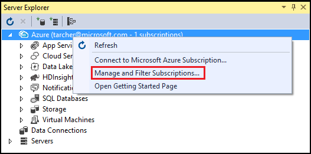
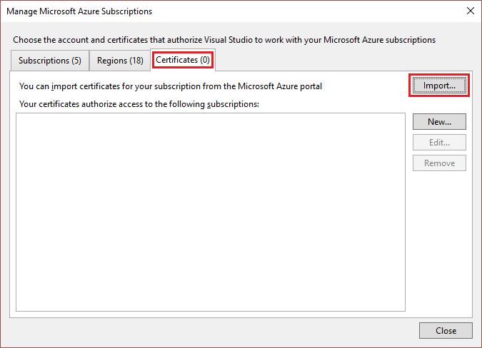
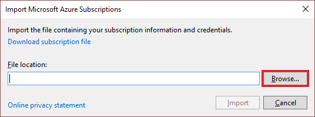
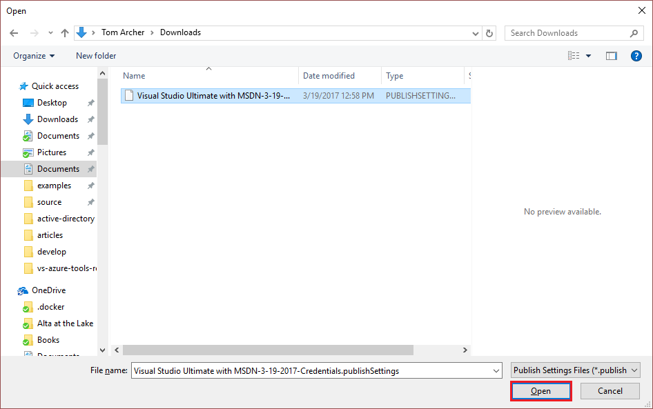
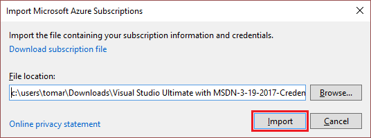

# Accessing private Azure clouds with Visual Studio

By default, Visual Studio supports Azure cloud REST endpoints. In this article, you learn how to use your private cloud's certificate to access and interact with the private cloud from Visual Studio.

1. In the Azure portal for the private cloud, download your publish-settings file, or contact your administrator for a publish-settings file. (The file has the extension `.publishsettings`.)

1. In Visual Studio **Server Explorer**, right-click the **Azure** node and select **Manage and Filter Subscriptions**.

    

1. In the **Manage Microsoft Azure Subscriptions** dialog, select the **Certificates** tab, then select **Import**.

    

1. In the **Import Microsoft Azure Subscriptions** dialog, select **Browse**.

    

1. In the **Open** dialog, browse to the directory where you saved the publish-settings file, select the file, and then select **Open**.

    

1. When returned to the **Import Microsoft Azure Subscriptions** dialog, select **Import**.

    

    The certificates are imported from the publish-settings file into Visual Studio, and you can now interact with your private cloud resources.

