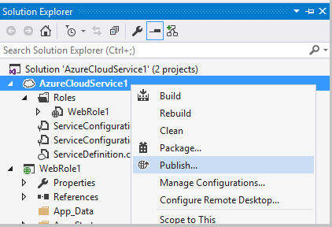
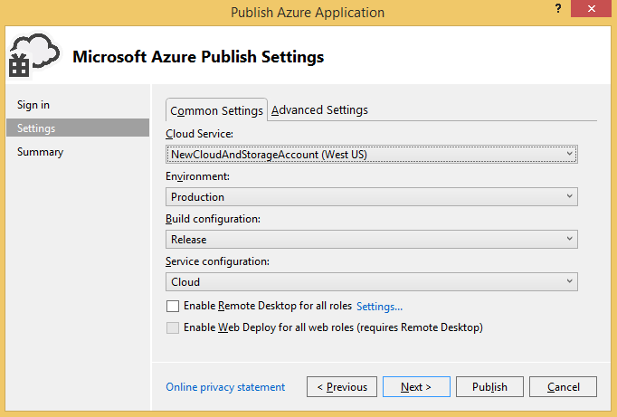

<properties
   pageTitle="Prepare to publish or deploy an Azure application from Visual Studio | Microsoft Azure"
   description="Learn the procedures to set up cloud and storage account services and configure your Azure application."
   services="visual-studio-online"
   documentationCenter="na"
   authors="TomArcher"
   manager="douge"
   editor="" />
<tags
   ms.service="multiple"
   ms.devlang="dotnet"
   ms.topic="article"
   ms.tgt_pltfrm="na"
   ms.workload="multiple"
   ms.date="05/08/2016"
   ms.author="tarcher" />

# Prepare to Publish or Deploy an Azure Application from Visual Studio

## Overview

Before you can publish a cloud service project, you must set up the following services:

- A **cloud service** to run your roles in the Azure environment

- A **storage account** that provides access to the Blob, Queue, and Table services.

Use the following procedures to set up these services and configure your application

## Create a cloud service

To publish a cloud service to Azure, you must first create a cloud service, which runs your roles in the Azure environment. You can create a cloud service in the [Azure classic portal](http://go.microsoft.com/fwlink/?LinkID=213885), as described in the section **To create a cloud service by using the Azure classic portal**, later in this topic. You can also create a cloud service in Visual Studio by using the publishing wizard.

### To create a cloud service by using Visual Studio

1. Open the shortcut menu for the Azure project, and choose **Publish**.

    

1. If you haven't signed in, sign in with your username and password for the Microsoft account or organizational account that's associated with your Azure subscription.

1. Choose the **Next** button to advance to the **Settings** page.

    

1. In the **Cloud Services** list, choose **Create New**. The **Create Azure Services** dialog appears.

1. Enter the name of your cloud service. The name forms part of the URL for your service and therefore must be globally unique. The name is not case-sensitive.

### To create a cloud service by using the Azure classic portal

1. Sign in to the [Azure classic portal](http://go.microsoft.com/fwlink/?LinkId=253103) on the Microsoft website.

1. (optional) To display a list of cloud services that you've already created, choose the Cloud Services link on the left side of the page.

1. Choose the **+** icon in the lower-left corner, and then choose **Cloud Service** on the menu that appears. Another screen with two options, **Quick Create** and **Custom Create**, appears. If you choose **Quick Create**, you can create a cloud service just by specifying its URL and the region where it will be physically hosted. If you choose **Custom Create**, you can immediately publish a cloud service by specifying a package (.cspkg file), a configuration (.cscfg) file, and a certificate. Custom Create isn’t required if you intend to publish your cloud service by using the **Publish** command in an Azure project. The **Publish** command is available on the shortcut menu for an Azure project.

1. Choose **Quick Create** to later publish your cloud service by using Visual Studio.

1. Specify a name for your cloud service.The complete URL appears next to the name.

1. In the list, choose the region where most of your users are located.

1. At the bottom of the window, choose the **Create Cloud Service** link.

## Create a storage account

A storage account provides access to the Blob, Queue, and Table services. You can create a storage account by using Visual Studio or the [Azure classic portal](http://go.microsoft.com/fwlink/?LinkId=253103).

### To create a storage account by using Visual Studio

1. In **Solution Explorer**, open the shortcut menu for the **Storage** node, and then choose **Create Storage Account**.

    

1. Select or enter the following information for the new storage account in the **Create Storage Account** dialog box.
    - The Azure subscription to which you want to add the storage account.
    - The name you want to use for the new storage account.
    - The region or affinity group (such as West US or East Asia).
    - The type of replication you want to use for the storage account, such as Geo-Redundant.

1. When you’re done, choose **Create**.The new storage account appears in the **Storage** list in **Server Explorer**.

### To create a storage account by using the Azure classic portal

1. Sign in to the [Azure classic portal](http://go.microsoft.com/fwlink/?LinkId=253103) on the Microsoft website.

1. (Optional) To view your storage accounts, choose the **Storage** link in the panel on the left side of the page.

1. In the lower-left corner of the page, choose the **+** icon.

1. In the menu that appears, choose **Storage**, and then choose **Quick Create**.

1. Give the storage account a name that will result in a unique url.

1. Give your cloud service a name. The complete URL appears next to the name.

1. In the list of regions, choose a region where most of your users are located.

1. Specify whether you want to enable geo-replication. If you enable geo-replication, your data will be saved in multiple physical locations to reduce the chance of loss. This feature makes storage more expensive, but you can reduce the cost by enabling geo-location when you create the storage account instead of adding the feature later. For more information, see [Geo-replication](http://go.microsoft.com/fwlink/?LinkId=253108).

1. At the bottom of the window, choose the **Create Storage Account** link.

After you create your storage account, you will see the URLs that you can use to access resources in each of the Azure storage services, and also the primary and secondary access keys for your account. You use these keys to authenticate requests made against the storage services.

>[AZURE.NOTE] The secondary access key provides the same access to your storage account as the primary access key and is generated as a backup should your primary access key be compromised. Additionally, it is recommended that you regenerate your access keys on a regular basis. You can modify a connection string setting to use the secondary key while you regenerate the primary key, then you can modify it to use the regenerated primary key while you regenerate the secondary key.

## Configure your app to use services provided by the storage account

You must configure any role that accesses storage services to use the Azure storage services that you have created. To do this, you can use multiple service configurations for your Azure project. By default, two are created in your Azure project. By using multiple service configurations, you can use the same connection string in your code, but have a different value for a connection string in each service configuration. For example, you can use one service configuration to run and debug your application locally using the Azure storage emulator and a different service configuration to publish your application to Azure. For more information about service configurations, see [Configuring Your Azure Project Using Multiple Service Configurations](vs-azure-tools-multiple-services-project-configurations.md).

### To configure your application to use services that the storage account provides

1. In Visual Studio open your Azure solution. In Solution Explorer, open the shortcut menu for each role in your Azure project that accesses the storage services and choose **Properties**. A page with the name of the role is displayed in the Visual Studio editor. The page displays the fields for the **Configuration** tab.

1. In the property pages for the role, choose **Settings**.

1. In the **Service Configuration** list, choose the name of the service configuration that you want to edit. If you want to make changes to all of the service configurations for this role, you can choose **All Configurations**.  For more information about how to update service configurations, see the section **Manage Connection Strings for Storage Accounts** in the topic [Configure the Roles for an Azure Cloud Service with Visual Studio](vs-azure-tools-configure-roles-for-cloud-service.md).

1. To modify any connection string settings, choose the **…** button next to the setting. The **Create Storage Connection String** dialog box appears.

1. Under **Connect using**, choose the **Your subscription** option.

1. In the **Subscription** list, choose your subscription. If the list of subscriptions doesn't include the one that you want, choose the **Download Publish Settings** link.

1. In the **Account name** list, choose your storage account name. Azure Tools obtains storage account credentials automatically by using the .publishsettings file. To specify your storage account credentials manually, choose the **Manually entered credentials** option, and then continue with this procedure. You can get your storage account name and primary key from the [Azure classic portal](http://go.microsoft.com/fwlink/p/?LinkID=213885). If you don’t want to specify your storage account settings manually, choose the **OK** button to close the dialog box.

1. Choose the **Enter storage account** credentials link.

1. In the **Account name** box, enter the name of your storage account.

    >[AZURE.NOTE] Log into the [Azure classic portal](http://go.microsoft.com/fwlink/?LinkID=213885), and then choose the **Storage** button. The portal shows a list of storage accounts. If you choose an account, a page for it opens. You can copy the name of the storage account from this page. If you are using a previous version of the classic portal, the name of your storage account appears in the **Storage Accounts** view. To copy this name, highlight it in the **Properties** window of this view, and then choose the Ctrl-C keys. To paste the name into Visual Studio, choose the **Account name** text box, and then choose the Ctrl+V keys.

1. In the **Account key** box, enter your primary key, or copy and paste it from the [Azure classic portal](http://go.microsoft.com/fwlink/?LinkID=213885).
    To copy this key:

    1. At the bottom of the page for the appropriate storage account, choose the **Manage Keys** button.

    1. On the **Manage Keys Access** page, select the text of the primary access key, and then choose the Ctrl+C keys.

    1. In Azure Tools, paste the key into the **Account key** box.

    1. You must select one of the following options to determine how the service will access the storage account:
        - **Use HTTP**. This is the standard option. For example, `http://<account name>.blob.core.windows.net`.
        - **Use HTTPS** for a secure connection. For example, `https://<accountname>.blob.core.windows.net`.
        - **Specify custom endpoints** for each of the three services. You can then type these endpoints into the field for the specific service.

        >[AZURE.NOTE] If you create custom endpoints, you can create a more complex connection string. When you use this string format, you can specify storage service endpoints that include a custom domain name that you have registered for your storage account with the Blob service. Also you can grant access only to blob resources in a single container through a shared access signature. For more information about how to create custom endpoints, see [Configure Azure Storage Connection Strings](storage-configure-connection-string.md).

1. To save these connection string changes, choose the **OK** button and then choose the **Save** button on the toolbar. After you save these changes, you can get the value of this connection string in your code by using [GetConfigurationSettingValue](https://msdn.microsoft.com/library/azure/microsoft.windowsazure.serviceruntime.roleenvironment.getconfigurationsettingvalue.aspx). When you publish your application to Azure, choose the service configuration that contains the Azure storage account for the connection string. After your application is published, verify that the application works as expected against the Azure storage services

## Next steps

To learn more about publishing apps to Azure from Visual Studio, see [Publishing a Cloud Service using the Azure Tools](vs-azure-tools-publishing-a-cloud-service.md).
