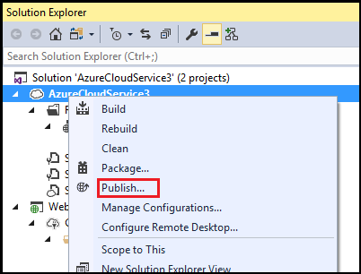
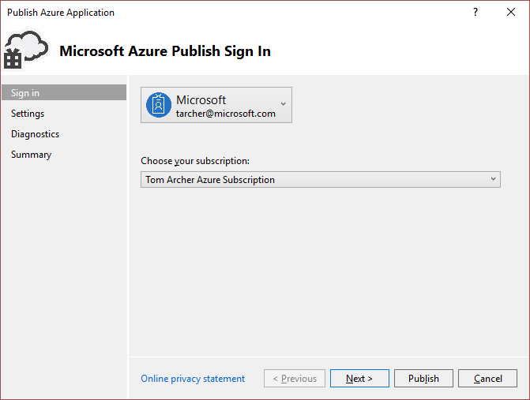
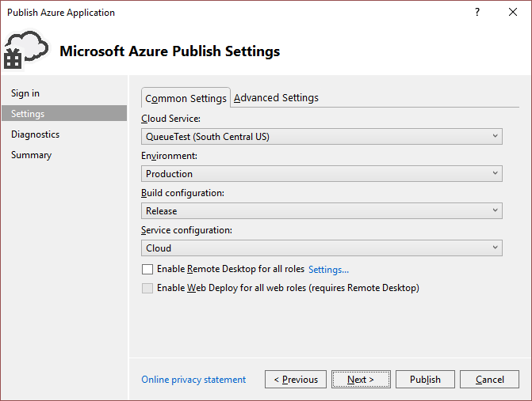
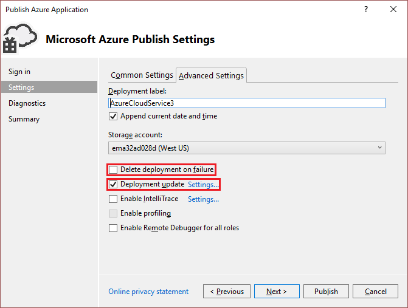
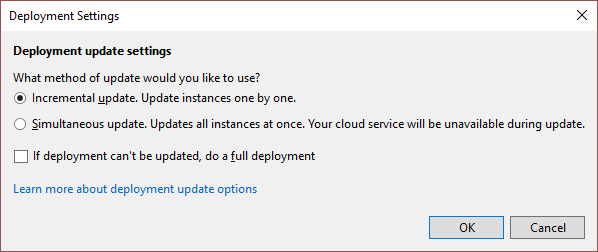
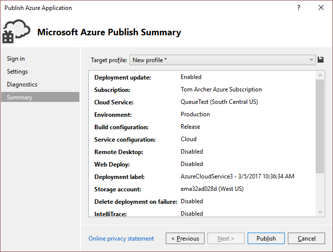

# Retain a constant virtual IP address for an Azure cloud service
When you update a cloud service that's hosted in Azure, you might need to ensure that the virtual IP address (VIP) of the service doesn't change. Many domain management services use the Domain Name System (DNS) for registering domain names. DNS works only if the VIP remains the same. You can use the **Publish Wizard** in Azure Tools to ensure that the VIP of your cloud service doesn’t change when you update it. For more information about how to use DNS domain management for cloud services, see [Configuring a custom domain name for an Azure cloud service](cloud-services/cloud-services-custom-domain-name-portal.md).

## Publish a cloud service without changing its VIP
The VIP of a cloud service is allocated when you first deploy it to Azure in a particular environment, such as the production environment. The VIP changes only if you delete the deployment explicitly or the deployment is implicitly deleted by the deployment update process. To retain the VIP, you must not delete your deployment, and you must make sure that Visual Studio doesn’t delete your deployment automatically. 

You can specify deployment settings in the **Publish Wizard**, which supports several deployment options. You can specify a fresh deployment or an update deployment, which can be incremental or simultaneous. Both kinds of update deployment retain the VIP. For definitions of these different types of deployment, see [Publish Azure Application Wizard](vs-azure-tools-publish-azure-application-wizard.md). In addition, you can control whether the previous deployment of a cloud service is deleted if an error occurs. If you don't set that option correctly, the VIP might change unexpectedly.

## Update a cloud service without changing its VIP
1. Create or open an Azure cloud service project in Visual Studio. 

2. In **Solution Explorer**, right-click the project. On the shortcut menu, select **Publish**.

	

3. In the **Publish Azure Application** dialog box, select the Azure subscription to which you want to deploy. Sign in if necessary, and select **Next**.

	

4. On the **Common Settings** tab, verify that the name of the cloud service to which you’re deploying, the **Environment**, the **Build configuration**, and the **Service configuration** are all correct.

	

5. On the **Advanced Settings** tab, verify that the **Deployment label** and the **Storage account** are correct. Verify that the **Delete deployment on failure** check box is cleared, and verify that the **Deployment update** check box is selected. By clearing the **Delete deployment on failure** check box, you ensure that your VIP isn't lost if an error occurs during deployment. By selecting the **Deployment update** check box, you ensure that your deployment isn't deleted and your VIP isn't lost when you republish your application. 

	

6. To further specify how you want the roles to be updated, select **Settings** next to **Deployment update**. Select either **Incremental update** or **Simultaneous update**, and select **OK**. Choose **Incremental update** to update each instance of your application, one after another, so that the application is always available. Choose **Simultaneous update** to update all instances of your application at the same time. Simultaneous updating is faster, but your service might not be available during the update process. When you are finished, select **Next**.

	

7. In the **Publish Azure Application** dialog box, select **Next** until the **Summary** page is displayed. Verify your settings, and then select **Publish**.
   
	

## Next steps
- [Using the Visual Studio Publish Azure Application Wizard](vs-azure-tools-publish-azure-application-wizard.md)

