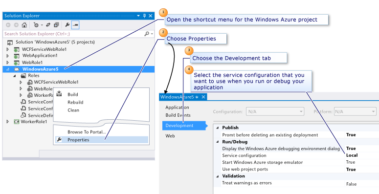

<properties
   pageTitle="Configure an Azure Cloud Service Project with Visual Studio | Microsoft Azure"
   description="Learn how to configure an Azure cloud service project in Visual Studio, depending on your requirements for that project."
   services="visual-studio-online"
   documentationCenter="na"
   authors="TomArcher"
   manager="douge"
   editor="" />
<tags
   ms.service="multiple"
   ms.devlang="dotnet"
   ms.topic="article"
   ms.tgt_pltfrm="na"
   ms.workload="multiple"
   ms.date="04/18/2016"
   ms.author="tarcher" />

# Configure an Azure Cloud Service Project with Visual Studio

You can configure an Azure cloud service project, depending on your requirements for that project. You can set properties for the project for the following categories:

- **Publish a cloud service to Azure**

  You can set a property to make sure that an existing cloud service deployed to Azure is not accidentally deleted.

- **Run or debug a cloud service on the local computer**

  You can select a service configuration to use and indicate whether you want to start the Azure storage emulator.

- **Validate a cloud service package when it is created**

  You can decide to treat any warnings as errors so that you can make sure that the cloud service package will deploy without any issues. This reduces your wait time if you deploy and then discover that a failure occurred.

The following illustration shows how to select a configuration to use when you run or debug your cloud service locally. You can set any of the project properties that you require from this window, as shown in the illustration.

## To configure an Azure cloud service project

1. To configure a cloud service project from **Solution Explorer**, open the shortcut menu for the cloud service project and then choose **Properties**.

  A page with the name of the cloud service project appears in the Visual Studio editor.

1. Choose the **Development** tab.

1. To make sure that you don't accidentally delete an existing deployment in Azure, in the prompt before deleting an existing deployment list, choose **True**.

1. To select the service configuration that you want to use when you run or debug your cloud service locally, in the **Service configuration** list choose the service configuration.

  >[AZURE.NOTE] If you want to create a service configuration to use, see How to: Manage Service Configurations and Profiles. If you want to modify a service configuration for a role, see [How to configure the roles for an Azure cloud service with Visual Studio](vs-azure-tools-configure-roles-for-cloud-service.md).

1. To start the Azure storage emulator when you run or debug your cloud service locally, in the **Start Azure storage emulator**, choose **True**.

1. To make sure that you cannot publish if there are package validation errors, in **Treat warnings as errors**, choose **True**.

1. To make sure that your web role uses the same port each time it starts locally in IIS Express, in **Use web project ports**, choose **True**. To use a specific port for a particular web project, open the shortcut menu for the web project, choose the **Properties** tab, choose the **Web** tab, and change the port number in the **Project Url** setting in the **IIS Express** section. For example, enter `http://localhost:14020` as the project URL.

1. To save any changes that you have made to the properties of the cloud service project, choose the **Save** button on the toolbar.

## Next steps

To learn more about how to configure Azure cloud service projects in Visual Studio, see [Configuring Your Azure project using multiple service configurations](vs-azure-tools-multiple-services-project-configurations.md).
