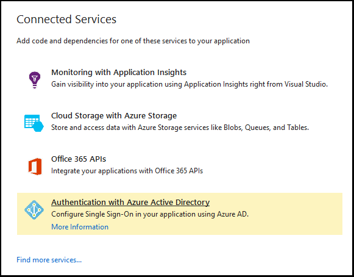
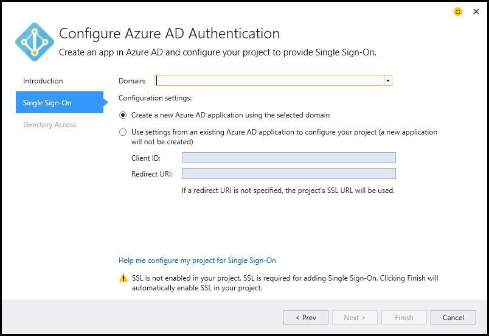
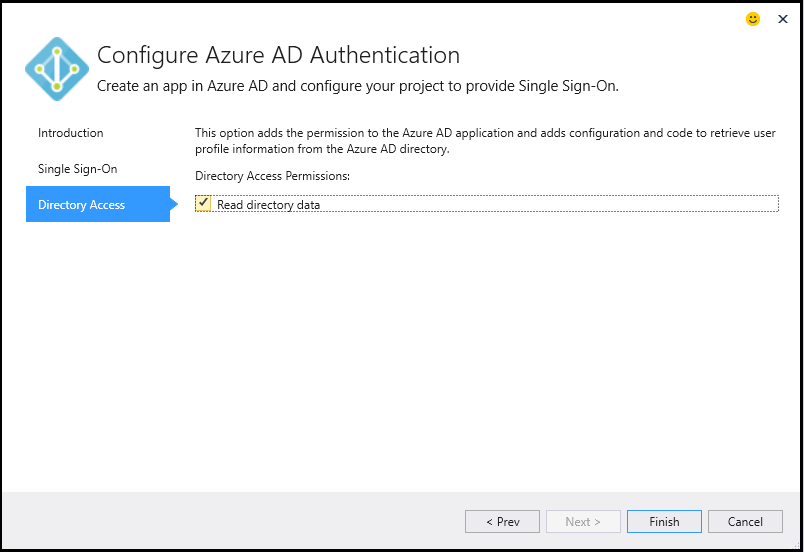

<properties 
   pageTitle="Adding an Azure Active Directory by using Connected Services in Visual Studio | Microsoft Azure"
   description="Add an Azure Active Directory by using the Visual Studio Add Connected Services dialog box"
   services="visual-studio-online"
   documentationCenter="na"
   authors="TomArcher"
   manager="douge"
   editor="" />
<tags 
   ms.service="active-directory"
   ms.devlang="multiple"
   ms.topic="article"
   ms.tgt_pltfrm="na"
   ms.workload="na"
   ms.date="05/08/2016"
   ms.author="tarcher" />

# Adding an Azure Active Directory by using Connected Services in Visual Studio 

##Overview
By using Azure Active Directory (Azure AD), you can support Single Sign-On (SSO) for ASP.NET MVC web applications, or AD Authentication in Web API services. With Azure AD Authentication, your users can use their accounts from Azure AD to connect to your web applications. The advantages of Azure AD Authentication with Web API include enhanced data security when exposing an API from a web application. With Azure AD, you do not have to manage a separate authentication system with its own account and user management.

## Supported Project Types

You can use the Connected Services dialog to connect to Azure AD in the following project types.

- ASP.NET MVC Projects

- ASP.NET Web API Projects

### Connect to Azure AD using the Connected Services dialog

1. Make sure you have an Azure account. If you don't have an Azure account, you can sign up for a [free trial](http://go.microsoft.com/fwlink/?LinkId=518146).

1. In Visual Studio, open the shortcut menu of the **References** node in your project and choose **Add Connected Services**.
1. Select **Azure AD Authentication** and then choose **Configure**.

    

1. On the first page of the **Configure Azure AD Authentication**, check **Configure Single Sign-on using Azure AD**.

    If your project is configured with another authentication configuration, the wizard warns you that continuing will disable the previous configuration.

    

1.  On the second page, select a domain from the **Domain** drop-down list. The list of domains contains all domains accessible by the accounts listed in the Account Settings dialog. As an alternative, you can enter a domain name if you don’t find the one you’re looking for, such as mydomain.onmicrosoft.com. You can choose the option to create a new Azure AD app or use the settings from an existing Azure AD app. 

    

1. On the third page of the wizard, make sure that **Read directory data** is checked. The wizard will fill in the **Client secret**. 

    

1. Choose the **Finish** button. The dialog adds the necessary configuration code and references to enable your project for Azure AD authentication. You can see the AD domain on the [Azure portal](http://go.microsoft.com/fwlink/p/?LinkID=525040).

1. Review the Getting Started page that appears in your browser for ideas on next steps, and the What Happened page to see how your project was modified. If you want to check that everything worked, open one of the modified configuration files and verify that the settings mentioned in What Happened are there. For example, the main web.config in an ASP.NET MVC project will have these settings added:

        <appSettings> 
            <add key="ida:ClientId" value="ClientId from the new Azure AD App" />
            <add key="ida:AADInstance" value="https://login.windows.net/" />
            <add key="ida:Domain" value="Your selected domain" />
            <add key="ida:TenantId" value="The Id of your selected Azure AD Tenant" />
            <add key="ida:PostLogoutRedirectUri" value="The default redirect URI from the project" />
        </appSettings>

## How your project is modified

When you run the wizard, Visual Studio adds Azure AD and associated references to your project. Configuration files and code files in your project are also modified to add support for Azure AD. The specific modifications that Visual Studio makes depend on the project type. For detailed information about how ASP.NET MVC projects are modified, see [What happened– MVC Projects](http://go.microsoft.com/fwlink/p/?LinkID=513809). For Web API projects, see [What happened – Web API Projects](http://go.microsoft.com/fwlink/p/?LinkId=513810).

##Next steps

Ask questions and get help.

 - [MSDN Forum: Azure AD](https://social.msdn.microsoft.com/forums/azure/home?forum=WindowsAzureAD)

 - [Azure AD Documentation](https://azure.microsoft.com/documentation/services/active-directory/)

 - [Blog Post: Intro to Azure AD](http://blogs.msdn.com/b/brunoterkaly/archive/2014/03/03/introduction-to-windows-azure-active-directory.aspx)

