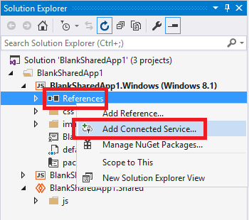
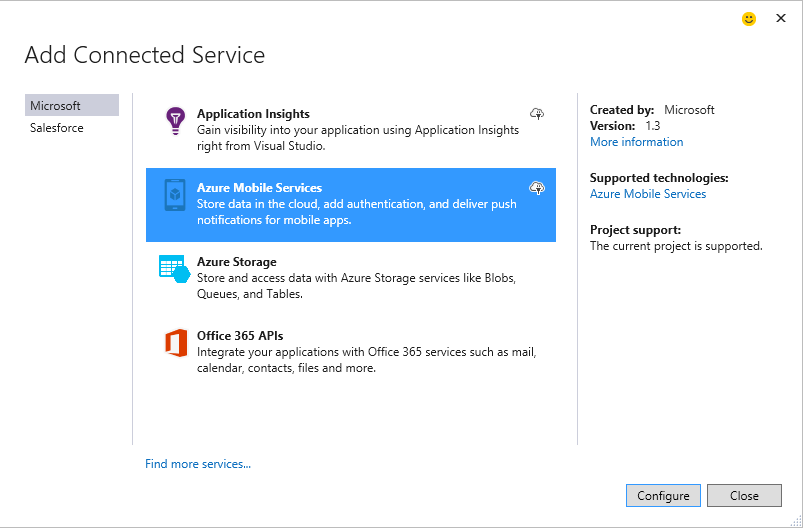
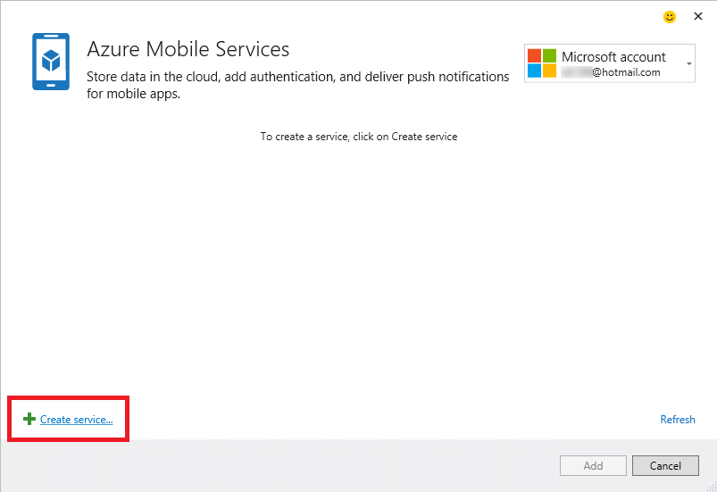
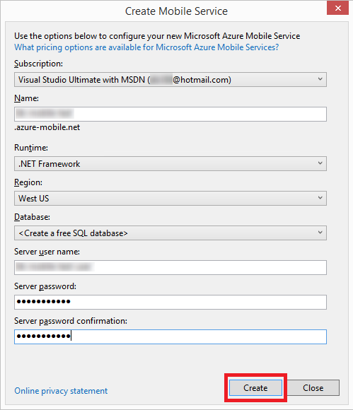

# Adding Mobile Services by using Visual Studio Connected Services
With Visual Studio 2015, you can connect to Azure Mobile Services using the **Add Connected Service** dialog. You can connect from any C# client app, any JavaScript app, or cross-platform Cordova app. Once you connect, you can create and access data, create custom APIs and scheduled jobs, or add support for push notifications.  The connected services operation adds all appropriate references and connection code. You can also take advantage of built-in support for authentication with a variety of popular identity schemes, such as Azure AD, Facebook, Twitter, and Microsoft Accounts.

## Supported Project Types
> [!NOTE]
> In Visual Studio 2015, adding Azure Mobile Services to a Windows Universal (Windows 10) projects by using the Add Connected Services dialog is not supported. You can add Azure Mobile Services by installing the appropriate packages using the NuGet Package Manager for your project.
> 
> 

You can use the Connected Services dialog to connect to Azure Mobile Services in the following project types.

* .NET Windows 8.1 Store, Phone, and Universal App projects
* JavaScript Windows 8.1 Store, Phone, and Universal App projects
* Projects created using Visual Studio Tools for Apache Cordova

## Connect to Azure Mobile Services using the Add Connected Services dialog
1. Make sure you have an Azure account. If you don't have an Azure account, you can sign up for a [free trial](http://go.microsoft.com/fwlink/?LinkId=518146).
2. Open the **Add Connected Services** dialog box.
   
   * For .NET apps, open your project in Visual Studio, open the context menu for the **References** node in Solution Explorer, and then choose **Add Connected Service**
     
        
   * For Apache Cordova app projects, open your project in Visual Studio, open the context menu for the project node in Solution Explorer, and then choose **Add Connected Service**.
3. In the **Add Connected Service** dialog box, choose **Azure Mobile Services**, and then choose the **Configure** button. You may be prompted to log into Azure if you haven't already done so.
   
    
4. In the **Azure Mobile Services** dialog box, choose an existing mobile service if you have one. If you need to create a new Azure mobile service, follow the procedure below to do so. Otherwise, skip to the next step.
   
    To create a new mobile service account:
   
   1. choose the **Create Service **link at the bottom of the dialog box.
       
   2. On the **Create Mobile Service** dialog box, you can choose a JavaScript backend mobile service, or a .NET backend mobile service from the **Runtime** drop-down list. 
      
       
      
       A JavaScript backend service is simple and powerful. If you create a JavaScript backend mobile service, the server-side JavaScript code is stored in the cloud, but you can edit server scripts by using Server Explorer, or the Azure management portal. 
      
       A .NET backend mobile service gives you the full power and flexibility of Web API and Entity Framework. If you create a .NET backend mobile service, a project is created for you and added to your solution. 
   3. Choose the **Region** where you want the mobile service, and then enter a user name and password for the server.
   4. After you've entered all the required information, choose the **Create** button to create the mobile service.
   5. The new mobile service should appear in the service list on the **Azure Mobile Services** dialog box. Choose the new mobile service in the list and then choose the **Add** button to add the service to your project.
5. Review the getting started page that appears and find out how your project was modified. A Getting Started page appears in your browser whenever you add a connected service. You can review the suggested next steps and code examples, or switch to the What Happened page to see what references were added to your project, and how your code and configuration files were modified.
6. Using the code samples as a guide, start writing code to access your mobile service!

## How your project is modified
How Visual Studio modifies your project depends on the project type. For C# client apps, see [What happend – C# projects](http://go.microsoft.com/fwlink/p/?LinkId=513119). For JavaScript client apps, see [What happened – JavaScript projects](http://go.microsoft.com/fwlink/p/?LinkId=513120). For Cordova apps, see [What happend – Cordova projects](http://go.microsoft.com/fwlink/p/?LinkId=513116).

## Next steps
Ask questions and get help: 

* [MSDN Forum: Azure Mobile Services](https://social.msdn.microsoft.com/forums/azure/home?forum=azuremobile)
* [Azure Mobile Services at the Microsoft Azure Team Blog](https://azure.microsoft.com/blog/topics/mobile/)
* [Azure Mobile Services at azure.microsoft.com](https://azure.microsoft.com/services/mobile-services/)
* [Azure Mobile Services Documentation at azure.microsoft.com](https://azure.microsoft.com/documentation/services/mobile-services/)

