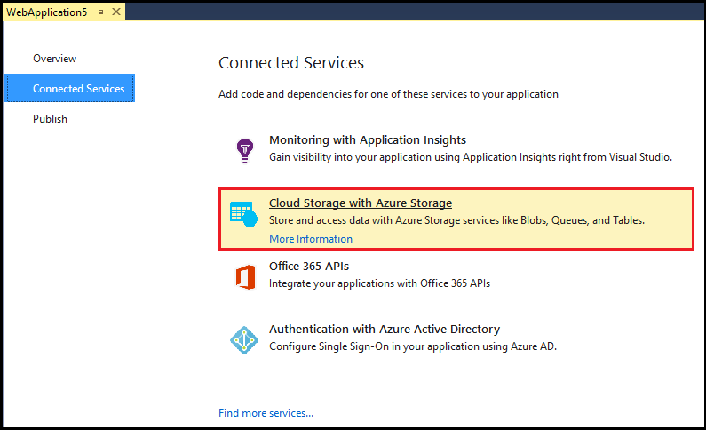
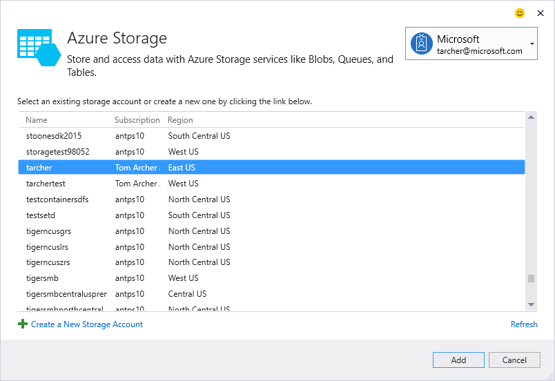

# Adding Azure storage by using Visual Studio Connected Services
With Visual Studio, you can connect any of the following to Azure Storage by using the **Add Connected Services** dialog:

- C# cloud service
- .NET backend mobile service
- ASP.NET website or service
- ASP.NET Core service
- Azure WebJob service 

The connected service functionality adds all the needed references and connection code to your project, and modifies your configuration files appropriately. 

After completion, the **Add Connected Services** dialog automatically displays documentation detailing the steps required to start working with blob storage, queues, and tables.

## Connect to Azure Storage using the Connected Services dialog
1. Open your project in Visual Studio

1. In **Solution Explorer**, right-click the **Connected Services** node, and, from the context menu, and select **Add Connected Service**.
   
    

1. In the **Connected Services** page, select **Cloud Storage with Azure Storage**.
   
    

1. In the **Azure Storage** dialog, select an existing storage account, and select **Add**.
   
	If you need to create a storage account, go to the next step. Otherwise, skip to step 6.
	
	

1. To create a storage account: 
   
   1. Select **Create a New Storage Account** at the bottom of the dialog.

   1. Fill out the **Create Storage Account** dialog, and select **Create**.
      
       
      
   1. When the **Azure Storage** dialog is displayed, the new storage account appears in the list. Select the new storage account in the list, and select **Add**.

1. The storage connected service appears under the **Service References** node of your project.
   
## How your project is modified
When you finish the dialog, Visual Studio adds references and modifies certain configuration files. The specific changes depend on the project type: 

- ASP.NET project - [What happened – ASP.NET Projects](http://go.microsoft.com/fwlink/p/?LinkId=513126)
- ASP.NET Core project - [What happened – ASP.NET 5 Projects](http://go.microsoft.com/fwlink/p/?LinkId=513124) 
- Cloud service project (web roles and worker roles) - [What happened – Cloud Service projects](http://go.microsoft.com/fwlink/p/?LinkId=516965)
- WebJob project - [What happened - WebJob projects](visual-studio/vs-storage-webjobs-what-happened.md)

## Next steps
- [MSDN Forum: Azure Storage](https://social.msdn.microsoft.com/forums/azure/home?forum=windowsazuredata)
- [Microsoft Azure Storage Team Blog](http://blogs.msdn.com/b/windowsazurestorage/)
- [Azure Storage documentation](https://docs.microsoft.com/azure/storage/)
