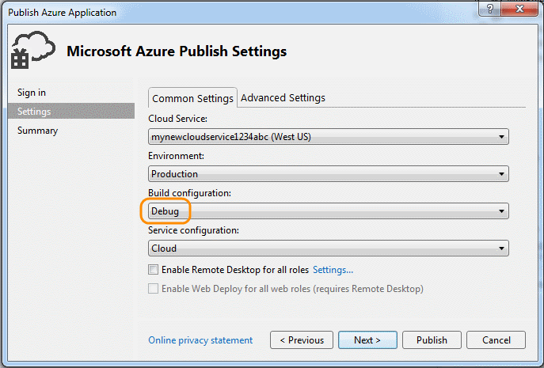
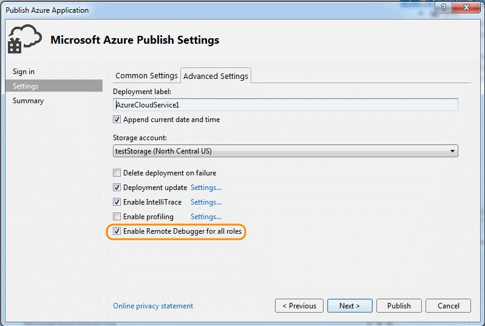
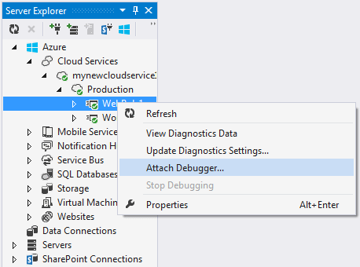
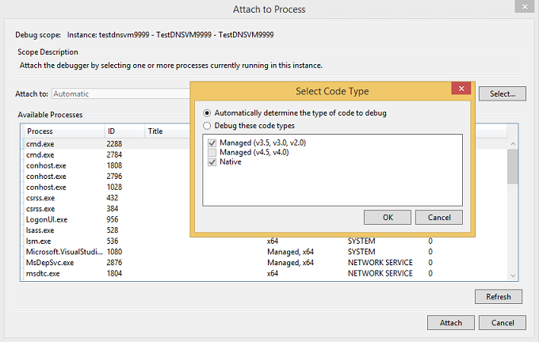
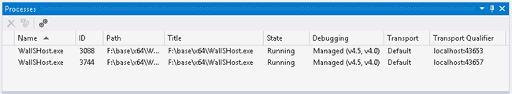
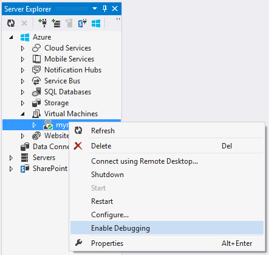
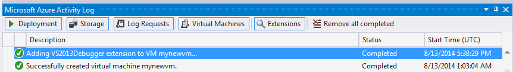
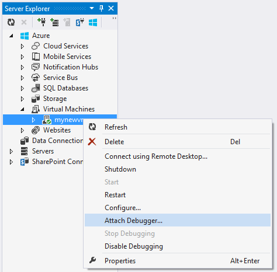
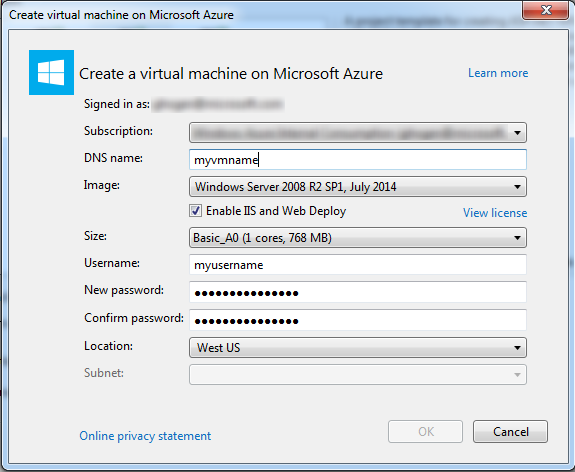
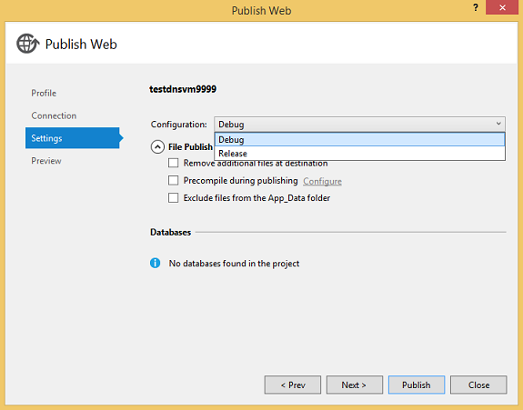

<properties 
	pageTitle="Debugging an Azure cloud service or virtual machine in Visual Studio | Microsoft Azure"
	description="Debugging a Cloud Service or Virtual Machine in Visual Studio"
	services="visual-studio-online"
	documentationCenter="na"
	authors="TomArcher"
	manager="douge"
	editor="" />
<tags 
	ms.service="visual-studio-online"
	ms.devlang="multiple"
	ms.topic="article"
	ms.tgt_pltfrm="multiple"
	ms.workload="na"
	ms.date="06/01/2016"
	ms.author="tarcher" />

# Debugging an Azure cloud service or virtual machine in Visual Studio

Visual Studio gives you different options for debugging Azure cloud services and virtual machines.

## Debug your cloud service on your local computer

You can save time and money by using the Azure compute emulator to debug your cloud service on a local machine. By debugging a service locally before you deploy it, you can improve reliability and performance without paying for compute time. However, some errors might occur only when you run a cloud service in Azure itself. You can debug these errors if you enable remote debugging when you publish your service and then attach the debugger to a role instance.

The emulator simulates the Azure Compute service and runs in your local environment so that you can test and debug your cloud service before you deploy it. The emulator handles the lifecycle of your role instances and provides access to simulated resources, such as local storage. When you debug or run your service from Visual Studio, it automatically starts the emulator as a background application and then deploys your service to the emulator. You can use the emulator to view your service when it runs in the local environment. You can run the full version or the express version of the emulator. (Starting with Azure 2.3, the express version of the emulator is the default.) See [Using Emulator Express to Run and Debug a Cloud Service Locally](https://msdn.microsoft.com/library/dn339018.aspx).

### To debug your cloud service on your local computer

1. On the menu bar, choose **Debug**, **Start Debugging** to run your Azure cloud service project. As an alternative, you can press F5. You’ll see a message that the Compute Emulator is starting. When the emulator starts, the system tray icon confirms it.

    

1. Display the user interface for the compute emulator by opening the shortcut menu for the Azure icon in the notification area, and then select **Show Compute Emulator UI**.

    The left pane of the UI shows the services that are currently deployed to the compute emulator and the role instances that each service is running. You can choose the service or roles to display lifecycle, logging, and diagnostic information in the right pane. If you put the focus in the top margin of an included window, it expands to fill the right pane.

1. Step through the application by selecting commands on the **Debug** menu and setting breakpoints in your code. As you step through the application in the debugger, the panes are updated with the current status of the application. When you stop debugging, the application deployment is deleted.If your application includes a web role and you've set the Startup action property to start the web browser, Visual Studio starts your web application in the browser.If you change the number of instances of a role in the service configuration, you must stop your cloud service and then restart debugging so that you can debug these new instances of the role.

    **Note:** When you stop running or debugging your service, the local compute emulator and storage emulator aren't stopped. You must stop them explicitly from the notification area.

## Debug a cloud service in Azure

To debug a cloud service from a remote machine, you must enable that functionality explicitly when you deploy your cloud service so that required services (msvsmon.exe, for example) are installed on the virtual machines that run your role instances. If you didn't enable remote debugging when you published the service, you have to republish the service with remote debugging enabled.

If you enable remote debugging for a cloud service, it doesn't exhibit degraded performance or incur additional charges. You shouldn't use remote debugging on a production service, because clients who use the service might be adversely affected.

>[AZURE.NOTE] When you publish a cloud service from Visual Studio, you can enable **IntelliTrace** for any roles in that service that target the .NET Framework 4 or the .NET Framework 4.5. By using **IntelliTrace**, you can examine events that occurred in a role instance in the past and reproduce the context from that time. See [Debugging a published cloud service with IntelliTrace and Visual Studio](http://go.microsoft.com/fwlink/?LinkID=623016) and [Using IntelliTrace](https://msdn.microsoft.com/library/dd264915.aspx).

### To enable remote debugging for a cloud service

1. Open the shortcut menu for the Azure project, and then select **Publish**.

1. Select the **Staging** environment and the **Debug** configuration.

    This is only a guideline. You can opt to run your test environments in a Production environment. However, you may adversely affect users if you enable remote debugging on the Production environment. You can choose the Release configuration, but the Debug configuration makes debugging easier.

    

1. Follow the usual steps, but select the **Enable Remote Debugger for all roles** check box on the **Advanced Settings** tab.

    

### To attach the debugger to a cloud service in Azure

1. In Server Explorer, expand the node for your cloud service.

1. Open the shortcut menu for the role or role instance to which you want to attach, and then select **Attach Debugger**.

    If you debug a role, the Visual Studio debugger attaches to each instance of that role. The debugger will break on a breakpoint for the first role instance that runs that line of code and meets any conditions of that breakpoint. If you debug an instance, the debugger attaches to only that instance and breaks on a breakpoint only when that specific instance runs that line of code and meets the breakpoint's conditions.

    

1. After the debugger attaches to an instance, debug as usual.The debugger automatically attaches to the appropriate host process for your role. Depending on what the role is, the debugger attaches to w3wp.exe, WaWorkerHost.exe, or WaIISHost.exe. To verify the process to which the debugger is attached, expand the instance node in Server Explorer. See [Azure Role Architecture](http://blogs.msdn.com/b/kwill/archive/2011/05/05/windows-azure-role-architecture.aspx) for more information about Azure processes.

    

1. To identify the processes to which the debugger is attached, open the Processes dialog box by, on the menu bar, choosing Debug, Windows, Processes. (Keyboard: Ctrl+Alt+Z)To detach a specific process, open its shortcut menu, and then select **Detach Process**. Or, locate the instance node in Server Explorer, find the process, open its shortcut menu, and then select **Detach Process**.

    

>[AZURE.WARNING] Avoid long stops at breakpoints when remote debugging. Azure treats a process that's stopped for longer than a few minutes as unresponsive and stops sending traffic to that instance. If you stop for too long, msvsmon.exe detaches from the process.

To detach the debugger from all processes in your instance or role, open the shortcut menu for the role or instance that you're debugging, and then select **Detach Debugger**.

## Limitations of remote debugging in Azure

From Azure SDK 2.3, remote debugging has the following limitations.

- With remote debugging enabled, you can't publish a cloud service in which any role has more than 25 instances.

- The debugger uses ports 30400 to 30424, 31400 to 31424 and 32400 to 32424. If you try to use any of these ports, you won't be able to publish your service, and one of the following error messages will appear in the activity log for Azure: 

    - Error validating the .cscfg file against the .csdef file. 
    The reserved port range 'range' for endpoint Microsoft.WindowsAzure.Plugins.RemoteDebugger.Connector of role 'role' overlaps with an already defined port or range.
    - Allocation failed. Please retry later, try reducing the VM size or number of role instances, or try deploying to a different region.

## Debugging Azure virtual machines

You can debug programs that run on Azure virtual machines by using Server Explorer in Visual Studio. When you enable remote debugging on an Azure virtual machine, Azure installs the remote debugging extension on the virtual machine. Then, you can attach to processes on the virtual machine and debug as you normally would.

>[AZURE.NOTE] Virtual machines created through the Azure resource manager stack can be remotely debugged by using Cloud Explorer in Visual Studio 2015. For more information, see [Managing Azure Resources with Cloud Explorer](http://go.microsoft.com/fwlink/?LinkId=623031).

### To debug an Azure virtual machine

1. In Server Explorer, expand the Virtual Machines node and select the node of the virtual machine that you want to debug.

1. Open the context menu and select **Enable Debugging**. When asked if you're sure if you want to enable debugging on the virtual machine, select **Yes**.

    Azure installs the remote debugging extension on the virtual machine to enable debugging.

    

    

1. After the remote debugging extension finishes installing, open the virtual machine's context menu and select **Attach Debugger...**

    Azure gets a list of the processes on the virtual machine and shows them in the Attach to Process dialog box.

    

1. In the **Attach to Process** dialog box, select **Select** to limit the results list to show only the types of code you want to debug. You can debug 32- or 64-bit managed code, native code, or both.

    

1. Select the processes you want to debug on the virtual machine and then select **Attach**. For example, you might choose the w3wp.exe process if you wanted to debug a web app on the virtual machine. See [Debug One or More Processes in Visual Studio](https://msdn.microsoft.com/library/jj919165.aspx) and [Azure Role Architecture](http://blogs.msdn.com/b/kwill/archive/2011/05/05/windows-azure-role-architecture.aspx) for more information.

## Create a web project and a virtual machine for debugging

Before publishing your Azure project, you might find it useful to test it in a contained environment that supports debugging and testing scenarios, and where you can install testing and monitoring programs. One way to do this is to remotely debug your app on a virtual machine.

Visual Studio ASP.NET projects offer an option to create a handy virtual machine that you can use for app testing. The virtual machine includes commonly-needed endpoints such as PowerShell, remote desktop, and WebDeploy.

### To create a web project and a virtual machine for debugging

1. In Visual Studio, create a new ASP.NET Web Application.

1. In the New ASP.NET Project dialog, in the Azure section, choose **Virtual Machine** in the dropdown list box. Leave the **Create remote resources** check box selected. Select **OK** to proceed.

    The **Create virtual machine on Azure** dialog box appears.

    

    **Note:** You'll be asked to sign in to your Azure account if you're not already signed in.

1. Select the various settings for the virtual machine and then select **OK**. See [Virtual Machines]( http://go.microsoft.com/fwlink/?LinkId=623033) for more information.

    The name you enter for DNS name will be the name of the virtual machine. 

    

    Azure creates the virtual machine and then provisions and configures the endpoints, such as Remote Desktop and Web Deploy

1. After the virtual machine is fully configured, select the virtual machine’s node in Server Explorer.

1. Open the context menu and select **Enable Debugging**. When asked if you're sure if you want to enable debugging on the virtual machine, select **Yes**. 

    Azure installs the remote debugging extension to the virtual machine to enable debugging.

    

    

1. Publish your project as outlined in [How to: Deploy a Web Project Using One-Click Publish in Visual Studio](https://msdn.microsoft.com/library/dd465337.aspx). Because you want to debug on the virtual machine, on the **Settings** page of the **Publish Web** wizard, select **Debug** as the configuration. This makes sure that code symbols are available while debugging.

    

1. In the **File Publish Options**, select **Remove additional files at destination** if the project was already deployed at an earlier time.

1. After the project publishes, on the virtual machine's context menu in Server Explorer, select **Attach Debugger...**

    Azure gets a list of the processes on the virtual machine and shows them in the Attach to Process dialog box.

    

1. In the **Attach to Process** dialog box, select **Select** to limit the results list to show only the types of code you want to debug. You can debug 32- or 64-bit managed code, native code, or both.

    

1. Select the processes you want to debug on the virtual machine and then select **Attach**. For example, you might choose the w3wp.exe process if you wanted to debug a web app on the virtual machine. See [Debug One or More Processes in Visual Studio](https://msdn.microsoft.com/library/jj919165.aspx) for more information.

## Next steps

- Use **Intellitrace** to collect a log of calls and events from a release server. See [Debugging a Published Cloud Service with IntelliTrace and Visual Studio](http://go.microsoft.com/fwlink/?LinkID=623016).
- Use **Azure Diagnostics** to log detailed information from code running within roles, whether the roles are running in the development environment or in Azure. See [Collecting logging data by using Azure Diagnostics](http://go.microsoft.com/fwlink/p/?LinkId=400450).
