<properties
   pageTitle="Configuring Diagnostics for Azure Cloud Services and Virtual Machines | Microsoft Azure"
   description="Describes how to configure diagnostics information for debugging Azure cloude services and virtual machines (VMs) in Visual Studio."
   services="visual-studio-online"
   documentationCenter="na"
   authors="TomArcher"
   manager="douge"
   editor="" />
<tags
   ms.service="multiple"
   ms.devlang="dotnet"
   ms.topic="article"
   ms.tgt_pltfrm="na"
   ms.workload="multiple"
   ms.date="05/08/2016"
   ms.author="tarcher" />

# Configuring Diagnostics for Azure Cloud Services and Virtual Machines

When you need to troubleshoot an Azure cloud service or Azure virtual machine, you can configure Azure diagnostics more easily by using Visual Studio. Azure diagnostics captures system data and logging data on the virtual machines and virtual machine instances that run your cloud service and transfers that data into a storage account of your choice. See [Enable diagnostics logging for web apps in Azure App Service](./app-service-web/web-sites-enable-diagnostic-log.md) for more information about diagnostics logging in Azure.

This topic shows you how to enable and configure Azure diagnostics in Visual Studio, both before and after deployment, as well as in Azure virtual machines. It also shows you how to select the types of diagnostics information to collect and how to view the information after it's collected.

You can configure Azure Diagnostics in the following ways:

- You can change diagnostics configuration settings through the **Diagnostics Configuration** dialog box in Visual Studio. The settings are saved in a file called diagnostics.wadcfgx (diagnostics.wadcfg in Azure SDK 2.4 or earlier). Alternatively, you can directly modify the configuration file. If you manually update the file, the configuration changes will take effect the next time you deploy the cloud service to Azure or run the service in the emulator.

- Use **Cloud Explorer** or **Server Explorer** in Visual Studio to change the diagnostics settings for a running cloud service or virtual machine.

## Azure 2.6 diagnostics changes

For Azure SDK 2.6 projects in Visual Studio, the following changes were made. (These changes also apply to later versions of Azure SDK.)

- The local emulator now supports diagnostics. This means you can collect diagnostics data and ensure your application is creating the right traces while you're developing and testing in Visual Studio. The connection string `UseDevelopmentStorage=true` enables diagnostics data collection while you're running your cloud service project in Visual Studio by using the Azure storage emulator. All diagnostics data is collected in the (Development Storage) storage account.

- The diagnostics storage account connection string (Microsoft.WindowsAzure.Plugins.Diagnostics.ConnectionString) is stored once again in the service configuration (.cscfg) file. In Azure SDK 2.5 the diagnostics storage account was specified in the diagnostics.wadcfgx file.

There are some notable differences between how the connection string worked in Azure SDK 2.4 and earlier and how it works in Azure SDK 2.6 and later.

- In Azure SDK 2.4 and earlier, the connection string was used as a runtime by the diagnostics plugin to get the storage account information for transferring diagnostics logs.

- In Azure SDK 2.6 and later, the diagnostics connection string is used by Visual Studio to configure the diagnostics extension with the appropriate storage account information during publishing. The connection string lets you define different storage accounts for different service configurations that Visual Studio will use when publishing. However, because the diagnostics plugin is no longer available (after Azure SDK 2.5), the .cscfg file by itself can't enable the Diagnostics Extension. You have to enable the extension separately through tools such as Visual Studio or PowerShell.

- To simplify the process of configuring the diagnostics extension with PowerShell, the package output from Visual Studio also contains the public configuration XML for the diagnostics extension for each role. Visual Studio uses the diagnostics connection string to populate the storage account information present in the public configuration. The public config files are created in the Extensions folder and follow the pattern PaaSDiagnostics.'<RoleName>'.PubConfig.xml. Any PowerShell based deployments can use this pattern to map each configuration to a Role.

- The connection string in the .cscfg file is also used by the [Azure portal](http://go.microsoft.com/fwlink/p/?LinkID=525040) to access the diagnostics data so it can appear in the **Monitoring** tab. The connection string is needed to configure the service to show verbose monitoring data in the portal.

## Migrating projects to Azure SDK 2.6 and later

When migrating from Azure SDK 2.5 to Azure SDK 2.6 or later, if you had a diagnostics storage account specified in the .wadcfgx file, then it will stay there. To take advantage of the flexibility of using different storage accounts for different storage configurations, you'll have to manually add the connection string to your project.If you're migrating a project from Azure SDK 2.4 or earlier to Azure SDK 2.6, then the diagnostics connection strings are preserved. However, please note the changes in how connection strings are treated in Azure SDK 2.6 as specified in the previous section.

### How Visual Studio determines the diagnostics storage account

- If a diagnostics connection string is specified in the .cscfg file, Visual Studio uses it to configure the diagnostics extension when publishing, and when generating the public configuration xml files during packaging.

- If no diagnostics connection string is specified in the .cscfg file, then Visual Studio falls back to using the storage account specified in the .wadcfgx file to configure the diagnostics extension when publishing, and generating the public configuration xml files when packaging.

- The diagnostics connection string in the .cscfg file takes precedence over the storage account in the .wadcfgx file. If a diagnostics connection string is specified in the .cscfg file, then Visual Studio uses that and ignores the storage account in .wadcfgx.

### What does the "Update development storage connection strings…" checkbox do?

The checkbox for **Update development storage connection strings for Diagnostics and Caching with Microsoft Azure storage account credentials when publishing to Microsoft Azure** gives you a convenient way to update any development storage account connection strings with the Azure storage account specified during publishing.

For example, suppose you select this checkbox and the diagnostics connection string specifies `UseDevelopmentStorage=true`. When you publish the project to Azure, Visual Studio will automatically update the diagnostics connection string with the storage account you specified in the Publish wizard. However, if a real storage account was specified as the diagnostics connection string, then that account is used instead.

## Diagnostics functionality differences between Azure SDK 2.4 and earlier and Azure SDK 2.5 and later

If you're upgrading your project from Azure SDK 2.4 to Azure SDK 2.5 or later, you should bear in mind the following diagnostics functionality differences.

- **Configuration APIs are deprecated** – Programmatic configuration of diagnostics is available in Azure SDK 2.4 or earlier versions, but is deprecated in Azure SDK 2.5 and later. If your diagnostics configuration is currently defined in code, you'll need to reconfigure those settings from scratch in the migrated project in order for diagnostics to keep working. The diagnostics configuration file for Azure SDK 2.4 is diagnostics.wadcfg, and diagnostics.wadcfgx for Azure SDK 2.5 and later.

- **Diagnostics for cloud service applications can only be configured at the role level, not at the instance level.**

- **Every time you deploy your app, the diagnostics configuration is updated** – This can cause parity issues if you change your diagnostics configuration from Server Explorer and then redeploy your app.

- **In Azure SDK 2.5 and later, crash dumps are configured in the diagnostics configuration file, not in code** – If you have crash dumps configured in code, you'll have to manually transfer the configuration from code to the configuration file, because the crash dumps aren't transferred during the migration to Azure SDK 2.6.

## Enable diagnostics in cloud service projects before deploying them

In Visual Studio, you can choose to collect diagnostics data for roles that run in Azure, when you run the service in the emulator before deploying it. All changes to diagnostics settings in Visual Studio are saved in the diagnostics.wadcfgx configuration file. These configuration settings specify the storage account where diagnostics data is saved when you deploy your cloud service.

### To enable diagnostics in Visual Studio before deployment

1. On the shortcut menu for the role that interests you, choose **Properties**, and then choose the **Configuration** tab in the role’s **Properties** window.

1. In the **Diagnostics** section, make sure that the **Enable Diagnostics** check box is selected.

    

1. Choose the ellipsis (…) button to specify the storage account where you want the diagnostics data to be stored.The storage account you choose will be the location where diagnostics data is stored.

    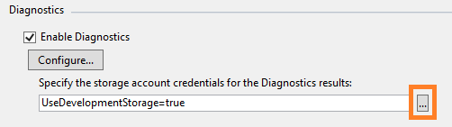

1. In the **Create Storage Connection String** dialog box, specify whether you want to connect using the Azure Storage Emulator, an Azure subscription, or manually entered credentials.

    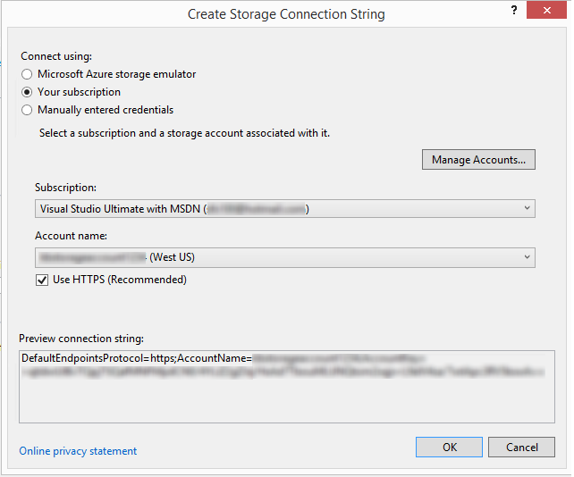

  - If you choose the Microsoft Azure Storage Emulator option, the connection string is set to UseDevelopmentStorage=true.

  - If you choose the Your subscription option, you can choose the Azure subscription you want to use and the account name. You can choose the Manage Accounts button to manage your Azure subscriptions.

  - If you choose the Manually entered credentials option, you're prompted to enter the name and key of the Azure account you want to use.

1. Choose the **Configure** button to view the **Diagnostics configuration** dialog box.Each tab (except for **General** and **Log Directories**) represents a diagnostic data source that you can collect. The default tab, **General**, offers you the following diagnostics data collection options: **Errors only**, **All information**, and **Custom plan**. The default option, **Errors only**, takes the least amount of storage because it doesn’t transfer warnings or tracing messages. The All information option transfers the most information and is, therefore, the most expensive option in terms of storage.

    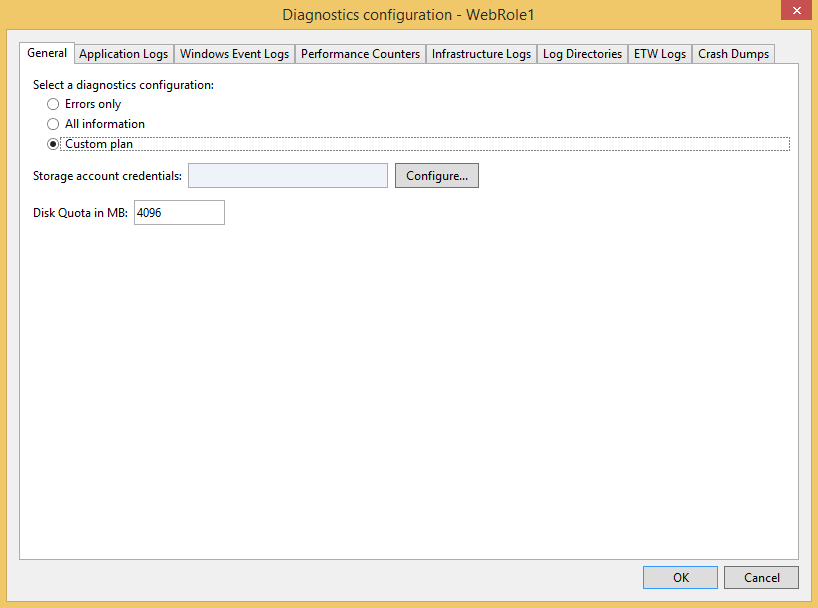

1. For this example, select the **Custom plan** option so you can customize the data collected.

1. The **Disk Quota in MB** box specifies how much space you want to allocate in your storage account for diagnostics data. You can change the default value if you want.

1. On each tab of diagnostics data you want to collect, select its **Enable Transfer of <log type>** check box.For example, if you want to collect application logs, select the **Enable transfer of Application Logs** check box on the **Application Logs** tab. Also, specify any other information required by each diagnostics data type. See the section **Configure diagnostics data sources** later in this topic for configuration information on each tab.

1. After you’ve enabled collection of all the diagnostics data you want, choose the **OK** button.

1. Run your Azure cloud service project in Visual Studio as usual. As you use your application, the log information that you enabled is saved to the Azure storage account you specified.

## Enable diagnostics in Azure virtual machines

In Visual Studio, you can choose to collect diagnostics data for Azure virtual machines.

### To enable diagnostics in Azure virtual machines

1. In **Server Explorer**, choose the Azure node and then connect to your Azure subscription, if you're not already connected.

1. Expand the **Virtual Machines** node. You can create a new virtual machine, or select one that's already there.

1. On the shortcut menu for the virtual machine that interests you, choose **Configure**. This shows the virtual machine configuration dialog box.

    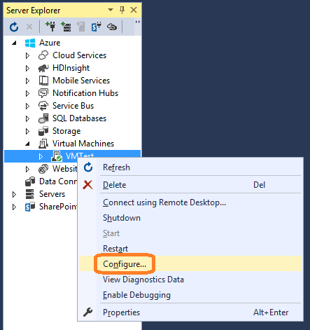

1. If it's not already installed, add the Microsoft Monitoring Agent Diagnostics extension. This extension lets you gather diagnostics data for the Azure virtual machine. In the Installed Extensions list, choose the Select an available extension drop-down menu and then choose Microsoft Monitoring Agent Diagnostics.

    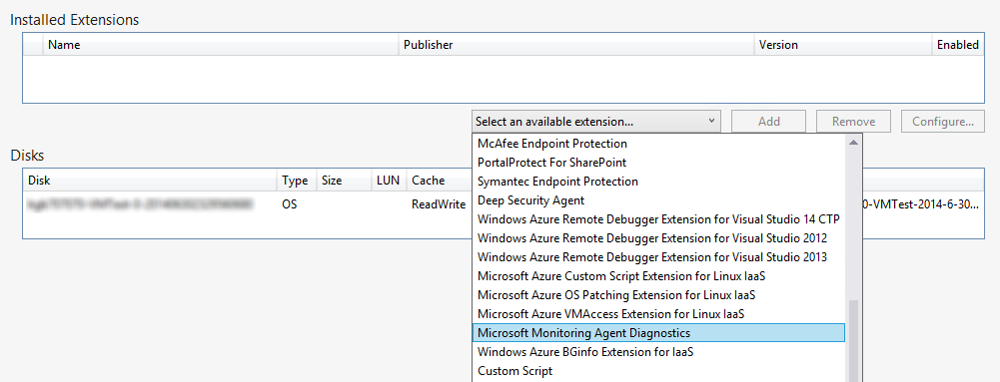

    >[AZURE.NOTE] Other diagnostics extensions are available for your virtual machines. For more information, see Azure VM Extensions and Features.

1. Choose the **Add** button to add the extension and view its **Diagnostics configuration** dialog box.

1. Choose the **Configure** button to specify a storage account and then choose the **OK** button.

    Each tab (except for **General** and **Log Directories**) represents a diagnostic data source that you can collect.

    

    The default tab, **General**, offers you the following diagnostics data collection options: **Errors only**, **All information**, and **Custom plan**. The default option, **Errors only**, takes the least amount of storage because it doesn’t transfer warnings or tracing messages. The **All information** option transfers the most information and is, therefore, the most expensive option in terms of storage.

1. For this example, select the **Custom plan** option so you can customize the data collected.

1. The **Disk Quota in MB** box specifies how much space you want to allocate in your storage account for diagnostics data. You can change the default value if you want.

1. On each tab of diagnostics data you want to collect, select its **Enable Transfer of <log type>** check box.

    For example, if you want to collect application logs, select the **Enable transfer of Application Logs** check box on the **Application Logs** tab. Also, specify any other information required by each diagnostics data type. See the section **Configure diagnostics data sources** later in this topic for configuration information on each tab.

1. After you’ve enabled collection of all the diagnostics data you want, choose the **OK** button.

1. Save the updated project.

    You'll see a message in the **Microsoft Azure Activity Log** window that the virtual machine has been updated.

## Configure diagnostics data sources

After you enable diagnostics data collection, you can choose exactly what data sources you want to collect and what information is collected. The following is a list of tabs in the **Diagnostics configuration** dialog box and what each configuration option means.

### Application logs

**Application logs** contain diagnostics information produced by a web application. If you want to capture application logs, select the **Enable transfer of Application Logs** check box. You can increase or decrease the number of minutes when the application logs are transferred to your storage account by changing the **Transfer Period (min)** value. You can also change the amount of information captured in the log by setting the Log level value. For example, you can choose **Verbose** to get more information or choose **Critical** to capture only critical errors. If you have a specific diagnostics provider that emits application logs, you can capture them by adding the provider’s GUID to the **Provider GUID** box.

  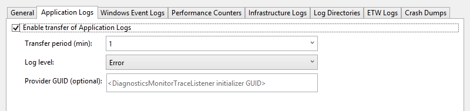

  See [Enable diagnostics logging for web apps in Azure App Service](./app-service-web/web-sites-enable-diagnostic-log.md) for more information about application logs.

### Windows event logs

If you want to capture Windows event logs, select the **Enable transfer of Windows Event Logs** check box. You can increase or decrease the number of minutes when the event logs are transferred to your storage account by changing the **Transfer Period (min)** value. Select the check boxes for the types of events that you want to track.

  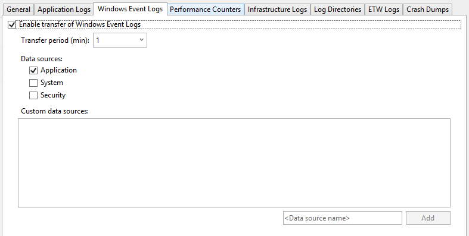

If you're using Azure SDK 2.6 or later and want to specify a custom data source, enter it in the **<Data source name>** text box and then choose the **Add** button next to it. The data source is added to the diagnostics.cfcfg file.

If you're using Azure SDK 2.5 and want to specify a custom data source, you can add it to the `WindowsEventLog` section of the diagnostics.wadcfgx file, such as in the following example.

```
<WindowsEventLog scheduledTransferPeriod="PT1M">
   <DataSource name="Application!*" />
   <DataSource name="CustomDataSource!*" />
</WindowsEventLog>
```
### Performance counters

Performance counter information can help you locate system bottlenecks and fine-tune system and application performance. See [Create and Use Performance Counters in an Azure Application](https://msdn.microsoft.com/library/azure/hh411542.aspx) for more information. If you want to capture performance counters, select the **Enable transfer of Performance Counters** check box. You can increase or decrease the number of minutes when the event logs are transferred to your storage account by changing the **Transfer Period (min)** value. Select the check boxes for the performance counters that you want to track.

  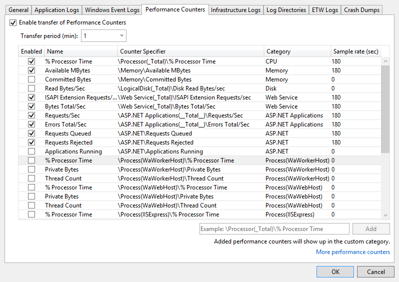

To track a performance counter that isn’t listed, enter it by using the suggested syntax and then choose the **Add** button. The operating system on the virtual machine determines which performance counters you can track. For more information about syntax, see [Specifying a Counter Path](https://msdn.microsoft.com/library/windows/desktop/aa373193.aspx).

### Infrastructure logs

If you want to capture infrastructure logs, which contain information about the Azure diagnostic infrastructure, the RemoteAccess module, and the RemoteForwarder module, select the **Enable transfer of Infrastructure Logs** check box. You can increase or decrease the number of minutes when the logs are transferred to your storage account by changing the Transfer Period (min) value.

  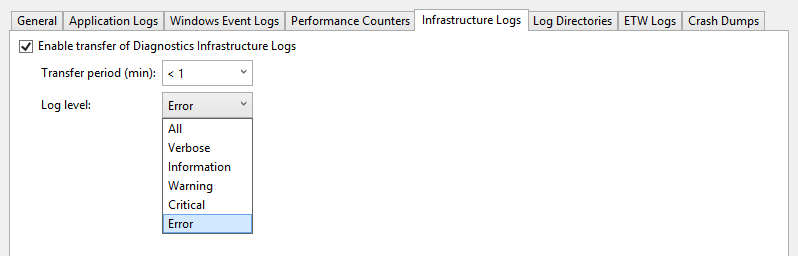

  See [Collect Logging Data by Using Azure Diagnostics](https://msdn.microsoft.com/library/azure/gg433048.aspx) for more information.

### Log directories

If you want to capture log directories, which contain data collected from log directories for Internet Information Services (IIS) requests, failed requests, or folders that you choose, select the **Enable transfer of Log Directories** check box. You can increase or decrease the number of minutes when the logs are transferred to your storage account by changing the **Transfer Period (min)** value.

You can select the boxes of the logs you want to collect, such as **IIS Logs** and **Failed Request** Logs. Default storage container names are provided, but you can change the names if you want.

Also, you can capture logs from any folder. Just specify the path in the **Log from Absolute Directory** section and then choose the **Add Directory** button. The logs will be captured to the specified containers.

  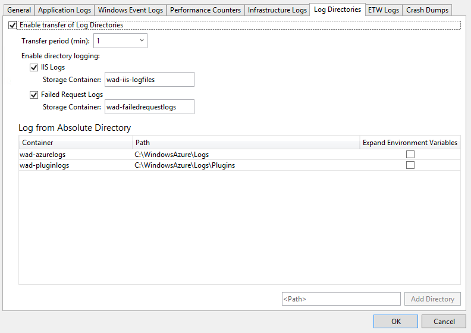

### ETW logs

If you use [Event Tracing for Windows](https://msdn.microsoft.com/library/windows/desktop/bb968803(v=vs.85).aspx) (ETW) and want to capture ETW logs, select the **Enable transfer of ETW Logs** check box. You can increase or decrease the number of minutes when the logs are transferred to your storage account by changing the **Transfer Period (min)** value.

The events are captured from event sources and event manifests that you specify. To specify an event source, enter a name in the **Event Sources** section and then choose the **Add Event Source** button. Similarly, you can specify an event manifest in the **Event Manifests** section and then choose the **Add Event Manifest** button.

  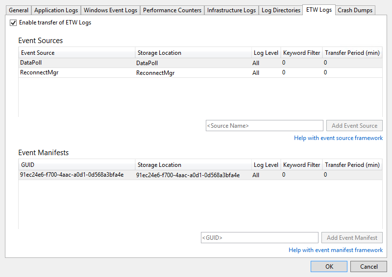

  The ETW framework is supported in ASP.NET through classes in the [System.Diagnostics.aspx](https://msdn.microsoft.com/library/system.diagnostics(v=vs.110) namespace. The Microsoft.WindowsAzure.Diagnostics namespace, which inherits from and extends standard [System.Diagnostics.aspx](https://msdn.microsoft.com/library/system.diagnostics(v=vs.110) classes, enables the use of [System.Diagnostics.aspx](https://msdn.microsoft.com/library/system.diagnostics(v=vs.110) as a logging framework in the Azure environment. For more information, see [Take Control of Logging and Tracing in Microsoft Azure](https://msdn.microsoft.com/magazine/ff714589.aspx) and [Enabling Diagnostics in Azure Cloud Services and Virtual Machines](./cloud-services/cloud-services-dotnet-diagnostics.md).

### Crash dumps

If you want to capture information about when a role instance crashes, select the **Enable transfer of Crash Dumps** check box. (Because ASP.NET handles most exceptions, this is generally useful only for worker roles.) You can increase or decrease the percentage of storage space devoted to the crash dumps by changing the **Directory Quota (%)** value. You can change the storage container where the crash dumps are stored, and you can select whether you want to capture a **Full** or **Mini** dump.

The processes currently being tracked are listed. Select the check boxes for the processes that you want to capture. To add another process to the list, enter the process name and then choose the **Add Process** button.

  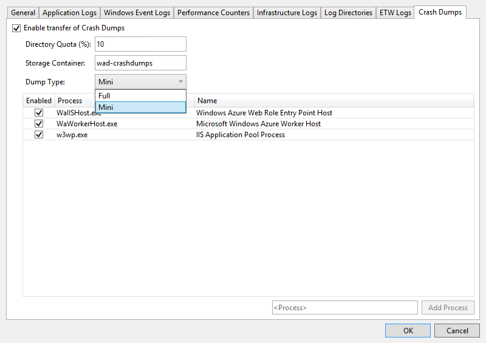

  See [Take Control of Logging and Tracing in Microsoft Azure](https://msdn.microsoft.com/magazine/ff714589.aspx) and [Microsoft Azure Diagnostics Part 4: Custom Logging Components and Azure Diagnostics 1.3 Changes](http://justazure.com/microsoft-azure-diagnostics-part-4-custom-logging-components-azure-diagnostics-1-3-changes/) for more information.

## View the diagnostics data

After you’ve collected the diagnostics data for a cloud service or a virtual machine, you can view it.

### To view cloud service diagnostics data

1. Deploy your cloud service as usual and then run it.

1. You can view the diagnostics data in either a report that Visual Studio generates or tables in your storage account. To view the data in a report, open **Cloud Explorer** or **Server Explorer**, open the shortcut menu of the node for the role that interests you, and then choose **View Diagnostic Data**.

    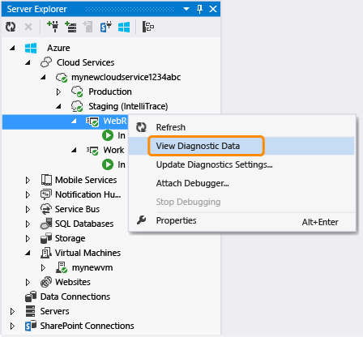

    A report that shows the available data appears.

    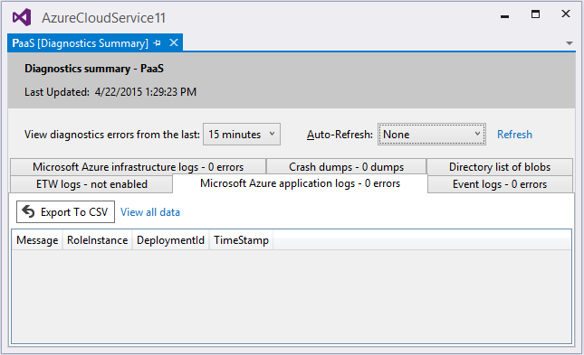

    If the most recent data doesn't appear, you might have to wait for the transfer period to elapse.

    Choose the **Refresh** link to immediately update the data, or choose an interval in the **Auto-Refresh** dropdown list box to have the data updated automatically. To export the error data, choose the **Export to CSV** button to create a comma-separated value file you can open in a spreadsheet.

    In **Cloud Explorer** or **Server Explorer**, open the storage account that's associated with the deployment.

1. Open the diagnostics tables in the table viewer, and then review the data that you collected. For IIS logs and custom logs, you can open a blob container. By reviewing the following table, you can find the table or blob container that contains the data that interests you. In addition to the data for that log file, the table entries contain EventTickCount, DeploymentId, Role, and RoleInstance to help you identify what virtual machine and role generated the data and when. 

    |Diagnostic data|Description|Location|
    |---|---|---|
    |Application Logs|Logs that your code generates by calling methods of the System.Diagnostics.Trace class.|WADLogsTable|
    |Event Logs|This data is from the Windows event logs on the virtual machines. Windows stores information in these logs, but applications and services also use them to report errors or log information.|WADWindowsEventLogsTable|
    |Performance Counters|You can collect data on any performance counter that’s available on the virtual machine. The operating system provides performance counters, which include many statistics such as memory usage and processor time.|WADPerformanceCountersTable|
    |Infrastructure Logs|These logs are generated from the diagnostics infrastructure itself.|WADDiagnosticInfrastructureLogsTable|
    |IIS Logs|These logs record web requests. If your cloud service gets a significant amount of traffic, these logs can be quite lengthy, so you should collect and store this data only when you need it.|You can find failed-request logs in the blob container under wad-iis-failedreqlogs under a path for that deployment, role, and instance. You can find complete logs under wad-iis-logfiles. Entries for each file are made in the WADDirectories table.|
    |Crash dumps|This information provides binary images of your cloud service’s process (typically a worker role).|wad-crush-dumps blob container|
    |Custom log files|Logs of data that you predefined.|You can specify in code the location of custom log files in your storage account. For example, you can specify a custom blob container.|

1. If data of any type is truncated, you can try increasing the buffer for that data type or shortening the interval between transfers of data from the virtual machine to your storage account.

1. (optional) Purge data from the storage account occasionally to reduce overall storage costs.

1. When you do a full deployment, the diagnostics.cscfg file (.wadcfgx for Azure SDK 2.5) is updated in Azure, and your cloud service picks up any changes to your diagnostics configuration. If you, instead, update an existing deployment, the .cscfg file isn’t updated in Azure. You can still change diagnostics settings, though, by following the steps in the next section. For more information about performing a full deployment and updating an existing deployment, see [Publish Azure Application Wizard](vs-azure-tools-publish-azure-application-wizard.md).

### To view virtual machine diagnostics data

1. On the shortcut menu for the virtual machine, choose **View Diagnostics Data**.

    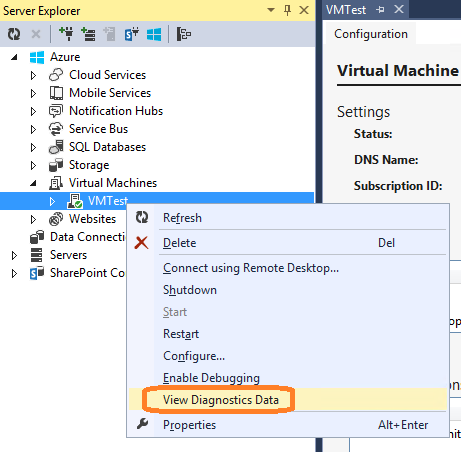

    This opens the **Diagnostics summary** window.

      

    If the most recent data doesn't appear, you might have to wait for the transfer period to elapse.

    Choose the **Refresh** link to immediately update the data, or choose an interval in the **Auto-Refresh** dropdown list box to have the data updated automatically. To export the error data, choose the **Export to CSV** button to create a comma-separated value file you can open in a spreadsheet.

## Configure cloud service diagnostics after deployment

If you're investigating a problem with a cloud service that already running, you might want to collect data that you didn't specify before you originally deployed the role. In this case, you can start to collect that data by using the settings in Server Explorer. You can configure diagnostics for either a single instance or all the instances in a role, depending on whether you open the Diagnostics Configuration dialog box from the shortcut menu for the instance or the role. If you configure the role node, any changes apply to all instances. If you configure the instance node, any changes apply to that instance only.

### To configure diagnostics for a running cloud service

1. In Server Explorer, expand the **Cloud Services** node, and then expand nodes to locate the role or instance that you want to investigate or both.

    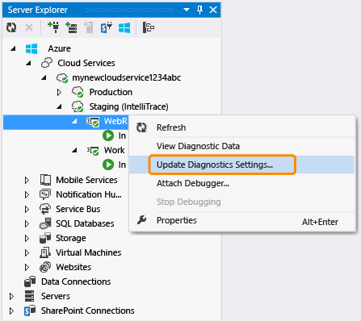

1. On the shortcut menu for an instance node or a role node, choose **Update Diagnostics Settings**, and then choose the diagnostic settings that you want to collect.

    For information about the configuration settings, see **Configure diagnostics data sources** in this topic. For information about how to view the diagnostics data, see **View the diagnostics data** in this topic.

    If you change data collection in **Server Explorer**, these changes remain in effect until you fully redeploy your cloud service. If you use the default publish settings, the changes are not overwritten, since the default publish setting is to update the existing deployment, rather than do a full redeployment. To make sure the settings clear at deployment time, go to the **Advanced Settings** tab in the Publish wizard and clear the **Deployment update** checkbox. When you redeploy with that checkbox cleared, the settings revert to those in the .wadcfgx (or .wadcfg) file as set through the Properties editor for the role. If you update your deployment, Azure keeps the old settings.

## Troubleshoot Azure cloud service issues

If you experience problems with your cloud service projects, such as a role that gets stuck in a "busy" status, repeatedly recycles, or throws an internal server error, there are tools and techniques you can use to diagnose and fix these problems. For specific examples of common problems and solutions, as well as an overview of the concepts and tools used to diagnose and fix such errors, see [Azure PaaS Compute Diagnostics Data](http://blogs.msdn.com/b/kwill/archive/2013/08/09/windows-azure-paas-compute-diagnostics-data.aspx).

## Q & A

**What is the buffer size, and how large should it be?**

On each virtual machine instance, quotas limit how much diagnostic data can be stored on the local file system. In addition, you specify a buffer size for each type of diagnostic data that's available. This buffer size acts like an individual quota for that type of data. By checking the bottom of the dialog box, you can determine the overall quota and the amount of memory that remains. If you specify larger buffers or more types of data, you'll approach the overall quota. You can change the overall quota by modifying the diagnostics.wadcfg/.wadcfgx configuration file. The diagnostics data is stored on the same filesystem as your application’s data, so if your application uses a lot of disk space, you shouldn’t increase the overall diagnostics quota.

**What is the transfer period, and how long should it be?**

The transfer period is the amount of time that elapses between data captures. After each transfer period, data is moved from the local filesystem on a virtual machine to tables in your storage account. If the amount of data that's collected exceeds the quota before the end of a transfer period, older data is discarded. You might want to decrease the transfer period if you're losing data because your data exceeds the buffer size or the overall quota.

**What time zone are the time stamps in?**

The time stamps are in the local time zone of the data center that hosts your cloud service. The following three timestamp columns in the log tables are used.

  - **PreciseTimeStamp** is the ETW timestamp of the event. That is, the time the event is logged from the client.

  - **TIMESTAMP** is PreciseTimeStamp rounded down to the upload frequency boundary. So, if your upload frequency is 5 minutes and the event time 00:17:12, TIMESTAMP will be 00:15:00.

  - **Timestamp** is the timestamp at which the entity was created in the Azure table.

**How do I manage costs when collecting diagnostic information?**

The default settings (**Log level** set to **Error** and **Transfer period** set to **1 minute**) are designed to minimize cost. Your compute costs will increase if you collect more diagnostic data or decrease the transfer period. Don’t collect more data than you need, and don’t forget to disable data collection when you no longer need it. You can always enable it again, even at runtime, as shown in the previous section.

**How do I collect failed-request logs from IIS?**

By default, IIS doesn’t collect failed-request logs. You can configure IIS to collect them if you edit the web.config file for your web role.

**I’m not getting trace information from RoleEntryPoint methods like OnStart. What’s wrong?**

The methods of RoleEntryPoint are called in the context of WAIISHost.exe, not IIS. Therefore, the configuration information in web.config that normally enables tracing doesn’t apply. To resolve this issue, add a .config file to your web role project, and name the file to match the output assembly that contains the RoleEntryPoint code. In the default web role project, the name of the .config file would be WAIISHost.exe.config. Then add the following lines to this file:

```
<system.diagnostics>
  <trace>
      <listeners>
          <add name “AzureDiagnostics” type=”Microsoft.WindowsAzure.Diagnostics.DiagnosticMonitorTraceListener”>
              <filter type=”” />
          </add>
      </listeners>
  </trace>
</system.diagnostics>
```

Now, in the **Properties** window, set the **Copy to Output Directory** property to **Copy always**.

## Next steps

To learn more about diagnostics logging in Azure, see [Enabling Diagnostics in Azure Cloud Services and Virtual Machines](./cloud-services/cloud-services-dotnet-diagnostics.md) and [Enable diagnostics logging for web apps in Azure App Service](./app-service-web/web-sites-enable-diagnostic-log.md).
