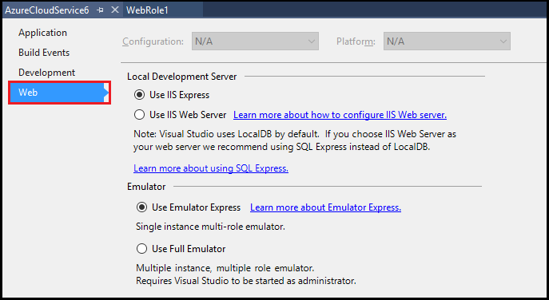

# Using Emulator Express to run and debug an Azure cloud service on a local machine
By using Emulator Express, you can test and debug a cloud service without running Visual Studio as an administrator. You can set your project settings to use either Emulator Express or the full emulator, depending on the requirements of your cloud service. For more information about the full emulator, see [Run an Azure Application in the Compute Emulator](storage/storage-use-emulator.md).

## Using Emulator Express in Visual Studio
When you create an Azure project in Azure SDK 2.3 or later, Emulator Express is automatically used. For existing projects that were created with an earlier version of the Azure SDK, use the following steps to select Emulator Express:

1. Create or open an Azure cloud service project in Visual Studio.

1. In **Solution Explorer**, right-click the project, and, from the context menu, select **Properties**.

1. In the projects properties pages, select the **Web** tab.

	

1. Under **Local Development Server**, select **Use IIS Express option**.

1. Under **Emulator**, select **Use Emulator Express**.
   
1. To launch the Emulator Express, run the following command at a command prompt: 

	```
	csrun.exe /useemulatorexpress
	```

## Emulator Express limitations
The following issues are known limitations of Emulator Express: 

- Emulator Express is not compatible with IIS Web Server.
- Your cloud service can contain multiple roles, but each role is limited to one instance.
- You can't access port numbers below 1000. If you use an authentication provider that normally uses a port below 1000, you might need to change this value to a port number that's above 1000.
- Any limitations that apply to the Azure Compute Emulator also apply to Emulator Express. For example, you can't have more than 50 role instances per deployment. For more information about the Azure Compute Emulator, see [Run an Azure Application in the Compute Emulator](http://go.microsoft.com/fwlink/p/?LinkId=623050).

## Next steps
[Debugging Azure cloud services](https://msdn.microsoft.com/library/azure/ee405479.aspx)
