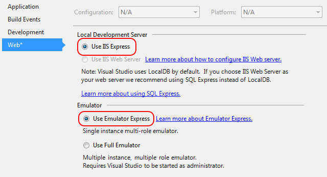

<properties
   pageTitle="Using Emulator Express to run and debug a cloud service on a local machine | Microsoft Azure"
   description="Using Emulator Express to run and debug a cloud service on a local machine"
   services="visual-studio-online"
   documentationCenter="n/a"
   authors="TomArcher"
   manager="douge"
   editor="" />
<tags
   ms.service="visual-studio-online"
   ms.devlang="multiple"
   ms.topic="article"
   ms.tgt_pltfrm="multiple"
   ms.workload="na"
   ms.date="04/19/2016"
   ms.author="tarcher" />

# Using Emulator Express to run and debug a cloud service on a local machine

By using Emulator Express, you can test and debug a cloud service without running Visual Studio as an administrator. You can set your project settings to use either Emulator Express or the full emulator, depending on the requirements of your cloud service. For more information about the full emulator, see [Run an Azure Application in the Compute Emulator](./storage/storage-use-emulator.md). Emulator Express was first included in Azure SDK 2.1, and as of Azure SDK 2.3, it is the default emulator.

## Using Emulator Express in the Visual Studio IDE

When you create a new project in Azure SDK 2.3 or later, Emulator Express is already selected. For existing projects that were created with an earlier version of the SDK, follow these steps to select Emulator Express.

### To configure a project to use Emulator Express

1. On the shortcut menu for the Azure project, choose **Properties**, and then choose the **Web** tab.

1. Under **Local Development Server**, choose the **Use IIS Express option** button. Emulator Express isn't compatible with IIS Web Server.

1. Under **Emulator**, choose the **Use Emulator Express** option button.

    

## Launching Emulator Express at a command prompt

At a command prompt, you can launch the express version of the Azure Compute Emulator, csrun.exe, by using the /useemulatorexpress option.

## Limitations

Before you use Emulator Express, you should be aware of some limitations:

- Emulator Express isn't compatible with IIS Web Server.

- Your cloud service can contain multiple roles, but each role is limited to one instance.

- You can't access port numbers below 1000. For example, if you use an authentication provider that normally uses a port below 1000, you might need to change this value to a port number that's above 1000.

- Any limitations that apply to the Azure Compute Emulator also apply to Emulator Express. For example, you can't have more than 50 role instances per deployment. See [Run an Azure Application in the Compute Emulator](http://go.microsoft.com/fwlink/p/?LinkId=623050)

## Next steps

[Debugging Cloud Services](https://msdn.microsoft.com/library/azure/ee405479.aspx)
