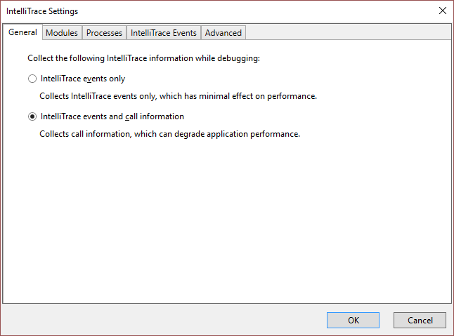
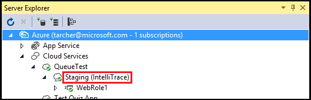
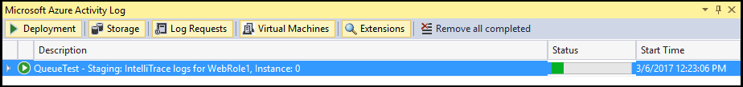

<properties 
   pageTitle="Debugging a published cloud service with IntelliTrace and Visual Studio | Microsoft Azure"
   description="Debugging a published cloud service with IntelliTrace and Visual Studio"
   services="visual-studio-online"
   documentationCenter="n/a"
   authors="TomArcher"
   manager="douge"
   editor="" />
<tags 
   ms.service="visual-studio-online"
   ms.devlang="multiple"
   ms.topic="article"
   ms.tgt_pltfrm="multiple"
   ms.workload="na"
   ms.date="04/18/2016"
   ms.author="tarcher" />

# Debugging a published cloud service with IntelliTrace and Visual Studio

##Overview

With IntelliTrace, you can log extensive debugging information for a role instance when it runs in Azure. If you need to find the cause of a problem, you can use the IntelliTrace logs to step through your code from Visual Studio as if it were running in Azure. In effect, IntelliTrace records key code execution and environment data when your Azure application is running as a cloud service in Azure, and lets you replay the recorded data from Visual Studio. As an alternative, you can use remote debugging to attach directly to a cloud service that's running in Azure. See [Debugging Cloud Services](http://go.microsoft.com/fwlink/p/?LinkId=623041).

>[AZURE.IMPORTANT] IntelliTrace is intended for debug scenarios only, and should not be used for a production deployment.

>[AZURE.NOTE] You can use IntelliTrace if you have Visual Studio Enterprise installed and your Azure application targets .NET Framework 4 or a later version. IntelliTrace collects information for your Azure roles. The virtual machines for these roles always run 64-bit operating systems.

## To configure an Azure application for IntelliTrace

To enable IntelliTrace for an Azure application, you must create and publish the application from a Visual Studio Azure project. You must configure IntelliTrace for your Azure application before you publish it to Azure. If you publish your application without configuring IntelliTrace but then decide that you want to do that, you will have to publish the application again from Visual Studio. For more information, see [Publishing a Cloud Service using the Azure Tools](http://go.microsoft.com/fwlink/p/?LinkId=623012).

1. When you are ready to deploy your Azure application, verify that your project build targets are set to **Debug**.

1. Open the shortcut menu for the Azure project in Solution Explorer and choose **Publish**.
 
    The Publish Azure Application wizard appears.

1. To collect IntelliTrace logs for your application when it is published in the cloud, select the **Enable IntelliTrace** check box.

    >[AZURE.NOTE] You can enable either IntelliTrace or profiling when you publish your Azure application. You cannot enable both.

1. To customize the basic IntelliTrace configuration, choose the **Settings** hyperlink.

    The IntelliTrace Settings dialog appears, as shown in the following figure. You can specify which events to log, whether to collect call information, which modules and processes to collect logs for, and how much space to allocate to the recording. For more information about IntelliTrace, see [Debugging with IntelliTrace](http://go.microsoft.com/fwlink/?LinkId=214468).

    

The IntelliTrace log is a circular log file of the maximum size specified in the IntelliTrace settings (the default size is 250 MB). IntelliTrace logs are collected to a file in the file system of the virtual machine. When you request the logs, a snapshot is taken at that point in time and downloaded to your local computer.

After the Azure application has been published to Azure, you can determine if IntelliTrace has been enabled from the Azure Compute node in Server Explorer, as shown in the following image:

## Downloading IntelliTrace Logs for a Role Instance

You can download IntelliTrace logs for a role instance from the **Cloud Services** node in **Server Explorer**. Expand the **Cloud Services** node until you locate the instance you are interested in, open the shortcut menu for this instance and choose **View IntelliTrace Logs**. The IntelliTrace logs are downloaded to a file in a directory on your local computer. Each time that you request the IntelliTrace logs, a new snapshot is created.

When the logs are downloaded, Visual Studio displays the progress of the operation in the Azure Activity Log window. As shown in the following figure, you can expand the line item for the operation to see more detail.

You can continue to work in Visual Studio while the IntelliTrace logs are downloading. When the log has finished downloading, it will automatically open in Visual Studio.

>[AZURE.NOTE] The IntelliTrace logs might contain exceptions that the framework generates and subsequently handles. Internal framework code generates these exceptions as a normal part of starting up a role, so you may safely ignore them.

## See Also

[Debugging Cloud Services](https://msdn.microsoft.com/library/ee405479.aspx)

