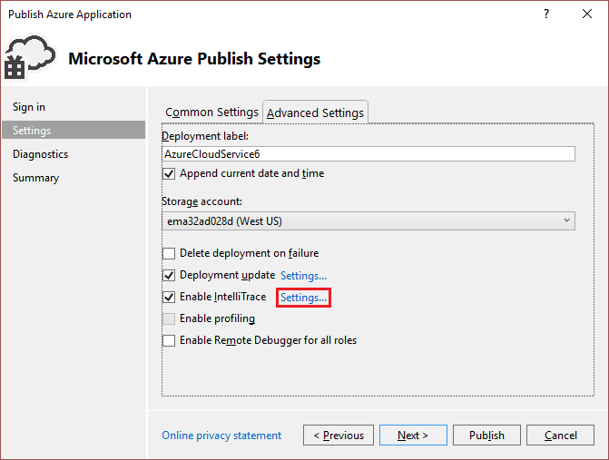
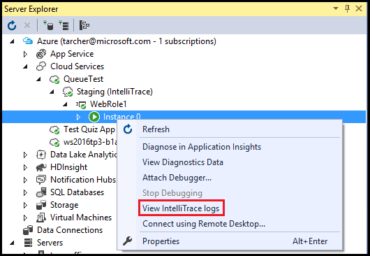

# Debugging a published Azure cloud service with Visual Studio and IntelliTrace
With IntelliTrace, you can log extensive debugging information for a role instance when it runs in Azure. If you need to find the cause of a problem, you can use the IntelliTrace logs to step through your code from Visual Studio as if it were running in Azure. In effect, IntelliTrace records key code execution and environment data when your Azure application is running as a cloud service in Azure, and lets you replay the recorded data from Visual Studio. 

You can use IntelliTrace if you have Visual Studio Enterprise installed and your Azure application targets .NET Framework 4 or a later version. IntelliTrace collects information for your Azure roles. The virtual machines for these roles always run 64-bit operating systems.

As an alternative, you can use [remote debugging](http://go.microsoft.com/fwlink/p/?LinkId=623041) to attach directly to a cloud service that's running in Azure.

> [!IMPORTANT]
> IntelliTrace is intended for debug scenarios only, and should not be used for a production deployment.
> 

## Configure an Azure application for IntelliTrace
To enable IntelliTrace for an Azure application, you must create and publish the application from a Visual Studio Azure project. You must configure IntelliTrace for your Azure application before you publish it to Azure. If you publish your application without configuring IntelliTrace, you need to republish the project. For more information, see [Publishing an Azure cloud services projects using Visual Studio](http://go.microsoft.com/fwlink/p/?LinkId=623012).

1. When you are ready to deploy your Azure application, verify that your project build targets are set to **Debug**.

1. In **Solution Explorer**, right-click project, and, from the context menu, select **Publish**.
   
1. In the **Publish Azure Application** dialog, select the Azure subscription, and select **Next**.

1. In the **Settings** page, select the **Advanced Settings** tab.

1. Turn on the **Enable IntelliTrace** option to collect IntelliTrace logs for your application when it is published in the cloud.
   
1. To customize the basic IntelliTrace configuration, select **Settings** next to **Enable IntelliTrace**.

	
   
1. In the **IntelliTrace Settings** dialog, you can specify which events to log, whether to collect call information, which modules and processes to collect logs for, and how much space to allocate to the recording. For more information about IntelliTrace, see [Debugging with IntelliTrace](http://go.microsoft.com/fwlink/?LinkId=214468).
   
    

The IntelliTrace log is a circular log file of the maximum size specified in the IntelliTrace settings (the default size is 250 MB). IntelliTrace logs are collected to a file in the file system of the virtual machine. When you request the logs, a snapshot is taken at that point in time and downloaded to your local computer.

After the Azure cloud service has been published to Azure, you can determine if IntelliTrace has been enabled from the Azure node in **Server Explorer**, as shown in the following image:

## Download IntelliTrace logs for a role instance
Using Visual Studio, you can download IntelliTrace logs for a role instance by following these steps:

1. In **Server Explorer**, expand the **Cloud Services** node, and locate role instance whose logs you wish to download. 

1. Right-click the role instance, and from the s context menu, select **View IntelliTrace Logs**. 

	

1. The IntelliTrace logs are downloaded to a file in a directory on your local computer. Each time that you request the IntelliTrace logs, a new snapshot is created. While the logs are being downloaded, Visual Studio displays the progress of the operation in the **Azure Activity Log** window. As shown in the following figure, you can expand the line item for the operation to see more detail.

You can continue to work in Visual Studio while the IntelliTrace logs are downloading. When the log has finished downloading, it opens in Visual Studio.

> [!NOTE]
> The IntelliTrace logs might contain exceptions that the framework generates and handles afterwards. Internal framework code generates these exceptions as a normal part of starting up a role, so you may safely ignore them.
> 
> 

## Next steps
- [Options for debugging Azure cloud services](vs-azure-tools-debugging-cloud-services-overview.md)
- [Publishing an Azure cloud service using Visual Studio](vs-azure-tools-publishing-a-cloud-service.md)