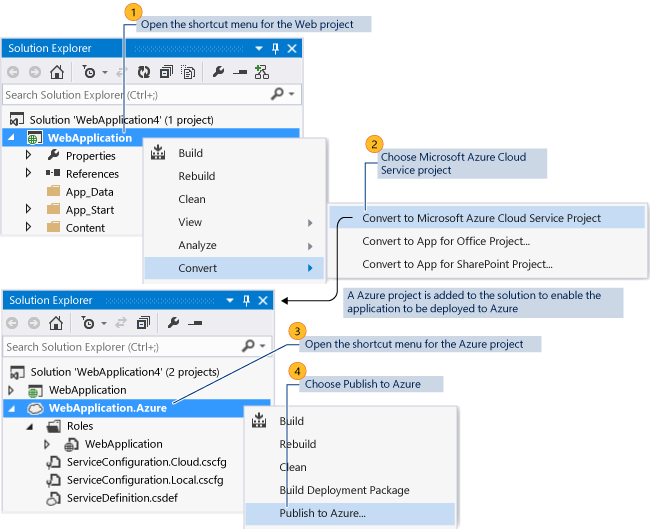

<properties
   pageTitle="How to Migrate and Publish a Web Application to an Azure Cloud Service from Visual Studio | Microsoft Azure"
   description="Learn how to migrate and publish your web application to an Azure cloud service by using Visual Studio."
   services="visual-studio-online"
   documentationCenter="na"
   authors="TomArcher"
   manager="douge"
   editor="" />
<tags
   ms.service="multiple"
   ms.devlang="dotnet"
   ms.topic="article"
   ms.tgt_pltfrm="na"
   ms.workload="multiple"
   ms.date="06/01/2016"
   ms.author="tarcher" />

# How to: Migrate and Publish a Web Application to an Azure Cloud Service from Visual Studio

To take advantage of the hosting services and scalability of Azure, you might want to migrate and publish your web application to an Azure cloud service. You can run a web application in Azure with minimal changes to your existing application.

>[AZURE.NOTE] This topic is about deploying to cloud services, not to web sites. For information about deploying to web sites, see [Deploy a web app in Azure App Service](./app-service-web/web-sites-deploy.md).

For a list of specific templates that are supported for both Visual C# and Visual Basic, see the section **Supported Project Templates** later in this topic.

You must first enable your web application for Azure from Visual Studio. The following illustration shows the key steps to publish your existing web application by adding an Azure project to use for deployment. This process adds an Azure project with the required web role to your solution. Based on the type of web project that you have, the project properties for assemblies are also updated if the service package requires additional assemblies for deployment.



>[AZURE.NOTE] The **Convert**, **Convert to Azure Cloud Service Project** command is displayed only for the web project in your solution. For example, the command is not available for a Silverlight project in your solution.
When you create a service package or publish your application to Azure, warnings or errors might occur. These warnings and errors can help you fix issues before you deploy to Azure. For example, you might receive a warning about a missing assembly. For more information about how to treat any warnings as errors, see [Configure an Azure Cloud Service Project with Visual Studio](vs-azure-tools-configuring-an-azure-project.md). If you build your application, run it locally using the compute emulator, or publish it to Azure, you might see the following error in the **Error List** window: **The specified path, file name, or both are too long**. This error occurs because the length of the fully qualified Azure project name is too long. The length of the project name, including the full path, cannot be more than 146 characters. For example, this is the full project name including file path for an Azure project that is created for a Silverlight application: `c:\users\<user name>\documents\visual studio 2015\Projects\SilverlightApplication4\SilverlightApplication4.Web.Azure.ccproj`. You might have to move your solution to a different directory that has a shorter path to reduce the length of the fully qualified project name.

To migrate and publish a web application to Azure from Visual Studio, follow these steps.

## Enable a Web Application for Deployment to Azure

### To enable a web application for deployment to Azure

1. To enable your web application for deployment to Azure, open the shortcut menu for a web project in your solution and choose Add Azure Deployment Project.

    The following actions occur:

    - An Azure project called `<name of the web project>.Azure` is added to the solution for your application.

    - A web role for the web project is added to this Azure project.

    - The **Copy Local** property is set to true for any assemblies that are required for MVC 2, MVC 3, MVC 4, and Silverlight Business Applications. This adds these assemblies to the service package that is used for deployment.

  >[AZURE.IMPORTANT] If you have other assemblies or files that are required for this web application, you must manually set the properties for these files. For information about how to set these properties, see the section **Include Files in the Service Package** later in this article.

  >[AZURE.NOTE] If a web role for a specific web project already exists in an Azure project in the solution, **Convert**, **Convert to Azure Cloud Service Project** is not displayed on the shortcut menu for this web project.

  If you have multiple web projects in your web application and you want to create web roles for each web project, you must perform the steps in this procedure for each web project. This creates separate Azure projects for each web role. Each web project can be published separately. Alternatively, you can manually add another web role to an existing Azure project in your web application. To do this, open the shortcut menu for the **Roles** folder in your Azure project, choose **Add**, then **Web Role Project in solution**, choose the project to add as a web role, and then choose the **OK** button.

## Use an Azure SQL Database for Your Application

If you have a connection string for your web application that uses a SQL Server database that's on the premises, you must change this connection string to use an instance of SQL Database that Azure hosts instead.

>[AZURE.IMPORTANT] Your subscription must enable you to use SQL Database. If you access your subscription from the [Azure classic portal](http://go.microsoft.com/fwlink/?LinkID=213885), you can determine what services your subscription provides. The following instructions apply to the released [Azure classic portal](http://go.microsoft.com/fwlink/?LinkID=213885). If you are using the [Azure portal](http://portal.microsoft.com), skip to the next procedure.

### To use a SQL Database instance in your web role for your connection string

1. To create an instance of SQL Database in the [Azure classic portal](http://go.microsoft.com/fwlink/?LinkID=213885), follow the steps in the following article: [Create a SQL Database Server](http://go.microsoft.com/fwlink/?LinkId=225109).

    >[AZURE.NOTE] When you set up the firewall rules for your instance of SQL Database, you must select the **Allow other Azure services to access this server** check box.

1. To create an instance of SQL Database to use for your connection string, follow the steps in the next section in the following article: [Create a SQL Database](http://go.microsoft.com/fwlink/?LinkId=225110).

1. To copy the ADO.NET connection string to use for your connection string, perform the following steps in the [Azure classic portal](http://go.microsoft.com/fwlink/?LinkID=213885).  

  1. Choose the **Database** button, and then open the node for the subscription that you used to create your instance of SQL Database.

  1. To display the available instances of SQL Database, choose the **SQL Databases** node.

  1. To display the properties for the database, choose the database. The **Properties** view appears.

      >[AZURE.NOTE] If the **Properties** view doesn't appear, you might need to open it by using the divider.

  1. To display the connection strings, choose the ellipsis (...) button next to View.

    The **Connection Strings** dialog box appears.

  1. To copy the ADO.NET connection string, highlight the text, and choose the Ctrl+C keys.

  1. To close the dialog box, choose the **Close** button.

1. To replace the connection string in the web.config file to use this instance of SQL Database, open the web.config file, highlight the existing connection string entry, and then choose the Ctrl+V keys. The ADO.NET connection string for the instance of SQL Database replaces the existing connection string.

1. You must also add the parameter `MultipleActiveResultSets=True` to the connection string. The connection string should have the following format:

    ```
    connectionString=”Server=tcp:<database_server>.database.windows.net,1433;Database=<database_name>;User ID=<user_name>@<database_server>;Password=<myPassword>;Trusted_Connection=False;Encrypt=True;MultipleActiveResultSets=True"
    ```

1. (Optional) An alternative method to changing the connection string directly in the web.config file is to add a section into one of the web.config transformation files, depending on the build configuration that you use to create your service package. Open either the Web.Debug.Config file or the Web.Release.Config file. Add the following section into this file:

    ```
    XMLCopy<connectionStrings><addname="DefaultConnection"connectionString="Server=tcp:<database_server>.database.windows.net,1433;Database=<database_name>;User ID=<user_name>@<database_server>;Password=<myPassword>;Trusted_Connection=False;Encrypt=True;MultipleActiveResultSets=True"xdt:Transform="SetAttributes"xdt:Locator="Match(name)"/></connectionStrings>
    ```

1. Save the file that you modified and republish your application.

### To use an instance of SQL Database by using the Azure classic portal

1. In the [Azure classic portal](http://go.microsoft.com/fwlink/?LinkID=213885), choose the SQL Databases node.

  - If the instance of SQL Database that you want to use appears, choose to open it.

  - If you haven't created any instances, choose the appropriate link, and then create an instance.

1. After you open or create a database instance, choose the **Connection Strings** link.

1. At the bottom of the page, choose the link to configure firewall settings, and accept the default values or configure the values that you need.

1. Copy the ADO.NET connection string, paste it into your web.config file over the old connection string for the on-premises database, and be sure to add `MultipleActiveResultSets=True`.

## Publish a Web Application to Azure

### To publish a Web application to Azure

1. To test the application in the local development environment using the Azure compute emulator, open the shortcut menu for the Azure project for the web role and choose **Set as Startup Project**. Then choose **Debug**, **Start Debugging** (Keyboard: **F5**).

    The **Start the Azure Debugging Environment** dialog box opens and the application starts in the browser. For specific details about how to start each type of web application in the compute emulator, see the table in this section.

1. To set up the services for your application to publish to Azure, you must have a Microsoft account and an Azure subscription. Use the steps in the following topic to set up your services: [Prepare to publish or deploy an Azure application from Visual Studio](vs-azure-tools-cloud-service-publish-set-up-required-services-in-visual-studio.md).

1. To publish the web application to Azure, open the shortcut menu for the web project and choose **Publish to Azure**.

    The **Publish Azure Application** dialog box opens and Visual Studio starts the deployment process. For more information about how to publish the application, see the section **Publish an Azure Application from Visual Studio** in [Publishing a Cloud Service using the Azure Tools](vs-azure-tools-publishing-a-cloud-service.md).

    >[AZURE.NOTE] You can also publish the web application from the Azure project. To do this, open the shortcut menu for the Azure project and choose **Publish**.

1. To see the progress of the deployment, you can view the **Azure Activity Log** window. This log is automatically displayed when the deployment process starts. You can expand the line item in the activity log to show detailed information, as shown in the following illustration:

    

1. (Optional) To cancel the deployment process, open the shortcut menu for the line item in the activity log and choose **Cancel and remove**. This stops the deployment process and deletes the deployment environment from Azure.

    >[AZURE.NOTE] To remove this deployment environment after it has been deployed, you must use the [Azure classic portal](http://go.microsoft.com/fwlink/?LinkID=213885).

1. (Optional) After your role instances have started, Visual Studio automatically shows the deployment environment in the **Azure Compute** node in **Cloud Explorer** or **Server Explorer**. From here you can view the status of the individual role instances.

    The following illustration shows the role instances in **Server Explorer** while they are still in the Initializing state:

    

1. To access your application after deployment, choose the arrow next to your deployment when a status of **Completed** appears in the **Azure Activity log**. This displays the URL for your web application in Azure. See the following table for the details about how to start a specific type of web application from Azure.

    The following table lists the details about how to start specific web applications from Azure or to run or debug a web application locally using the Azure Compute Emulator:

    |Web Application Type|Run/Debug Locally Using the Compute Emulator|Running in Azure|
    |---|---|---|
    |ASP.NET Web Application|On the menu bar, choose **Debug**, **Start Debugging** (Keyboard: Choose the **F5** key.).|Choose the URL hyperlink displayed in the **Deployment** tab for the **Azure Activity log** to load the start page in the browser.|
    |ASP.NET MVC 2 Web Application|On the menu bar, choose **Debug**, **Start Debugging** (Keyboard: Choose the **F5** key.).|Choose the URL hyperlink displayed in the **Deployment** tab for the **Azure Activity log** to load the start page in the browser.|
    |ASP.NET MVC 3 Web Application|On the menu bar, choose **Debug**, **Start Debugging** (Keyboard: Choose the **F5** key.).|Choose the URL hyperlink displayed in the **Deployment** tab for the **Azure Activity log** to load the start page in the browser.|
    |ASP.NET MVC 4 Web Application|On the menu bar, choose **Debug**, **Start Debugging** (Keyboard: Choose the **F5** key.).|Choose the URL hyperlink displayed in the **Deployment** tab for the **Azure Activity log** to load the start page in the browser.|
    |ASP.NET Empty Web Application|You must add an .aspx page in your application that you set as the start page for your web project. Then on the menu bar, choose **Debug**, **Start Debugging** (Keyboard: Choose the **F5** key.).|If you have a default .aspx page in your application, choose the URL hyperlink displayed in the **Deployment** tab for the **Azure Activity log** and this page is loaded in the browser. If you have a different .aspx page, you need to navigate to this specific page using the following format for your url: `<url for deployment>/<name of page>.aspx`|
    |Silverlight Application|On the menu bar, choose **Debug**, **Start Debugging** (Keyboard: Choose the **F5** key.).|You need to navigate to the specific page for your application using the following format for your url: `<url for deployment>/<name of page>.aspx`|
    |Silverlight Business Application|On the menu bar, choose **Debug**, **Start Debugging** (Keyboard: Choose the **F5** key.).|You need to navigate to the specific page for your application using the following format for your url: `<url for deployment>/<name of page>.aspx`|
    |Silverlight Navigation Application|On the menu bar, choose **Debug**, **Start Debugging** (Keyboard: Choose the **F5** key.).|You need to navigate to the specific page for your application using the following format for your url:`<url for deployment>/<name of page>.aspx`|
    |WCF Service Application|You must set the .svc file as the start page for your WCF Service project. Then on the menu bar, choose **Debug**, **Start Debugging** (Keyboard: Choose the **F5** key.).|You need to navigate to the svc file for your application using the following format for your url: `<url for deployment>/<name of service file>.svc`|
    |WCF Workflow Service Application|You must set the .svc file as the start page for your WCF Service project. Then on the menu bar, choose **Debug**, **Start Debugging** (Keyboard: Choose the **F5** key.).|You need to navigate to the svc file for your application using the following format for your url: `<url for deployment>/<name of service file>.svc`|
    |ASP.NET Dynamic Entities|On the menu bar, choose **Debug**, **Start Debugging** (Keyboard: Choose the **F5** key.).|You must update the connection string (see next section). You also need to navigate to the specific page for your application using the following format for your url: `<url for deployment>/<name of page>.aspx`|
    |ASP.NET Dynamic Data Linq to SQL|On the menu bar, choose **Debug**, **Start Debugging** (Keyboard: Choose the **F5** key.).|You must follow the steps in this procedure: Use a SQL Azure database for your application (see earlier section in this topic). You also need to navigate to the specific page for your application using the following format for your url: `<url for deployment>/<name of page>.aspx`|

## Update a Connection String for ASP.NET Dynamic Entities

### To Update a Connection String for ASP.NET Dynamic Entities

1. To create a SQL Azure database that can be used for a ASP.NET Dynamic Entities web application, follow the steps in the procedure **Use a SQL Azure database for your application** earlier in this topic.

1. Add the tables and fields that you need for this database from the [Azure classic portal](http://go.microsoft.com/fwlink/?LinkID=213885).

1. The connection string for this type of application has the following format in the web.config file:  

    ```
    <addname="tempdbEntities"connectionString="metadata=res://*/Model1.csdl|res://*/Model1.ssdl|res://*/Model1.msl;provider=System.Data.SqlClient;provider connection string=&quot;data source=<server name>\SQLEXPRESS;initial catalog=<database name>;integrated security=True;multipleactiveresultsets=True;App=EntityFramework&quot;"providerName="System.Data.EntityClient"/>
    ```

    Update the *connectionString* value with the ADO.NET connection string for your SQL Azure database as follows:

    ```
    XMLCopy<addname="tempdbEntities"connectionString="metadata=res://*/Model1.csdl|res://*/Model1.ssdl|res://*/Model1.msl;provider=System.Data.SqlClient;provider connection string=&quot;Server=tcp:<SQL Azure server name>.database.windows.net,1433;Database=<database name>;User ID=<user name>;Password=<password>;Trusted_Connection=False;Encrypt=True;multipleactiveresultsets=True;App=EntityFramework&quot;"providerName="System.Data.EntityClient"/>
    ```

1. To save the web.config file with the changes that you have made to the connection string, on the menu bar choose **File**, **Save web.config**.

## Supported Project Templates

To publish a web application to Azure, the application must use one of the project templates for C# or Visual Basic that is listed in the table below.

|Project Template Group|Project Template|
|---|---|
|Web|ASP.NET Web Application|
|Web|ASP.NET MVC 2 Web Application|
|Web|ASP.NET MVC 3 Web Application|
|Web|ASP.NET MVC4 Web Application|
|Web|ASP.NET Empty Web Application|
|Web|ASP.NET MVC 2 Empty Web Application|
|Web|ASP.NET Dynamic Data Entities Web Application|
|Web|ASP.NET Dynamic Data Linq to SQL Web Application|
|Silverlight|Silverlight Application|
|Silverlight|Silverlight Business Application|
|Silverlight|Silverlight Navigation Application|
|WCF|WCF Service Application|
|WCF|WCF Workflow Service Application|
|Workflow|WCF Workflow Service Application|

## Next Steps
For more information on publishing, see [Prepare to Publish or Deploy an Azure Application from Visual Studio](vs-azure-tools-cloud-service-publish-set-up-required-services-in-visual-studio.md). Also check out
[Setting Up Named Authentication Credentials](vs-azure-tools-setting-up-named-authentication-credentials.md).
