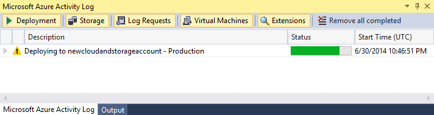

# How to: Migrate and Publish a Web Application to an Azure Cloud Service from Visual Studio

To take advantage of the hosting services and scaling ability of Azure, you might want to migrate and deploy your web application to an Azure cloud service. Only minimal changes are required. This article covers deploying to cloud services only; for App Service, see [Deploy a web app in Azure App Service](app-service/app-service-deploy-local-git.md).

> [!Important]
> This migration is supported only for the specific ASP.NET, Silverlight, WCF, and WCF Workflow projects. It is not supported for ASP.NET Core projects. See [Supported Project Templates](#supported-project-templates).

## Migrate a project to cloud services

1. Right-click the web application project and select **Convert > Convert to Microsoft Azure Cloud Service Project**. (Note that this command does not appear if you already have a web role project in the solution.)
1. Visual Studio creates a cloud service project in the solution that contains the required web role. The name of this project is the same as your application project with plus the suffix `.Azure`.
1. Visual Studio also sets the **Copy Local** property to true for any assemblies that are required for MVC 2, MVC 3, MVC 4, and Silverlight Business Applications. This property adds these assemblies to the service package that is used for deployment.

   > [!Important]
   > If you have other assemblies or files that are required for this web application, you must manually set the properties for these files. For information about how to set these properties, see [Include Files in the Service Package](#include-files-in-the-service-package).

### Errors and warnings

Any warnings or errors that occur indicate issues to fix before deploying to Azure, such as missing assemblies.

If you build your application, run it locally using the compute emulator, or publish it to Azure, you might see the error: "The specified path, file name, or both are too long." This error indicates that length of the fully qualified Azure project name exceeds 146 characters. To correct the issue, move your solution to a different folder with a shorter path.

For more information about how to treat any warnings as errors, see [Configure an Azure Cloud Service Project with Visual Studio](vs-azure-tools-configuring-an-azure-project.md).

### Test the migration locally

1. In Visual Studio **Solution Explorer**, right-click the added cloud service project and select **Set as Startup Project**.
1. Select **Debug > Start Debugging** (F5) to launch the Azure debugging environment. This environment specifically provides emulation of various Azure services.

### Use an Azure SQL Database for your application

If you have a connection string for your web application that uses an on-premises SQL Server database, you must migrate your database to Azure SQL Database instead and update your connection string. For guidance with this process, refer to the following topics:

- [SQL Server database migration to SQL Database in the cloud](sql-database/sql-database-cloud-migrate.md)
- [Use .NET (C#) with Visual Studio to connect and query and Azure SQL database](sql-database/sql-database-connect-query-dotnet-visual-studio.md).

## Publish the application to Azure Cloud Service

1. Create the necessary cloud service and storage accounts in your Azure subscription as described on [Prepare to publish or deploy an Azure application from Visual Studio](vs-azure-tools-cloud-service-publish-set-up-required-services-in-visual-studio.md).
1. In Visual Studio, right-click the application project and select **Publish to Microsoft Azure...** (which is different from the "Publish..." command.).
1. In the **Publish Azure Application** that appears, sign in using the account with your Azure subscription and select **Next >**.
1. In the **Settings > Common Settings** tab, select the target cloud service from the **Cloud Service** drop-down list, along with your chosen environment and configurations. 
1. In **Settings > Advanced Settings**, select the storage account to use, then select **Next >**.
1. In **Diagnostics**, choose whether to send information to Application Insights.
1. Select **Next >** to view a summary, then select **Publish** to start deployment.
1. Visual Studio opens an activity log window where you can track progress:

    

1. (Optional) To cancel the deployment process, right-click the line item in the activity log and choose **Cancel and remove**. This command stops the deployment process and deletes the deployment environment from Azure. Note: to remove this deployment environment after it has been deployed, you must use the [Azure portal](https://portal.azure.com).
1. (Optional) After your role instances have started, Visual Studio automatically shows the deployment environment in the **Server Explorer > Cloud Services** node. From here you can view the status of the individual role instances.
1. To access your application after deployment, choose the arrow next to your deployment when a status of **Completed** appears in the **Azure Activity log** along with the URL. See the following table for the details about how to start a specific type of web application from Azure.

## Using the compute emulator and starting application in Azure

All application types can be started in a browser connected to the Visual Studio debugger by selecting **Debug > Start Debugging** (F5). With an ASP.NET Empty Web Application project, you must first add an `.aspx` page in your application and set it as the start page for your web project.

The following table provides details about starting the application in Azure:

   | Web Application Type | Running in Azure |
   | --- | --- | --- |
   | ASP.NET Web Application<br/>(including MVC 2, MVC 3, MVC 4) | Select the URL in the **Deployment** tab for the **Azure Activity log**. |
   | ASP.NET Empty Web Application | If you have a default `.aspx` page in your application, select the URL in the **Deployment** tab for the **Azure Activity log**. To navigate to a different page, enter a URL of the following form in a browser: `<deployment_url>/<page_name>.aspx` |
   | Silverlight Application<br/>Silverlight Business Application<br/>Silverlight Navigation Application | Navigate to the specific page for your application using the following URL form: `<deployment_url>/<page_name>.aspx` |
    WCF Service Application<br/>WCF Workflow Service Application | Set the `.svc` file as the start page for your WCF Service project. Then navigate to `<deployment_url>/<service_file>.svc` |
   | ASP.NET Dynamic Entities<br/>ASP.NET Dynamic Data Linq to SQL | Update the connection string as described in the next section. Then navigate to `<deployment_url>/<page_name>.aspx`. For Linq to SQL, you must use an Azure SQL database. |

## Update a Connection String for ASP.NET Dynamic Entities

1. Create a SQL Azure database for a ASP.NET Dynamic Entities web application as described earlier in (#use-an-azuresql-database-for-your-application).
1. Add the tables and fields that you need for this database from the Azure portal.
1. Specify a connection string in the `web.config` file with the following format and save the file:

    ```xml
    <addname="tempdbEntities"connectionString="metadata=res://*/Model1.csdl|res://*/Model1.ssdl|res://*/Model1.msl;provider=System.Data.SqlClient;provider connection string=&quot;data source=<server name>\SQLEXPRESS;initial catalog=<database name>;integrated security=True;multipleactiveresultsets=True;App=EntityFramework&quot;"providerName="System.Data.EntityClient"/>
    ```

    Update the *connectionString* value with the ADO.NET connection string for your SQL Azure database as follows:

    ```xml
    XMLCopy<addname="tempdbEntities"connectionString="metadata=res://*/Model1.csdl|res://*/Model1.ssdl|res://*/Model1.msl;provider=System.Data.SqlClient;provider connection string=&quot;Server=tcp:<SQL Azure server name>.database.windows.net,1433;Database=<database name>;User ID=<user name>;Password=<password>;Trusted_Connection=False;Encrypt=True;multipleactiveresultsets=True;App=EntityFramework&quot;"providerName="System.Data.EntityClient"/>
    ```

## Supported Project Templates

Applications that can be migrated and published to cloud services must use one of the templates in the table below. ASP.NET Core is not supported.

| Template Group | Project Template |
| --- | --- |
| Web | ASP.NET Web Application (.NET Framework) |
| Web | ASP.NET MVC 2 Web Application |
| Web | ASP.NET MVC 3 Web Application |
| Web | ASP.NET MVC4 Web Application |
| Web | ASP.NET Empty Web Application (or Site) |
| Web | ASP.NET MVC 2 Empty Web Application |
| Web | ASP.NET Dynamic Data Entities Web Application |
| Web | ASP.NET Dynamic Data Linq to SQL Web Application |
| Silverlight | Silverlight Application |
| Silverlight | Silverlight Business Application |
| Silverlight | Silverlight Navigation Application |
| WCF | WCF Service Application |
| WCF | WCF Workflow Service Application |
| Workflow | WCF Workflow Service Application |

## Next steps

- [Prepare to Publish or Deploy an Azure Application from Visual Studio](vs-azure-tools-cloud-service-publish-set-up-required-services-in-visual-studio.md)
- [Setting Up Named Authentication Credentials](vs-azure-tools-setting-up-named-authentication-credentials.md).
