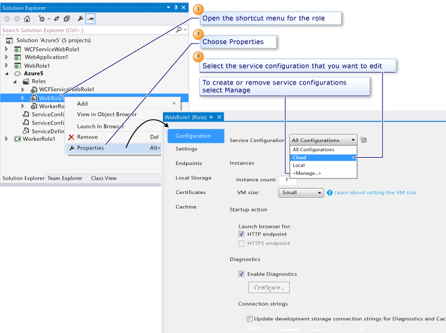

<properties
   pageTitle="Configuring your Azure project using multiple service configurations | Microsoft Azure"
   description="Learn how to configure an Azure cloud service project by changing the ServiceDefinition.csdef and ServiceConfiguration.cscfg files."
   services="visual-studio-online"
   documentationCenter="na"
   authors="TomArcher"
   manager="douge"
   editor="" />
<tags
   ms.service="multiple"
   ms.devlang="multiple"
   ms.topic="article"
   ms.tgt_pltfrm="na"
   ms.workload="na"
   ms.date="06/01/2016"
   ms.author="tarcher" />

# Configuring Your Azure Project Using Multiple Service Configurations

An Azure cloud service project includes two configuration files: ServiceDefinition.csdef and ServiceConfiguration.cscfg. These files are packaged with your Azure cloud service application and deployed to Azure.

- The **ServiceDefinition.csdef** file contains the metadata that is required by the Azure environment for the requirements of your cloud service application, including what roles it contains. This file also contains configuration settings that apply to all instances. These configuration settings can be read at runtime using the Azure Service Hosting Runtime API. This file cannot be updated while your service is running in Azure.

- The **ServiceConfiguration.cscfg** file sets values for the configuration settings defined in the service definition file and specifies the number of instances to run for each role. This file can be updated while your cloud service is running in Azure.

The Azure Tools for Microsoft Visual Studio provide property pages that you can use to set configuration settings stored in these files. To access the property pages, double-click the role reference underneath the Azure cloud service project in Solution Explorer, or right-click the role reference and choose **Properties**, as shown in the following figure.

For information about the underlying schemas for the service definition and service configuration files, see the [Schema Reference](https://msdn.microsoft.com/library/azure/dd179398.aspx). For more information about service configuration, see [How to Configure Cloud Services](./cloud-services/cloud-services-how-to-configure.md).

## Configuring role properties

The property pages for a web role and a worker role are similar, although there are a few differences, pointed out in the following sections.

From the **Caching** page, you can configure the Azure caching services.

### Configuration page

On the **Configuration** page, you can set these properties:

**Instances**

Set the **Instance** count property to the number of instances the service should run for this role.

Set the **VM size** property to **Extra Small**, **Small**, **Medium**, **Large**, or **Extra Large**.  For more information, see [Sizes for Cloud Services](./cloud-services/cloud-services-sizes-specs.md).

**Startup Action** (Web Role Only)

Set this property to specify that Visual Studio should launch a web browser for either the HTTP endpoints or the HTTPS endpoints, or both when you start debugging.

The HTTPS endpoint option is available only if you have already defined an HTTPS endpoint for your role. You can define an HTTPS endpoint on the **Endpoints** property page.

If you have already added an HTTPS endpoint, the HTTPS endpoint option is enabled by default, and Visual Studio will launch a browser for this endpoint when you start debugging, in addition to a browser for your HTTP endpoint. This assumes that both startup options are enabled.

**Diagnostics**

By default, diagnostics is enabled for the Web role. The Azure cloud service project and storage account are set to use the local storage emulator. When you are ready to deploy to Azure, you can select the builder button (**…**) to update the storage account to use Azure storage in the cloud. You can transfer the diagnostics data to the storage account on demand or at automatically scheduled intervals. For more information about Azure diagnostics, see [Enabling Diagnostics in Azure Cloud Services and Virtual Machines](./cloud-services/cloud-services-dotnet-diagnostics.md).

## Settings page

On the **Settings** page, you can add configuration settings for your service. Configuration settings are name-value pairs. Code running in the role can read the values of your configuration settings at runtime using classes provided by the [Azure Managed Library](http://go.microsoft.com/fwlink?LinkID=171026). Specifically, the [GetConfigurationSettingValue](https://msdn.microsoft.com/library/azure/microsoft.windowsazure.serviceruntime.roleenvironment.getconfigurationsettingvalue.aspx) method returns the value of a named configuration setting at runtime.

### Configuring a connection string to a storage account

A connection string is a configuration setting that provides connection and authentication information for the storage emulator or for an Azure storage account. Whenever your code must access Azure storage services data – that is, blob, queue, or table data – from code running in a role, you will have to define a connection string for that storage account.

A connection string that points to an Azure storage account must use a defined format. For information about how to create connection strings, see [Configure Azure Storage Connection Strings](./storage/storage-configure-connection-string.md).

When you are ready to test your service against the Azure storage services, or when you are ready to deploy your cloud service to Azure, you can change the value of any connection strings to point to your Azure storage account. Select (**…**), select **Enter storage account credentials**. Enter your account information that includes your account name and account key. In the **Storage Account Connection String** dialog box, you can also indicate whether you want to use the default HTTPS endpoints (the default option), the default HTTP endpoints, or custom endpoints. You might decide to use custom endpoints if you have registered a custom domain name for your service, as described in [Configure a custom domain name for blob data in an Azure storage account](./storage/storage-custom-domain-name.md).

>[AZURE.IMPORTANT] You must modify your connection strings to point to an Azure storage account before you deploy your service. Failing to do this may cause your role not to start, or to cycle through the initializing, busy, and stopping states.

## Endpoints page

A worker role can have any number of HTTP, HTTPS, or TCP endpoints. Endpoints can be input endpoints, which are available to external clients, or internal endpoints, which are available to other roles that are running in the service.

- To make an HTTP endpoint available to external clients and Web browsers, change the endpoint type to input, and specify a name and a public port number.

- To make an HTTPS endpoint available to external clients and Web browsers, change the endpoint type to **input**, and specify a name, a public port number, and a management certificate name.

    Note that before you can specify a management certificate, you must define the certificate on the **Certificates** property page.

- To make an endpoint available for internal access by other roles in the cloud service, change the endpoint type to internal, and specify a name and possible private ports for this endpoint.

## Local storage page

You can use the **Local Storage** property page to reserve one or more local storage resources for a role. A local storage resource is a reserved directory in the file system of the Azure virtual machine in which an instance of a role is running.

## Certificates page

On the **Certificates** page, you can associate certificates with your role. The certificates that you add can be used to configure your HTTPS endpoints on the **Endpoints** property page.

The **Certificates** property page adds information about your certificates to your service configuration. Note that your certificates are not packaged with your service; you must upload your certificates separately to Azure through the [Azure classic portal](http://go.microsoft.com/fwlink/?LinkID=213885).

To associate a certificate with your role, provide a name for the certificate. You use this name to refer to the certificate when you configure an HTTPS endpoint on the **Endpoints** property page. Next, specify whether the certificate store is **Local Machine** or **Current User** and the name of the store. Finally, enter the certificate's thumbprint. If the certificate is in the Current User\Personal (My) store, you can enter the certificate's thumbprint by selecting the certificate from a populated list. If it resides in any other location, enter the thumbprint value by hand.

When you add a certificate from the certificate store, any intermediate certificates are automatically added to the configuration settings for you. These intermediate certificates must also be uploaded to Azure in order to correctly configure your service for SSL.

Any management certificates that you associate with your service apply to your service only when it is running in the cloud. When your service is running in the local development environment, it uses a standard certificate that is managed by the compute emulator.

## Configuring the Azure cloud service project

To configure settings that apply to an entire Azure cloud service project, you first open the shortcut menu for that project node, and then you choose Properties to open its property pages. The following table shows those property pages.

|Property Page|Description|
|---|---|
|Application|From this page, you can display information about the version of Azure Tools that this cloud service project uses, and you can upgrade to the current version of the tools.|
|Build Events|From this page, you can set pre-build and post-build events.|
|Development|From this page, you can specify build configuration instructions and the conditions under which any post-build events are run.|
|Web|From this page, you can configure settings that relate to the web server.|
