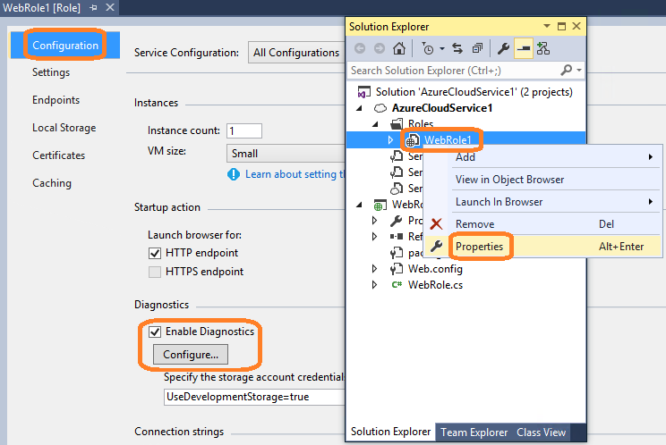

# Optimizing Your Azure Code
When you’re programming apps that use Microsoft Azure, there are some coding practices you should follow to help avoid problems with app scalability, behavior and performance in a cloud environment. Microsoft provides an Azure Code Analysis tool that recognizes and identifies several of these commonly-encountered issues and helps you resolve them. You can download the tool in Visual Studio via NuGet.

## Azure Code Analysis rules
The Azure Code Analysis tool uses the following rules to automatically flag your Azure code when it finds known performance-impacting issues. Detected issues appear as a warnings or compiler errors. Code fixes or suggestions to resolve the warning or error are often provided through a light bulb icon.

## Avoid using default (in-process) session state mode
### ID
AP0000

### Description
If you use the default (in-process) session state mode for cloud applications, you can lose session state.

Please share your ideas and feedback at [Azure Code Analysis feedback](http://go.microsoft.com/fwlink/?LinkId=403771).

### Reason
By default, the session state mode specified in the web.config file is in-process. Also, if no entry specified in the configuration file, the Session State mode defaults to in-process. The in-process mode stores session state in memory on the web server. When an instance is restarted or a new instance is used for load balancing or failover support, the session state stored in memory on the web server isn’t saved. This situation prevents the application from being scalable on the cloud.

ASP.NET session state supports several different storage options for session state data: InProc, StateServer, SQLServer, Custom, and Off. It’s recommended that you use Custom mode to host data on an external Session State store, such as [Azure Session State provider for Redis](http://go.microsoft.com/fwlink/?LinkId=401521).

### Solution
One recommended solution is to store session state on a managed cache service. Learn how to use [Azure Session State provider for Redis](http://go.microsoft.com/fwlink/?LinkId=401521) to store your session state. You can also store session state in other places to ensure your application is scalable on the cloud. To learn more about alternative solutions please read [Session State Modes](https://msdn.microsoft.com/library/ms178586).

## Run method should not be async
### ID
AP1000

### Description
Create asynchronous methods (such as [await](https://msdn.microsoft.com/library/hh156528.aspx)) outside of the [Run()](https://msdn.microsoft.com/library/azure/microsoft.windowsazure.serviceruntime.roleentrypoint.run.aspx) method and then call the async methods from [Run()](https://msdn.microsoft.com/library/azure/microsoft.windowsazure.serviceruntime.roleentrypoint.run.aspx). Declaring the [[Run()](https://msdn.microsoft.com/library/azure/microsoft.windowsazure.serviceruntime.roleentrypoint.run.aspx)](https://msdn.microsoft.com/library/azure/microsoft.windowsazure.serviceruntime.roleentrypoint.run.aspx) method as async causes the worker role to enter a restart loop.

Please share your ideas and feedback at [Azure Code Analysis feedback](http://go.microsoft.com/fwlink/?LinkId=403771).

### Reason
Calling async methods inside the [Run()](https://msdn.microsoft.com/library/azure/microsoft.windowsazure.serviceruntime.roleentrypoint.run.aspx) method causes the cloud service runtime to recycle the worker role. When a worker role starts, all program execution takes place inside the [Run()](https://msdn.microsoft.com/library/azure/microsoft.windowsazure.serviceruntime.roleentrypoint.run.aspx) method. Exiting the [Run()](https://msdn.microsoft.com/library/azure/microsoft.windowsazure.serviceruntime.roleentrypoint.run.aspx) method causes the worker role to restart. When the worker role runtime hits the async method, it dispatches all operations after the async method and then returns. This causes the worker role to exit from the [[[[Run()](https://msdn.microsoft.com/library/azure/microsoft.windowsazure.serviceruntime.roleentrypoint.run.aspx)](https://msdn.microsoft.com/library/azure/microsoft.windowsazure.serviceruntime.roleentrypoint.run.aspx)](https://msdn.microsoft.com/library/azure/microsoft.windowsazure.serviceruntime.roleentrypoint.run.aspx)](https://msdn.microsoft.com/library/azure/microsoft.windowsazure.serviceruntime.roleentrypoint.run.aspx) method and restart. In the next iteration of execution, the worker role hits the async method again and restarts, causing the worker role to recycle again as well.

### Solution
Place all async operations outside of the [Run()](https://msdn.microsoft.com/library/azure/microsoft.windowsazure.serviceruntime.roleentrypoint.run.aspx) method. Then, call the refactored async method from inside the [[Run()](https://msdn.microsoft.com/library/azure/microsoft.windowsazure.serviceruntime.roleentrypoint.run.aspx)](https://msdn.microsoft.com/library/azure/microsoft.windowsazure.serviceruntime.roleentrypoint.run.aspx) method, such as RunAsync().wait. The Azure Code Analysis tool can help you fix this issue.

The following code snippet demonstrates the code fix for this issue:

```
public override void Run()
{
    RunAsync().Wait();
}

public async Task RunAsync()
{
    //Asynchronous operations code logic
    // This is a sample worker implementation. Replace with your logic.

    Trace.TraceInformation("WorkerRole1 entry point called");

    HttpClient client = new HttpClient();

    Task<string> urlString = client.GetStringAsync("http://msdn.microsoft.com");

    while (true)
    {
        Thread.Sleep(10000);
        Trace.TraceInformation("Working");

        string stream = await urlString;
    }

}
```

## Use Service Bus Shared Access Signature authentication
### ID
AP2000

### Description
Use Shared Access Signature (SAS) for authentication. Access Control Service (ACS) is being deprecated for service bus authentication.

Please share your ideas and feedback at [Azure Code Analysis feedback](http://go.microsoft.com/fwlink/?LinkId=403771).

### Reason
For enhanced security, Azure Active Directory is replacing ACS authentication with SAS authentication. See [Azure Active Directory is the future of ACS](https://cloudblogs.microsoft.com/enterprisemobility/2013/06/22/azure-active-directory-is-the-future-of-acs/) for information on the transition plan.

### Solution
Use SAS authentication in your apps. The following example shows how to use an existing SAS token to access a service bus namespace or entity.

```
MessagingFactory listenMF = MessagingFactory.Create(endpoints, new StaticSASTokenProvider(subscriptionToken));
SubscriptionClient sc = listenMF.CreateSubscriptionClient(topicPath, subscriptionName);
BrokeredMessage receivedMessage = sc.Receive();
```

See the following topics for more information.

* For an overview, see [Shared Access Signature Authentication with Service Bus](https://msdn.microsoft.com/library/dn170477.aspx)
* [How to use Shared Access Signature Authentication with Service Bus](https://msdn.microsoft.com/library/dn205161.aspx)
* For a sample project, see [Using Shared Access Signature (SAS) authentication with Service Bus Subscriptions](http://code.msdn.microsoft.com/windowsazure/Using-Shared-Access-e605b37c)

## Consider using OnMessage method to avoid "receive loop"
### ID
AP2002

### Description
To avoid going into a "receive loop," calling the **OnMessage** method is a better solution for receiving messages than calling the **Receive** method. However, if you must use the **Receive** method, and you specify a non-default server wait time, make sure the server wait time is more than one minute.

Please share your ideas and feedback at [Azure Code Analysis feedback](http://go.microsoft.com/fwlink/?LinkId=403771).

### Reason
When calling **OnMessage**, the client starts an internal message pump that constantly polls the queue or subscription. This message pump contains an infinite loop that issues a call to receive messages. If the call times out, it issues a new call. The timeout interval is determined by the value of the [OperationTimeout](https://msdn.microsoft.com/library/microsoft.servicebus.messaging.messagingfactorysettings.operationtimeout.aspx) property of the [MessagingFactory](https://msdn.microsoft.com/library/microsoft.servicebus.messaging.messagingfactory.aspx)that’s being used.

The advantage of using **OnMessage** compared to **Receive** is that users don’t have to manually poll for messages, handle exceptions, process multiple messages in parallel, and complete the messages.

If you call **Receive** without using its default value, be sure the *ServerWaitTime* value is more than one minute. Setting *ServerWaitTime* to more than one minute prevents the server from timing out before the message is fully received.

### Solution
Please see the following code examples for recommended usages. For more details, see [QueueClient.OnMessage Method (Microsoft.ServiceBus.Messaging)](https://msdn.microsoft.com/library/microsoft.servicebus.messaging.queueclient.onmessage.aspx)and [QueueClient.Receive Method (Microsoft.ServiceBus.Messaging)](https://msdn.microsoft.com/library/microsoft.servicebus.messaging.queueclient.receive.aspx).

To improve the performance of the Azure messaging infrastructure, see the design pattern [Asynchronous Messaging Primer](https://msdn.microsoft.com/library/dn589781.aspx).

The following is an example of using **OnMessage** to receive messages.

```
void ReceiveMessages()
{
    // Initialize message pump options.
    OnMessageOptions options = new OnMessageOptions();
    options.AutoComplete = true; // Indicates if the message-pump should call complete on messages after the callback has completed processing.
    options.MaxConcurrentCalls = 1; // Indicates the maximum number of concurrent calls to the callback the pump should initiate.
    options.ExceptionReceived += LogErrors; // Enables you to get notified of any errors encountered by the message pump.

    // Start receiving messages.
    QueueClient client = QueueClient.Create("myQueue");
    client.OnMessage((receivedMessage) => // Initiates the message pump and callback is invoked for each message that is recieved, calling close on the client will stop the pump.
    {
        // Process the message.
    }, options);
    Console.WriteLine("Press any key to exit.");
    Console.ReadKey();
```

The following is an example of using **Receive** with the default server wait time.

```
string connectionString =  
CloudConfigurationManager.GetSetting("Microsoft.ServiceBus.ConnectionString");

QueueClient Client =  
    QueueClient.CreateFromConnectionString(connectionString, "TestQueue");

while (true)  
{   
   BrokeredMessage message = Client.Receive();
   if (message != null)
   {
      try  
      {
         Console.WriteLine("Body: " + message.GetBody<string>());
         Console.WriteLine("MessageID: " + message.MessageId);
         Console.WriteLine("Test Property: " +  
            message.Properties["TestProperty"]);

         // Remove message from queue
         message.Complete();
      }

      catch (Exception)
      {
         // Indicate a problem, unlock message in queue
         message.Abandon();
      }
   }
```

The following is an example of using **Receive** with a non-default server wait time.

```
while (true)  
{   
   BrokeredMessage message = Client.Receive(new TimeSpan(0,1,0));

   if (message != null)
   {
      try  
      {
         Console.WriteLine("Body: " + message.GetBody<string>());
         Console.WriteLine("MessageID: " + message.MessageId);
         Console.WriteLine("Test Property: " +  
            message.Properties["TestProperty"]);

         // Remove message from queue
         message.Complete();
      }

      catch (Exception)
      {
         // Indicate a problem, unlock message in queue
         message.Abandon();
      }
   }
}
```
## Consider using asynchronous Service Bus methods
### ID
AP2003

### Description
Use asynchronous Service Bus methods to improve performance with brokered messaging.

Please share your ideas and feedback at [Azure Code Analysis feedback](http://go.microsoft.com/fwlink/?LinkId=403771).

### Reason
Using asynchronous methods enables application program concurrency because executing each call doesn’t block the main thread. When using Service Bus messaging methods, performing an operation (send, receive, delete, etc.) takes time. This time includes the processing of the operation by the Service Bus service in addition to the latency of the request and the reply. To increase the number of operations per time, operations must execute concurrently. For more information please refer to [Best Practices for Performance Improvements Using Service Bus Brokered Messaging](https://msdn.microsoft.com/library/azure/hh528527.aspx).

### Solution
See [QueueClient Class (Microsoft.ServiceBus.Messaging)](https://msdn.microsoft.com/library/microsoft.servicebus.messaging.queueclient.aspx) for information about how to use the recommended asynchronous method.

To improve the performance of the Azure messaging infrastructure, see the design pattern [Asynchronous Messaging Primer](https://msdn.microsoft.com/library/dn589781.aspx).

## Consider partitioning Service Bus queues and topics
### ID
AP2004

### Description
Partition Service Bus queues and topics for better performance with Service Bus messaging.

Please share your ideas and feedback at [Azure Code Analysis feedback](http://go.microsoft.com/fwlink/?LinkId=403771).

### Reason
Partitioning Service Bus queues and topics increases performance throughput and service availability because the overall throughput of a partitioned queue or topic is no longer limited by the performance of a single message broker or messaging store. In addition, a temporary outage of a messaging store doesn’t make a partitioned queue or topic unavailable. For more information, see [Partitioning Messaging Entities](https://msdn.microsoft.com/library/azure/dn520246.aspx).

### Solution
The following code snippet shows how to partition messaging entities.

```
// Create partitioned topic.
NamespaceManager ns = NamespaceManager.CreateFromConnectionString(myConnectionString);
TopicDescription td = new TopicDescription(TopicName);
td.EnablePartitioning = true;
ns.CreateTopic(td);
```

For more information, see [Partitioned Service Bus Queues and Topics | Microsoft Azure Blog](https://azure.microsoft.com/blog/2013/10/29/partitioned-service-bus-queues-and-topics/) and check out the [Microsoft Azure Service Bus Partitioned Queue](https://code.msdn.microsoft.com/windowsazure/Service-Bus-Partitioned-7dfd3f1f) sample.

## Do not set SharedAccessStartTime
### ID
AP3001

### Description
You should avoid using SharedAccessStartTimeset to the current time to immediately start the Shared Access policy. You only need to set this property if you want to start the Shared Access policy at a later time.

Please share your ideas and feedback at [Azure Code Analysis feedback](http://go.microsoft.com/fwlink/?LinkId=403771).

### Reason
Clock synchronization causes a slight time difference among datacenters. For example, you would logically think setting the start time of a storage SAS policy as the current time by using DateTime.Now or a similar method will cause the SAS policy to take effect immediately. However, the slight time differences between datacenters can cause problems with this since some datacenter times might be slightly later than the start time, while others ahead of it. As a result, the SAS policy can expire quickly (or even immediately) if the policy lifetime is set too short.

For more guidance on using Shared Access Signature on Azure storage, see [Introducing Table SAS (Shared Access Signature), Queue SAS and update to Blob SAS - Microsoft Azure Storage Team Blog - Site Home - MSDN Blogs](http://blogs.msdn.com/b/windowsazurestorage/archive/2012/06/12/introducing-table-sas-shared-access-signature-queue-sas-and-update-to-blob-sas.aspx).

### Solution
Remove the statement that sets the start time of the shared access policy. The Azure Code Analysis tool provides a fix for this issue. For more information on security management, please see the design pattern [Valet Key Pattern](https://msdn.microsoft.com/library/dn568102.aspx).

The following code snippet demonstrates the code fix for this issue.

```
// The shared access policy provides  
// read/write access to the container for 10 hours.
blobPermissions.SharedAccessPolicies.Add("mypolicy", new SharedAccessBlobPolicy()
{
   // To ensure SAS is valid immediately, don’t set start time.
   // This way, you can avoid failures caused by small clock differences.
   SharedAccessExpiryTime = DateTime.UtcNow.AddHours(10),
   Permissions = SharedAccessBlobPermissions.Write |
      SharedAccessBlobPermissions.Read
});
```

## Shared Access Policy expiry time must be more than five minutes
### ID
AP3002

### Description
There can be as much as a five minute difference in clocks among datacenters at different locations due to a condition known as "clock skew." To prevent the SAS policy token from expiring earlier than planned, set the expiry time to be more than five minutes.

Please share your ideas and feedback at [Azure Code Analysis feedback](http://go.microsoft.com/fwlink/?LinkId=403771).

### Reason
Datacenters at different locations around the world synchronize by a clock signal. Because it takes time for clock signal to travel to different locations, there can be a time variance between datacenters at different geographical locations although everything is supposedly synchronized. This time difference can affect the Shared Access policy start time and expiration interval. Therefore, to ensure Shared Access policy takes effect immediately, don’t specify the start time. In addition, make sure the expiration time is more than 5 minutes to prevent early timeout.

For more information about using Shared Access Signature on Azure storage, see [Introducing Table SAS (Shared Access Signature), Queue SAS and update to Blob SAS - Microsoft Azure Storage Team Blog - Site Home - MSDN Blogs](http://blogs.msdn.com/b/windowsazurestorage/archive/2012/06/12/introducing-table-sas-shared-access-signature-queue-sas-and-update-to-blob-sas.aspx).

### Solution
For more information on security management, see the design pattern [Valet Key Pattern](https://msdn.microsoft.com/library/dn568102.aspx).

The following is an example of not specifying a Shared Access policy start time.

```
// The shared access policy provides  
// read/write access to the container for 10 hours.
blobPermissions.SharedAccessPolicies.Add("mypolicy", new SharedAccessBlobPolicy()
{
   // To ensure SAS is valid immediately, don’t set start time.
   // This way, you can avoid failures caused by small clock differences.
   SharedAccessExpiryTime = DateTime.UtcNow.AddHours(10),
   Permissions = SharedAccessBlobPermissions.Write |
      SharedAccessBlobPermissions.Read
});
```

The following is an example of specifying a Shared Access policy start time with a policy expiration duration greater than five minutes.

```
// The shared access policy provides  
// read/write access to the container for 10 hours.
blobPermissions.SharedAccessPolicies.Add("mypolicy", new SharedAccessBlobPolicy()
{
   // To ensure SAS is valid immediately, don’t set start time.
   // This way, you can avoid failures caused by small clock differences.
  SharedAccessStartTime = new DateTime(2014,1,20),   
 SharedAccessExpiryTime = new DateTime(2014, 1, 21),
   Permissions = SharedAccessBlobPermissions.Write |
      SharedAccessBlobPermissions.Read
});
```

For more information, see [Create and Use a Shared Access Signature](https://msdn.microsoft.com/library/azure/jj721951.aspx).

## Use CloudConfigurationManager
### ID
AP4000

### Description
Using the [ConfigurationManager](https://msdn.microsoft.com/library/system.configuration.configurationmanager\(v=vs.110\).aspx) class for projects such as Azure Website and Azure mobile services won't introduce runtime issues. As a best practice, however, it's a good idea to use Cloud[ConfigurationManager](https://msdn.microsoft.com/library/system.configuration.configurationmanager\(v=vs.110\).aspx) as a unified way of managing configurations for all Azure Cloud applications.

Please share your ideas and feedback at [Azure Code Analysis feedback](http://go.microsoft.com/fwlink/?LinkId=403771).

### Reason
CloudConfigurationManager reads the configuration file appropriate to the application environment.

[CloudConfigurationManager](https://msdn.microsoft.com/library/azure/microsoft.windowsazure.cloudconfigurationmanager.aspx)

### Solution
Refactor your code to use the [CloudConfigurationManager Class](https://msdn.microsoft.com/library/azure/microsoft.windowsazure.cloudconfigurationmanager.aspx). A code fix for this issue is provided by the Azure Code Analysis tool.

The following code snippet demonstrates the code fix for this issue. Replace

`var settings = ConfigurationManager.AppSettings["mySettings"];`

with

`var settings = CloudConfigurationManager.GetSetting("mySettings");`

Here's an example of how to store the configuration setting in a App.config or Web.config file. Add the settings to the appSettings section of the configuration file. The following is the Web.config file for the previous code example.

```
<appSettings>
    <add key="webpages:Version" value="3.0.0.0" />
    <add key="webpages:Enabled" value="false" />
    <add key="ClientValidationEnabled" value="true" />
    <add key="UnobtrusiveJavaScriptEnabled" value="true" />
    <add key="mySettings" value="[put_your_setting_here]"/>
  </appSettings>  
```

## Avoid using hard-coded connection strings
### ID
AP4001

### Description
If you use hard-coded connection strings and you need to update them later, you’ll have to make changes to your source code and recompile the application. However, if you store your connection strings in a configuration file, you can change them later by simply updating the configuration file.

Please share your ideas and feedback at [Azure Code Analysis feedback](http://go.microsoft.com/fwlink/?LinkId=403771).

### Reason
Hard-coding connection strings is a bad practice because it introduces problems when connection strings need to be changed quickly. In addition, if the project needs to be checked in to source control, hard-coded connection strings introduce security vulnerabilities since the strings can be viewed in the source code.

### Solution
Store connection strings in the configuration files or Azure environments.

* For standalone applications, use app.config to store connection string settings.
* For IIS-hosted web applications, use web.config to store connection strings.
* For ASP.NET vNext applications, use configuration.json to store connection strings.

For information on using configurations files such as web.config or app.config, see [ASP.NET Web Configuration Guidelines](https://msdn.microsoft.com/library/vstudio/ff400235\(v=vs.100\).aspx). For information on how Azure environment variables work, see [Azure Web Sites: How Application Strings and Connection Strings Work](https://azure.microsoft.com/blog/2013/07/17/windows-azure-web-sites-how-application-strings-and-connection-strings-work/). For information on storing connection string in source control, see [avoid putting sensitive information such as connection strings in files that are stored in source code repository](http://www.asp.net/aspnet/overview/developing-apps-with-windows-azure/building-real-world-cloud-apps-with-windows-azure/source-control).

## Use diagnostics configuration file
### ID
AP5000

### Description
Instead of configuring diagnostics settings in your code such as by using the Microsoft.WindowsAzure.Diagnostics programming API, you should configure diagnostics settings in the diagnostics.wadcfg file. (Or, diagnostics.wadcfgx if you use Azure SDK 2.5). By doing this, you can change diagnostics settings without having to recompile your code.

Please share your ideas and feedback at [Azure Code Analysis feedback](http://go.microsoft.com/fwlink/?LinkId=403771).

### Reason
Before Azure SDK 2.5 (which uses Azure diagnostics 1.3), Azure Diagnostics (WAD) could be configured by using several different methods: adding it to the configuration blob in storage, by using imperative code, declarative configuration, or the default configuration. However, the preferred way to configure diagnostics is to use an XML configuration file (diagnostics.wadcfg or diagnositcs.wadcfgx for SDK 2.5 and later) in the application project. In this approach, the diagnostics.wadcfg file completely defines the configuration and can be updated and redeployed at will. Mixing the use of the diagnostics.wadcfg configuration file with the programmatic methods of setting configurations by using the [DiagnosticMonitor](https://msdn.microsoft.com/library/microsoft.windowsazure.diagnostics.diagnosticmonitor.aspx)or [RoleInstanceDiagnosticManager](https://msdn.microsoft.com/library/microsoft.windowsazure.diagnostics.management.roleinstancediagnosticmanager.aspx)classes can lead to confusion. See [Initialize or Change Azure Diagnostics Configuration](https://msdn.microsoft.com/library/azure/hh411537.aspx) for more information.

Beginning with WAD 1.3 (included with Azure SDK 2.5), it’s no longer possible to use code to configure diagnostics. As a result, you can only provide the configuration when applying or updating the diagnostics extension.

### Solution
Use the diagnostics configuration designer to move diagnostic settings to the diagnostics configuration file (diagnositcs.wadcfg or diagnositcs.wadcfgx for SDK 2.5 and later). It’s also recommended that you install [Azure SDK 2.5](http://go.microsoft.com/fwlink/?LinkId=513188) and use the latest diagnostics feature.

1. On the shortcut menu for the role that you want to configure, choose Properties, and then choose the Configuration tab.
2. In the **Diagnostics** section, make sure that the **Enable Diagnostics** check box is selected.
3. Choose the **Configure** button.

   

   See [Configuring Diagnostics for Azure Cloud Services and Virtual Machines](vs-azure-tools-diagnostics-for-cloud-services-and-virtual-machines.md) for more information.

## Avoid declaring DbContext objects as static
### ID
AP6000

### Description
To save memory, avoid declaring DBContext objects as static.

Please share your ideas and feedback at [Azure Code Analysis feedback](http://go.microsoft.com/fwlink/?LinkId=403771).

### Reason
DBContext objects hold the query results from each call. Static DBContext objects are not disposed until the application domain is unloaded. Therefore, a static DBContext object can consume large amounts of memory.

### Solution
Declare DBContext as a local variable or non-static instance field, use it for a task, and then let it be disposed of after use.

The following example MVC controller class shows how to use the DBContext object.

```
public class BlogsController : Controller
    {
        //BloggingContext is a subclass to DbContext        
        private BloggingContext db = new BloggingContext();
        // GET: Blogs
        public ActionResult Index()
        {
            //business logics…
            return View();
        }
        protected override void Dispose(bool disposing)
        {
            if (disposing)
            {
                db.Dispose();
            }
            base.Dispose(disposing);
        }
    }
```

## Next steps
To learn more about optimizing and troubleshooting Azure apps, see [Troubleshoot a web app in Azure App Service using Visual Studio](app-service/web-sites-dotnet-troubleshoot-visual-studio.md).
