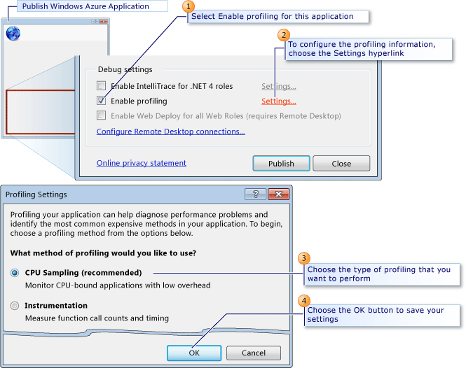
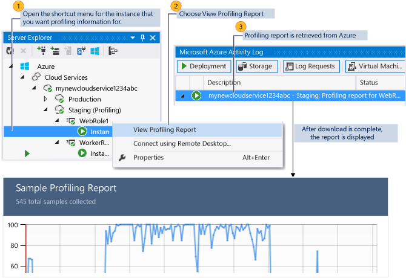

<properties 
   pageTitle="Testing the performance of a cloud service | Microsoft Azure"
   description="Test the performance of a cloud service using the Visual Studio profiler"
   services="visual-studio-online"
   documentationCenter="n/a"
   authors="TomArcher"
   manager="douge"
   editor="" />
<tags 
   ms.service="visual-studio-online"
   ms.devlang="multiple"
   ms.topic="article"
   ms.tgt_pltfrm="multiple"
   ms.workload="na"
   ms.date="04/18/2016"
   ms.author="tarcher" />

# Testing the performance of a cloud service 

##Overview

You can test the performance of a cloud service in the following ways:

- Use Azure Diagnostics to collect information about requests and connections, and to review site statistics that show how the service performs from a customer perspective. To get started with , see [Configuring diagnostics for Azure Cloud Services and Virtual Machines]( http://go.microsoft.com/fwlink/p/?LinkId=623009).

- Use the Visual Studio profiler to get an in-depth analysis of the computational aspects of how the service runs. As this topic describes, you can use the profiler to measure performance as a service runs in Azure. For information about how to use the profiler to measure performance as a service runs locally in a compute emulator, see [Testing the Performance of an Azure Cloud Service Locally in the Compute Emulator Using the Visual Studio Profiler](http://go.microsoft.com/fwlink/p/?LinkId=262845).

## Choosing a performance testing method

###Use Azure Diagnostics to collect:###

- Statistics on web pages or services, such as requests and connections.

- Statistics on roles, such as how often a role is restarted.

- Overall information about memory usage, such as the percentage of time that the garbage collector takes or the memory set of a running role.

###Use the Visual Studio profiler to:###

- Determine which functions take the most time.

- Measure how much time each part of a computationally intensive program takes.

- Compare detailed performance reports for two versions of a service.

- Analyze memory allocation in more detail than the level of individual memory allocations.

- Analyze concurrency problems in multithreaded code.

When you use the profiler, you can collect data when a cloud service runs locally or in Azure.

###Collect profiling data locally to:###

- Test the performance of a part of a cloud service, such as the execution of specific worker role, that doesn’t require a realistic simulated load.

- Test the performance of a cloud service in isolation, under controlled conditions.

- Test the performance of a cloud service before you deploy it to Azure.

- Test the performance of a cloud service privately, without disturbing the existing deployments.

- Test the performance of the service without incurring charges for running in Azure.

###Collect profiling data in Azure to:###

- Test the performance of a cloud service under a simulated or real load.

- Use the instrumentation method of collecting profiling data, as this topic describes later.

- Test the performance of the service in the same environment as when the service runs in production.

You typically simulate a load to test cloud services under normal or stress conditions.

## Profiling a cloud service in Azure

When you publish your cloud service from Visual Studio, you can profile the service and specify the profiling settings that give you the information that you want. A profiling session is started for each instance of a role. For more information about how to publish your service from Visual Studio, see [Publishing to an Azure Cloud Service from Visual Studio](https://msdn.microsoft.com/library/azure/ee460772.aspx).

To understand more about performance profiling in Visual Studio, see [Beginners Guide to Performance Profiling](https://msdn.microsoft.com/library/azure/ms182372.aspx) and [Analyzing Application Performance by Using Profiling Tools](https://msdn.microsoft.com/library/azure/z9z62c29.aspx).

>[AZURE.NOTE] You can enable either IntelliTrace or profiling when you publish your cloud service. You can't enable both.

###Profiler collection methods

You can use different collection methods for profiling, based on your performance issues:

- **CPU sampling** - This method collects application statistics that are useful for initial analysis of CPU utilization issues. CPU sampling is the suggested method for starting most performance investigations. There is a low impact on the application that you are profiling when you collect CPU sampling data.

- **Instrumentation** -This method collects detailed timing data that is useful for focused analysis and for analyzing input/output performance issues. The instrumentation method records each entry, exit, and function call of the functions in a module during a profiling run. This method is useful for gathering detailed timing information about a section of your code and for understanding the impact of input and output operations on application performance. This method is disabled for a computer running a 32-bit operating system. This option is available only when you run the cloud service in Azure, not locally in the compute emulator.

- **.NET Memory Allocation** - This method collects .NET Framework memory allocation data by using the sampling profiling method. The collected data includes the number and size of allocated objects.

- **Concurrency** - This method collects resource contention data, and process and thread execution data that is useful in analyzing multi-threaded and multi-process applications. The concurrency method collects data for each event that blocks execution of your code, such as when a thread waits for locked access to an application resource to be freed. This method is useful for analyzing multi-threaded applications.

- You can also enable **Tier Interaction Profiling**, which provides additional information about the execution times of synchronous ADO.NET calls in functions of multi-tiered applications that communicate with one or more databases. You can collect tier interaction data with any of the profiling methods. For more information about tier interaction profiling, see [Tier Interactions View](https://msdn.microsoft.com/library/azure/dd557764.aspx).

## Configuring profiling settings

The following illustration shows how to configure your profiling settings from the Publish Azure Application dialog box.

>[AZURE.NOTE] To enable the **Enable profiling** check box, you must have the profiler installed on the local computer that you are using to publish your cloud service. By default, the profiler is installed when you install Visual Studio.

### To configure profiling settings

1. In Solution Explorer, open the shortcut menu for your Azure project, and then choose **Publish**. For detailed steps about how to publish a cloud service, see [Publishing a cloud service using the Azure tools](http://go.microsoft.com/fwlink/p?LinkId=623012).

1. In the **Publish Azure Application** dialog box, chose the **Advanced Settings** tab.

1. To enable profiling, select the **Enable profiling** check box.

1. To configure your profiling settings, choose the **Settings** hyperlink. The Profiling Settings dialog box appears.

1. From the **What method of profiling would you like to use** option buttons, choose the type of profiling that you need.

1. To collect the tier interaction profiling data, select the **Enable Tier Interaction Profiling** check box.

1. To save the settings, choose the **OK** button.

    When you publish this application, these settings are used to create the profiling session for each role.

## Viewing Profiling Reports

A profiling session is created for each instance of a role in your cloud service. To view your profiling reports of each session from Visual Studio, you can view the Server Explorer window and then choose the Azure Compute node to select an instance of a role. You can then view the profiling report as shown in the following illustration.

### To view profiling reports

1. To view the Server Explorer window in Visual Studio, on the menu bar choose View, Server Explorer.

1. Choose the Azure Compute node, and then choose the Azure deployment node for the cloud service that you selected to profile when you published from Visual Studio.

1. To view profiling reports for an instance, choose the role in the service, open the shortcut menu for a specific instance, and then choose **View Profiling Report**.

    The report, a .vsp file, is now downloaded from Azure, and the status of the download appears in the  Azure Activity Log. When the download completes, the profiling report appears in a tab in the editor for Visual Studio named <Role name>_<Instance Number>_<identifier>.vsp. Summary data for the report appears.

1. To display different views of the report, in the Current View list, choose the type of view that you want. For more information, see [Profiling Tools Report Views](https://msdn.microsoft.com/library/azure/bb385755.aspx).

## Next steps

[Debugging Cloud Services](https://msdn.microsoft.com/library/azure/ee405479.aspx)

[Publishing to an Azure Cloud Service from Visual Studio](https://msdn.microsoft.com/library/azure/ee460772.aspx)

