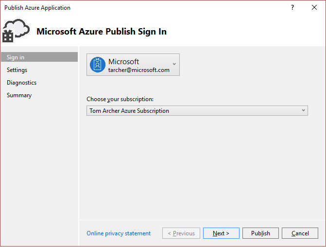
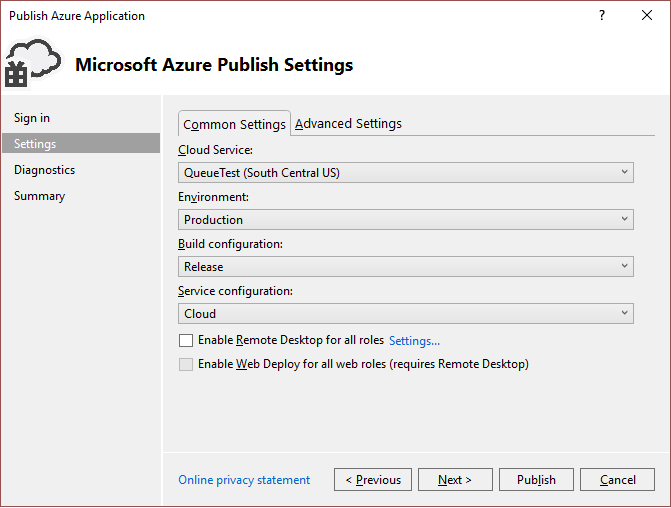
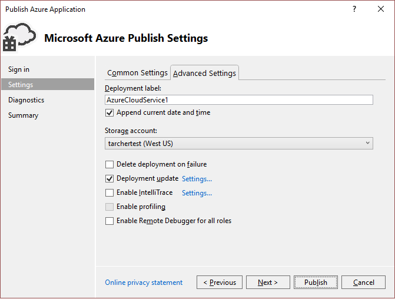
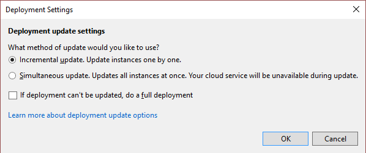
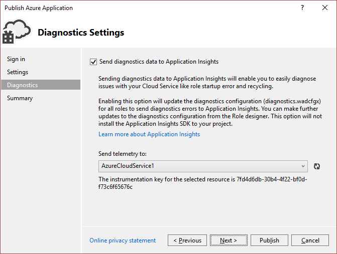
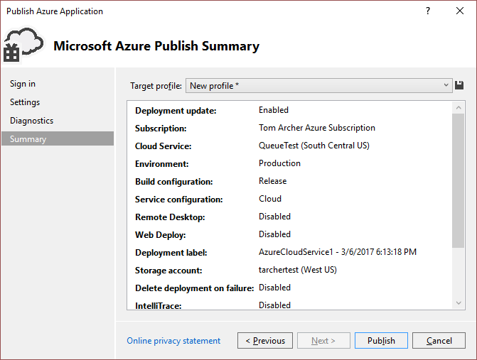

# Using the Visual Studio Publish Azure Application Wizard

After you develop a web application in Visual Studio, you can publish that application to an Azure cloud service by using the **Publish Azure Application** wizard.

> [!Note]
> This article is about deploying to cloud services, not to web sites. For information about deploying to web sites, see [How to Deploy an Azure Web Site](https://social.msdn.microsoft.com/Search/windowsazure?query=How%20to%20Deploy%20an%20Azure%20Web%20Site&Refinement=138&ac=4#refinementChanges=117&pageNumber=1&showMore=false).

## Accessing the Publish Azure Application wizard

You can access the Publish Azure Application wizard in two ways depending on the type of Visual Studio project you have.

**If you have an Azure cloud service project:**

1. Create or open an Azure cloud service project in Visual Studio.

1. In **Solution Explorer**, right-click the project, and, from the context menu, select **Publish**.

**If you have a web application project that is not enabled for Azure:**

1. Create or open an Azure cloud service project in Visual Studio.

1. In **Solution Explorer**, right-click the project, and, from the context menu, select **Convert** > **Convert to Azure Cloud Service Project**. 

1. In **Solution Explorer**, right-click the newly created Azure project, and, from the context menu, select **Publish**.

## Sign-in page

**Account** - Select an account or select **Add an account** in the account dropdown list.

**Choose your subscription** - Choose the subscription to use for your deployment.

## Settings page - Common Settings tab

**Cloud service** - Using the dropdown, either select an existing cloud service, or select **&lt;Create New>**, and create a cloud service. The data center displays in parentheses for each cloud service. It is recommended that the data center location for the cloud service be the same as the data center location for the storage account (Advanced Settings).

**Environment** - Select either **Production** or **Staging**. Choose the staging environment if you want to deploy your application in a test environment. 

**Build configuration** - Select either **Debug** or **Release**.

**Service configuration** - Select either **Cloud** or **Local**.

**Enable Remote Desktop for all roles** - Select this option if you want to be able to remotely connect to the service. This option is primarily used for troubleshooting. For more information, see [Enable Remote Desktop Connection for a Role in Azure Cloud Services using Visual Studio](cloud-services/cloud-services-role-enable-remote-desktop-visual-studio.md).

**Enable Web Deploy for all web roles** - Select this option to enable web deployment for the service. You must also select the **Enable Remote Desktop for all roles** option to use this feature. For more information, see [Publishing a cloud service using Visual Studio](vs-azure-tools-publishing-a-cloud-service.md).

## Settings page - Advanced Settings tab

**Deployment label** - Either accept the default name, or enter a name of your choosing. To append the date to the deployment label, leave the check box selected. 

**Storage account** - Select the storage account to use for this deployment, **&lt;Create New> to create a storage account. The data center displays in parentheses for each storage account. It is recommended that the data center location for the storage account is the same as the data center location for the cloud service (Common Settings).

The Azure storage account stores the package for the application deployment. After the application is deployed, the package is removed from the storage account.

**Delete deployment on failure** - Select this option to have the deployment deleted if any errors are encountered during publishing. This should be unchecked if you want to maintain a constant virtual IP address for your cloud service.

**Deployment update** - Select this option if you want to deploy only updated components. This type of deployment can be faster than a full deployment. This should be checked if you want to maintain a constant virtual IP address for your cloud service. 

**Deployment update - settings** - This dialog is used to further specify how you want the roles to be updated. If you choose **Incremental update**, each instance of your application is updated one after another, so that the application is always available. If you choose **Simultaneous update**, all instances of your application are updated at the same time. Simultaneous updating is faster, but your service might not be available during the update process.

**Enable IntelliTrace** - Specify if you want to enable IntelliTrace. With IntelliTrace, you can log extensive debugging information for a role instance when it runs in Azure. If you need to find the cause of a problem, you can use the IntelliTrace logs to step through your code from Visual Studio as if it were running in Azure. For more information about using IntelliTrace, see [Debugging a published Azure cloud service with Visual Studio and IntelliTrace](./vs-azure-tools-intellitrace-debug-published-cloud-services.md).

**Enable profiling** - Specify if you want to enable performance profiling. The Visual Studio profiler enables you to get an in-depth analysis of the computational aspects of how your cloud service runs. For more information on using the Visual Studio profiler, see [Test the performance of an Azure cloud service](./vs-azure-tools-performance-profiling-cloud-services.md).

**Enable Remote Debugger for all roles** - Specify if you want to enable remote debugging. For more information on debugging cloud services using Visual Studio, see [Debugging an Azure cloud service or virtual machine in Visual Studio](./vs-azure-tools-debug-cloud-services-virtual-machines.md).

## Diagnostics Settings page

Diagnostics enables you to troubleshoot an Azure cloud service (or Azure virtual machine). For information about diagnostics, see [Configuring Diagnostics for Azure Cloud Services and Virtual Machines](./vs-azure-tools-diagnostics-for-cloud-services-and-virtual-machines.md). For information about Application Insights, see [What is Application Insights?](./application-insights/app-insights-overview.md).

## Summary page

**Target profile** - You can choose to create a publishing profile from the settings that you have chosen. For example, you might create one profile for a test environment and another for production. To save this profile, choose the **Save** icon. The wizard creates the profile and saves it in the Visual Studio project. To modify the profile name, open the **Target profile** list, and then choose **&lt;Manage…&gt;**.

   > [!Note]
   > The publishing profile appears in Solution Explorer in Visual Studio, and the profile settings are written to a file with an .azurePubxml extension. Settings are saved as attributes of XML tags.

## Publishing your application

Once you configure all the settings for your project's deployment, select **Publish** at the bottom of the dialog. You can monitor the process status in the **Output** window in Visual Studio.

## Next steps

- [Migrate and publish a Web Application to an Azure cloud service from Visual Studio](./vs-azure-tools-migrate-publish-web-app-to-cloud-service.md)

- [Learn how to use Visual Studio to publish an Azure cloud service](./vs-azure-tools-publishing-a-cloud-service.md)

- [Debugging a published Azure cloud service with Visual Studio and IntelliTrace](./vs-azure-tools-intellitrace-debug-published-cloud-services.md)

- [Test the performance of an Azure cloud service](./vs-azure-tools-performance-profiling-cloud-services.md)

- [Configuring Diagnostics for Azure Cloud Services and Virtual Machines](./vs-azure-tools-diagnostics-for-cloud-services-and-virtual-machines.md).

- [What is Application Insights?](./application-insights/app-insights-overview.md)