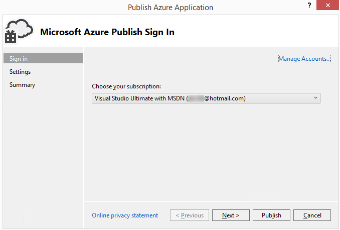
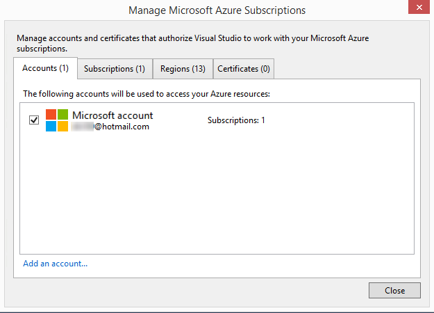
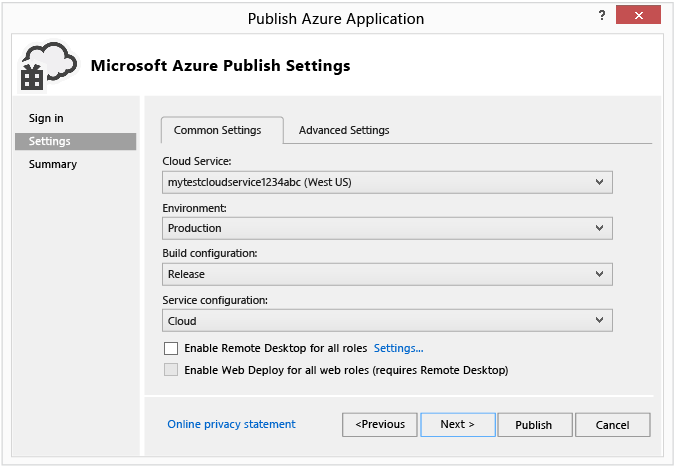
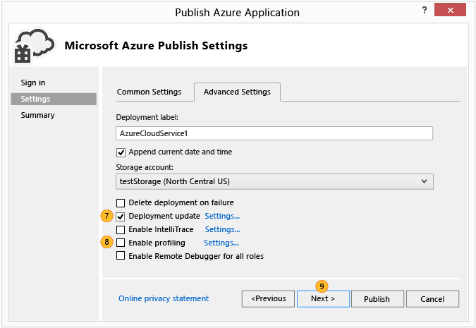
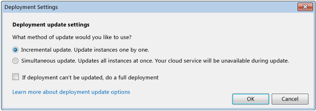
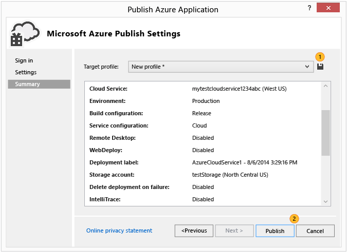

<properties 
   pageTitle="Publish Azure Application Wizard | Microsoft Azure"
   description="Publish Azure Application Wizard"
   services="visual-studio-online"
   documentationCenter="na"
   authors="TomArcher"
   manager="douge"
   editor="" />
<tags 
   ms.service="multiple"
   ms.devlang="multiple"
   ms.topic="article"
   ms.tgt_pltfrm="na"
   ms.workload="na"
   ms.date="05/08/2016"
   ms.author="tarcher" />

# Publish Azure Application Wizard

## Overview

After you develop a web application in Visual Studio, you can publish that application more easily to an Azure cloud service by using the **Publish Azure Application** wizard. The first section explains the steps that you must complete before you use the wizard, and the remaining sections explain the features of the wizard.

>[AZURE.NOTE] This topic is about deploying to cloud services, not to web sites. For information about deploying to web sites, see [How to Deploy an Azure Web Site](https://social.msdn.microsoft.com/Search/windowsazure?query=How%20to%20Deploy%20an%20Azure%20Web%20Site&Refinement=138&ac=4#refinementChanges=117&pageNumber=1&showMore=false).

## Prerequisites

Before you can publish your web application to Azure, you need to have a Microsoft account and an Azure subscription, and you have to associate your web application with an Azure cloud service. If you’ve already completed these tasks, you can skip to the next section.

1. Get a Microsoft account and an Azure subscription. You can try a free one month free Azure subscription [here](https://azure.microsoft.com/pricing/free-trial/)

1. Create a cloud service and a storage account on Azure. You can do this from Server Explorer in Visual Studio, or by using the [Azure classic portal](http://go.microsoft.com/fwlink/?LinkID=213885).

1. Enable your web application for Azure. To enable your web application to be published to Azure from Visual Studio, you’ll need to associate it with an Azure cloud service project in Visual Studio. To create the associated cloud service project, open the shortcut menu for the project for your web application, and then choose Convert, **Convert to Azure Cloud Service Project**.

1. After the cloud service project is added to your solution, open the same shortcut menu again and then choose **Publish**. For more information about how to enable applications for Azure, see [How to: Migrate and Publish a Web Application to an Azure Cloud Service from Visual Studio](https://msdn.microsoft.com/library/azure/hh420322.aspx).

>[AZURE.NOTE] Be sure to start Visual Studio with administrator credentials (Run As Administrator).

1. When you’re ready to publish your application, open the shortcut menu for the Azure cloud service project, and then choose **Publish**. The following steps show the Publish Azure Application wizard.

## Choosing Your Subscription

### To choose a subscription

1. Before you use the wizard for the first time, you must sign in. Choose the **Sign In** link. Sign in to the Azure portal when prompted, and provide your Azure user name and password. 

    

    The list of subscriptions populates with the subscriptions associated with your account. You might also see subscriptions from any subscription files that you imported previously.

1. In the **Choose your subscription** list, choose the subscription to use for this deployment.

   If you choose **<Manage…>**, the **Manage Subscriptions** dialog box appears, and you can choose the subscription and user account you want to use. The **Accounts** tab shows all of your accounts, and the **Subscriptions** tab shows all of the subscriptions associated with the accounts. You can also choose a region from which to use Azure resources, as well as create or import certificates for your subscription from the Azure portal. If you imported any subscriptions from a subscription file, the associated certificates will appear under the **Certificates** tab. When you're done, choose the **Close** button.

    

    >[AZURE.NOTE] A subscription file can contain more than one subscription.

1. Choose the **Next** button to continue. 

    If there aren't any cloud services in your subscription, you need to create a cloud service in Azure to host your project. The **Create Cloud Service and Storage Account** dialog box appears.

    Specify a new name for the cloud service. The name must be unique in Azure. Then specify a region or affinity group for a data center that’s near you or most of your clients. This name is also used for a new storage account that Azure creates for your cloud service.

1. Modify any settings you want for this deployment and then publish it by choosing the **Publish** button (The next section provides more details about the various settings). To review the settings before publishing, choose the **Next** button.

    >[AZURE.NOTE] If you chose Publish in this step, you can monitor the status of this deployment in Visual Studio.

You can modify both common and advanced settings for a deployment by using the **Publish Azure Application** wizard. For example, you can choose a setting to deploy your application to a test environment before you release it. The following illustration shows the **Common Settings** tab for an Azure deployment.

## Configuring Your Publish Settings

### To configure the publish settings

1. In the **Cloud service** list, perform one of the following sets of steps:

   1. In the dropdown list box, choose an existing cloud service. The data center location for the service appears. You should note this location and make sure that your storage account location is in the same data center.

    1. Choose **Create New** to create a cloud service that Azure hosts. In the **Create Cloud Service** dialog box, provide a name for the service, and then specify a region or affinity group to specify the location of the data center that you want to host this cloud service. The name must be unique in Azure.

1. In the **Environment** list, choose either **Production** or **Staging**. Choose the staging environment if you want to deploy your application to a test environment. You can move your application to the production environment later.

1. In the **Build configuration** list, choose either **Debug** or **Release**.

1. In the **Service configuration** list, choose either **Cloud** or **Local**.

    Select the **Enable Remote Desktop for all roles** check box if you want to be able to remotely connect to the service. This option is primarily used for troubleshooting. When you select this check box, the **Remote Desktop Configuration** dialog box appears. Choose the Settings link to change the configuration.

    Select the **Enable Web Deploy for all web roles** check box to enable web deployment for the service. You must enable Remote Desktop to use this feature. For more information, see [[Publishing a Cloud Service using the Azure Tools](https://msdn.microsoft.com/library/azure/ff683672.aspx)](https://msdn.microsoft.com/library/azure/ff683672.aspx). For more information about Web Deploy, see [[Publishing a Cloud Service using the Azure Tools](https://msdn.microsoft.com/library/azure/ff683672.aspx)](https://msdn.microsoft.com/library/azure/ff683672.aspx).

1. Choose the **Advanced Settings** tab. In the **Deployment label** field, either accept the default name, or enter a name of your choosing. To append the date to the deployment label, leave the check box selected.

    

1. In the **Storage account** list, choose the storage account to use for this deployment. Compare the locations of the data centers for your cloud service and your storage account. Ideally, these locations should be the same.

    >[AZURE.NOTE] The Azure storage account stores the package for the application deployment. After the application is deployed, the package is removed from the storage account.

1. Select the **Deployment update** check box if you want to deploy only updated components. This type of deployment can be faster than a full deployment. Choose the **Settings** link to open the **Deployment update settings** dialog box, shown in the following illustration. 

    

    You can choose either of two options for update deployment, incremental or simultaneous. An incremental deployment updates one deployed instance at a time, so that your application remains online and available to users. A simultaneous deployment updates all deployed instances at once. Simultaneous update is faster than incremental update, but if you choose this option, your application might not be available during the update process.

    You should select the check box for If deployment can't be updated, do a full deployment if you want the full deployment to take place automatically if an update deployment fails. A full deployment resets the virtual IP (VIP) address for the cloud service. For more information, see [How to: Retain a Constant Virtual IP Address for a Cloud Service](https://msdn.microsoft.com/library/azure/jj614593.aspx).

1. To debug your service, select the **Enable IntelliTrace** check box, or if you are deploying a **Debug** configuration and want to debug your cloud service in Azure, select the **Enable Remote Debugger for all roles** checkbox to deploy the remote debugging services.

2. To profile the application, select the **Enable profiling** check box, and then choose the **Settings** link to display the profiling options. 

    >[AZURE.NOTE] You must use Visual Studio Ultimate to enable either IntelliTrace or Tier Interaction Profiling (TIP), and you can't enable both at the same time.

    For more information, see [Debugging a Published Cloud Service with IntelliTrace and Visual Studio](https://msdn.microsoft.com/library/azure/ff683671.aspx) and [Testing the Performance of a Cloud Service](https://msdn.microsoft.com/library/azure/hh369930.aspx).

1. Choose **Next** to view the summary page for the application.

## Publishing Your Application

1. You can choose to create a publishing profile from the settings that you have chosen. For example, you might create one profile for a test environment and another for production. To save this profile, choose the **Save** icon. The wizard creates the profile and saves it in the Visual Studio project. To modify the profile name, open the **Target profile** list, and then choose **<Manage…>**.

    

    >[AZURE.NOTE] The publishing profile appears in Solution Explorer in Visual Studio, and the profile settings are written to a file with an .azurePubxml extension. Settings are saved as attributes of XML tags.

1. Choose **Publish** to publish your application. You can monitor the process status in the **Output** window in Visual Studio.

## See Also

[How to: Migrate and Publish a Web Application to an Azure Cloud Service from Visual Studio](https://msdn.microsoft.com/library/azure/hh420322.aspx)

[Publishing a Cloud Service using the Azure Tools](https://msdn.microsoft.com/library/azure/ff683672.aspx)

[Debugging a Published Cloud Service with IntelliTrace and Visual Studio](https://msdn.microsoft.com/library/azure/ff683671.aspx)

[Testing the Performance of a Cloud Service](https://msdn.microsoft.com/library/azure/hh369930.aspx)

