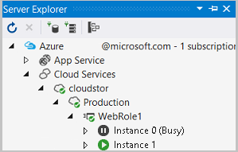

# Publishing a cloud service using Visual Studio

Visual Studio can publish an application directly to Azure, with support for both Staging and Production environments of a cloud service. When publishing, you select the deployment environment and a storage account that's used temporarily for the deployment package.

When you're developing and testing an Azure application, you can use Web Deploy to publish changes incrementally for your web roles. After you publish your application to a deployment environment, Web Deploy lets you deploy changes directly to the virtual machine that is running the web role. You do not have to package and publish your entire Azure application each time you want to update your web role to test out the changes. With this approach, you can have your web role changes available in the cloud for testing without waiting to have your application published to a deployment environment.

Use the following procedures to publish your Azure application and to update a web role by using Web Deploy:

- Publish or Package an Azure application from Visual Studio
- Update a web role as part of the development and testing cycle

## Publish or package an Azure application from Visual Studio

When you publish your Azure application, you can do one of the following tasks:

- Create a service package: You can use this package and the service configuration file to publish your application to a deployment environment from the [Azure portal](https://portal.azure.com).

- Publish your Azure project from Visual Studio: To publish your application directly to Azure, you use the Publish Wizard. For information, see [Publish Azure Application Wizard](vs-azure-tools-publish-azure-application-wizard.md).

### To create a service package from Visual Studio

1. When you are ready to publish your application, open Solution Explorer, open the shortcut menu for the Azure project that contains your roles, and choose Publish.

1. To create a service package only, follow these steps:

   a. On the shortcut menu for the Azure project, choose **Package**.

   b. In the **Package Azure Application** dialog box, choose the service configuration for which you want to create a package, and then choose the build configuration.

   c. (Optional) To turn on Remote Desktop for the cloud service after you publish it, select **Enable Remote Desktop for all Roles**, and then select **Settings** to configure Remote Desktop credentials. For more information, see [Enable Remote Desktop Connection for a Role in Azure Cloud Services using Visual Studio](cloud-services/cloud-services-role-enable-remote-desktop-visual-studio.md).

      If you want to debug your cloud service after you publish it, turn on remote debugging by selecting **Enable Remote Debugger for all Roles**.

   d. To create the package, choose the **Package** link.

      File Explorer shows the file location of the newly created package. You can copy this location so that you can use it from the Azure portal.

   e. To publish this package to a deployment environment, you must use this location as the Package location when you create a cloud service and deploy this package to an environment with the Azure portal.

1. (Optional) To cancel the deployment process, on the shortcut menu for the line item in the activity log, choose **Cancel and remove**. This command stops the deployment process and deletes the deployment environment from Azure. To remove the environment after deployment, use the Azure portal.

1. (Optional) After your role instances have started, Visual Studio automatically shows the deployment environment in the **Cloud Services** node in Server Explorer. From here, you can see the status of the individual role instances. See [Managing Azure resources with Cloud Explorer](vs-azure-tools-resources-managing-with-cloud-explorer.md).The following illustration shows the role instances while they are still in the Initializing state:

    

## Update a web role as part of the development and testing cycle

If your app’s back end infrastructure is stable, but the web roles need more frequent updating, you can use Web Deploy to update only a web role in your project. Web Deploy is handy when you don’t want to rebuild and redeploy the back end worker roles, or if you have multiple web roles and you want to update only one of the web roles.

### Requirements for using Web Deploy

- **For development and testing purposes only**: The changes are made directly to the virtual machine where the web role is running. If this virtual machine has to be recycled, the changes are lost because the original package that you published is used to recreate the virtual machine for the role. Republish your application to get the latest changes for the web role.

- **Only web roles can be updated**: Worker roles can’t be updated. In addition, you can’t update the `RoleEntryPoint` in `web role.cs`.

- **Can only support a single instance of a web role**: You can’t have multiple instances of any web role in your deployment environment. However, multiple web roles each with only one instance are supported.

- **Enable remote desktop connections**: This requirement allows Web Deploy to use the user and password to connect to the virtual machine to deploy the changes to the server that’s running Internet Information Services (IIS). In addition, you might need to connect to the virtual machine to add a trusted certificate to IIS on this virtual machine. (This certificate ensures that the remote connection for IIS that is used by Web Deploy is secure.)

The following procedure assumes that you are using the **Publish Azure Application** wizard.

### Enable Web Deploy when you publish your application

1. To enable the **Enable Web Deploy for all web roles** option, you must first configure remote desktop connections. Select **Enable Remote Desktop** for all roles and then supply the credentials that is used to connect remotely in the **Remote Desktop Configuration** box that appears. See [Enable Remote Desktop Connection for a Role in Azure Cloud Services using Visual Studio](cloud-services/cloud-services-role-enable-remote-desktop-visual-studio.md).

1. To enable Web Deploy for all the web roles in your application, select **Enable Web Deploy for all web roles**.

    A yellow warning triangle appears. Web Deploy uses an untrusted, self-signed certificate by default, which is not recommended for uploading sensitive data. If you need to secure this process for sensitive data, you can add an SSL certificate to be used for Web Deploy connections. This certificate needs to be a trusted certificate. For more information, see [Make web deploy secure](#make-web-deploy-secure).

1. Choose **Next** to show the **Summary** screen, and then choose **Publish** to deploy the cloud service.

    The cloud service is published. The virtual machine that is created has remote connections enabled for IIS so that Web Deploy can be used to update your web roles without republishing them.

   > [!NOTE]
   > If you have more than one instance configured for a web role, a warning message appears, stating that each web role is limited to one instance only in the package that’s created to publish your application. Select **OK** to continue. As stated in the Requirements section, you can have more than one web role but only one instance of each role.

### Update your web role by using Web Deploy

1. To use Web Deploy, make code changes to the project for any of your web roles in Visual Studio that you want to publish, and then right-click this project node in your solution and point to **Publish**. The **Publish Web** dialog box appears.

1. (Optional) If you added a trusted SSL certificate to use for remote connections for IIS, you can clear the **Allow untrusted certificate** check box. For information about how to add a certificate to make Web Deploy secure, see the section **To Make Web Deploy Secure** later in this article.

1. To use Web Deploy, the publish mechanism needs the user name and password that you set up for your Remote Desktop connection when you first published the package.

   a. In **User name**, enter the user name.

   b. In **Password**, enter the password.

   c. (Optional) If you want to save this password in this profile, choose **Save password**.

1. To publish the changes to your web role, choose **Publish**.

    The status line displays **Publish started**. When the publishing has completed, **Publish succeeded** appears. The changes have now been deployed to the web role on your virtual machine. Now you can start your Azure application in the Azure environment to test your changes.

### Make web deploy secure

1. Web Deploy uses an untrusted, self-signed certificate by default, which is not recommended for uploading sensitive data. If you need to secure this process for sensitive data, you can add an SSL certificate to be used for Web Deploy connections. This certificate needs to be a trusted certificate, which you obtain from a certificate authority (CA).

    To make Web Deploy secure for each virtual machine for each of your web roles, you must upload the trusted certificate that you want to use for web deploy to the Azure portal. This certificate makes sure that the certificate is added to the virtual machine that is created for the web role when you publish your application.

1. To add a trusted SSL certificate to IIS to use for remote connections, follow these steps:

   a. To connect to the virtual machine that is running the web role, select the instance of the web role in **Cloud Explorer** or **Server Explorer**, and then choose the **Connect using Remote Desktop** command. For detailed steps about how to connect to the virtual machine, see [Enable Remote Desktop Connection for a Role in Azure Cloud Services using Visual Studio](cloud-services/cloud-services-role-enable-remote-desktop-visual-studio.md). Your browser prompts you to download an `.rdp` file.

   b. To add an SSL certificate, open the management service in IIS Manager. In IIS Manager, enable SSL by opening the **Bindings** link in the **Action** pane. The **Add Site Binding** dialog box appears. Choose **Add**, and then choose HTTPS in the **Type** drop-down list. In the **SSL certificate** list, choose the SSL certificate that you had signed by a CA and that you uploaded to the Azure portal. For more information, see [Configure Connection Settings for the Management Service](http://go.microsoft.com/fwlink/?LinkId=215824).

      > [!NOTE]
      > If you add a trusted SSL certificate, the yellow warning triangle no longer appears in the **Publish Wizard**.

## Include files in the service package

You might need to include specific files in your service package so that they are available on the virtual machine that is created for a role. For example, you might want to add an `.exe` or an `.msi` file that is used by a startup script to your service package. Or you might need to add an assembly that a web role or worker role project requires. To include files, they must be added to the solution for your Azure application.

1. To add an assembly to a service package, use the following steps:

   a. In **Solution Explorer**, open the project node for the project that is missing the referenced assembly.
   b. To add the assembly to the project, open the shortcut menu for the **References** folder and then choose **Add Reference**. The Add Reference dialog appears.
   c. Choose the reference that you want to add and then choose **OK**. The reference is added to the list under the **References** folder.
   d. Open the shortcut menu for the assembly that you added and choose **Properties**. The **Properties** window appears.

      To include this assembly in the service package, in the **Copy Local list** choose **True**.
1. In **Solution Explorer** open the project node for the project that is missing the referenced assembly.

1. To add the assembly to the project, open the shortcut menu for the **References** folder and then choose **Add Reference**. The **Add Reference** dialog appears.

1. Choose the reference that you want to add and then choose the **OK** button.

    The reference is added to the list under the **References** folder.

1. Open the shortcut menu for the assembly that you added and choose **Properties**. The Properties window appears.

1. To include this assembly in the service package, in the **Copy Local** list, choose **True**.

1. To include files in the service package that have been added to your web role project, open the shortcut menu for the file, and then choose **Properties**. From the **Properties** window, choose **Content** from the **Build Action** list box.

1. To include files in the service package that have been added to your worker role project, open the shortcut menu for the file, and then choose **Properties**. From the **Properties** window, choose **Copy if newer** from the **Copy to output directory** list box.

## Next steps

To learn more about publishing to Azure from Visual Studio, see [Publish Azure Application Wizard](vs-azure-tools-publish-azure-application-wizard.md).
