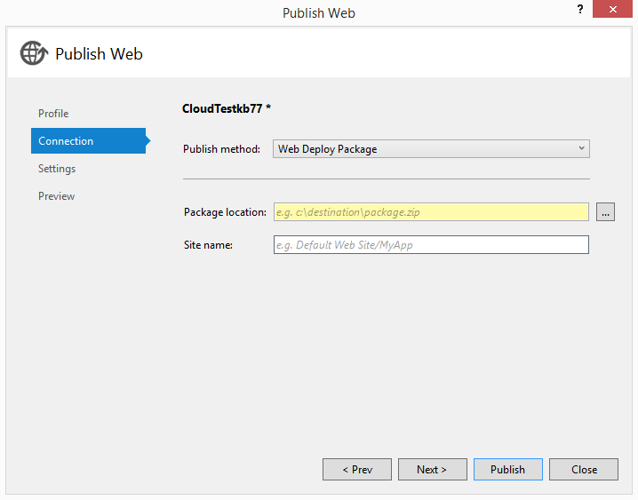

<properties
   pageTitle="Using Windows PowerShell Scripts to Publish to Dev and Test Environments | Microsoft Azure"
   description="Learn how to use Windows PowerShell scripts from Visual Studio to publish to development and test environments."
   services="visual-studio-online"
   documentationCenter="na"
   authors="TomArcher"
   manager="douge"
   editor="" />
<tags
   ms.service="multiple"
   ms.devlang="dotnet"
   ms.topic="article"
   ms.tgt_pltfrm="na"
   ms.workload="multiple"
   ms.date="05/08/2016"
   ms.author="tarcher" />

# Using Windows PowerShell scripts to publish to dev and test environments

When you create a web application in Visual Studio, you can generate a Windows PowerShell script that you can use later to automate the publishing of your website to Azure as a Web App in Azure App Service or a virtual machine. You can edit and extend the Windows PowerShell script in the Visual Studio editor to suit your requirements, or integrate the script with existing build, test, and publishing scripts.

Using these scripts, you can provision customized versions (also known as dev and test environments) of your site for temporary use. For example, you might set up a particular version of your website on an Azure virtual machine or on the staging slot on a website to run a test suite, reproduce a bug, test a bug fix, trial a proposed change, or set up a custom environment for a demo or presentation. After you've created a script that publishes your project, you can recreate identical environments by re-running the script as needed, or run the script with your own build of your web application to create a custom environment for testing.

## What you need

- Azure SDK 2.3 or later. See [Visual Studio Downloads](http://go.microsoft.com/fwlink/?LinkID=624384) for more information.

You do not need the Azure SDK to generate the scripts for web projects. This feature is for web projects, not web roles in cloud services.

- Azure PowerShell 0.7.4 or later. See [How to install and configure Azure PowerShell](powershell-install-configure.md) for more information.

- [Windows PowerShell 3.0](http://go.microsoft.com/?linkid=9811175) or later.

## Additional tools

Additional tools and resources for working with PowerShell in Visual Studio for Azure development are available. See [PowerShell Tools for Visual Studio](http://go.microsoft.com/fwlink/?LinkId=404012).

## Generating the publish scripts

You can generate the publish scripts for a virtual machine that hosts your website when you create a new project by following [these instructions](./virtual-machines/virtual-machines-windows-classic-web-app-visual-studio.md). You can also [generate publish scripts for web apps in Azure App Service](./app-service-web/web-sites-dotnet-get-started.md).

## Scripts that Visual Studio generates

Visual Studio generates a solution-level folder called **PublishScripts** that contains two Windows PowerShell files, a publish script for your virtual machine or website, and a module that contains functions that you can use in the scripts. Visual Studio also generates a file in the JSON format that specifies the details of the project you are deploying.

### Windows PowerShell publish script

The publish script contains specific publish steps for deploying to a website or virtual machine. Visual Studio provides syntax coloring for Windows PowerShell development. Help for the functions is available, and you can freely edit the functions in the script to suit your changing requirements.

### Windows PowerShell module

The Windows PowerShell module that Visual Studio generates contains functions that the publish script uses. These are Azure PowerShell functions and are not intended to be modified. See [How to install and configure Azure PowerShell](powershell-install-configure.md) for more information.

### JSON configuration file

The JSON file is created in the **Configurations** folder and contains configuration data that specifies exactly which resources to deploy to Azure. The name of the file that Visual Studio generates is project-name-WAWS-dev.json if you created a website, or project name-VM-dev.json if you created a virtual machine. Here's an example of a JSON configuration file that's generated when you create a website. Most of the values are self-explanatory. The website name is generated by Azure, so it might not match your project name.

```
{
"environmentSettings": {
"webSite": {
"name": "WebApplication26632",
"location": "West US"
},
"databases": [
{
"connectionStringName": "DefaultConnection",
"databaseName": "WebApplication26632_db",
"serverName": "YourDatabaseServerName",
"user": "sqluser2",
"password": "",
"edition": "",
"size": "",
"collation": "",
"location": "West US"
}
]
}
}
```
When you create a virtual machine, the JSON configuration file looks similar to the following. Note that a cloud service is created as a container for the virtual machine. The virtual machine contains the usual endpoints for web access through HTTP and HTTPS, as well as endpoints for Web Deploy, which lets you publish to the website from your local machine, Remote Desktop, and Windows PowerShell.

```
{
"environmentSettings": {
"cloudService": {
"name": "myusernamevm1",
"affinityGroup": "",
"location": "West US",
"virtualNetwork": "",
"subnet": "",
"availabilitySet": "",
"virtualMachine": {
"name": "myusernamevm1",
"vhdImage": "a699494373c04fc0bc8f2bb1389d6106__Win2K8R2SP1-Datacenter-201403.01-en.us-127GB.vhd",
"size": "Small",
"user": "vmuser1",
"password": "",
"enableWebDeployExtension": true,
"endpoints": [
{
"name": "Http",
"protocol": "TCP",
"publicPort": "80",
"privatePort": "80"
},
{
"name": "Https",
"protocol": "TCP",
"publicPort": "443",
"privatePort": "443"
},
{
"name": "WebDeploy",
"protocol": "TCP",
"publicPort": "8172",
"privatePort": "8172"
},
{
"name": "Remote Desktop",
"protocol": "TCP",
"publicPort": "3389",
"privatePort": "3389"
},
{
"name": "Powershell",
"protocol": "TCP",
"publicPort": "5986",
"privatePort": "5986"
}
]
}
},
"databases": [
{
"connectionStringName": "",
"databaseName": "",
"serverName": "",
"user": "",
"password": ""
}
],
"webDeployParameters": {
"iisWebApplicationName": "Default Web Site"
}
}
}
```

You can edit the JSON configuration to change what happens when you run the publish scripts. The `cloudService` and `virtualMachine` sections are required, but you can delete the `databases` section if you don't need it. The properties that are empty in the default configuration file that Visual Studio generates are optional; those that have values in the default configuration file are required.

If you have a website that has multiple deployment environments (known as slots) instead of a single production site in Azure, you can include the slot name in the name of the website in the JSON configuration file. For example, if you have a website that's named **mysite** and a slot for it named **test** then the URI is mysite-test.cloudapp.net, but the correct name to use in the configuration file is mysite(test). You can only do this if the website and slots already exist in your subscription. If they don't exist, create the website by running the script without specifying the slot, then create the slot in the [Azure classic portal](http://go.microsoft.com/fwlink/?LinkID=213885), and thereafter run the script with the modified website name. For more information about deployment slots for web apps, see [Set up staging environments for web apps in Azure App Service](./app-service-web/web-sites-staged-publishing.md).

## How to run the publish scripts

If you have never run a Windows PowerShell script before, you must first set the execution policy to enable scripts to run. This is a security feature to prevent users from running Windows PowerShell scripts if they're vulnerable to malware or viruses that involve executing scripts.

### Run the script

1. Create the Web Deploy package for your project. A Web Deploy package is a compressed archive (.zip file) that contain files that you want to copy to your website or virtual machine. You can create Web Deploy packages in Visual Studio for any web application.



For more information, see [How to: Create a Web Deployment Package in Visual Studio](https://msdn.microsoft.com/library/dd465323.aspx). You can also automate the creation of your Web Deploy package, as described in the section **Customizing and extending the publish scripts** later in this topic.

1. In **Solution Explorer**, open the context menu for the script, and then choose **Open with PowerShell ISE**.

1. If this is the first time you've run Windows PowerShell scripts on this computer, open a command prompt window with Administrator privileges and type the following command:

`Set-ExecutionPolicy RemoteSigned`

1. Sign in to Azure by using the following command.

`Add-AzureAccount`

When prompted, supply your username and password.

Note that when you automate the script, this method of providing Azure credentials won't work. Instead, you should use the .publishsettings file to provide credentials. One time only, you use the command **Get-AzurePublishSettingsFile** to download the file from Azure, and thereafter use **Import-AzurePublishSettingsFile** to import the file. For detailed instructions, see [How to install and configure Azure PowerShell](powershell-install-configure.md).

1. (Optional) If you want to create Azure resources such as the virtual machine, database, and website without publishing your web application, use the **Publish-WebApplication.ps1** command with the **-Configuration** argument set to the JSON configuration file. This command line uses the JSON configuration file to determine which resources to create. Because it uses the default settings for other command-line arguments, it creates the resources, but doesn't publish your web application. The –Verbose option gives you more information about what's happening.

`Publish-WebApplication.ps1 -Verbose –Configuration C:\Path\WebProject-WAWS-dev.json`

1. Use the **Publish-WebApplication.ps1** command as shown in one of the following examples to invoke the script and publish your web application. If you need to override the default settings for any of the other arguments, such as the subscription name, publish package name, virtual machine credentials, or database server credentials, you can specify those parameters. Use the **–Verbose** option to see more information about the progress of the publishing process.

```
Publish-WebApplication.ps1 –Configuration C:\Path\WebProject-WAWS-dev-json `
–SubscriptionName Contoso `
-WebDeployPackage C:\Documents\Azure\ADWebApp.zip `
-DatabaseServerPassword @{Name="dbServerName";Password="adminPassword"} `
-Verbose
```

If you're creating a virtual machine, the command looks like the following. This example also shows how to specify the credentials for multiple databases. For the virtual machines that these scripts create, the SSL certificate is not from a trusted root authority. Therefore, you need to use the **–AllowUntrusted** option.

```
Publish-WebApplication.ps1 `
-Configuration C:\Path\ADVM-VM-test.json `
-SubscriptionName Contoso `
-WebDeployPackage C:\Path\ADVM.zip `
-AllowUntrusted `
-VMPassword @{name = "vmUserName"; password = "YourPasswordHere"} `
-DatabaseServerPassword @{Name="server1";Password="adminPassword1"}, @{Name="server2";Password="adminPassword2"} `
-Verbose
```

The script can create databases, but it doesn't create database servers. If you want to create a database server, you can use the **New-AzureSqlDatabaseServer** function in the Azure module.

## Customizing and extending the publish scripts

You can customize the publish script and JSON configuration file. The functions in the Windows PowerShell module **AzureWebAppPublishModule.psm1** are not intended to be modified. If you just want to specify a different database or change some of the properties of the virtual machine, edit the JSON configuration file. If you want to extend the functionality of the script to automate building and testing your project, you can implement function stubs in **Publish-WebApplication.ps1**.

To automate building your project, add code that calls MSBuild to `New-WebDeployPackage` as shown in this code example. The path to the MSBuild command is different depending on the version of Visual Studio you have installed. To get the correct path, you can use the function **Get-MSBuildCmd**, as shown in this example.

### To automate building your project

1. Add the `$ProjectFile` parameter in the global param section.

```
[Parameter(Mandatory = $false)]
  [ValidateScript({Test-Path $_ -PathType Leaf})]
  [String]
  $ProjectFile,
```

1. Copy the function `Get-MSBuildCmd` into your script file.

```
function Get-MSBuildCmd
{
        process
{

             $path =  Get-ChildItem "HKLM:\SOFTWARE\Microsoft\MSBuild\ToolsVersions\" |
                                   Sort-Object {[double]$_.PSChildName} -Descending |
                                   Select-Object -First 1 |
                                   Get-ItemProperty -Name MSBuildToolsPath |
                                   Select -ExpandProperty MSBuildToolsPath
       
            $path = (Join-Path -Path $path -ChildPath 'msbuild.exe')

        return Get-Item $path
    }
}
```

1. Replace `New-WebDeployPackage` with the following code and replace the placeholders in the line constructing `$msbuildCmd`. This code is for Visual Studio 2015. If you're using Visual Studio 2013, change the **VisualStudioVersion** property below to `12.0`.

```
function New-WebDeployPackage
{
    #Write a function to build and package your web application
      
#To build your web application, use MsBuild.exe. For help, see MSBuild Command-Line Reference at: http://go.microsoft.com/fwlink/?LinkId=391339
      
Write-VerboseWithTime 'Build-WebDeployPackage: Start'
      
$msbuildCmd = '"{0}" "{1}" /T:Rebuild;Package /P:VisualStudioVersion=14.0 /p:OutputPath="{2}\MSBuildOutputPath" /flp:logfile=msbuild.log,v=d' -f (Get-MSBuildCmd), $ProjectFile, $scriptDirectory
      
Write-VerboseWithTime ('Build-WebDeployPackage: ' + $msbuildCmd)
      
#Start execution of the build command
$job = Start-Process cmd.exe -ArgumentList('/C "' + $msbuildCmd + '"') -WindowStyle Normal -Wait -PassThru
      
if ($job.ExitCode -ne 0)
{
throw('MsBuild exited with an error. ExitCode:' + $job.ExitCode)
}

#Obtain the project name
$projectName = (Get-Item $ProjectFile).BaseName
      
#Construct the path to web deploy zip package
$DeployPackageDir =  '.\MSBuildOutputPath\_PublishedWebsites\{0}_Package\{0}.zip' -f $projectName
      
      
#Get the full path for the web deploy zip package. This is required for MSDeploy to work
$WebDeployPackage = Resolve-Path –LiteralPath $DeployPackageDir
      
Write-VerboseWithTime 'Build-WebDeployPackage: End'
      
return $WebDeployPackage
}
```

1. Call the `New-WebDeployPackage` function before this line: `$Config = Read-ConfigFile $Configuration` for web apps or `$Config = Read-ConfigFile $Configuration -HasWebDeployPackage:([Bool]$WebDeployPackage)` for virtual machines.

```
if($ProjectFile)
{
$WebDeployPackage = New-WebDeployPackage
}
```

1. Invoke the customized script from command line using passing the `$Project` argument, as in the following example command line.

```
.\Publish-WebApplicationVM.ps1 -Configuration .\Configurations\WebApplication5-VM-dev.json `
-ProjectFile ..\WebApplication5\WebApplication5.csproj `
-VMPassword @{Name="VMUser";Password="Test.123"} `
-AllowUntrusted `
-Verbose
```

To automate testing of your application, add code to `Test-WebApplication`. Be sure to uncomment the lines in **Publish-WebApplication.ps1** where these functions are called. If you don't provide an implementation, you can manually build your project with Visual Studio, and then run the publish script to publish to Azure.

## Publishing function summary

To get help for functions you can use at the Windows PowerShell command prompt, use the command `Get-Help function-name`. The help includes parameter help and examples. The same help text is also in the script source files, **AzureWebAppPublishModule.psm1** and **Publish-WebApplication.ps1**. The script and help are localized in your Visual Studio language.

**AzureWebAppPublishModule**

|Function name|Description|
|---|---|
|Add-AzureSQLDatabase|Creates a new Azure SQL database.|
|Add-AzureSQLDatabases|Creates Azure SQL databases from the values in the JSON configuation file that Visual Studio generates.|
|Add-AzureVM|Creates a Azure virtual machine and returns the URL of the deployed VM. The function sets up the prerequisites and then calls the **New-AzureVM** function (Azure module) to create a new virtual machine.|
|Add-AzureVMEndpoints|Adds new input endpoints to a virtual machine and returns the virtual machine with the new endpoint.|
|Add-AzureVMStorage|Creates a new Azure storage account in the current subscription. The name of the account begins with "devtest" followed by a unique alphanumeric string. The function returns the name of the new storage account. You must specify either a location or an affinity group for the new storage account.|
|Add-AzureWebsite|Creates a website with the specified name and location. This function calls the **New-AzureWebsite** function in the Azure module. If the subscription doesn't already include a website with the specified name, this function creates the website and returns a website object. Otherwise, it returns `$null`.|
|Backup-Subscription|Saves the current Azure subscription in the `$Script:originalSubscription` variable in script scope.This function saves the current Azure subscription (as obtained by `Get-AzureSubscription -Current`) and its storage account, and the subscription that is changed by this script (stored in the variable `$UserSpecifiedSubscription`) and its storage account, in script scope. By saving the values, you can use a function, such as `Restore-Subscription`, to restore the original current subscription and storage account to current status if the current status has changed.|
|Find-AzureVM|Gets the specified Azure virtual machine.|
|Format-DevTestMessageWithTime|Prepends the date and time to a message. This function is designed for messages written to the Error and Verbose streams.|
|Get-AzureSQLDatabaseConnectionString|Assembles a connection string to connect to an Azure SQL database.|
|Get-AzureVMStorage|Returns the name of the first storage account with the name pattern "devtest*" (case insensitive) in the specified location or affinity group. If the "devtest*" storage account doesn't match the location or affinity group, the function ignores it. You must specify either a location or an affinity group.|
|Get-MSDeployCmd|Returns a command to run the MsDeploy.exe tool.|
|New-AzureVMEnvironment|Finds or creates a virtual machine in the subscription that matches the values in the JSON configuration file.|
|Publish-WebPackage|Uses MsDeploy.exe and a web publish package .Zip file to deploy resources to a website. This function doesn't generate any output. If the call to MSDeploy.exe fails, the function throws an exception. To get more detailed output, use the **-Verbose** option.|
|Publish-WebPackageToVM|Verifies the parameter values, and then calls the **Publish-WebPackage** function.|
|Read-ConfigFile|Validates the JSON configuration file and returns a hash table of selected values.|
|Restore-Subscription|Resets the current subscription to the original subscription.|
|Test-AzureModule|Returns `$true` if the installed Azure module version is 0.7.4 or later. Returns `$false` if the module isn't installed or is an earlier version. This function has no parameters.|
|Test-AzureModuleVersion|Returns `$true` if the version of the Azure module is 0.7.4 or later. Returns `$false` if the module isn't installed or is an earlier version. This function has no parameters.|
|Test-HttpsUrl|Converts the input URL to a System.Uri object. Returns `$True` if the URL is absolute and its scheme is https. Returns `$false` if the URL is relative, its scheme isn't HTTPS, or the input string can't be converted to a URL.|
|Test-Member|Returns `$true` if a property or method is a member of the object. Otherwise, returns `$false`.|
|Write-ErrorWithTime|Writes an error message prefixed with the current time. This function calls the **Format-DevTestMessageWithTime** function to prepend the time before writing the message to the Error stream.|
|Write-HostWithTime|Writes a message to the host program (**Write-Host**) prefixed with the current time. The effect of writing to the host program varies. Most programs that host Windows PowerShell write these messages to standard output.|
|Write-VerboseWithTime|Writes a verbose message prefixed with the current time. Because it calls **Write-Verbose**, the message displays only when the script runs with the **Verbose** parameter or when the **VerbosePreference** preference is set to **Continue**.|

**Publish-WebApplication**

|Function name|Description|
|---|---|
|New-AzureWebApplicationEnvironment|Creates Azure resources, such as a website or virtual machine.|
|New-WebDeployPackage|This function isn't implemented. You can add commands in this function to build your project.|
|Publish-AzureWebApplication|Publishes a web application to Azure.|
|Publish-WebApplication|Creates and deploys Web Apps, virtual machines, SQL databases, and storage accounts for a Visual Studio web project.|
|Test-WebApplication|This function isn't implemented. You can add commands in this function to test your application.|

## Next steps

Learn more about PowerShell scripting by reading [Scripting with Windows PowerShell](https://technet.microsoft.com/library/bb978526.aspx) and see other Azure PowerShell scripts at the [Script Center](https://azure.microsoft.com/documentation/scripts/).
