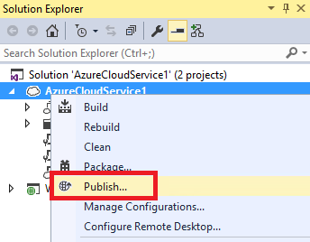
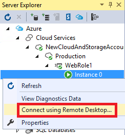

<properties 
   pageTitle="Using Remote Desktop with Azure Roles | Microsoft Azure"
   description="Using Remote Desktop with Azure Roles"
   services="visual-studio-online"
   documentationCenter="na"
   authors="TomArcher"
   manager="douge"
   editor="" />
<tags 
   ms.service="multiple"
   ms.devlang="multiple"
   ms.topic="article"
   ms.tgt_pltfrm="na"
   ms.workload="na"
   ms.date="04/18/2016"
   ms.author="tarcher" />

# Using Remote Desktop with Azure Roles

By using the Azure SDK and Remote Desktop Services, you can access Azure roles and virtual machines that are hosted by Azure. In Visual Studio, you can configure Remote Desktop Services from an Azure project. To enable Remote Desktop Services, you must create a working project that contains one or more roles and then publish it to Azure.

>[AZURE.IMPORTANT] You should access an Azure role for troubleshooting or development only. The purpose of each virtual machine is to run a specific role in your Azure application, not to run other client applications. If you want to use Azure to host a virtual machine that you can use for any purpose, see Accessing Azure Virtual Machines from Server Explorer.

## To enable and use Remote Desktop for an Azure Role

1. In Solution Explorer, open the shortcut menu for your project, and then choose **Publish**.

    The **Publish Azure Application** wizard appears.

    

1. At the bottom of **Microsoft Azure Publish Settings** page of the wizard, select the **Enable Remote Desktop** for all roles check box. 

    The **Remote Desktop Configuration** dialog box appears.

1. At the bottom of the **Remote Desktop Configuration** dialog box, choose the **More Options** button. 
 
    This displays a dropdown list box that lets you create or choose a certificate so that you can encrypt credentials information when connecting via remote desktop.

1. In the dropdown list, choose **&lt;Create>**, or choose an existing one from the list. 

    If you choose an existing certificate, skip the following steps.

    >[AZURE.NOTE] The certificates that you need for a remote desktop connection are different from the certificates that you use for other Azure operations. The remote access certificate must have a private key.

    The **Create Certificate** dialog box appears.

    1. Provide a friendly name for the new certificate, and then choose the **OK** button. The new certificate appears in the dropdown list box.

    1. In the **Remote Desktop Configuration** dialog box, provide a user name and a password.
    
        You can’t use an existing account. Don’t specify Administrator as the user name for the new account.

        >[AZURE.NOTE] If the password doesn’t meet the complexity requirements, a red icon appears next to the password text box. The password must include capital letters, lowercase letters, and numbers or symbols.

    1. Choose a date on which the account will expire and after which remote desktop connections will be blocked.

    1. After you've provided all the required information, choose the **OK** button.
    
        Several settings that enable Remote Access Services are added to the .cscfg and .csdef files.

1. In the **Microsoft Azure Publish Settings** wizard, choose the **OK** button when you’re ready to publish your cloud service.

    If you're not ready to publish, choose the **Cancel** button. The configuration settings are saved, and you can publish your cloud service later.

## Connect to an Azure Role by using Remote Desktop

After you publish your cloud service on Azure, you can use Server Explorer to log into the virtual machines that Azure hosts. 

1. In Server Explorer, expand the **Azure** node, and then expand the node for a cloud service and one of its roles to display a list of instances.

1. Open the shortcut menu for an instance node, and then choose **Connect Using Remote Desktop**.

    

1. Enter the user name and password that you created previously. You are now logged into your remote session.

