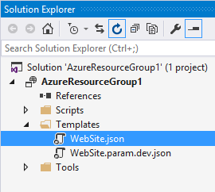
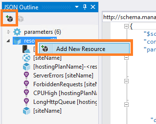
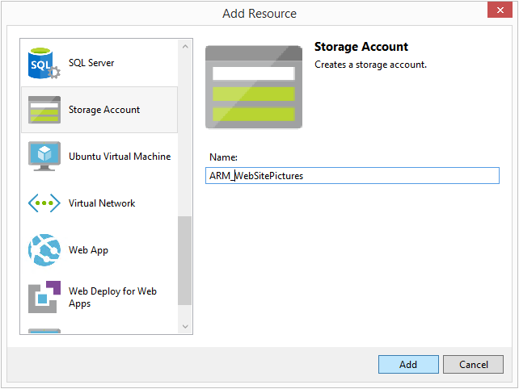
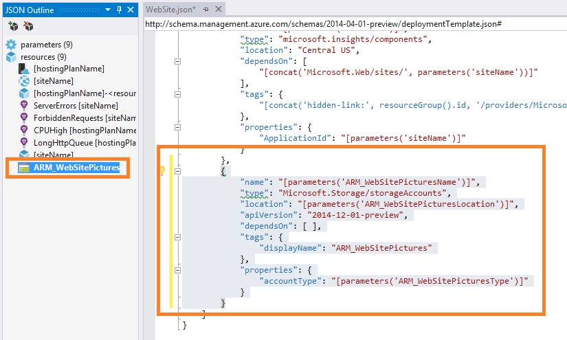
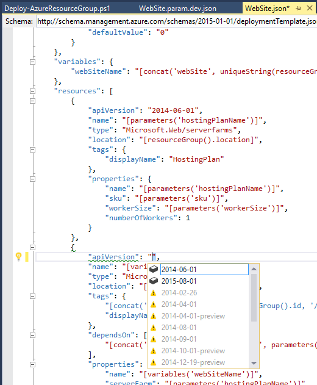

<properties 
   pageTitle="Editing a Resource Manager template with Visual Studio | Microsoft Azure"
   description="Learn how to add resources to an Azure Resource Manager template by using Visual Studio."
   services="visual-studio-online"
   documentationCenter="na"
   authors="TomArcher"
   manager="douge"
   editor="" />
<tags 
   ms.service="multiple"
   ms.devlang="dotnet"
   ms.topic="article"
   ms.tgt_pltfrm="na"
   ms.workload="multiple"
   ms.date="11/13/2015"
   ms.author="tarcher" />

# Editing Resource Manager templates with Visual Studio

Visual Studio enables you to edit the Resource Manager template for your resource group. You can make changes to the template either through the Visual Studio JSON Outline window or directly to the template syntax.

## Adding resources to a resource group through JSON Outline window

### To add resources to a resource group

1. In Solution Explorer, choose the JSON file for the Azure resource group. The JSON file appears in the editor, and the **JSON Outline** window also appears next to the editor. If you close the JSON Outline window, it won't automatically open again until you choose the Show Outline command on the context menu of a JSON template file (not a parameters file).

    

1. In the **JSON Outline** window, choose the **resources** node, and then either choose the **Add New Resource** command on the context menu, or choose the **Add Resource** button at the top of the JSON Outline window.

    

1. In the list of resources in the **Add Resource** dialog box, choose the resource you want to add, provide the information required by the resource, and then choose the **Add** button. For example, if you add a storage account, you need to provide a base name for the parameters that will be created for you. 
 
    

    The resource is added to the resources lists in the **JSON Outline** window, and the new JSON representing the resource appears in the file. Related parameters and/or variables may also be added.

    

1. Deploy the new resource to the Azure resource group. On the context menu of the resource group project in Solution Explorer, choose **Deploy** and then choose the name of the resource group. 

    

    The **Deploy to Resource Group** dialog box appears.

1. Choose the **Deploy** button.

1. If any parameters need to be specified by you, the **Edit Parameters** dialog box appears. Enter any required values and then choose the **Save** button. The new resource is deployed to your Azure resource group.

## Editing the template syntax

With Visual Studio, you can also edit the template directly. When you start editing values in the template, you will get help from the editor for the possible values you can provide. 

For more information about the structure of the template, see [Authoring Azure Resource Manager templates](resource-group-authoring-templates.md)

## See Also

[Creating and deploying Azure resource groups through Visual Studio](vs-azure-tools-resource-groups-deployment-project-create-deploy.md)

[Azure Resource Manager Cmdlets](https://msdn.microsoft.com/library/azure/dn757692.aspx)

[Using Windows PowerShell with Azure Resource Manager](../powershell-azure-resource-manager/)

[Channel9 Video: Azure Resource Manager](http://channel9.msdn.com/Events/TechEd/NorthAmerica/2014/DEV-B224#fbid=)

