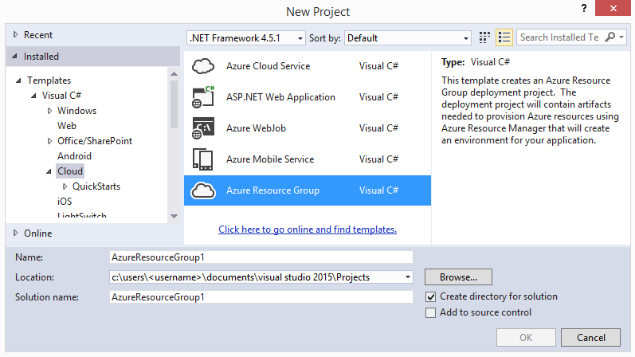
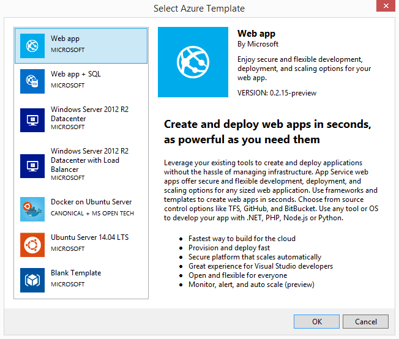
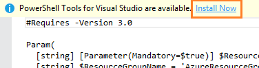
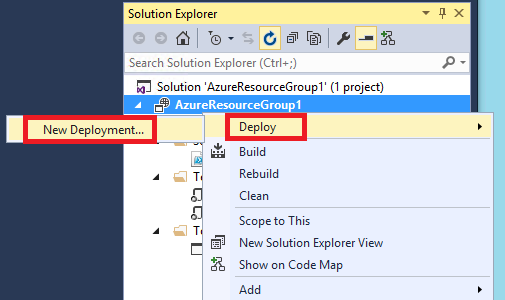
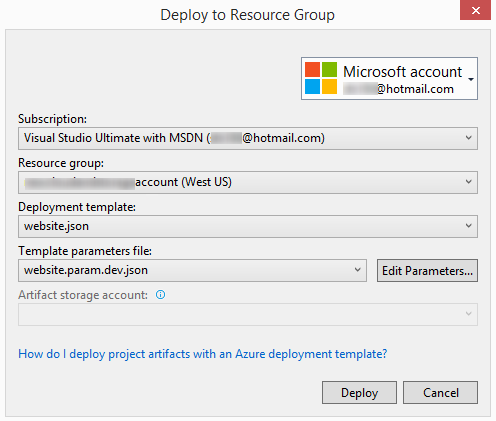
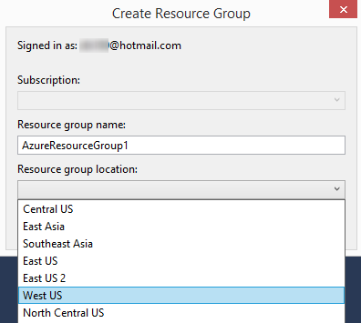
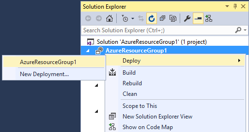

<properties
   pageTitle="Creating and deploying Azure Resource Group deployment projects | Microsoft Azure"
   description="Creating and deploying Azure Resource Group deployment projects"
   services="visual-studio-online"
   documentationCenter="na"
   authors="kempb"
   manager="douge"
   editor="tlee" />
<tags
   ms.service="azure-resource-manager"
   ms.devlang="multiple"
   ms.topic="article"
   ms.tgt_pltfrm="na"
   ms.workload="na"
   ms.date="10/02/2015"
   ms.author="kempb" />

# Creating and deploying Azure Resource Group deployment projects

The **Azure Resource Group** deployment project template is available in Visual Studio when Azure SDK 2.6 is installed. Azure Resource Group projects let you group together and publish multiple related Azure resources in a single deployment operation. Azure Resource Group projects use a technology called **Azure Resource Manager** to do their work. **Azure Resource Manager** is a REST API service that lets you define Azure resource groups, which contain multiple Azure resources that are typically used together and have a similar lifecycle. By using resource groups, you can operate on all the resources in a group with a single function call, instead of calling different functions for each individual resource. To learn more about Azure resource groups, see [Using resource groups to manage your Azure resources](resource-group-portal.md). For a more detailed, end-to-end Azure Resource Group deployment scenario, see [Azure Resource Group for Visual Studio](https://azure.microsoft.com/en-us/blog/azure-resource-manager-2-5-for-visual-studio/).

Azure Resource Group projects contain Azure Resource Manager JSON templates, which define the elements that are deployed to a resource group. See [Authoring Azure Resource Manager templates](resource-group-authoring-templates.md) for more information.

Azure Resource Manager has many different resource providers available that can be used to deploy resources such as Ubuntu Server and Windows Server 2012 R2. This topic uses a **Web Apps** resource, which deploys a basic, empty website to Azure.

## Creating Azure Resource Group projects

In this procedure, you learn how to create an Azure Resource Group project with a **Web App** template.

### To create a Azure Resource Group project

1. In Visual Studio, choose **File**, **New Project**, choose **C#** or **Visual Basic**. Then choose **Cloud**, and then choose **Azure Resource Group** project.

    

1. Choose the template that you want to deploy to Azure Resource Manager. For this example, we'll choose the **Web app** template.

    

    You can also add more resources to the Resource Group later.

    >[AZURE.NOTE] The list of available templates is retrieved online and may change.

    Visual Studio creates an Azure Resource Group deployment project for a web app.

1. Expand the nodes in the deployment project to see what was created.

    Since we chose the Web app template for this example, you see the following files. 

|File name|Description|
|---|---|
|Deploy-AzureResourceGroup.ps1|A PowerShell script that invokes PowerShell commands to deploy to Azure Resource Manager.

**Note** This PowerShell script is used by Visual Studio to deploy your template. Any changes you make to this script will also affect deployment in Visual Studio, so be careful.|
!WebSite.json|A configuration file that specifies all the details that you want deployed to Azure Resource Manager.|
|WebSite.param.dev.json|A parameters file that contains specific values needed by the configuration file.|
|AzCopy.exe|A tool used by the PowerShell script to copy files from the local storage drop path to the storage account container. This tool is used only if you configure the deployment project to deploy your code along with the template.|

All Azure Resource Group deployment projects contain these four basic files. Other projects may contain additional files to support other functionality.

## Customizing an Azure Resource Group project

You can customize a deployment project by modifying the JSON template files that describe the Azure resources you want to deploy. JSON stands for JavaScript Object Notation, and is a serialized data format that is easy to work with.

Azure Resource Group projects have two template files under the **Templates** node in Solution Explorer that you can modify: an Azure Resource Manager template file and a parameter file.

- **Azure Resource Manager template files** (which have the extension .json) specify the file(s) containing the resources you want, as well as parameters needed by the deployment project, such as site name and location. They also specify the dependencies of the components in the Azure Resource Group and their properties, such as names, tags, and rules for triggers. You can modify this file to add your own functionality. For example, you could add a database to the template. Refer to the documentation for each resource provider to find out the parameters you need to provide. See [Resource Providers](https://msdn.microsoft.com/library/azure/dn790572.aspx) for more information.

- **Parameter files** (which have the extension `.param.*.json`) contain values for the parameters specified in the configuration file that are needed for each resource provider. In this example, the configuration file for a web app (WebSite.json) defines parameters for *siteName* and *siteLocation*. During deployment, you are asked to provide values for the parameters in the template file, and these values are stored in the parameters file. You can also edit the parameter file directly.

JSON files can be edited in the Visual Studio editor. If you install the [PowerShell Tools for Visual Studio](https://visualstudiogallery.msdn.microsoft.com/c9eb3ba8-0c59-4944-9a62-6eee37294597), then you'll also get syntax highlighting, brace matching, and IntelliSense to make it easier to read and edit PowerShell scripts. A link to install the PowerShell Tools appears at the top of the editor if it's not already installed.

The JSON files use a schema which is referenced at the top of each file. You can download the schema and analyze it if you want to understand it better. The schema defines what elements are allowed, the types and formats of fields, the possible values of enumerated values, and so on.

If you want to deploy to different configurations or change settings often, you can create different copies of the *param* file. Try to use the same template for all environments.

## Deploying an Azure Resource Group project to an Azure resource group

When you deploy an Azure Resource Group project, you deploy it to an Azure resource group, which is just a logical grouping of resources in Azure such as web apps, databases, and so on.

1. On the shortcut menu of the deployment project node, choose **Deploy**, **New Deployment**.

    

    The **Deploy to Resource Group** dialog box appears.

    

1. In the **Resource group** dropdown box, choose an existing resource group or create a new one.To create a resource group, open the **Resource Group** dropdown box and choose **<Create New...>**.

    The **Create Resource Group** dialog box appears.

    

    >[AZURE.NOTE] Typically when you start a new deployment project you will want to create a new resource group to deploy to.

1. Enter a name and location for the resource group, and then choose the **Create** button.

    The location of the resource group doesn't need to be the same as the location of the resources, since resources in a group can span regions.

1. Choose the template configuration and parameters files you want to use for this deployment, or accept the defaults.

    You can edit the properties for a resource by choosing the **Edit Parameters** button. If required parameters are missing when you deploy, the **Edit Parameters** dialog box appears so that you can provide them. Parameters that are missing values have **<null>** appearing in the **Value** box next to them. For this example (a web app resource), the required parameters include the site name, hosting plan, and site location. (If you recall, these parameter values are set to null by default in the parameters file.) The other parameters have default values.

    

1. In the **Edit Parameters** dialog box, enter the site name, site location, hosting plan name, and check the values of any other properties. When you're done, choose the **Save** button.

    - The *siteName* parameter is the first part of the URL of the web page. For example, for the URL mywebsitename.azurewebsites.net, the site name is **mywebsitename**.

    - The *hostingPlanName* parameter specifies your hosting plan. For this example, you can use "Free". For more information about hosting plans, see [Azure App Service plans in-depth overview](http://azure.microsoft.com/documentation/articles/azure-web-sites-web-hosting-plans-in-depth-overview/)

    - The *siteLocation* parameter refers to the Azure region where the site is to be hosted, such as "West US". For a list of available regions, see [Azure Regions](http://azure.microsoft.com/regions/).

1. Choose the **Deploy** button to deploy the project to Azure.

    You can see the progress of the deployment in the **Output** window. Deployment may take several minutes to complete, depending on your configuration.

    >[AZURE.NOTE] You may be asked to install the Microsoft Azure PowerShell cmdlets. Because these cmdlets are required to deploy Azure resource groups, you need to install them.

1. In a browser, open the [Azure Management Preview Portal](https://portal.azure.com/). Since this is a new change, there should be a new notification message available in the **Notifications** tab. Choose it to view details about the new Azure resource group. To see a list of all the available resource groups, you can choose the **Browse** tab and then choose **Resource Groups**.

    

1. If you make changes and want to redeploy your project, you can choose the existing resource group directly from the Azure resource group project's shortcut menu. On the shortcut menu, choose **Deploy**, and then choose the resource group you just deployed to.

    

    Deploying an Azure resource group deploys only that project. If your solution has a code project or any other projects, you need to deploy them separately.

## Using Azure SDK 2.5 Cloud Deployment Projects with Azure SDK 2.6

If you are using Cloud Deployment projects that were created with Azure SDK 2.5, you'll want to upgrade to Azure SDK 2.6 or later to be able to use the new features for editing and deploying Azure resource templates. The easiest way to reuse the templates you created with Azure SDK 2.5 is to create the Azure SDK 2.6 or later version of the project, move your templates to that project and do some modifications.

### To use Azure SDK 2.5 Cloud Deployment projects with Azure SDK 2.6 or later

1. Add a new Azure SDK 2.6 or later Azure Resource Group project to your solution.

    1. Open the solution that contains your Azure SDK 2.5 Cloud Deployment project.

    1. On the **File** menu, choose **New**, **Project**.

    1. In the **New Project** dialog box, find the **Azure Resource Group **project under **Visual C#**/**Cloud** or **Visual Basic**/**Cloud**.

         The project template name was changed from **Cloud Deployment** to Azure Resource Group.

    1. Give the project a name.

    1. Change the solution drop-down box to **Add to solution**.

    1. Next, you will be asked to pick a template. Since you’ll be moving your existing templates from your Azure SDK 2.5 Cloud Deployment project, you can choose any template, so let’s choose the blank template at the bottom of the list.

    1. Choose the **OK** button.

        The new project is added to your solution.

1. Copy your template and parameter files from the Azure SDK 2.5 Cloud Deployment project to your Azure SDK 2.6 or later Resource Group project.

    1. In Solution Explorer, find the template and parameter files you want to copy in the Azure SDK 2.5 deployment project, select them and copy them.

    2. Paste the files into the **Templates** folder in your new Azure SDK 2.6 or later Resource Group project.

1. In Solution Explorer, find the template and parameter files you want to copy in the Azure SDK 2.5 deployment project, select them and copy them.

1. Paste the files into the Templates folder in your new Azure SDK 2.6 or later Resource Group project.

1. If you're also deploying a web application with your template, you’ll need to create a reference from the new Azure SDK 2.6 or later Resource Group project to your Web Application.

    1. On the context menu of the **References** node of your new Azure SDK 2.6 or later Resource Group project in Solution Explorer, choose **Add Reference**.

    1. Select the box next to your Web Application in the list of projects and then choose the **OK** button.

1. On the context menu of the References node of your new Azure SDK 2.6 or later Resource Group project in Solution Explorer, choose Add Reference.

1. Select the box next to your Web Application in the list of projects and then choose the OK button.

1. Rename all occurrences of the parameters *dropLocation* and *dropLocationSasToken* to *_artifactsLocation* and *_artifactsLocationSasToken*.

1. If you don’t plan to use them, you can delete the empty template and parameter files that were automatically added to the Azure SDK 2.6 or later project when you created it

    1. Delete the file DeployTemplate.json.

    1. Delete the file DeploymentTemplate.param.dev.json.

1. If you have made changes to the Publish-AzureResourceGroup.ps1 script in the Azure SDK 2.5 project, you’ll need to move those changes to the Deploy-AzureResourceGroup.ps1 script in the Azure SDK 2.6 or later project.

    Now you can deploy your template using the deployment command in the Azure SDK 2.6 or later Azure Resource Group project and take advantage of the new features for editing templates in Azure SDK 2.6. Once you have the 2.6 or later project working to your satisfaction, you can remove the Azure SDK 2.5 project from your solution.

## Why the project required updating

Some changes were made to the templates deployed in Azure SDK 2.6 that makes Azure SDK 2.5 deployment script and templates incompatible. The first, and biggest change, is the deployment is launched. Azure SDK 2.5 had compiled code that used the Azure REST APIs to upload your template and start the deployment. Feedback from developers indicated that they would prefer Visual Studio to just launch the PowerShell script that is included in the project. So, in Azure SDK 2.6, the deploy command launches the PowerShell script that is included in the project to deploy the template. This enables you to customize the deployment and have those customizations always run, whether you are deploying from the command line using Azure PowerShell or deploying through Visual Studio using the Deploy command. To deploy from Visual Studio, you'll need to use the Azure SDK 2.6 (or later) deployment PowerShell script when you have Azure SDK 2.6 or later installed.

Adjustments were also made to some variable names and build tasks to better align with naming conventions in TFS automated builds and other projects within Microsoft. The code in Visual Studio that gathers the variables and values needed to launch the PowerShell script will look for these new names.

## Next steps

To learn how to add resources to your Azure Resource Group in Visual Studio, see [Adding resources to an Azure Resource Group](vs-azure-tools-resource-group-adding-resources.md).
