<properties
   pageTitle="Azure Resource Group Visual Studio projects | Microsoft Azure"
   description="Use Visual Studio to create a Azure resource group project and deploy the resources to Azure."
   services="azure-resource-manager"
   documentationCenter="na"
   authors="tfitzmac"
   manager="timlt"
   editor="tysonn" />
<tags
   ms.service="azure-resource-manager"
   ms.devlang="multiple"
   ms.topic="get-started-article"
   ms.tgt_pltfrm="na"
   ms.workload="na"
   ms.date="05/17/2016"
   ms.author="tomfitz" />

# Creating and deploying Azure resource groups through Visual Studio

With Visual Studio and the [Azure SDK](https://azure.microsoft.com/downloads/), you can create a project that deploys your infrastructure and code to Azure. For example, you can define the web host, web site, and database for your app, and deploy that infrastructure along with the code. Or, you can define a Virtual Machine, Virtual Network and Storage Account, and deploy that infrastructure along with a script that is executed on Virtual Machine. The **Azure Resource Group** deployment project enables you to deploy all the needed resources in a single, repeatable operation. For more information about deploying and managing your resources, see [Azure Resource Manager overview](resource-group-overview.md).

Azure Resource Group projects contain Azure Resource Manager JSON templates, which define the resources that are deployed to Azure. To learn about the elements of the Resource Manager template, see [Authoring Azure Resource Manager templates](resource-group-authoring-templates.md). Visual Studio enables you to edit these templates, and provides tools that simplify working with templates.

In this topic, you will deploy a web app and SQL Database; however, the steps are almost the same for any type resource. You can just as easily deploy a Virtual Machine and its related resources. Visual Studio provides many different starter templates for deploying common scenarios.

This article was written using Visual Studio 2015 Update 2 and Microsoft Azure SDK for .NET 2.9. If you use Visual Studio 2013 with Azure SDK 2.9, your experience will be largely the same. You can use versions of the Azure SDK from 2.6 or later; however, your experience may be different than that shown in this article. It is strongly recommended that you install the latest version of the [Azure SDK](https://azure.microsoft.com/downloads/) before starting the steps. 

## Create Azure Resource Group project

In this procedure, you will create an Azure Resource Group project with a **Web app + SQL** template.

1. In Visual Studio, choose **File**, **New Project**, choose **C#** or **Visual Basic**. Then choose **Cloud**, and then choose **Azure Resource Group** project.

    

1. Choose the template that you want to deploy to Azure Resource Manager. Notice there are many different options based on the type of project you wish to deploy. For this topic, we'll choose the **Web app + SQL** template.

    

    The template you pick is just a starting point; you can add and remove resources to fulfill your scenario.

    >[AZURE.NOTE] The list of available templates is retrieved online and may change.

    Visual Studio creates a resource group deployment project for the web app and SQL database.

1. Expand the nodes in the deployment project to see what was created.

    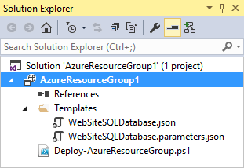

    Since we chose the Web app + SQL template for this example, you see the following files. 

    |File name|Description|
    |---|---|
    |Deploy-AzureResourceGroup.ps1|A PowerShell script that invokes PowerShell commands to deploy to Azure Resource Manager. **Note** This PowerShell script is used by Visual Studio to deploy your template. Any changes you make to this script will also affect deployment in Visual Studio, so be careful.|
    |WebSiteSQLDatabase.json|The resource manager template that defines the infrastructure you want deploy to Azure, and the parameters you can provide during deployment. It also defines the dependencies between the resources so they are deployed in the correct order.|
    |WebSiteSQLDatabase.parameters.json|A parameters file that contains values needed by the template. These are the values you pass in to customize each deployment.|

    All resource group deployment projects contain these basic files. Other projects may contain additional files to support other functionality.

## Customize the Resource Manager template

You can customize a deployment project by modifying the JSON templates that describe the resources you want to deploy. JSON stands for JavaScript Object Notation, and is a serialized data format that is easy to work with. 
The JSON files use a schema which is referenced at the top of each file. You can download the schema and analyze it if you want to understand it better. The schema defines what elements are allowed, the types and formats of 
fields, the possible values of enumerated values, and so on. To learn about the elements of the Resource Manager template, see [Authoring Azure Resource Manager templates](resource-group-authoring-templates.md).

To work on your template, open **WebSiteSQLDatabase.json**.

The Visual Studio editor provides tools to assist you with editing the resource manager template. The **JSON Outline** window makes it easy to see the elements defined in your template.

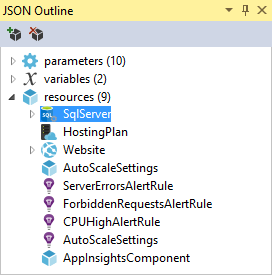

Selecting any of the elements in the outline takes you to that part of the template and highlights the corresponding JSON.

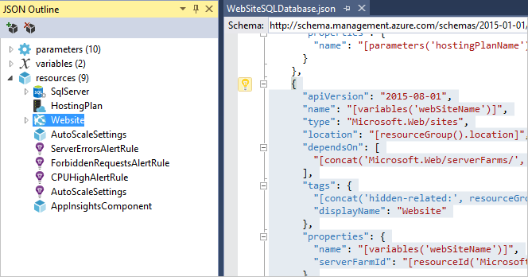

You can add a new resource to your template by either selecting the **Add Resource** button at the top of the JSON Outline window, or by right-clicking **resources** and selecting **Add New Resource**.

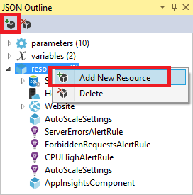

For this tutorial, select **Storage Account** and give it a name. A storage account name must be only numbers and lower-case letters, and less than 24 characters. The project will add a 13-character unique string onto the name 
that you provide so make sure your name is no more 11 characters.

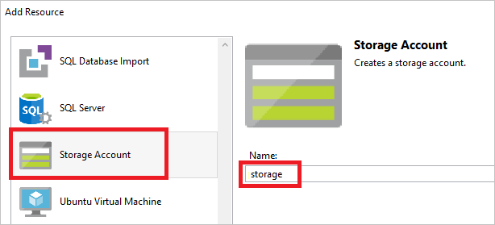

Notice that not only was the resource added, but also a parameter for the type storage account, and a variable for the name of the storage account.

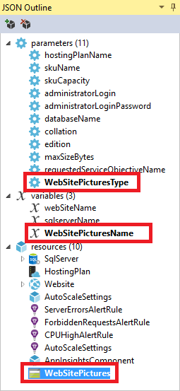

The **storageType** parameter is pre-defined with allowed types and a default type. You can leave these values or edit them for your scenario. If you do not want to permit anyone to deploy a 
**Premium_LRS** storage account through this template, simple remove it from the allowed types, as shown below. 

    "storageType": {
      "type": "string",
      "defaultValue": "Standard_LRS",
      "allowedValues": [
        "Standard_LRS",
        "Standard_ZRS",
        "Standard_GRS",
        "Standard_RAGRS"
      ]
    }

Visual Studio also provides intellisense to help you understand what properties are available when editing the template. For example, to edit the properties for your App Service plan, navigate to the 
**HostingPlan** resource, and add a new value for the **properties**. Notice that intellisense shows the available values and provides a description of that value.

You can set **numberOfWorkers** to 1.

    "properties": {
      "name": "[parameters('hostingPlanName')]",
      "numberOfWorkers": 1
    }

## Deploy the Resource Group project to Azure

You are now ready to deploy your project. When you deploy an Azure Resource Group project, you deploy it to an Azure resource group, which is just a logical grouping of resources in Azure such as web apps, databases, and so on.

1. On the shortcut menu of the deployment project node, choose **Deploy** > **New Deployment**.

    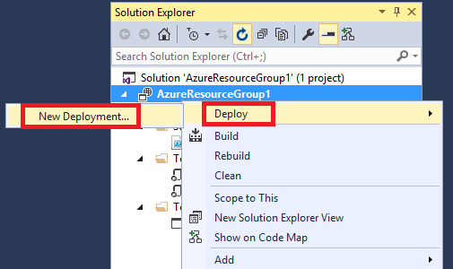

    The **Deploy to Resource Group** dialog box appears.

    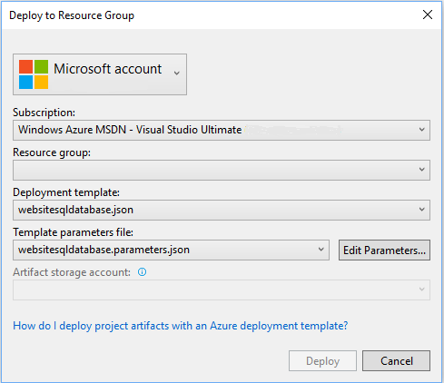

1. In the **Resource group** dropdown box, choose an existing resource group or create a new one. To create a resource group, open the **Resource Group** dropdown box and choose **Create New ...**.

    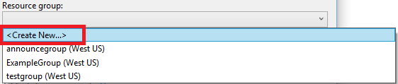

    The **Create Resource Group** dialog box appears. Give your group a name and location, and select the **Create** button.

    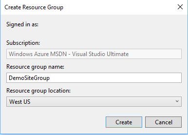
   
1. You can edit the parameters for the deployment by choosing the **Edit Parameters** button. Provide values for the parameters and select the **Save** button.

    
    
    The **Save passwords as plain text in the parameters file** option is not secure.

1. Choose the **Deploy** button to deploy the project to Azure. You can see the progress of the deployment in the **Output** window. Deployment may take several minutes to complete, depending on your configuration. Enter the database administrator password in the PowerShell console when prompted. If progress on your deployment has stalled, it may be because the process is waiting for you to enter the password in the PowerShell console.

    >[AZURE.NOTE] You may be asked to install the Azure PowerShell cmdlets. Because these cmdlets are required to deploy Azure resource groups, you need to install them.
    
1. When the deployment has finished, you should see a message in the **Output** window something like:

        ...
        15:19:19 - DeploymentName     : websitesqldatabase-0212-2318
        15:19:19 - CorrelationId      : 6cb43be5-86b4-478f-9e2c-7e7ce86b26a2
        15:19:19 - ResourceGroupName  : DemoSiteGroup
        15:19:19 - ProvisioningState  : Succeeded
        ...

1. In a browser, open the [Azure Portal](https://portal.azure.com/) and sign in to your account. To see the resource group, select **Resource groups** and the resource group you deployed to.

    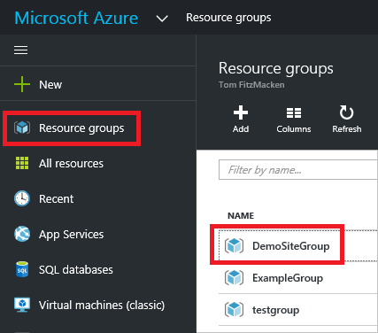

1. You will see all of the deployed resources.

    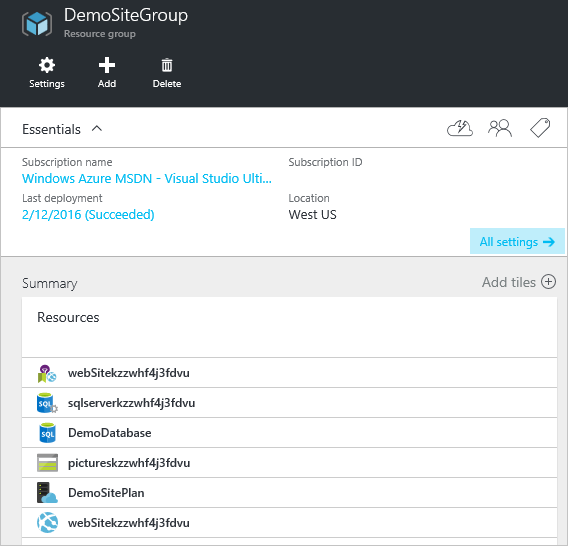

1. If you make changes and want to redeploy your project, you can choose the existing resource group directly from the Azure resource group project's shortcut menu. On the shortcut menu, choose **Deploy**, and then choose the resource group you just deployed to.

    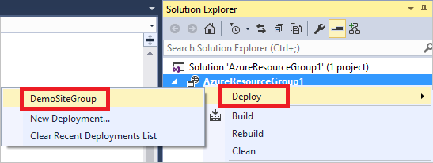

## Deploy code with your infrastructure

At this point, you have deployed the infrastructure for your app, but there is no actual code deployed with the project. This topic shows how to deploy a 
web app and SQL Database tables during deployment. If you are deploying a Virtual Machine instead of a web app, you want to run some code on the machine as part of deployment. The process for 
deploying code for a web app or for setting up a Virtual Machine is almost the same.

1. In your Visual Studio solution, add an **ASP.NET Web Application**. 

    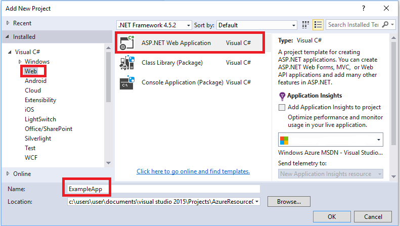
    
1. Select **MVC** and clear the field for **Host in the cloud** because the resource group project will perform that task.

    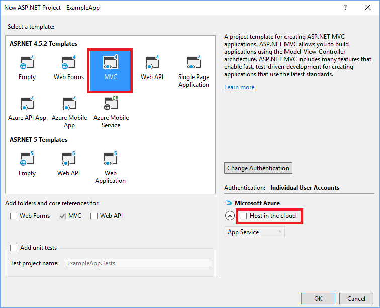
    
1. After your web app has been created, add a reference in the resource group project to the web app project.

    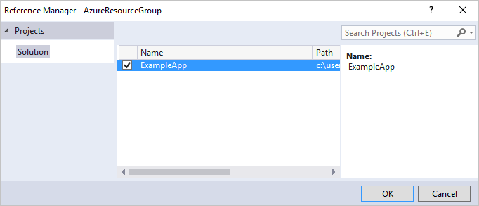
    
    By adding a reference, you link the web app project to the resource group project, and automatically set three key properties.  
    
    - The **Additional Properties** contains the web deployment package staging location that will be pushed to the Azure Storage. 
    - The **Include File Path** contains the path where the package will be created.  The **Include Targets** contains the command that deployment will execute. 
    - The default value of **Build;Package** enables the deployment to build and create a web deployment package (package.zip).  
    
    A publish profile is not needed as the deployment gets the necessary information from the properties to 
    create the package.
    
      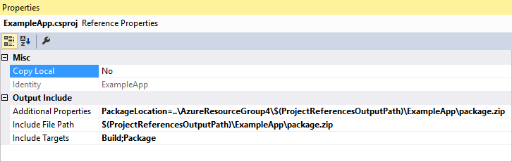
      
1. Add a new resource to the template, and this time select **Web Deploy for Web Apps**. 

    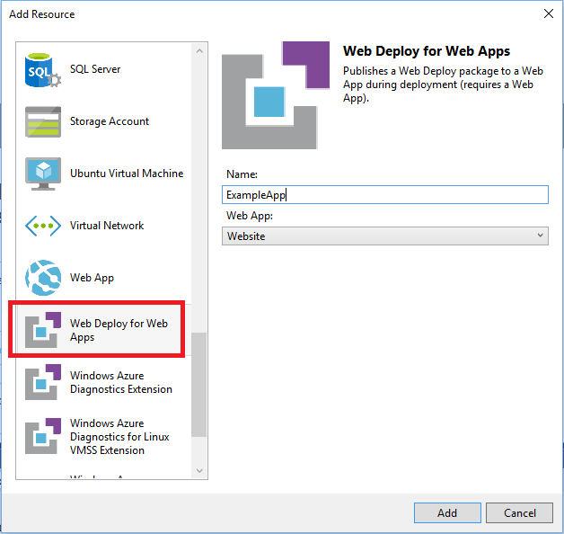
    
1. Re-deploy your resource group project to the resource group. This time there are some new parameters. You do not need to provide values for **_artifactsLocation** or **_artifactsLocationSasToken** because they are auto-generated. Set the folder and file name to the path that contains the deployment package.

    
    
    For the **Artifact storage account**, you can use the one deployed with this resource group.
    
After the deployment has finished, you can browse to the site and notice that the default ASP.NET app has been deployed.

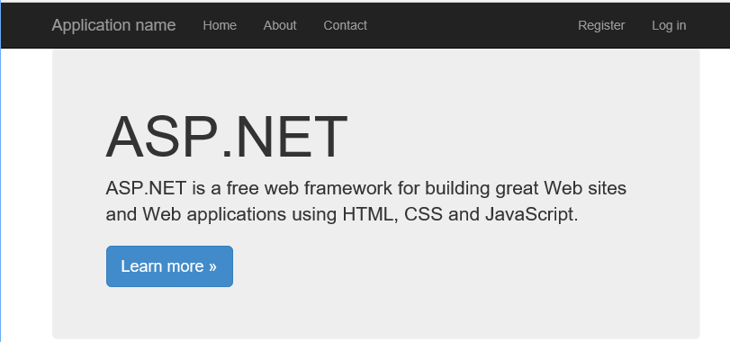

## Next steps

- To learn about managing your resources through the portal, see [Using the Azure Portal to manage your Azure resources](./azure-portal/resource-group-portal.md).
- To learn more about templates, see [Authoring Azure Resource Manager templates](resource-group-authoring-templates.md).
