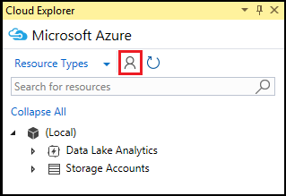
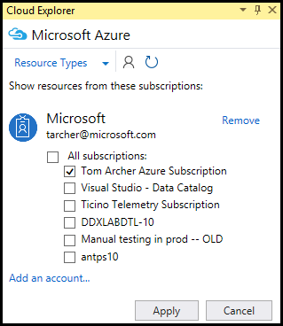
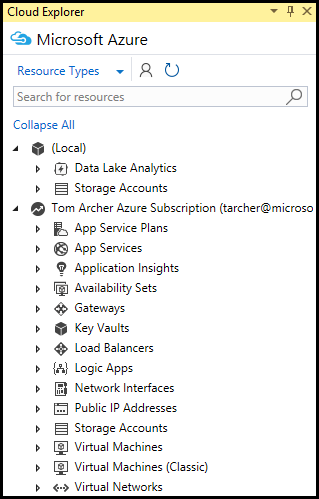
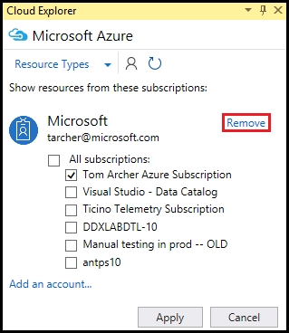
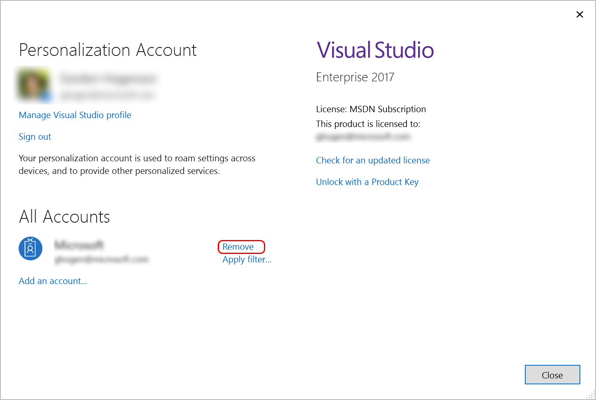
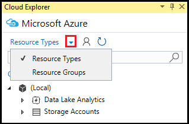
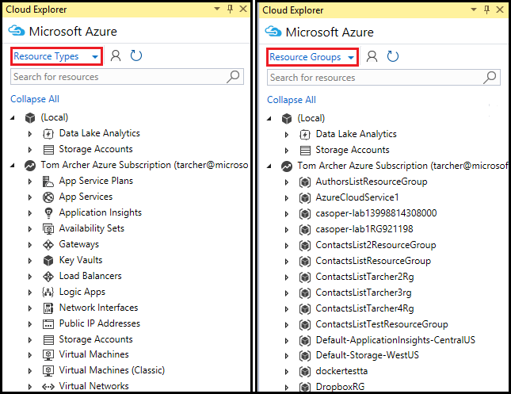
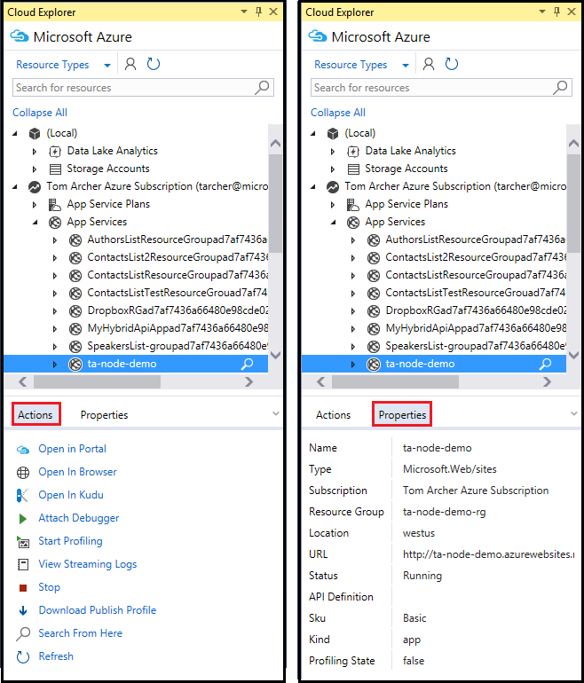
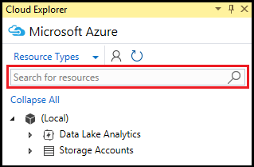

# Manage the resources associated with your Azure accounts in Visual Studio Cloud Explorer

Cloud Explorer enables you to view your Azure resources and resource groups, inspect their properties, and perform key developer diagnostics actions from within Visual Studio. 

Like the [Azure portal](http://go.microsoft.com/fwlink/p/?LinkID=525040), Cloud Explorer is built on the Azure Resource Manager stack. Therefore, Cloud Explorer understands resources such as Azure resource groups and Azure services such as Logic apps and API apps, and it supports [role-based access control](role-based-access-control/role-assignments-portal.md) (RBAC). 

## Prerequisites

- [Visual Studio 2017](https://www.visualstudio.com/downloads/) with the **Azure workload** selected, or an earlier version of Visual Studio with the [Microsoft Azure SDK for .NET 2.9](https://www.microsoft.com/en-us/download/details.aspx?id=51657).
- Microsoft Azure account - If you don't have an account, you can [sign up for a free trial](http://go.microsoft.com/fwlink/?LinkId=623901) or [activate your Visual Studio subscriber benefits](http://go.microsoft.com/fwlink/?LinkId=623901).

> [!NOTE]
> To view Cloud Explorer, select **View** > **Cloud Explorer** on the menu bar.   
> 

## Add an Azure account to Cloud Explorer

To view the resources associated with an Azure account, you must first add the account to Cloud Explorer. 

1. In **Cloud Explorer**, select **Azure account settings**.

  

1. Select **Manage accounts**. 

  

1. Log in to the Azure account whose resources you want to browse. 

1. Once logged in to an Azure account, the subscriptions associated with that account display. Select the check boxes for the account subscriptions you want to browse and then select **Apply**. 
 
  

1. After selecting the subscriptions whose resources you want to browse, those subscriptions and resources display in the Cloud Explorer.

  

## Remove an Azure account from Cloud Explorer 

1. In **Cloud Explorer**, select **Account Management**.

  

1. Next to the account you want to remove, select **Manage Accounts**.

  

1. Choose **Remove** to remove an account.

  

## View resource types or resource groups

To view your Azure resources, you can choose either **Resource Types** or **Resource Groups** view.

1. In **Cloud Explorer**, select the resource view dropdown.

  

1. From the context menu, select the desired view: 

	* **Resource Types** view - The common view used on the [Azure portal](http://go.microsoft.com/fwlink/p/?LinkID=525040), shows your Azure resources categorized by their type, such as web apps, storage accounts, and virtual machines. 
	* **Resource Groups** view - Categorizes Azure resources by the Azure resource group with which they're associated. A resource group is a bundle of Azure resources, typically used by a specific application. To learn more about Azure resource groups, see [Azure Resource Manager Overview](./azure-resource-manager/resource-group-overview.md).

The following image shows a comparison of the two resource views:

  

## View and navigate resources in Cloud Explorer

To navigate to an Azure resource and view its information in Cloud Explorer, expand the item's type or associated resource group and then select the resource. When you select a resource, information appears in the two tabs - **Actions** and **Properties** - at the bottom of Cloud Explorer. 

- **Actions** tab - Lists the actions you can take in Cloud Explorer for the selected resource. You can also view these options by right-clicking the resource to view its context menu.

- **Properties** tab - Shows the properties of the resource, such as its type, locale, and resource group with which it is associated.

The following image shows an example comparison of what you see on each tab for an App Service:

  

Every resource has the action **Open in portal**. When you choose this action, Cloud Explorer displays the selected resource in the [Azure portal](http://go.microsoft.com/fwlink/p/?LinkID=525040). The **Open in portal** feature is handy for navigating to deeply nested resources.

Additional actions and property values may also appear based on the Azure resource. For example, web apps and logic apps also have the actions **Open in browser** and **Attach debugger** in addition to **Open in portal**. Actions to open editors appear when you choose a storage account blob, queue, or table. Azure apps have **URL** and **Status** properties, while storage resources have key and connection string properties.

## Find resources in Cloud Explorer

To locate resources with a specific name in your Azure account subscriptions, enter the name in the **Search** box in Cloud Explorer.

  

As you enter characters in the **Search** box, only resources that match those characters appear in the resource tree.
