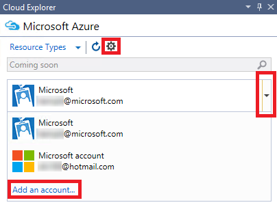
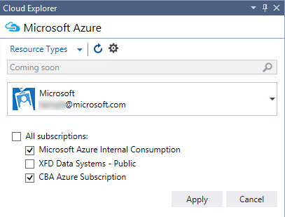
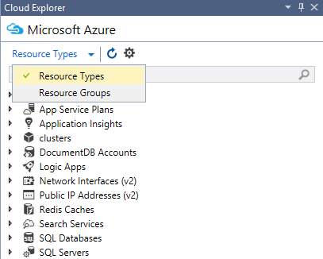
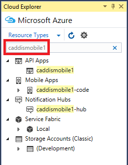

<properties 
   pageTitle="Managing Azure resources with Cloud Explorer | Microsoft Azure"
   description="Learn how to use Cloud Explorer to browse and manage Azure resources within Visual Studio."
   services="visual-studio-online"
   documentationCenter="na"
   authors="TomArcher"
   manager="douge"
   editor="" />
<tags 
   ms.service="multiple"
   ms.devlang="dotnet"
   ms.topic="article"
   ms.tgt_pltfrm="na"
   ms.workload="multiple"
   ms.date="05/08/2016"
   ms.author="tarcher" />

# Managing Azure resources with Cloud Explorer

##Overview

Cloud Explorer is designed to let you more easily and quickly browse and manage your Azure resources within the Visual Studio IDE. You can, for example, use it to open a Web app in the [Azure portal](http://go.microsoft.com/fwlink/p/?LinkID=525040) or in a browser, or attach a debugger to it, or you can view the properties of a blob container and open it in the Blob Container Editor.

Cloud Explorer is built on the Azure resource manager stack, just like the [Azure portal](http://go.microsoft.com/fwlink/p/?LinkID=525040). It understands resources such as Azure resource groups and Azure services such as Logic apps and API apps, and it supports [role-based access control](../role-based-access-control-configure/) (RBAC). To see Azure resources that have been added or changed, choose the **Refresh** button on the Cloud Explorer toolbar.

Cloud Explorer is installed as part of the Visual Studio Tools for Azure SDK 2.7. 

## Prerequisites

- Visual Studio 2015 RTM.

- The Visual Studio Tools for Azure SDK. 
- You must also have an Azure account and be logged into it to view Azure resources in Cloud Explorer. If you don't have one, you can create an account in just a couple of minutes. If you have an MSDN subscription, see [Azure Benefit for MSDN Subscribers](https://azure.microsoft.com/pricing/member-offers/msdn-benefits-details/). Otherwise, see [create a free trial account](https://azure.microsoft.com/pricing/free-trial/).

- If Cloud Explorer isn't visible, you can view it by choosing **View**, **Other Windows,** **Cloud Explorer** on the menu bar.

## Manage Azure accounts and subscriptions

To see your Azure resources in Cloud Explorer, you need to log in to an Azure account with one or more active subscriptions. If you have more than one Azure account, you can add them in Cloud Explorer and then choose the subscriptions you want to include in the Cloud Explorer resource view.

If you haven't used Azure before, or you haven't added the necessary accounts to Visual Studio, you'll be prompted to do so.

## To add Azure accounts to Cloud Explorer

1. Choose the Settings icon on the Cloud Explorer toolbar.

1. Choose the **Add an account** link. Log into the Azure account whose resources you want to browse. The account you just added should be selected in the account picker dropdown list. The subscriptions for that account appear under the account entry.

    

    

1. Select the check boxes for the account subscriptions you want to browse and then choose the **Apply** button.

    The Azure resources for the selected subscriptions appear in Cloud Explorer.

## To remove an Azure account

1. Choose **File**, **Account Settings** on the menu bar.

1. In the **All Accounts** section of the **Account Settings** dialog box, choose the **Remove** command next to the account you want to remove. Note that this command only removes the account from Visual Studio–it doesn't affect the Azure account itself.

## View resource types or groups

To view your Azure resources, you can choose either **Resource Types** or **Resource Groups** view.

- **Resource Types** view, which is also the common view used on the [Azure portal](http://go.microsoft.com/fwlink/p/?LinkID=525040), shows your Azure resources categorized by their type, such as web apps, storage accounts and virtual machines. This is similar to how Azure resources appear in Server Explorer.

- Resource Groups view categorizes Azure resources by the Azure resource group they're associated with.

 
	A resource group is a bundle of Azure resources, typically used by a specific application. To learn more about Azure resource groups, see [Azure Resource Manager Overview](./resource-group-overview.md).

## View and navigate resources

To navigate to an Azure resource and view its information in Cloud Explorer, expand the item's type or associated resource group and then choose the resource. When you choose a resource, information appears in the two tabs at the bottom of Cloud Explorer.

- The **Actions** tab shows the actions you can take in Cloud Explorer for the selected resource. You can also see available actions on the shortcut menu of the resource.

- The **Properties** tab shows the properties of the resource, such as its type, locale and resource group it's associated with.

Every resource has the action **Open in portal**. When you choose this action, Cloud Explorer displays the selected resource in the [Azure portal](http://go.microsoft.com/fwlink/p/?LinkID=525040). This feature is particularly handy for navigating to deeply-nested resources.

Additional actions and property values may also appear based on the Azure resource. For example, web apps and logic apps also have the actions **Open in browser** and **Attach debugger** in addition to **Open in portal**. Actions to open editors appear when you choose a storage account blob, queue, or table. Azure apps have **URL** and **Status** properties, while storage resources have key and connection string properties.

## Search resources

To locate resources with a specific name in your Azure account subscriptions, enter the name in the Search box in Cloud Explorer.

As you enter characters in the Search box, only resources that match those characters appear in the resource tree.

